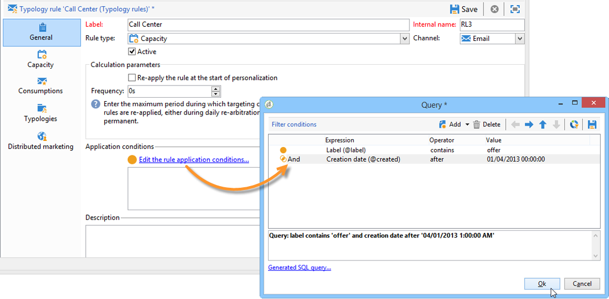
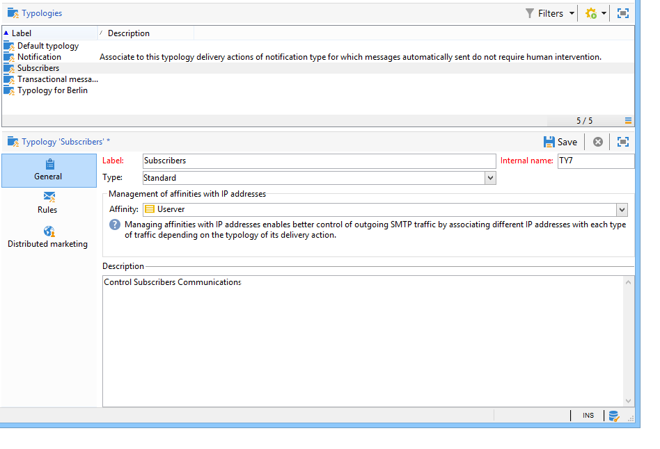
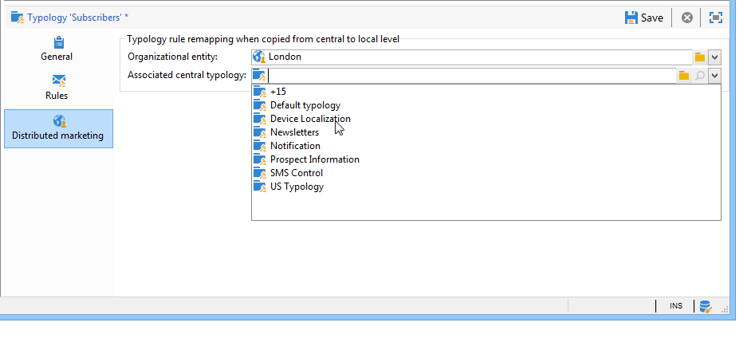

# 유형화 규칙 적용{#applying-rules}

## 게재에 유형화 적용 {#apply-a-typology-to-a-delivery}

생성한 유형화 규칙을 적용하려면 유형화에 유형화를 연결한 다음 게재에서 이 유형화를 참조하십시오.

이렇게 하려면 아래 단계를 수행합니다:

1. 캠페인 유형화를 만듭니다.

   유형화는 **[!UICONTROL Administration > Campaign Management > Typology management]** > **[!UICONTROL Typologies]** Campaign 탐색기 폴더.

1. 로 이동 **[!UICONTROL Rules]** 탭을 클릭하고 **[!UICONTROL Add]** 버튼을 클릭하고 이 유형화에 적용할 규칙을 선택합니다.

   

1. 유형화 저장: 기존 유형화 목록에 추가됨.
1. 규칙을 적용할 게재를 엽니다.
1. 게재 속성을 찾아 **[!UICONTROL Typology]** 탭.
1. 드롭다운 목록에서 유형을 선택합니다.

   

   >[!NOTE]
   >
   >이 템플릿을 사용하여 만든 모든 게재에 자동으로 적용되도록 게재 템플릿에서 유형화를 정의할 수 있습니다.

## 애플리케이션 조건 정의 {#define-application-conditions}

필요에 따라 규칙의 적용 필드를 제한할 수 있습니다(제어 규칙 제외).

연결된 특정 게재 또는 게재 대상 중 특정 수신자만 관련되도록 유형화 규칙을 구성할 수 있습니다.

규칙의 적용 조건을 정의하려면 **[!UICONTROL Edit the rule application conditions...]** 링크 **[!UICONTROL General]** 탭.

그런 다음 쿼리 편집기를 사용하여 필터링 조건을 정의합니다. 다음 예에서 용량 규칙은 레이블에 &#39;offer&#39;라는 단어가 포함된 게재 또는 2013년 4월 1일 전에 생성된 게재에만 관련됩니다.

>[!NOTE]
>
>필터링 규칙의 경우 필터링 기준의 적용 조건을 선택할 수 있습니다. 적용 조건은 게재 또는 게재 아웃라인에 따라 달라질 수 있습니다. [자세히 알아보기](filtering-rules.md#condition-a-filtering-rule)

## 계산 빈도 조정 {#adjust-calculation-frequency}

중재 작업은 매일 밤 데이터베이스 정리 워크플로우를 통해 자동으로 다시 실행됩니다. 그러나 이 기간 이후에는 값을 저장할 수 있습니다.

실제로 어떤 계산은 매일 변하지 않는 값을 사용한다. 따라서 매일 데이터를 다시 계산하고 데이터베이스를 무의미하게 오버로드하는 것은 관련이 없습니다. 예를 들어 프로세스가 고객 성향 점수와 주별 구매 정보로 마케팅 데이터베이스를 보강하는 경우 이러한 값을 기반으로 하는 데이터를 매일 다시 계산할 필요가 없습니다.

이렇게 하려면 **[!UICONTROL Frequency]** 필드 **[!UICONTROL General]** 탭에서는 타깃팅이 저장되는 최대 기간을 정의할 수 있습니다. 기본적으로 값은 **0** 일별 재중재의 다음 실행까지 계산이 유효함을 나타냅니다.

이 기간 이후의 결과를 저장하려면 다음에 12보다 큰 값을 입력합니다 **[!UICONTROL Frequency]** 필드: 이 기간이 만료되면 모든 규칙이 다시 적용됩니다.

다음 **[!UICONTROL Re-apply the rule at the start of personalization]** 옵션을 사용하면 기간에 지정된 경우를 포함하여 개인화 단계 중에 규칙을 자동으로 적용할 수 있습니다. **[!UICONTROL Frequency]** 필드는 여전히 유효합니다.

## 규칙 적용 단계 선택 {#selecting-the-rule-application-phase}

유형화 규칙은 관련된 게재의 타겟팅, 분석 및 개인화 단계 동안 특정 순서로 적용됩니다.

### 실행 순서 {#execution-order}

표준 작업 모드에서는 규칙은 다음 순서로 적용됩니다.

1. 타겟팅 시작 시 적용되는 경우에는 규칙을 제어합니다.
1. 필터링 규칙:

   * 주소 자격에 대한 기본 애플리케이션 규칙: 정의된 주소 / 확인되지 않은 주소 / 차단 목록에 주소 / 격리된 주소 / 주소 품질.
   * 사용자가 정의한 필터링 규칙.
   * 주소 또는 식별자에 대한 중복 제거 규칙(필요한 경우 적용).

1. 압력 규칙.
1. 용량 규칙.
1. 타겟팅 끝에 적용되는 경우에는 규칙을 제어합니다.
1. 규칙이 개인화 시작 시 적용되는 경우 규칙을 제어합니다. 사용자 규칙(필터링/압력/정전용량)이 만료되어 다시 계산해야 하는 경우 이 단계 중에 적용됩니다.
1. 규칙이 개인화 끝에 적용되는 경우 규칙을 제어합니다.

>[!NOTE]
>
>Campaign 상호 작용 모듈로 작업하는 경우 오퍼 자격 규칙은 필터링 규칙과 동시에 적용되거나(게재 개요에 있는 오퍼의 경우) 오퍼 엔진 호출 중에 개인화 단계 동안 적용됩니다.

의 적절한 필드를 사용하여 유형이 동일한 규칙의 실행 순서를 조정할 수 있습니다. **[!UICONTROL General]** 규칙의 탭입니다. 동일한 메시지 처리 단계 동안 여러 규칙이 실행되면 **[!UICONTROL Execution sequence]** 필드.

예를 들어 실행 순서가 20인 압력 규칙은 실행 순서가 30인 압력 규칙 이전에 실행됩니다.

### 제어 규칙 {#control-rules}

대상 **[!UICONTROL Control]** 규칙은 규칙이 적용되는 게재 수명 주기의 시점(타겟팅 전 또는 후, 개인화 시작 시, 분석 종료 시)을 결정할 수 있습니다. 의 드롭다운 목록에서 적용할 값을 선택합니다. **[!UICONTROL Phase]** 필드, **[!UICONTROL General]** 유형화 규칙의 탭입니다.

가능한 값:

* **[!UICONTROL At the start of targeting]**

  오류 발생 시 개인화 단계가 실행되지 않도록 하기 위해 여기에서 제어 규칙을 적용할 수 있습니다.

* **[!UICONTROL After targeting]**

  제어 규칙을 적용하려면 대상의 볼륨을 알고 있어야 하는 경우 이 단계를 선택합니다.

  예를 들어 **[!UICONTROL Check proof size]** 제어 규칙은 각 타겟팅 단계 후에 적용됩니다. 이 규칙은 증명 수신자가 너무 많은 경우 메시지 개인화를 방지합니다.

* **[!UICONTROL At the start of personalization]**

  제어가 메시지 개인화 승인과 관련된 경우 이 단계를 선택해야 합니다. 메시지 개인화는 분석 단계 동안 수행됩니다.

* **[!UICONTROL At the end of the analysis]**

  메시지 개인화를 완료해야 하는 경우 이 단계를 선택합니다.

## 추가 구성 {#additional-configurations}

### 발신 SMTP 트래픽 제어 {#control-outgoing-smtp-traffic}

옵션으로 다음을 사용할 수 있습니다. **[!UICONTROL Managing affinities with IP addresses]** 이 선호도를 MTA(게재 서버)에 게재하기 위한 필드입니다. 이를 통해 시스템 또는 출력 주소에 대한 특정 게재에 대한 이메일 수를 제한할 수 있습니다.

>[!NOTE]
>
>선호도 관리가 다음에 적용되지 않음 **[!UICONTROL Filtering]** 유형화.

<!--
>Affinities are defined in the instance configuration file, on the Adobe Campaign server. For more on this, refer to [this section](../../installation/using/about-initial-configuration.md).-->

### 캠페인 최적화 및 분산 마케팅 {#campaign-optimization-and-distributed-marketing}

다음 **[!UICONTROL Distributed Marketing]** 탭에서는 공유 캠페인이 주문 및/또는 예약될 때 적용되는 유형화 및/또는 규칙의 재매핑을 정의할 수 있습니다. 로컬 엔티티에 대해 정의된 유형화/규칙(중앙 엔티티에 대해 정의된 유형화와 연결)이 중앙 엔티티에 대해 연결된 규칙/유형화를 대체합니다. 다시 매핑을 사용하면 중앙 엔티티 규칙을 캠페인을 정렬하는 로컬 엔티티에 맞게 조정할 수 있습니다.

>[!NOTE]
>
>유형화 및 유형화 규칙에서 **[!UICONTROL Distributed Marketing]** 라이센스에 이 옵션이 포함된 경우 탭이 추가됩니다. 사용권 계약을 확인하십시오.\
>분산 마케팅에 대한 자세한 내용은 [이 섹션](../distributed-marketing/about-distributed-marketing.md).
