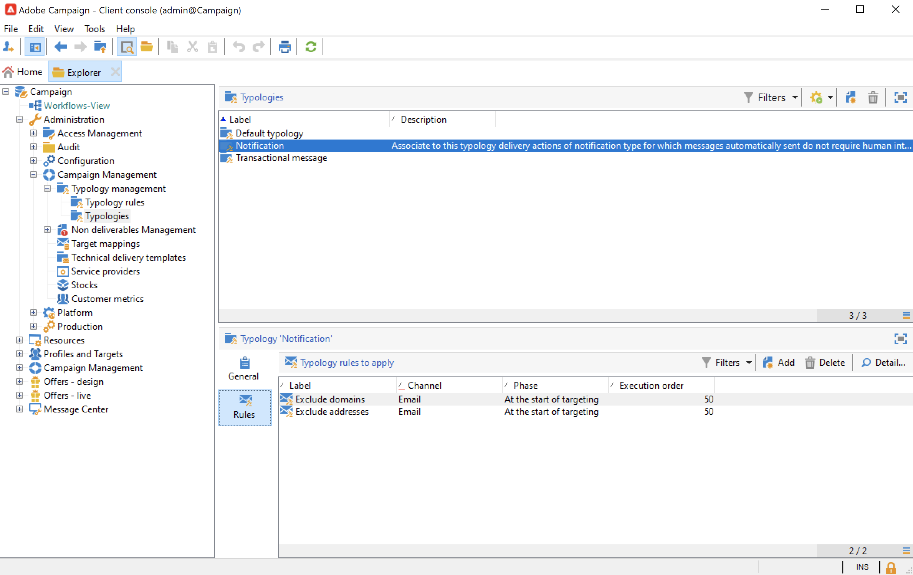

# 캠페인 유형화 시작{#about-campaign-typologies}

**캠페인 최적화**&#x200B;은(는) 게재 전송을 제어, 필터링 및 모니터링할 수 있는 Adobe Campaign 모듈입니다. 캠페인 간의 충돌을 방지하기 위해 Adobe Campaign은 특정 제한 조건을 적용하여 다양한 조합을 테스트할 수 있습니다. 이를 통해 회사 커뮤니케이션 정책을 준수하면서 고객의 요구 사항과 기대치에 가장 적합한 메시지를 보내도록 보장합니다.

 [비디오에서 이 기능 살펴보기](#typologies-video)

>[!NOTE]
>
>오퍼에 따라 Campaign 최적화를 추가 기능에 포함할 수 있습니다. 사용권 계약을 확인하십시오.

## 유형 규칙 및 유형 분류 {#typology-rules}

기본적으로 Campaign에는 유형화 및 유형화 규칙이 내장되어 있습니다.

유형화는 게재 분석 시 모든 메시지에 적용되는 확인 규칙 세트입니다.

캠페인 유형화에는 여러 유형화 규칙이 포함될 수 있지만, 게재는 하나의 유형화만 참조할 수 있습니다.

기본 제공 유형화 규칙 및 유형화는 Campaign 탐색기의 **[!UICONTROL Administration > Campaign management > Typology management]** 폴더에서 사용할 수 있습니다.

각 유형화에 대해 **[!UICONTROL Rules]** 탭에서 적용할 유형화 규칙을 추가, 삭제 또는 볼 수 있습니다.

유형화 규칙이 만들어지면 게재에서 참조되는 **유형화** 캠페인으로 유형화 규칙이 그룹화됩니다. [자세히 알아보기](#apply-typologies).

Campaign에는 기본 **필터링** 및 **제어** 규칙 집합이 있습니다.

* **필터링** 규칙은 기준에 따라 대상의 일부를 제외하는 데 사용됩니다. [자세히 알아보기](filtering-rules.md).
* **제어** 규칙을 사용하면 메시지를 보내기 전에 메시지의 유효성을 확인할 수 있습니다. [자세히 알아보기](control-rules.md).

Campaign 최적화 추가 기능은 **유형화 규칙**&#x200B;의 두 가지 추가 유형을 제공합니다.

* 마케팅 피로를 제어할 수 있는 **압력** 규칙입니다. [자세히 알아보기](pressure-rules.md).
* 최적의 처리 조건을 보장하기 위해 로드를 제한할 수 있는 **용량** 규칙입니다. [자세히 알아보기](consistency-rules.md#controlling-capacity).

>[!NOTE]
>
>**상호 작용** 모듈을 사용하여 오퍼를 관리하는 경우 **오퍼 프레젠테이션** 유형화 규칙을 만들어 프레젠테이션 규칙을 사용하여 오퍼 제안의 흐름을 제어할 수도 있습니다. [자세히 알아보기](../../v8/interaction/interaction-offer.md#offer-presentation).

## 유형화를 만들고 사용하는 주요 단계 {#apply-typologies}

게재에 대한 유형화를 만들고 사용하려면 아래 단계를 수행합니다.

1. 유형화 규칙을 만들고 유형화를 만들어 해당 규칙에 참조합니다.
자세한 단계는 다음 섹션에 나열되어 있습니다.

   * [필터링 규칙](filtering-rules.md)
   * [제어 규칙](control-rules.md)
   * [압력 규칙](pressure-rules.md)
   * [수용작업량 규칙](consistency-rules.md)

1. 생성한 유형화를 사용하도록 게재를 구성합니다. [자세히 알아보기](apply-rules.md#apply-a-typology-to-a-delivery).
1. 캠페인 시뮬레이션을 통해 동작을 테스트하고 제어합니다. [자세히 알아보기](campaign-simulations.md).

게재를 준비하는 동안 기준이 충족되면 수신자가 제외됩니다. 로그를 확인하여 제외 사항을 모니터링할 수 있습니다.

압력 유형화 규칙에 대한 샘플 사용 사례는 [이 페이지](pressure-rules.md#use-cases-on-pressure-rules)에서 확인할 수 있습니다.

## 튜토리얼 비디오 {#typologies-video}

### 유형화 규칙을 사용하여 피로도 관리를 설정합니다

이 비디오에서는 유형화 규칙을 활용하여 Adobe Campaign에서 피로도 관리를 구현하는 방법을 설명합니다.

>[!VIDEO](https://video.tv.adobe.com/v/3448338?quality=12&captions=kor)

### 사전 정의된 필터를 사용하여 피로도 관리 설정

피로도 관리는 수신자의 과도한 요청을 방지하기 위해 메시지 빈도 및 수량을 제어합니다. 캠페인 인스턴스에 캠페인 최적화 모듈이 없는 경우 수신한 메시지 수별로 대상 모집단을 필터링하는 사전 정의된 필터를 구성할 수 있습니다
이 비디오에서는 필터를 사용하여 Adobe Campaign에서 피로도 관리를 구현하는 방법을 설명합니다.

>[!VIDEO](https://video.tv.adobe.com/v/3444607?quality=12&captions=kor)
