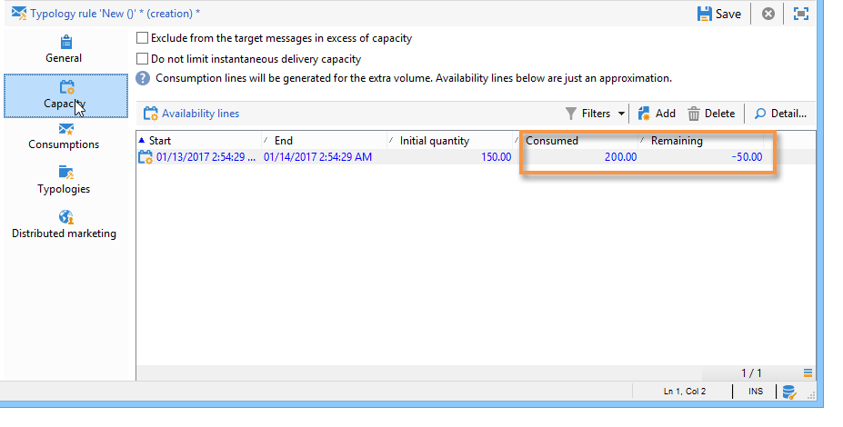
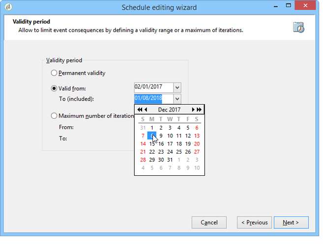

# 일관성 규칙{#consistency-rules}

Adobe Campaign은 캠페인 유형화에 포함된 규칙 세트를 사용하여 일관된 커뮤니케이션을 보장합니다. 양, 자연, 관련성 등과 같이 수신자에게 전송되는 게재를 제어하는 것이 이들의 목표입니다.

**용량** 예를 들어, 규칙은 메시지 전달으로 관련 플랫폼을 오버로드하는 것을 방지할 수 있습니다. 예를 들어, 서버 포팅을 방지하기 위해 다운로드 링크가 포함된 특별 오퍼를 한 번에 너무 많은 사람에게 전송해서는 안 됩니다. 전화 캠페인은 콜 센터 등의 처리 능력을 초과할 수 없습니다.

## 용량 제어 {#control-capacity}

메시지를 게재하기 전에 조직에서 게재(물리적 인프라), 게재가 생성할 수 있는 응답(인바운드 메시지), 연락처 구독자에게 수행할 호출 수(콜 센터 처리 능력)를 보유하고 있는지 확인해야 합니다.

이렇게 하려면 다음을 만들어야 합니다 **[!UICONTROL Capacity]** 유형화 규칙.

다음 예에서는 전화 충성도 캠페인에 대한 유형화 규칙을 만듭니다. 메시지 수를 하루에 20개(예: 콜 센터의 일일 처리 능력)로 제한합니다. 규칙이 두 게재에 적용되면 로그를 통해 소비를 모니터링할 수 있습니다.

새 용량 규칙을 디자인하려면 아래 단계를 수행하십시오.

1. 아래에 **[!UICONTROL Administration > Campaign management > Typology management > Typology rules]** 폴더, **[!UICONTROL New]**.
1. 선택 **[!UICONTROL Capacity]** 규칙 유형.

   

1. 에서 **[!UICONTROL Capacity]** 탭에서 가용성 라인을 생성합니다. 이 예제에서는 호출을 수행할 수 있는 기간입니다. 24시간 기간을 선택하고 초기 수량에 150을 입력합니다. 즉, 콜 센터에서 하루에 150개의 호출을 처리할 수 있습니다.

   

   >[!NOTE]
   >
   >가용성 라인은 정보 목적으로만 사용됩니다. 용량 제한에 도달했을 때 메시지를 제외해야 하는 경우 다음을 참조하십시오 [이 섹션](#exclude-messages-when-capacity-limit-reached).

1. 이 규칙을 유형화에 연결한 다음 유형화를 게재에 참조하여 이 용량 규칙을 적용합니다. 이 작업에 대한 자세한 정보는 [이 섹션](apply-rules.md#apply-a-typology-to-a-delivery)을 참조하십시오.
1. 규칙에서 소비를 모니터링할 수 있습니다 **[!UICONTROL Consumptions]** 및 **[!UICONTROL Capacity]** 탭.

   게재에서 규칙을 사용하면 **[!UICONTROL Consumed]** 및 **[!UICONTROL Remaining]** 열은 아래와 같이 로드 정보를 제공합니다.

   

   이 작업에 대한 자세한 정보는 [이 섹션](#monitor-consumption)을 참조하십시오.

## 최대 로드 정의 {#define-the-maximum-load}

최대 로드를 정의하려면 가용성 라인을 정의해야 합니다. 이렇게 하려면 다음 두 가지 옵션을 사용할 수 있습니다. 수동으로 수행할 수 있습니다. [하나 이상의 가용성 라인 생성](#add-availability-lines-one-by-one) 또는 가용성 범위를 만듭니다. 이러한 기간의 빈도는 자동화할 수 있습니다. [자세히 알아보기](#add-a-set-of-availability-lines)

### 가용성 라인을 하나씩 추가 {#add-availability-lines-one-by-one}

가용성 라인을 생성하려면 **[!UICONTROL Add]** 단추를 누르고 선택합니다. **[!UICONTROL Add an availability line]**. 가용성 기간과 사용 가능한 로드를 입력합니다.

처리 능력에 맞게 필요한 만큼 라인을 추가합니다.

### 가용성 라인 세트 추가 {#add-a-set-of-availability-lines}

지정된 시간에 대한 가용성 기간을 정의하려면 **[!UICONTROL Add]** 버튼을 클릭하고 **[!UICONTROL Add a set of availability lines]** 선택 사항입니다. 각 기간에 대한 기간 및 만들 기간 수를 나타냅니다.

페이지 작성 빈도를 자동화하려면 **[!UICONTROL Change]** 버튼을 클릭하고 기간 스케줄링을 정의합니다.

예를 들어 오전 9시부터 오후 5시까지 시간당 10번의 호출 비율로 모든 근무일에 대한 가용성 기간을 생성하는 일정을 정의하겠습니다. 그렇게 하려면 다음 단계를 적용합니다.

1. 주기성 유형 및 유효일 및 시간을 선택합니다.

   

1. 유효 일자를 나타냅니다.

   

1. 승인을 하기 전에 예약을 확인합니다.

   

다음 **[!UICONTROL Forecasting]** 워크플로우는 모든 일치 라인을 자동으로 생성합니다.

>[!NOTE]
>
>파일 가져오기를 통해 가용성 라인을 만드는 것이 좋습니다. 이 탭에서는 소비 라인을 보고 확인할 수 있습니다.

## 용량 제한에 도달하면 메시지 제외 {#exclude-messages-when-capacity-limit-reached}

가용성 라인은 정보 목적으로만 사용됩니다. 초과 메시지를 제외하려면 **[!UICONTROL Exclude from the target messages in excess of capacity]** 선택 사항입니다. 따라서 용량을 초과하지 않도록 합니다. 이전 예와 동일한 모집단의 경우 소비 및 잔여 용량은 초기 수량을 초과할 수 없습니다.

처리할 메시지 수는 정의된 가용성 범위에 걸쳐 균등하게 분할됩니다. 이는 일별 최대 호출 수가 제한되어 있으므로 콜 센터에 특히 적합합니다. 이메일 게재의 경우, **[!UICONTROL Do not limit instantaneous delivery capacity]** 옵션을 사용하면 이 가용성 범위를 무시하고 동시에 이메일을 보낼 수 있습니다.

>[!NOTE]
>
>오버로드의 경우, 저장된 메시지는 게재 속성에 정의된 수식에 따라 선택됩니다.

## 소비 모니터링 {#monitoring-consumption}

기본적으로 능력 규칙은 표시 목적으로만 사용됩니다. 을(를) 선택합니다 **[!UICONTROL Exclude messages in excess of capacity from the target]** 정의된 로드가 초과되지 않도록 하는 옵션입니다. 이 경우 이 유형화 규칙을 사용하여 초과 메시지는 게재에서 자동으로 제외됩니다.

소비를 모니터링하려면 **[!UICONTROL Consumed]** 열 **[!UICONTROL Capacity]** 유형화 규칙의 탭입니다.

소비 라인을 보려면 **[!UICONTROL Consumptions]** 탭의 값을 설정할 수 있습니다.
