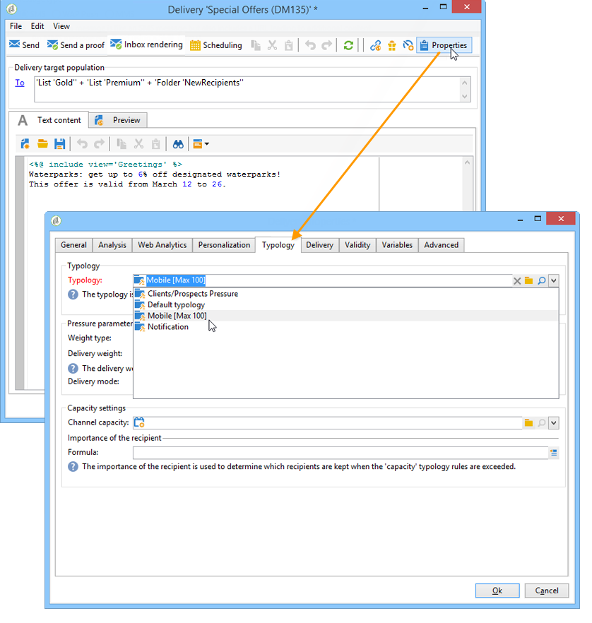

# 제어 규칙{#control-rules}

제어 규칙을 사용하면 문자 표시, SMS 크기, 주소 형식 등 게재 전에 메시지의 유효성 및 품질을 보장할 수 있습니다.

일련의 기본 규칙을 사용하여 일반적인 검사를 수행할 수 있습니다. 이러한 확인(인터페이스에 굵은 글꼴로 표시됨)은 다음과 같습니다.

* **[!UICONTROL Object approval]** (email): 보낸 사람 개체와 주소에 특정 메일 에이전트에 문제를 일으킬 수 있는 특수 문자가 포함되어 있지 않은지 확인합니다.
* **[!UICONTROL URL label approval]** (이메일): 각 추적 URL에 레이블이 있는지 확인합니다.
* **[!UICONTROL URL approval]** (이메일): 추적 URL(&quot;&amp;&quot; 문자 유무)을 확인합니다.
* **[!UICONTROL Message size approval]** (모바일): SMS 메시지의 크기를 확인합니다.
* **[!UICONTROL Validity period check]** (이메일): 모든 메시지를 보낼 수 있을 만큼 게재 유효 기간이 길은지 확인합니다.
* **[!UICONTROL Proof size check]** (모든 채널): 증명 대상 모집단이 100명의 수신자를 초과하는 경우 오류 메시지를 생성합니다.
* **[!UICONTROL Wave scheduling check]** (이메일): 게재가 여러 개의 웨이브로 분류되는 경우 유효 기간이 종료되기 전에 마지막 웨이브의 게재가 시작되도록 예약되어 있는지 확인합니다.
* **[!UICONTROL Unsubscription link approval]** (이메일): 각 컨텐츠(HTML 및 텍스트)에 하나 이상의 구독 취소(옵트아웃) URL이 있는지 확인합니다.

## 제어 규칙 만들기 {#create-a-control-rule}

필요에 맞게 새로운 제어 규칙을 만들 수 있습니다. 이렇게 하려면 다음을 만듭니다. **[!UICONTROL Control]** 유형화 규칙을 선택하고 SQL에서 **[!UICONTROL Code]** 탭.

**예:**

다음 예제에서는 SMS 오퍼가 100명 이상의 수신자에게 전송되지 않도록 규칙을 만들려고 합니다. 이 규칙은 캠페인 유형화에 연결된 다음, 관련 오퍼를 사용할 수 있는 SMS 게재에 연결됩니다.

다음 단계를 적용합니다.

1. 만들기 **[!UICONTROL Control]** 유형화 규칙. 선택 **[!UICONTROL Warning]** 경고 수준입니다.

   

1. 다음에서 **[!UICONTROL Code]** 탭에서는 아래와 같이 원하는 임계값을 적용할 스크립트를 입력합니다.

   

   이 스크립트는 게재 대상이 연락처 100개를 초과하는 경우 경고를 트리거합니다.

   ```
   if( delivery.FCP == false && delivery.properties.toDeliver > 100 ) { logWarning("Significant number of SMS to deliver (" + delivery.properties.toDeliver + "). Please make sure the target is correct.") return false; } return true
   ```

1. 이 규칙을 캠페인 유형화에 연결하고 관련 SMS 게재에서 유형화를 참조합니다.

   

1. 게재 분석 중에 규칙이 적용되고 해당하는 경우 경고가 생성됩니다.

   

   하지만 게재를 보낼 준비가 된 상태입니다.

   경고 수준을 늘리면 게재가 시작되지 않습니다.

   

   분석이 끝나면 **[!UICONTROL Confirm delivery]** 버튼을 사용할 수 없습니다.

   
