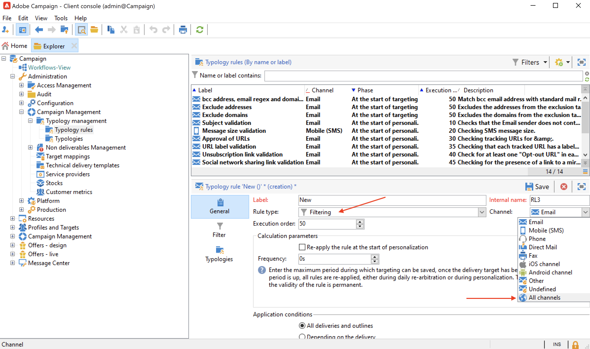
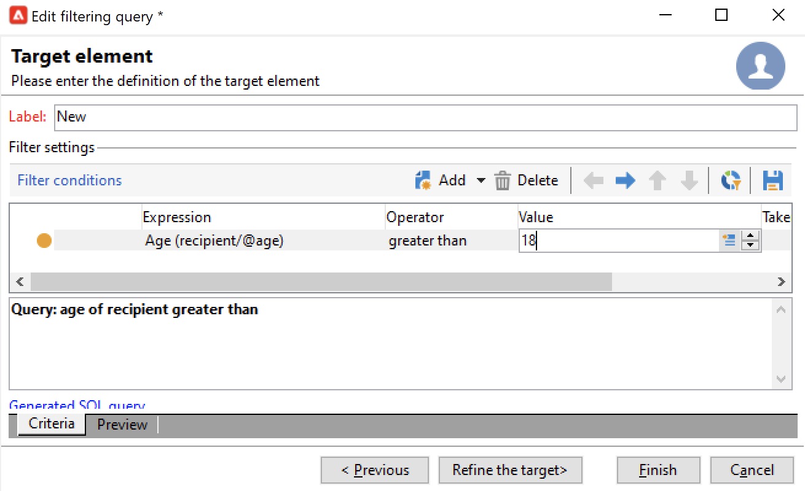
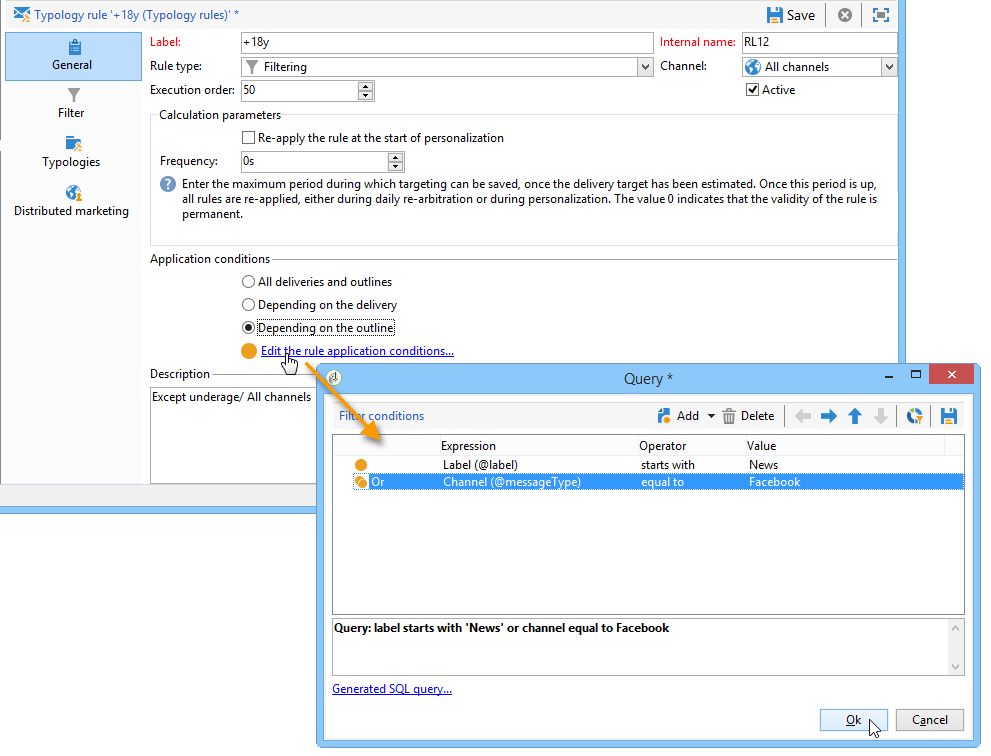

# 필터링 규칙{#filtering-rules}

쿼리에 정의된 기준을 기반으로 제외할 메시지를 선택하려면 필터링 규칙을 사용합니다. 이러한 규칙은 타겟팅 차원에 연결됩니다.

필터링 규칙은 다른 유형의 규칙(제어, 압력 등)에 연결할 수 있습니다. 유형화에서 또는 전용 로 그룹화됨 **필터링** 유형화. [자세히 알아보기](#create-and-use-a-filtering-typology)

## 필터링 규칙 만들기 {#create-a-filtering-rule}

예를 들어 뉴스레터 구독자를 필터링하여 미성년자인 수신자에게 커뮤니케이션이 전송되지 않도록 할 수 있습니다.

이 필터를 정의하려면 다음 단계를 적용합니다.

1. 다음으로 이동 **[!UICONTROL Administration > Campaign management > Typology management > Typology rules]** Campaign 탐색기 폴더 및 클릭 **신규** 아이콘을 클릭하여 유형화 규칙을 만듭니다.
1. 만들기 **[!UICONTROL Filtering]** 모든 채널에 적용할 수 있는 유형화 규칙입니다.

   

1. 다음에서 **필터** 탭 기본 타겟팅 차원을 다음으로 변경 **구독** (**nms:subscription**).

   

1. 다음을 사용하여 필터 만들기 **[!UICONTROL Edit the query from the targeting dimension...]** 링크를 클릭합니다.

   

1. 수신자 날짜를 필터링하고 필터링 조건을 저장합니다.

   

1. 다음에서 **유형화** 탭을 클릭하고 이 규칙을 캠페인 유형화에 연결한 다음 저장합니다.

   

게재에서 이 규칙을 사용하면 미성년자 구독자는 자동으로 제외됩니다. 특정 메시지는 규칙이 적용되는 시기를 나타냅니다.

## 필터링 규칙 조건 {#condition-a-filtering-rule}

연결된 게재 또는 게재 개요를 기반으로 필터링 규칙의 적용 필드를 제한할 수 있습니다.

이렇게 하려면 **[!UICONTROL General]** 유형화 규칙의 탭에서 적용할 제한 유형을 선택하고 필터를 만듭니다.
<!--

-->

이 경우 규칙이 모든 게재에 연결되어 있더라도 정의된 필터의 기준과 일치하는 게재에만 적용됩니다.

>[!NOTE]
>
>워크플로에서 유형화 및 필터링 규칙을 사용할 수 있습니다. **[!UICONTROL Delivery outline]** 활동. [자세히 알아보기](../workflow/delivery-outline.md)

## 필터링 유형화 만들기 및 사용 {#create-and-use-a-filtering-typology}

다음을 만들 수 있습니다. **[!UICONTROL Filtering]** 유형화: 필터링 규칙만 포함됩니다.

이러한 특정 유형화는 타겟을 선택할 때 게재에 연결할 수 있습니다. 게재 마법사에서 **[!UICONTROL To]** 링크를 클릭한 다음 **[!UICONTROL Exclusions]** 탭.

그런 다음 게재에 적용할 필터링 유형화를 선택합니다. 이렇게 하려면 **[!UICONTROL Add]** 을(를) 클릭하고 적용할 유형화를 선택합니다.

유형화로 그룹화하지 않고 이 탭을 통해 필터링 규칙을 직접 연결할 수도 있습니다. 이렇게 하려면 창의 아래 섹션을 사용합니다.

>[!NOTE]
>
>선택 창에서는 유형화와 필터링 규칙만 사용할 수 있습니다.
>
>이러한 구성은 템플릿을 사용하여 만든 모든 새 게재에 자동으로 적용되도록 게재 템플릿에서 정의할 수 있습니다.
>

## 기본 게재 가능성 제외 규칙 {#default-deliverability-exclusion-rules}

기본적으로 두 가지 필터링 규칙을 사용할 수 있습니다. **[!UICONTROL Exclude addresses]** ( **[!UICONTROL addressExclusions]** ) 및 **[!UICONTROL Exclude domains]** ( **[!UICONTROL domainExclusions]** ). 전자 메일 분석 중에 이러한 규칙은 수신자 전자 메일 주소를 게재 가능성 인스턴스에서 관리되는 암호화된 전역 제외 목록에 포함된 금지된 주소 또는 도메인 이름과 비교합니다. 일치하는 항목이 있으면 메시지가 해당 수신자에게 전송되지 않습니다.

이는 악성 활동, 특히 Spamtrap 사용으로 인해 차단 목록에 추가하다에 추가되는 것을 피하기 위한 것입니다. 예를 들어 웹 양식 중 하나를 통해 구독하는 데 Spamtrap을 사용하는 경우 확인 이메일이 해당 Spamtrap으로 자동 전송되며, 이렇게 되면 주소가 자동으로 차단 목록에 추가하다에 추가됩니다.

>[!NOTE]
>
>전역 제외 목록에 포함된 주소 및 도메인 이름은 숨겨집니다. 제외된 수신자 수만 게재 분석 로그에 표시됩니다.
