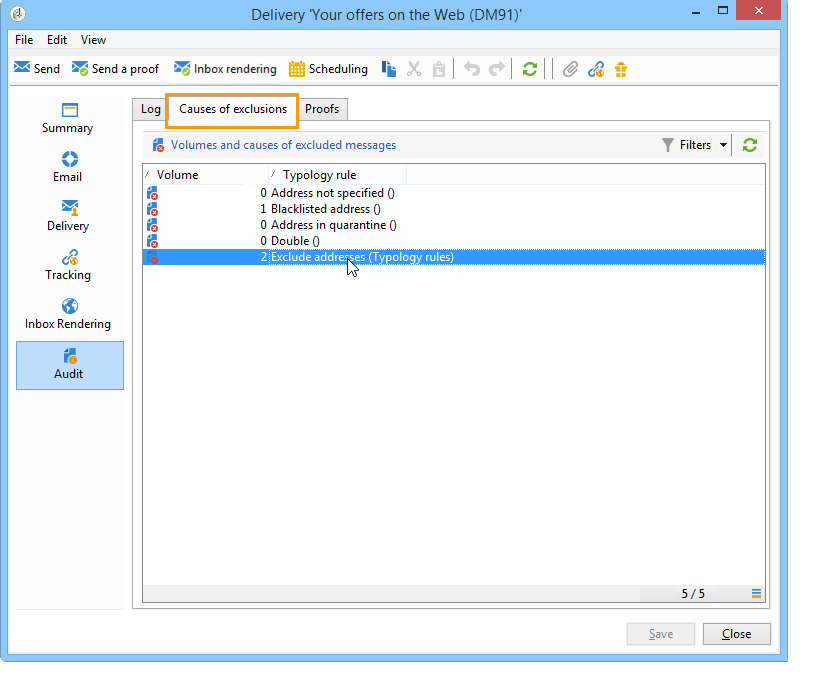
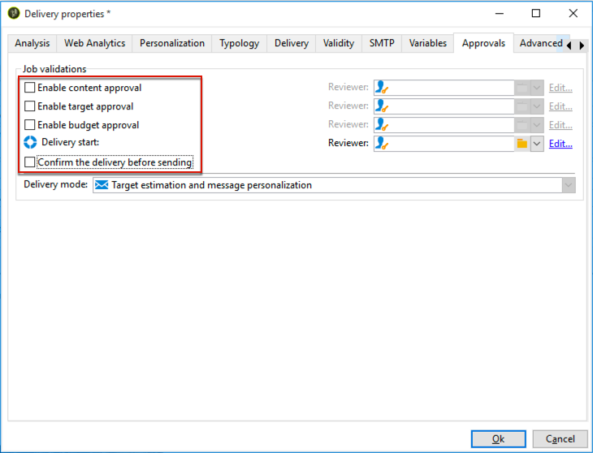

# 압력 규칙{#pressure-rules}

판매 압력 관리를 구현하면 데이터베이스의 모집단을 지나치게 모집하는 것을 방지할 수 있습니다. 마케팅 피로도 라고도 합니다. 이를 위해 수신자당 최대 메시지 수를 정의할 수 있습니다. 또한 캠페인 간에 중재 규칙을 구현하여 타겟팅된 대상자에게 최상의 메시지를 보낼 수 있습니다.

**압력** 규칙을 사용하여 마케팅 피로를 관리할 수 있습니다. 예를 들어 모집단에 보낼 편지 수를 2개로 제한하거나, 구독자 그룹의 이익과 가장 일치하는 커뮤니케이션을 선택하고, 불만을 가진 고객에게 SMS를 보내지 않는 등의 작업을 할 수 있습니다.

캠페인은 정의된 임계값 및 메시지 가중치를 기반으로 선택됩니다.

* 임계값은 지정된 기간 내에 지정된 수신자에 대해 승인된 가장 높은 게재 수입니다. 또는 변수를 설정할 수 있습니다. 유형화 규칙 설정에서 설정되거나 계산됩니다. [자세히 알아보기](#maximum-number-of-messages)
* 게재 가중치를 통해 압력 관리 프레임워크 내에서 최우선 게재를 식별할 수 있습니다. 가중치가 가장 높은 메시지에 우선 순위가 있습니다. [자세히 알아보기](#message-weight)

중재에는 진행 중인 캠페인보다 비중이 큰 예약된 캠페인이 과도한 프로필 요청으로 이어지지 않도록 하는 것이 포함됩니다. 이 경우 프로필이 게재에서 제외됩니다.

중재 기준(메시지 가중치 및/또는 임계값)은 다음 두 가지 유형의 정보에 따라 달라질 수 있습니다.

* 수신자 환경 설정(선언적 정보: 뉴스레터 구독, 수신자 상태(고객 또는 잠재 고객),
* 수신자 행동: 구매, 방문한 링크 등

적격 메시지를 정의하기 위한 중재 규칙은 분석 단계에서 적용됩니다. 각 수신자 및 관련 기간에 대해 다음 수식이 참인 경우 메시지가 전송됩니다. **(보낸 메시지 수) + (가중치가 더 큰 메시지 수) &lt; 임계값**.

그렇지 않으면 수신자는 **[!UICONTROL Excluded by arbitration]**. [자세히 알아보기](#exclusion-after-arbitration)

## 압력 규칙 만들기 {#create-a-pressure-rule}

Adobe Campaign을 사용하여 캠페인 간의 중재를 설정하려면 캠페인 유형화를 만들고 연결된 유형화 규칙(**압력** 규칙).

**[!UICONTROL Pressure]** 유형화 규칙을 만들고 구성하려면 다음 단계를 수행합니다.

1. 캠페인 유형 규칙 목록에서 다음을 선택합니다. **[!UICONTROL New]** 목록 위에 있는 아이콘.

   

1. 다음에서 **[!UICONTROL General]** 새 규칙의 탭에서 **압력** 규칙을 입력하고 규칙의 이름과 설명을 입력합니다.

   

1. 필요한 경우 실행 순서를 변경합니다. 여러 유형화 규칙이 다음으로 적용되는 경우 **[!UICONTROL Typology]** 를 설정하면 순서가 낮은 규칙이 먼저 적용됩니다. [자세히 알아보기](apply-rules.md#execution-order)
1. 다음에서 **[!UICONTROL Calculation parameters]** 섹션에서 다음 일별 재중재 실행 이후에 타깃팅을 저장하려면 빈도를 정의합니다. [자세히 알아보기](apply-rules.md#adjust-calculation-frequency)
1. 다음을 클릭합니다. **[!UICONTROL Pressure]** 을(를) 탭하고 유형화 규칙이 적용되는 달력 기간을 선택합니다.

   

   해당 기간에 연락 날짜가 포함된 게재에 규칙이 적용됩니다.

   >[!NOTE]
   >
   >의 맥락에서 [엔터프라이즈(FFDA) 배포](../../v8/architecture/enterprise-deployment.md) Campaign의 예약된 게재는 고려되지 않습니다.

1. 가장 많은 메시지 수를 계산하는 방법을 정의합니다.

   임계값은 관련 기간 동안 수신자에게 보낼 수 있는 최대 메시지 수를 나타냅니다.

   기본적으로 임계값은 일정하며 규칙에서 허가한 최대 메시지 수를 표시해야 합니다.

   

   변수 임계값을 정의하려면 **[!UICONTROL Depends on the recipient]** 의 값 **[!UICONTROL Type of threshold]** 필드를 만들고 오른쪽의 아이콘을 사용하여 표현식 편집기를 엽니다.

   

   자세한 내용은 다음을 참조하십시오. [최대 메시지 수](#maximum-number-of-messages).

1. 게재 가중치 계산 방법을 지정합니다.

   각 게재에는 가중치, 즉 우선 순위 수준을 나타내는 값이 있습니다. 이렇게 하면 캠페인 간에 중재가 활성화됩니다. 가중치는 유형화 규칙 및/또는 해당 속성에 정의된 공식을 사용하여 계산됩니다. [자세히 알아보기](#message-weight)

1. 기본적으로 모든 메시지는 임계값 계산에 고려됩니다. 다음 **[!UICONTROL Restriction]** 탭에서는 유형화 규칙과 관련된 메시지를 필터링할 수 있습니다.

   * 이 탭의 상단 섹션에서는 관련 수신자를 제한할 수 있습니다.
   * 이 탭의 아래 섹션에서는 계산할 메시지를 필터링할 수 있습니다.

     다음 예제에서는 수신자만 **새 연락처** 폴더 및 다음으로 시작하는 게재 고려 **뉴스레터** 걱정하고 있습니다.

   

1. 다음 **[!UICONTROL Typologies]** 탭에서는 이 규칙을 적용하는 캠페인 유형화를 보거나 규칙을 하나 이상의 기존 유형화에 연결할 수 있습니다. [자세히 알아보기](campaign-typologies.md#apply-typologies)

## 임계값 및 가중치 정의 {#define-thresholds-and-weights}

### 최대 메시지 수 {#maximum-number-of-messages}

각 압력 규칙은 특정 시간 동안 한 명의 수신자에게 보낼 수 있는 최대 메시지 수인 임계값을 정의합니다. 이 임계값에 도달하면 고려된 기간이 끝날 때까지 더 이상 게재할 수 없습니다. 이 프로세스를 사용하면 메시지가 설정된 임계값을 초과하는 경우 수신자를 게재에서 자동으로 제외하여 과도한 요청을 방지할 수 있습니다.

임계값은 일정하거나 변수가 있는 공식으로 계산할 수 있습니다. 즉, 특정 기간 동안 임계값은 수신자마다 또는 동일한 수신자에 대해 다를 수 있습니다.

>[!CAUTION]
>
>입력 중 **0** 임계값은 고려되는 기간 동안 대상 모집단에 대한 모든 게재를 방지합니다.

**예:**

수신자가 속한 세그먼트에 따라 허용된 메시지 수를 인덱싱할 수 있습니다. 즉, 웹 세그먼트에 속하는 수신자가 다른 수신자보다 더 많은 메시지를 받을 수 있습니다. An **[!UICONTROL Iif (@origin='Web', 5, 3)]** 유형 수식은 수신자에게 5개의 메시지를 게재하고 다른 세그먼트의 경우 3개의 메시지를 게재하도록 허용합니다. 구성은 다음과 같습니다.

임계값을 정의하려면 타겟팅 차원에 연결된 차원을 사용합니다. 예를 들어 에 저장된 수신자 프로필에 전달된 메시지를 포함할 수 있습니다. [방문자 테이블](../../v8/audiences/target-mappings.md) 또는 수신자의 메시지와 연결된 차원에서 식별된 동일한 가구에 매주 두 개 이상의 메시지를 보내지 않도록 합니다(여러 이메일 주소를 의미할 수 있음).

이렇게 하려면 **[!UICONTROL Count messages on a linked dimension]** 옵션을 선택한 다음 방문자 또는 연락처 테이블을 선택합니다.

### 메시지 가중치 {#message-weight}

각 게재에는 우선 순위 수준을 나타내는 가중치가 있습니다. 기본적으로 게재 가중치는 5로 설정되어 있습니다. 압력 규칙을 사용하면 적용되는 게재의 무게를 정의할 수 있습니다.

가중치는 수신자에 맞게 공식을 통해 설정하거나 계산할 수 있습니다. 예를 들어 수신자의 관심사에 따라 게재 가중치를 정의할 수 있습니다.

>[!CAUTION]
>
>유형화 규칙에 정의된 가중치를 의 각 게재에 대해 개별적으로 오버로드할 수 있습니다. **[!UICONTROL Properties]** 탭. 다음을 클릭합니다. **[!UICONTROL Typology]** 탭으로 이동하여 캠페인 유형화를 선택하고, 필요한 경우 적용할 가중치를 지정합니다.\
>그러나 A 유형화 규칙에 선언된 가중치는 B 유형화 규칙을 계산하는 데 사용되지 않습니다. 이 가중치는 A 규칙을 사용하는 게재에만 적용됩니다.

**예:**

다음 예에서는 음악에 대한 뉴스레터의 가중치를 수신자의 성향 점수와 연결하려고 합니다. 방법은 다음과 같습니다.

1. 수신자 성향 점수를 저장할 새 필드를 만듭니다. 필드, **@Music** 이 경우 설문 조사 및 온라인 설문 조사에 대한 응답, 수집된 추적 데이터 등으로 보강됩니다.
1. 이 필드를 기반으로 메시지 가중치를 계산하는 유형화 규칙을 만듭니다.

   

1. 뉴스레터, 특별 오퍼 등의 주제를 가진 메시지에 이 규칙을 적용합니다. 이러한 게재의 가중치 및 따라서 우선 순위 수준은 각 수신자의 성향 점수에 따라 달라집니다.

## 기간 설정 {#setting-the-period}

압력 규칙은에서 정의됩니다. **n**-일 순환 기간.

마침표는에 구성됩니다. **[!UICONTROL Pressure]** 규칙의 탭입니다. 일 수를 지정하고 필요한 경우 적용할 그룹화 유형(일, 주, 월, 분기 등)을 선택할 수 있습니다.

그룹화 유형을 사용하면 다음을 확장할 수 있습니다. **[!UICONTROL Period considered]** 기간의 날짜에 대한 전체 일, 달력 주, 달력 월 또는 달력 연도를 나타내는 필드입니다.

예를 들어, 매주 2개의 메시지 임계값을 정의하고 각 달로 그룹화한 압력 규칙은 동일한 주 및 동일한 달로 2개 이상의 메시지가 게재되지 않도록 합니다. 경고: 기간이 2개월과 겹치면 계산 임계값은 이 두 달력의 게재를 고려하므로 두 번째 달 동안의 모든 새 게재를 방지할 수 있습니다.

>[!CAUTION]
>
>임계값을 계산할 때에는 이미 전송된 게재만 고려됩니다.

2주 기간을 고려하여 게재를 제한하려면 다음을 입력합니다 **15d** 다음에서 **[!UICONTROL Concerned period]** 필드: 규칙이 적용되는 게재 날짜 이전 최대 2주까지 전송된 게재는 계산에 고려됩니다

기간 시작 일자는 데이터베이스 구성 방식에 따라 다릅니다.

예를 들어, 12/11 일자 게재에 그룹화하지 않고 15일 압력 규칙을 적용하는 경우 게재는 11/27과 12/12 사이에 고려됩니다. 압력 규칙이 임시 캘린더의 게재를 고려할 경우, 11/27과 12/27 사이에 예약된 모든 게재가 고려됩니다. 마지막으로, 규칙에서 월별 그룹화를 구성하는 경우 11월과 12월의 모든 게재가 임계값(11/1부터 12/31)을 계산하기 위해 고려됩니다.

**빈번한 사례**

현재 주별 게재를 고려하지 않고 계산 임계값의 이전 주별 게재를 고려하지 않도록 하려면 다음을 지정합니다. **[!UICONTROL Period considered]** &#39;0&#39;에서 &#39;주당 그룹화&#39;를 선택합니다. **[!UICONTROL Period type]**.

기간이 0보다 큰 경우(예: 1) 계산 임계값은 전날의 게재를 고려할 수 있습니다. 따라서 이전 날짜가 이전 달력 주에 해당하고 선택한 기간 유형이 &#39;주별 그룹화&#39;인 경우 계산 임계값에 이전 주가 모두 고려됩니다.

**예:**

2주 기간 동안 권유를 3개의 메시지로 제한하고 해당 달로 그룹화하는 압력 규칙을 만들려고 합니다.

05/30, 06/3, 06/8, 06/12, 06/22 및 06/30으로 예정된 6개의 뉴스레터를 동일한 가중치로 사용해 보겠습니다.

6월 12일과 30일로 예약된 게재는 전송되지 않습니다. 06/12 게재는 2주 기간당 3개의 메시지 임계값을 초과하며 30일 게재는 월별 승인된 통신의 임계값을 초과합니다.

이러한 게재에 대한 모든 수신자는 분석 단계 중 중재에 의해 제외됩니다.

동일한 규칙의 경우 분기별 게재를 그룹화하는 경우 의 수신자가 **뉴스레터 번호 5** 이(가) 또한 제외되며 전송되지 않습니다.

마지막으로, 선택한 그룹화가 없을 경우에만 **뉴스레터 번호 4** 처음 3개의 뉴스레터와 동일한 2주 기간으로 예약되었으므로 이(가) 전송되지 않습니다.

>[!NOTE]
>
>유형화 규칙의 정의를 변경할 때 **시뮬레이션** 게재가 게재에 미치는 영향을 제어하고 게재가 서로 미치는 영향을 모니터링합니다. [자세히 알아보기](campaign-simulations.md)

## 중재 후 제외 {#exclusion-after-arbitration}

중재 작업은 매일 밤 다음을 통해 다시 적용됩니다. **[!UICONTROL Forecasting]** 기술 워크플로우 및 **[!UICONTROL Campaign jobs]** 워크플로입니다.

다음 **[!UICONTROL Forecasting]** 워크플로는 분석 중에 유형화 규칙을 적용할 수 있도록 진행 중인 기간(시작 날짜부터 현재 날짜까지)에 대한 데이터를 미리 계산합니다. 또한 매일 밤 중재에 대한 제외 카운터를 다시 계산합니다.

따라서 각 수신자에 대해 Adobe Campaign은 관련 기간 동안 이미 전송된 메시지 수를 고려하여 전송할 메시지 수가 임계값을 초과하지 않는지 확인합니다. 이 정보는 **표시기**&#x200B;모든 계산은 게재 시 업데이트되므로

이 수가 임계값을 초과하는 경우 캠페인 유형화에 정의된 중재 규칙이 적용되고 수신자는 가중치가 낮은 캠페인에서 제외됩니다.

>[!NOTE]
>
>여러 게재에 동일한 점수가 있는 경우 가장 빠른 날짜에 예약된 캠페인이 전송됩니다.

## 압력 규칙에 대한 사용 사례 {#use-cases-on-pressure-rules}

### 기준에 따라 임계값 조정 {#adapt-the-threshold-based-on-criterion}

고객에게 매주 4개 이상, 잠재 고객에게 매주 2개 이상의 메시지를 게재하지 않도록 유형화 규칙을 만들려고 합니다.

고객 및 잠재 고객을 식별하려면 **[!UICONTROL Status]** 필드 - 잠재 고객의 경우 0, 고객의 경우 1이 포함됩니다.

규칙을 만들려면 다음 단계를 적용합니다.

1. 새로 만들기 **압력** 유형화 규칙을 입력합니다.
1. 편집 **[!UICONTROL Pressure]** 탭: **[!UICONTROL Maximum number of messages]** 섹션에서는 각 수신자에 따라 임계값을 계산하는 수식을 생성하려고 합니다. 다음 항목 선택 **[!UICONTROL Depends on the recipient]** 의 값 **[!UICONTROL Threshold type]** 필드를 클릭한 다음 **[!UICONTROL Edit expression]** 의 오른쪽에 **[!UICONTROL Formula]** 필드.

   다음을 클릭합니다. **[!UICONTROL Advanced parameters]** 버튼을 클릭하여 계산 공식을 정의합니다.

   

1. 다음 항목 선택 **[!UICONTROL Edit the formula using an expression]** 옵션 및 클릭 **[!UICONTROL Next]**.

   

1. 함수 목록에서 **Iif** 의 함수 **[!UICONTROL Others]** 노드.

   그런 다음 수신자를 선택합니다. **상태** 다음에서 **[!UICONTROL Available fields]** 섹션.

   

   다음 공식을 입력합니다. **Iif(@status=0,2,4)**

   

   이 수식을 사용하면 상태가 0인 경우 값 2를 할당하고 다른 모든 상태에 대해 값 4를 할당할 수 있습니다.

   수식을 승인하려면 **[!UICONTROL Finish]**&#x200B;을(를) 클릭합니다.

1. 규칙이 적용되는 기간(이 경우 7일)을 지정하여 주당 메시지 수를 계산합니다.

   

1. 규칙을 저장하여 생성을 승인합니다.

이제 방금 만든 규칙을 게재에 적용하기 위해 유형화에 연결합니다. 방법은 다음과 같습니다.

1. 캠페인 유형화를 만듭니다.
1. 로 이동 **[!UICONTROL Rules]** 탭을 클릭하고 **[!UICONTROL Add]** 버튼을 클릭하고 방금 만든 규칙을 선택합니다.

   

1. 유형화 저장: 기존 유형화 목록에 추가됨.

게재에서 이 유형화를 사용하려면 의 게재 속성에서 선택합니다 **[!UICONTROL Typology]** 아래 표시된 탭:

>[!NOTE]
>
>이 템플릿을 사용하여 만든 모든 게재에 자동으로 적용되도록 게재 템플릿에서 유형화를 정의할 수 있습니다.

게재 분석 중에 게재 수신자는 이미 보낸 게재 수에 따라 해당되는 경우 게재에서 제외됩니다. 이 정보를 보려면 다음을 수행할 수 있습니다.

* 분석 결과 보기:

  

* 게재를 편집하고 **[!UICONTROL Delivery]** 탭 및 **[!UICONTROL Exclusions]** 하위 탭:

  

* 다음을 클릭합니다. **[!UICONTROL Audit]** 탭을 클릭한 다음 **[!UICONTROL Causes of exclusions]** 제외 수 및 적용된 유형화 규칙을 표시하는 하위 탭:

  

### 비헤이비어를 기반으로 게재 가중치 계산 {#calculate-the-delivery-weight-based-on-behavior}

수신자 동작에 따라 압력 규칙을 정의할 수 있습니다. 따라서 게재 가중치는 수신자마다 다른 기준에 따라 조정될 수 있습니다. 예를 들어 수신자가 인터넷 사이트를 방문했는지, 지난 뉴스레터의 특정 섹션을 클릭했는지, 정보 서비스에 가입했는지 또는 설문 조사, 온라인 게임 등에 대한 답변을 기반으로 했는지 여부에 따라 메시지 보내기를 결정할 수 있습니다.

다음 예제에서는 가중치가 5인 게재를 만들려고 합니다. 이 가중치는 수신자 행동을 기반으로 하는 성향 점수로 보강됩니다. 이 사이트에서 이미 주문한 고객은 5점을, 온라인으로 주문한 적이 없는 고객은 4점을 갖게 됩니다.

이 유형의 구성을 수행하려면 공식을 사용하여 메시지 가중치를 정의해야 합니다. 성향 점수와 설문 조사 응답에 대한 정보는 데이터 모델에서 액세스할 수 있어야 합니다. 이 예에서는 **성향** 필드가 추가되었습니다.

다음 구성 단계를 적용합니다.

1. 새로 만들기 **압력** 유형화 규칙을 입력합니다.
1. 편집 **[!UICONTROL Pressure]** 탭. 각 개별 수신자를 기준으로 할 임계값 공식을 만들려고 합니다. **[!UICONTROL Edit expression]** 아이콘 의 오른쪽 **[!UICONTROL Weight formula]** 필드.

   

1. 기본적으로 값 **5** 표현식 편집기의 위쪽 섹션에 표시됩니다. 각 수신자의 성향 점수를 이 가중치에 추가하려고 합니다. 커서를 5의 오른쪽에 놓고 다음을 입력합니다. **+** 문자 및 선택 **성향** 필드.

   

1. 그런 다음 이미 구매한 수신자에 대해 더 높은 값을 추가합니다. 이들에게는 배송의 무게가 5만큼 증가해야 하는 반면, 다른 이들에게는 4만큼 증가하는 데 그친다.

   

1. 클릭 **[!UICONTROL Finish]** 을 눌러 이 규칙을 저장합니다.
1. 규칙을 캠페인 유형화에 연결하고 게재에서 이 유형화를 참조하여 승인합니다.

### 가중치가 가장 높은 메시지만 보내기 {#send-only-the-highest-weighted-messages}

수신자별로 하루에 2개의 메시지로 제한하여 같은 주 내에 최대 2개의 메시지를 보내며 가중치가 더 높은 메시지만 전달하려고 합니다.

이렇게 하려면 동일한 수신자에 대해 서로 다른 가중치가 적용된 여러 게재를 예약하고 가중치가 낮은 게재를 제외하는 압력 규칙을 적용해야 합니다.

먼저, 압력 규칙을 구성합니다.

1. 압력 규칙을 만듭니다. [자세히 알아보기](#create-a-pressure-rule)
1. 다음에서 **[!UICONTROL General]** 탭에서 **[!UICONTROL Re-apply the rule at the start of personalization]** 옵션을 선택합니다.

   

   이 옵션은 **[!UICONTROL Frequency]** 필드를 지정하고 개인화 단계 동안 규칙을 자동으로 적용합니다. [자세히 알아보기](apply-rules.md#adjust-calculation-frequency)

1. 다음에서 **[!UICONTROL Pressure]** 탭, 선택 **[!UICONTROL 7d]** (으)로 **[!UICONTROL Period considered]** 및 **[!UICONTROL Grouping per day]** (으)로 **[!UICONTROL Period type]**.
1. 다음에서 **[!UICONTROL Typologies]** 탭에서 규칙을 캠페인 유형화에 연결합니다.
1. 변경 내용을 저장합니다.

이제 압력 규칙을 적용할 각 게재에 대한 워크플로우를 만들고 구성합니다.

1. 캠페인을 만듭니다. [자세히 알아보기](../campaigns/marketing-campaign-create.md#create-a-campaign)
1. 다음에서 **[!UICONTROL Targeting and workflows]** 캠페인의 탭에서 **쿼리** 활동을 워크플로우에 추가합니다. 이 활동 사용에 대한 자세한 내용은 을 참조하십시오. [이 섹션](../workflow/query.md).
1. 추가 **[!UICONTROL Email delivery]** 활동을 워크플로우에 추가하고 엽니다. 이 활동 사용에 대한 자세한 내용은 을 참조하십시오. [이 섹션](../workflow/delivery.md).
1. 로 이동 **[!UICONTROL Approvals]** 의 탭 **[!UICONTROL Delivery properties]** 모든 승인을 비활성화합니다.

   

1. 다음에서 **[!UICONTROL Typology]** 의 탭 **[!UICONTROL Delivery properties]**&#x200B;에 규칙을 적용하려면 캠페인 유형화를 참조하십시오. 게재 가중치를 정의합니다.

   

1. 게재에서 다음을 클릭합니다. **[!UICONTROL Scheduling]** 및 선택 **[!UICONTROL Schedule delivery (automatic execution when the scheduled date is reached)]**. 이 예에서 **[!UICONTROL Use a calculation formula]** 옵션을 선택합니다.
1. 추출 날짜를 10분 (현재 날짜 + 10분)으로 설정합니다.
1. 연락 날짜를 다음 날(현재 날짜 + 1일)로 설정합니다.

   

   압력 규칙 제외가 성공적으로 구현되도록 하려면 연락 날짜 및 시간 이전과 야간 중재가 다시 적용되기 전에 추출 날짜 및 시간을 설정해야 합니다. [자세히 알아보기](#exclusion-after-arbitration)

1. 선택 취소 **[!UICONTROL Confirm the delivery before sending]** 옵션을 선택하고 변경 내용을 저장합니다.
1. 전송하려는 각 게재에 대해 유사하게 진행합니다. 각 게재에 대해 원하는 가중치를 설정해야 합니다.
1. 관련 워크플로우를 실행하여 게재를 준비하고 전송합니다.

야간 중재가 적용되면 동일한 수신자에 대해 가중치가 낮은 게재는 제외된다. 가중치가 가장 높은 게재만 전송으로 간주됩니다. [자세히 알아보기](#message-weight)

이미 해당 주 중에 일찍 이메일이 해당 수신자에게 전송된 것을 고려하여 아래 표에 두 개의 게재에 적용할 수 있는 구성의 예가 나와 있습니다.

<table> 
 <thead> 
  <tr> 
   <th> 게재  </th> 
   <th> 승인  </th> 
   <th> 두께  </th> 
   <th> 추출 날짜/시간  </th> 
   <th> 연락일  </th> 
   <th> 게재 시작 날짜/시간  </th> 
   <th> 중재 워크플로우 실행 날짜/시간  </th> 
   <th> 게재 상태  </th> 
   <th> 보낸 게재(날짜/시간)  </th> 
  </tr> 
 </thead> 
 <tbody> 
  <tr> 
   <td> 게재 1  </td> 
   <td> 비활성화됨  </td> 
   <td> 5  </td> 
   <td> 오후 3시  </td> 
   <td> 오전 8시(다음 날)  </td> 
   <td> 오후 2시  </td> 
   <td> 매일 밤  </td> 
   <td> 제외됨  </td> 
   <td> 제외됨  </td> 
  </tr> 
  <tr> 
   <td> 게재 2  </td> 
   <td> 비활성화됨  </td> 
   <td> 10  </td> 
   <td> 오후 4시  </td> 
   <td> 오전 9시(다음 날)  </td> 
   <td> 오후 2시  </td> 
   <td> 매일 밤  </td> 
   <td> 전송됨  </td> 
   <td> 오전 9시(다음 날)  </td> 
  </tr> 
 </tbody> 
</table>

두 게재에 대한 추출 날짜가 지나면 두 게재의 연락 날짜 이전에 야간 중재가 다시 적용됩니다. 이렇게 하면 이미 전송되었거나(게재를 처리 또는 브로드 로그를 통해 기록된 수신자) 전송 예정인 모든 게재(게재를 받을 자격이 있는 수신자, 예측 로그를 통해 기록된 수신자)를 찾을 수 있습니다.

압력 규칙에 정의된 기간 동안 전송된 모든 게재 및 잠재적 게재가 나열되면 Adobe Campaign은 가장 높은 가중치를 먼저 사용하여 가중치로 정렬합니다. 압력 규칙의 임계값에 도달하면(동일한 주 내에 2개 이하의 이메일) 수신자는 게재에서 제외됩니다.
