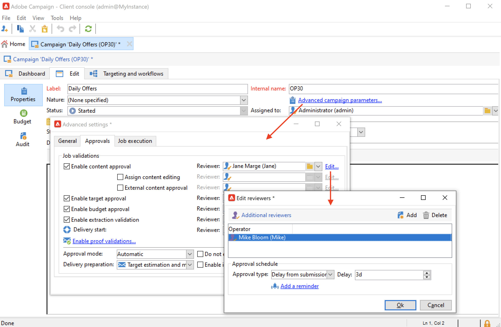
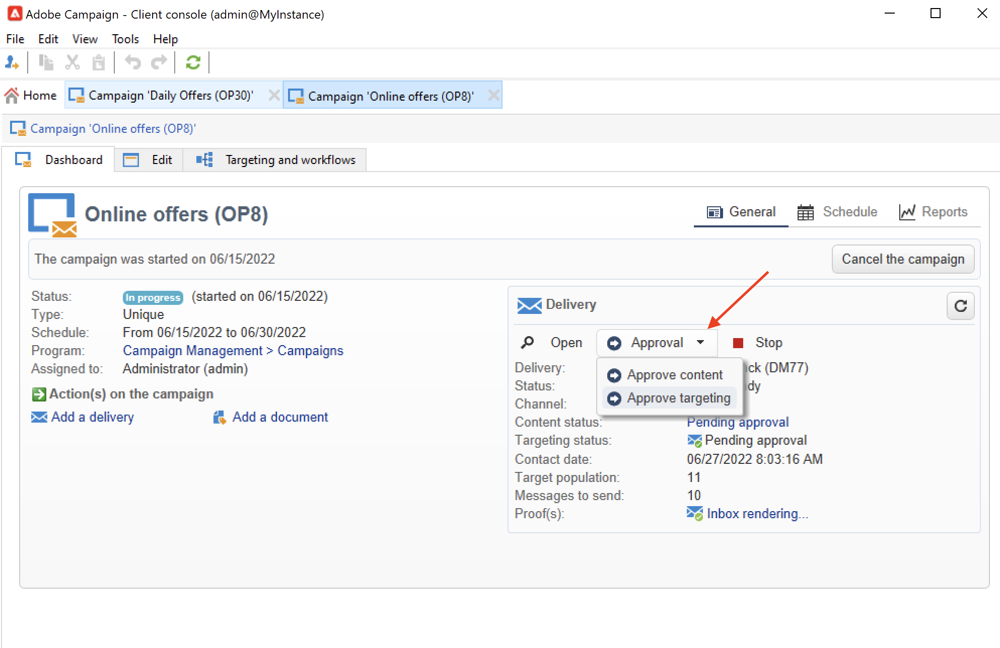
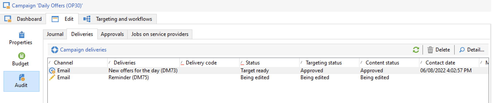

# 승인 프로세스 설정 및 관리 {#approval-marketing-campaigns}

마케팅 캠페인을 만들고 승인하는 방법 및 담당자는 각 조직마다 다릅니다. 캠페인 승인 프로세스에는 디지털 마케터, 게재 관리자, 콘텐츠 관리자, 파트너나 공급자와 같은 외부 소유자 등 여러 관련자를 조정하는 작업이 포함됩니다.

Adobe Campaign을 사용하면 캠페인에 대한 승인 흐름을 설정하고, 작업이 필요한 경우 운영자에게 알릴 수 있습니다. 타겟팅, 콘텐츠, 예산, 추출 및 증명 전송과 같은 게재의 각 단계에 대한 승인을 정의할 수 있습니다. 캠페인 게재가 다양한 유효성 검사 단계를 거침에 따라 Adobe Campaigns는 피드백, 댓글, 변경 요청 및 댓글을 비롯한 수정 사항 및 사인오프 기록을 컴파일합니다.

검토자로 지정된 Adobe Campaign 운영자에게 승인 요청을 알리는 알림 메시지가 전송됩니다.

운영자는 다음과 같은 여러 가지 방법으로 승인할 수 있습니다.

* (알림 메시지에서 참조) 이메일의 링크는 운영자가 웹 브라우저를 통해 Campaign으로 이동할 수 있도록 합니다. 연결한 후 검토자는 콘텐츠를 승인할지 여부를 선택할 수 있습니다.
   

* 캠페인 대시보드에서.
   

* 게재 대시보드에서.
   

운영자는 승인 창에서 캠페인 및 게재에 액세스할 수 있습니다. 댓글을 입력할 수도 있습니다.

운영자가 유효성을 검사하면 캠페인 및 게재 대시보드와 로그에 정보가 표시됩니다.

이 정보는 게재 승인 로그 및 캠페인의 승인 저널에서도 사용할 수 있습니다. 이러한 로그는 다음을 통해 액세스됩니다. **[!UICONTROL Edit > Audit > Approvals]** 탭.

## 승인 활성화{#enable-approvals}

승인이 활성화된 각 프로세스에 영향을 받는 운영자에게 승인 알림이 전송됩니다.

캠페인 템플릿, 각 캠페인에 대해 개별적으로 또는 게재에 대해 활성화할 수 있습니다.

승인이 필요한 모든 작업은 다음을 통해 캠페인 템플릿에서 선택됩니다.  **[!UICONTROL Properties]** > **[!UICONTROL Advanced campaign parameters...]** > **[!UICONTROL Approvals]** 탭. 이 탭에서 검토자 또는 검토자 그룹을 선택합니다. 이 옵션이 활성화되지 않은 경우 알림이 수신됩니다. [자세히 알아보기](#approving-processes)

이 설정을 이 템플릿을 사용하여 만든 각 캠페인에 대해, 각 게재에 대해 개별적으로 재정의할 수 있습니다. 찾아보기 **[!UICONTROL Properties]** 게재 단추, **[!UICONTROL Approvals]** 탭.

다음 예에서는 게재 콘텐츠에 승인이 필요하지 않습니다.

>[!CAUTION]
>
>검토자에게 **적절한 권한** 을 참조하고, 보안 영역이 올바르게 정의되었는지 확인합니다. [자세히 알아보기](#selecting-reviewers)

게재 승인 프로세스는에 자세히 설명되어 있습니다. [이 섹션](#review-and-approve-deliveries).

## 검토자 선택 {#select-reviewers}

각 승인 유형에 대해 승인을 담당하는 운영자 또는 운영자 그룹이 게재의 드롭다운 목록에서 선택됩니다. 를 사용하여 연산자를 더 추가할 수 있습니다 **[!UICONTROL Edit...]** 링크를 클릭합니다. 이 창에서는 승인 마감일도 편집할 수 있습니다. 기본적으로 검토자는 프로세스를 승인하기 위해 제출 날짜부터 3일이 있습니다. 자동 미리 알림을 추가하려면 **[!UICONTROL Add a reminder]** 링크를 클릭합니다.

검토자를 지정하지 않으면 캠페인 소유자가 승인을 담당하며 알림을 받습니다. 캠페인 소유자는에 지정됩니다. **[!UICONTROL Edit > Properties]** 캠페인의 탭:

이 있는 기타 모든 Adobe Campaign 연산자 **[!UICONTROL Administrator]** 권한도 작업을 승인할 수 있지만 알림은 받지 않습니다.

>[!NOTE]
>
>기본적으로 승인 운영자가 정의된 경우 캠페인 소유자는 승인을 수행하거나 게재를 시작할 수 없습니다. Adobe Campaign 관리자는 이 동작을 수정하고 캠페인 소유자가 게재를 승인/시작하도록 할 수 있습니다. **NmsCampaign_Activate_OwnerConfirmation** 옵션, 다음으로 설정 **1**.

검토자 목록이 정의된 경우 한 검토자가 승인하면 작업이 승인됩니다. 그러면 승인 링크는 캠페인 및 게재 대시보드에서 더 이상 사용할 수 없습니다. 알림 전송을 활성화할 때 다른 검토자가 알림 메시지에서 승인 링크를 클릭하면 다른 운영자가 작업을 이미 승인했다는 알림이 표시됩니다.

## 게재 검토 및 승인 {#review-and-approve-deliveries}

각 캠페인에 대해 게재 대상을 승인할 수 있습니다. [게재 콘텐츠](#approving-content) 비용. 승인을 담당하는 Adobe Campaign 운영자는 이메일로 통보를 받을 수 있으며 콘솔 또는 웹 연결을 통해 승인을 수락하거나 거부할 수 있습니다. [자세히 알아보기](#approving-processes)

DM 게재의 경우 Adobe Campaign 운영자는 추출 파일을 라우터로 보내기 전에 볼 수 있으며, 필요한 경우 형식을 변경하고 추출을 다시 시작할 수 있습니다. [자세히 알아보기](#approve-an-extraction-file)

이러한 유효성 검사 단계가 완료되면 게재를 시작할 수 있습니다. [자세히 알아보기](marketing-campaign-deliveries.md#starting-a-delivery)

>[!NOTE]
>
>캠페인 템플릿에서 승인이 필요한 프로세스가 선택됩니다. [자세히 알아보기](marketing-campaign-templates.md)

### 게재 승인 단계 {#approving-processes}

승인이 필요한 단계는 캠페인 대시보드에 표시됩니다(콘솔 또는 웹 인터페이스를 통해). 게재 추적 테이블 및 게재 대시보드에도 표시됩니다.

캠페인의 각 게재에 대해 다음 프로세스를 승인할 수 있습니다.

* **타겟팅, 콘텐츠 및 예산**

   다음의 경우 **[!UICONTROL Enable target approval]**, **[!UICONTROL Enable content approval]** 또는 **[!UICONTROL Enable budget approval]** 승인 설정 창에서 옵션을 선택하면 캠페인 및 게재 대시보드에 관련 링크가 표시됩니다.

   

   >[!NOTE]
   >
   >예산 승인은 승인 설정 창에서 목표 승인이 사용가능으로 설정된 경우에만 사용할 수 있습니다. 예산 승인을 위한 링크는 대상이 분석된 후에만 표시됩니다.

   다음과 같은 경우 **[!UICONTROL Assign content editing]** 또는 **[!UICONTROL External content approval]** 승인 설정 창에서 옵션을 선택하면 대시보드에 **[!UICONTROL Available content]** 및 **[!UICONTROL External content approval]** 링크.

   콘텐츠 승인을 통해 전송된 증명에 액세스할 수 있습니다.

* **추출 승인(DM 게재)**

   날짜 **[!UICONTROL Enable extraction approval]** 승인 설정 창에서 을(를) 선택합니다. 추출한 파일을 승인해야 라우터에 알릴 수 있습니다.

   다음 **[!UICONTROL Approve file]** 옵션은 campaign 및 게재 대시보드에서 사용할 수 있습니다.

   

   유효성 검사 전에 출력 파일을 미리 볼 수 있습니다. 추출 파일 미리 보기에는 데이터 샘플만 표시됩니다. 전체 파일이 로드되지 않았습니다.

* **연계된 게재 승인**

   다음 **[!UICONTROL Enable individual approval of each associated delivery]** 옵션은 보조 게재와 연결된 하나의 기본 게재에 사용됩니다. 기본적으로 이 옵션은 기본 게재의 전체 승인을 수행할 수 있도록 선택되어 있지 않습니다. 이 옵션을 선택한 경우 각 게재를 개별적으로 승인해야 합니다.

   

>[!NOTE]
>
>타깃팅 워크플로우에서 구성 문제와 연결된 오류가 메시지 준비 중에 발생하는 경우 **[!UICONTROL Restart message preparation]** 링크가 대시보드에 표시됩니다. 오류를 수정하고 이 링크를 사용하여 타깃팅 단계를 건너뛰고 메시지 준비를 다시 시작하십시오.

### 콘텐츠 승인 {#approve-content}

>[!CAUTION]
>
>콘텐츠를 승인하려면 증명 주기가 필수입니다. 증명을 통해 정보, 개인화 데이터 표시를 승인하고 링크가 작동하는지 확인할 수 있습니다.
>
>아래에 자세히 설명된 콘텐츠 승인 기능은 증명 전달과 관련되어 있습니다.

콘텐츠 승인 주기를 구성할 수 있습니다. 이렇게 하려면 **[!UICONTROL Enable content approval]** 승인 설정 창의 옵션입니다. 콘텐츠 승인 주기의 주요 단계는 다음과 같습니다.

1. 새 게재를 만든 후 캠페인 관리자는 **[!UICONTROL Submit content]** 캠페인 대시보드에 연결하여 콘텐츠 승인 주기를 시작합니다.

   >[!NOTE]
   >
   >다음과 같은 경우 **[!UICONTROL Enable the sending of proofs]** 옵션(이메일 게재용) 또는 **[!UICONTROL Enable the sending and approval of proofs]** (dm 게재의 경우) 승인 설정 창에서 옵션을 선택한 경우 증명이 자동으로 전송됩니다.

1. 콘텐츠 책임자에게 알림 이메일이 전송되며 책임자는 승인 여부를 선택할 수 있습니다.

   * 알림 이메일을 통해: 알림 이메일에는 이미 전송된 증명에 대한 링크가 포함되어 있으며, 다음과 같은 경우 다양한 웹 메일에 대한 메시지 렌더링에 대한 링크가 포함될 수 있습니다. **전달성** 이 인스턴스에 대해 추가 기능이 활성화되어 있습니다.

   * 콘솔 또는 웹 인터페이스, 게재 추적, 게재 대시보드 또는 캠페인 대시보드를 통해 이 캠페인 대시보드를 사용하면 보낸 증명 목록을 클릭하여 볼 수 있습니다. **[!UICONTROL Inbox rendering...]** 링크를 클릭합니다. 콘텐츠를 보려면 **[!UICONTROL Detail]** 목록 오른쪽에 있는 아이콘.

1. 콘텐츠 승인 여부를 알리는 알림 이메일이 캠페인 책임자에게 전송됩니다. 캠페인 담당자는 언제든지 콘텐츠 승인 주기를 다시 시작할 수 있습니다. 이렇게 하려면 **[!UICONTROL Content status]** 캠페인 대시보드의 라인(게재 수준)을 클릭한 다음 **[!UICONTROL Reset content approval to submit it again]**.

#### 콘텐츠 편집 할당 {#assign-content-editing}

이 옵션을 사용하면 웹 마스터와 같이 콘텐츠 편집을 담당하는 사람을 정의할 수 있습니다. 다음과 같은 경우 **[!UICONTROL Assign content editing]** 승인 설정 창에서 옵션을 선택하면 게재 만들기와 콘텐츠 담당자에게 알림 이메일 게재 사이에 몇 가지 승인 단계가 추가됩니다.

1. 새 게재를 만든 후 캠페인 담당자는 **[!UICONTROL Submit content editing]** 캠페인 대시보드에 연결하여 콘텐츠 편집 주기를 시작합니다.

1. 콘텐츠 편집 담당자는 콘텐츠를 사용할 수 있다는 이메일을 받게 됩니다.

1. 그런 다음 콘솔에 로그온하여 게재를 열고 간소화된 마법사를 사용하여 편집하여 제목, HTML 및 텍스트 콘텐츠를 변경하고 증명을 보낼 수 있습니다.

   >[!NOTE]
   >
   >다음과 같은 경우 **[!UICONTROL Enable the sending of proofs]** 옵션(이메일 게재용) 또는 **[!UICONTROL Enable the sending and approval of proofs]** (dm 게재의 경우) 승인 설정 창에서 옵션을 선택한 경우 증명이 자동으로 전송됩니다.

1. 콘텐츠 편집 담당자는 게재 콘텐츠를 변경하고 나면 콘텐츠를 사용 가능하게 만들 수 있습니다.

   이렇게 하려면 다음을 사용할 수 있습니다.

   * 다음 **[!UICONTROL Available content]** Adobe Campaign 콘솔에서 연결합니다.
   * 알림 메시지의 링크.
운영자는 콘텐츠를 캠페인 담당자에게 제출하기 전에 댓글을 추가할 수 있습니다.
알림 메시지를 통해 검토자는 컨텐츠를 승인하거나 거부할 수 있습니다.

#### 외부 콘텐츠 승인 {#external-content-approval}

이 옵션을 사용하면 브랜드 통신 일관성, 비율 등과 같은 게재 렌더링 승인을 담당하는 외부 연산자를 정의할 수 있습니다. 다음의 경우 **[!UICONTROL External content approval]** 승인 설정 창에서 옵션을 선택하면 콘텐츠 승인과 캠페인 담당자에게 알림 게재 사이에 몇 가지 승인 단계가 추가됩니다.

1. 외부 콘텐츠 관리자는 콘텐츠가 승인되었음을 알리고 외부 승인을 요청하는 알림 이메일을 수신합니다.
1. 알림 이메일에는 게재 렌더링을 볼 수 있는 전송된 증명에 대한 링크와 게재 콘텐츠를 승인 또는 거부하는 버튼이 포함되어 있습니다.

이러한 링크는 하나 이상의 증명을 보낸 경우에만 사용할 수 있습니다. 그렇지 않으면 콘솔 또는 웹 인터페이스를 통해서만 게재 렌더링을 사용할 수 있습니다.

### 추출 파일 승인 {#approve-an-extraction-file}

오프라인 게재의 경우, Adobe Campaign은 설정 방법에 따라 라우터로 전송되는 추출 파일을 생성합니다. 콘텐츠는 사용된 내보내기 템플릿에 따라 다릅니다.

콘텐츠, 타겟팅 및 예산이 승인되면 게재가 다음으로 변경됩니다. **[!UICONTROL Extraction pending]** 캠페인에 대한 추출 워크플로우가 시작될 때까지.

추출 요청 날짜에 추출 파일이 만들어지고 게재 상태가 (으)로 변경됩니다. **[!UICONTROL File to approve]**.

이름을 클릭하여 추출한 파일의 컨텐츠를 보거나 승인하거나, 필요한 경우 포맷을 변경하고, 대시보드의 링크를 사용하여 추출을 다시 시작할 수 있습니다.

파일이 승인되면 라우터에 알림 이메일을 보낼 수 있습니다. [자세히 알아보기](marketing-campaign-deliveries.md#start-an-offline-delivery)

## 승인 모드 {#approval-modes}

작업은 캠페인 대시보드, 게재 추적 탭, 게재 대시보드 또는 검토자에게 전송된 이메일 알림에서 승인할 수 있습니다.

### 대시보드에서 승인 {#approval-via-the-dashboard}

콘솔 또는 웹 인터페이스를 통해 작업을 승인하려면 캠페인 대시보드에서 해당 링크를 클릭합니다.

예를 들어 게재 분석이 실행되면

1. **[!UICONTROL Approve targeting]**&#x200B;을(를) 선택합니다.

1. 팝업 창에서 승인할 정보를 선택합니다.
1. 선택 **[!UICONTROL Accept]** 또는 **[!UICONTROL Reject]** 필요한 경우 설명을 입력합니다. 이 댓글은 유효성 검사 로그에 표시됩니다.
1. 을(를) 사용하여 선택 항목 확인 **[!UICONTROL Target approval]** 단추를 클릭합니다.

다른 운영자가 프로세스를 이미 승인한 경우 승인 링크를 사용할 수 없습니다.

프로세스가 거부된 경우 게재 대시보드에 정보가 다음과 같이 표시됩니다.

### 알림 메시지에서 승인 {#approval-via-notification-messages}

에서 작업을 승인하려면 [알림 메시지](#notifications):

1. 알림에서 링크를 클릭합니다.
1. Adobe Campaign에 로그온합니다.
1. 승인할 정보 확인
1. 선택 **[!UICONTROL Accept]** 또는 **[!UICONTROL Reject]** 필요한 경우 설명을 입력합니다.
1. 유효성 검사. 선택한 항목과 주석이 유효성 검사 로그에 표시됩니다.

>[!NOTE]
>
>프로세스 중에 경고가 발생하면 알림에 경고가 표시됩니다.

### 승인 추적{#approval-tracking}

승인 로그는 사용자 인터페이스에서 사용할 수 있습니다.

* 캠페인 승인 로그에서 **[!UICONTROL Approvals]** 의 하위 탭 **[!UICONTROL Edit > Audit]** 탭:

   

* 캠페인 게재 로그에서 **[!UICONTROL Deliveries]** 의 하위 탭 **[!UICONTROL Edit > Audit]** 탭:

   

* 각 게재에 대한 승인 상태는 다음을 클릭하여 볼 수 있습니다. **[!UICONTROL Hide/display logs]** 옵션 **[!UICONTROL Summary]** 탭.

   

* 이 정보는 를 통해서도 액세스할 수 있습니다. **[!UICONTROL Audit > Approvals]** 각 게재의 탭:

   

>[!NOTE]
>
>연산자가 작업을 승인하거나 거부하면 다른 검토자는 더 이상 작업을 변경할 수 없습니다.

### 자동/수동 승인 {#automatic-and-manual-approval}

타겟팅 워크플로우를 만들 때 승인이 자동(기본 모드)인 경우, Adobe Campaign은 승인이 필요한 즉시 승인 링크를 표시하거나 알림을 보냅니다.

승인 모드(수동 또는 자동)를 선택하려면 **[!UICONTROL Edit > Properties]** 캠페인 또는 캠페인 템플릿의 탭을 클릭한 다음 **[!UICONTROL Advanced campaign parameters...]** 그리고 마지막으로 **[!UICONTROL Approvals]** 탭.
par

>[!NOTE]
>
>승인 모드는 캠페인의 모든 게재에 적용됩니다.

타겟팅 워크플로우가 만들어지는 경우 수동 승인을 사용하면 승인 링크를 만들거나 알림을 자동으로 보내지 않을 수 있습니다. 그러면 캠페인 대시보드에서 다음을 제공합니다 **[!UICONTROL Submit targeting for approval]** 링크를 클릭하여 승인 프로세스를 수동으로 시작합니다.

확인 메시지를 통해 이 게재에 대해 선택한 작업에 대한 승인을 승인할 수 있습니다.

그러면 승인 버튼이 캠페인 대시보드(이 게재용), 게재 대시보드 및 게재 추적에 표시됩니다. 알림이 활성화되면 동시에 전송됩니다.

이 승인 활성화 방법을 사용하면 검토자에게 거짓 알림을 보내지 않고 타깃팅을 작업할 수 있습니다.

## 알림 {#notifications}

알림은 프로세스가 승인 보류 중임을 알리기 위해 검토자에게 전송되는 특정 이메일 메시지입니다. 운영자가 메시지의 링크를 클릭하면 인증 페이지가 나타나고, 로그인 후 운영자는 정보를 보고 작업을 승인하거나 거부할 수 있습니다. 승인 창에서도 설명을 입력할 수 있습니다.

알림 이메일의 콘텐츠를 개인화할 수 있습니다. 다음을 참조하십시오 [알림 콘텐츠](#notification-content).

### 알림 활성화/비활성화 {#enabling-disabling-notification}

기본적으로 캠페인 템플릿, 캠페인 또는 게재에서 관련 작업 승인이 활성화된 경우 알림 메시지가 전송됩니다. 그러나 콘솔에서 승인을 승인하기 위해서만 알림을 비활성화할 수 있습니다.

이렇게 하려면 캠페인 또는 캠페인 템플릿의 승인 창( **[!UICONTROL Edit > Properties]** > **[!UICONTROL Advanced campaign parameters...]** > **[!UICONTROL Approvals]** tab)을 눌러 선택 **[!UICONTROL Do not enable notification sending]**.

### 알림 콘텐츠 {#notification-content}

알림 콘텐츠가 특정 템플릿에 정의되어 있습니다. **[!UICONTROL Notification of validations for the marketing campaign]**. 이 템플릿은에 저장됩니다 **[!UICONTROL Administration > Campaign management > Technical delivery templates]** Adobe Campaign 트리의 폴더입니다.
