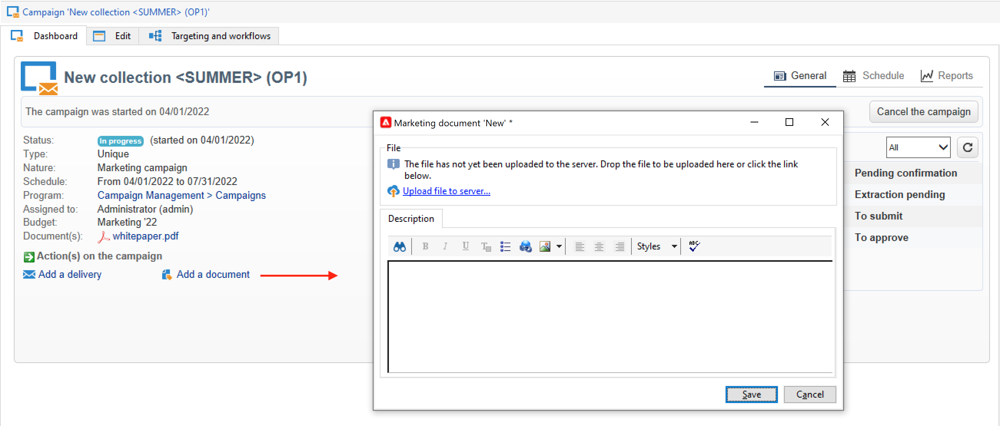
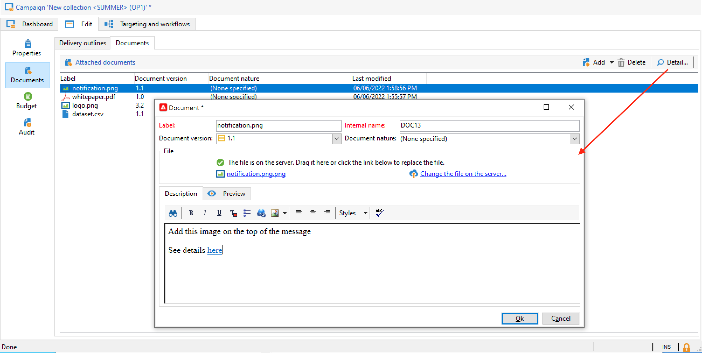
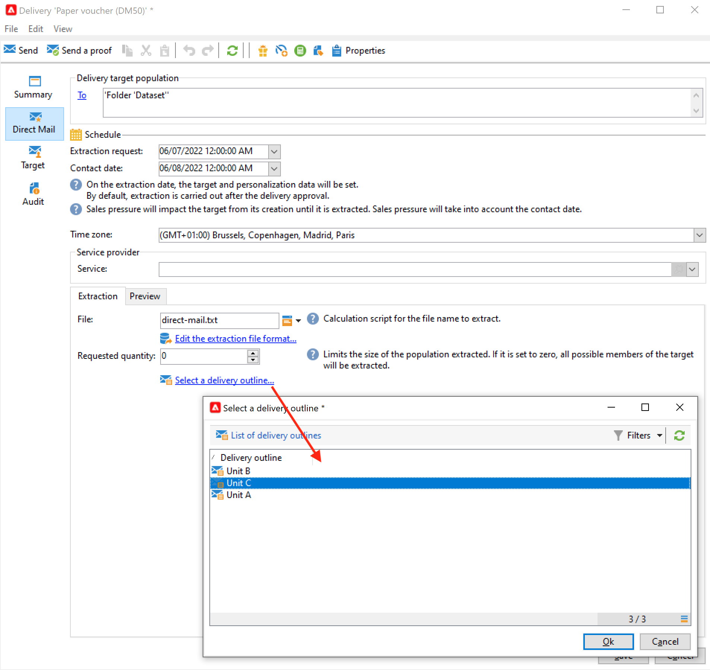
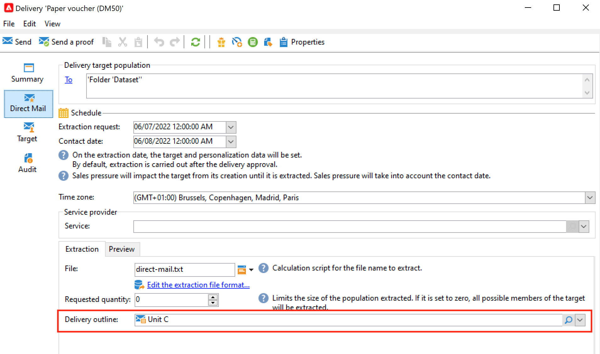

# 에셋 및 문서 관리 {#manage-assets-documents}

보고서, 사진, 웹 페이지, 다이어그램 등 다양한 문서를 캠페인에 연결할 수 있습니다. 이러한 문서는 모든 형식으로 제공될 수 있습니다.

캠페인에서 프로모션 쿠폰, 특정 브랜드 또는 스토어와 관련된 특별 오퍼 등과 같은 다른 항목을 참조할 수도 있습니다. 이러한 요소를 아웃라인에 포함하면 DM 게재와 연결할 수 있습니다. [자세히 알아보기](#associating-and-structuring-resources-linked-via-a-delivery-outline).

>[!CAUTION]
>
>이 기능은 소규모 에셋 및 문서를 위해 설계되었습니다.

<!--
>[!NOTE]
>
>If you are using Campaign Marketing Resource Management module, you can also manage a library of marketing resources that are available for several users for collaborative work. [Learn more](../../mrm/using/managing-marketing-resources.md).
-->

## 문서 추가 {#add-documents}

캠페인 수준(컨텍스트 문서) 또는 프로그램 수준(일반 문서)에서 문서를 연결할 수 있습니다.

캠페인의 경우 **[!UICONTROL Documents]** 탭에는 다음이 포함됩니다.

* 콘텐츠에 필요한 모든 문서 목록(템플릿, 이미지 등) 적절한 권한이 있는 Adobe Campaign 운영자가 로컬로 다운로드할 수 있습니다.
* 라우터에 대한 정보가 포함된 문서(있는 경우).

문서는 **[!UICONTROL Edit > Documents]** 탭을 통해 프로그램 또는 캠페인에 연결됩니다.

대시보드의 전용 링크에서 캠페인에 문서를 추가할 수도 있습니다.

**[!UICONTROL Detail...]** 아이콘을 클릭하여 파일의 내용을 보고 정보를 추가합니다.

대시보드에서 캠페인과 관련된 문서는 다음 예제와 같이 **[!UICONTROL Document(s)]** 섹션에 그룹화됩니다.

이 보기에서 편집하고 수정할 수도 있습니다.

## 게재 개요 사용 {#delivery-outlines}

게재 개요는 구조화된 요소 세트(문서, 스토어, 프로모션 쿠폰 등)입니다. 회사에서 만든 다음 특정 캠페인을 위해 만듭니다. DM 게재 컨텍스트에서 사용됩니다.

이러한 요소는 게재 개요로 그룹화되고 각 게재 개요는 게재와 연결됩니다. 게재를 첨부하기 위해 **서비스 공급자**&#x200B;에 전송된 추출 파일에서 이 요소를 참조합니다. 예를 들어, 단위를 참조하는 게재 개요와 이 단위가 사용하는 마케팅 브로셔를 만들 수 있습니다.

캠페인의 경우 게재 개요를 사용하면 관련 단위, 승인된 프로모션 오퍼, 로컬 이벤트 초대 등의 특정 기준에 따라 게재와 연결할 외부 요소를 구성할 수 있습니다.

>[!CAUTION]
>
>게재 개요는 DM 캠페인으로 제한됩니다.

### 게재 개요 만들기 {#create-an-outline}

게재 개요를 만들려면 관련 캠페인의 **[!UICONTROL Edit > Documents]** 탭에서 **[!UICONTROL Delivery outlines]** 하위 탭을 클릭하십시오.

>[!NOTE]
>
>이 탭이 표시되지 않으면 이 캠페인에 이 기능을 사용할 수 없거나 DM 게재가 인스턴스에서 활성화되지 않은 것입니다. [캠페인 템플릿 구성](marketing-campaign-templates.md#campaign-templates) 또는 라이선스 계약을 참조하세요.

그런 다음 **[!UICONTROL Add a delivery outline]**&#x200B;을(를) 클릭하고 캠페인에 대한 윤곽선 계층 구조를 만듭니다.

1. 트리의 루트를 마우스 오른쪽 단추로 클릭하고 **[!UICONTROL New > Delivery outlines]**&#x200B;을(를) 선택합니다.
1. 방금 만든 윤곽선을 마우스 오른쪽 단추로 클릭하고 **[!UICONTROL New > Item]** 또는 **[!UICONTROL New > Personalization fields]**&#x200B;을(를) 선택합니다.

아웃라인에는 항목, 개인화 필드 및 오퍼가 포함될 수 있습니다.

* 예를 들어, 여기에서 참조되고 설명되며 게재에 첨부될 실제 문서가 항목일 수 있습니다.
* 개인화 필드를 사용하면 수신자가 아닌 게재와 관련된 개인화 요소를 만들 수 있습니다. 따라서 특정 대상(환영 오퍼, 할인 등)에 대한 게재에 사용할 값을 만들 수 있습니다. Adobe Campaign에서 만들어지고 **[!UICONTROL Import personalization fields...]** 링크를 통해 개요로 가져옵니다.

  

  목록 영역의 오른쪽에 있는 **[!UICONTROL Add]** 아이콘을 클릭하여 개요에서 바로 만들 수도 있습니다.

  

### 윤곽선 선택 {#select-an-outline}

다음 예제와 같이 각 게재에 대해 추출 아웃라인에 예약된 섹션에서 연결할 아웃라인을 선택할 수 있습니다.

그러면 선택한 아웃라인이 창의 아래 섹션에 표시됩니다. 필드 오른쪽에 있는 아이콘을 사용하여 편집하거나 드롭다운 목록을 사용하여 변경할 수 있습니다.

게재의 **[!UICONTROL Summary]** 탭에도 다음 정보가 표시됩니다.

### 추출 결과 {#extraction-result}

추출하여 서비스 공급업체에 보내는 파일에서 아웃라인의 이름과 필요한 경우 해당 특성(비용, 설명 등)을 표시합니다. 서비스 공급자와 연관된 내보내기 템플릿의 정보에 따라 콘텐츠에 추가됩니다.

다음 예제에서는 게재와 연결된 아웃라인에 대한 레이블, 예상 비용 및 설명을 추출 파일에 추가합니다.

내보내기 모델은 관련 게재에 대해 선택한 서비스 공급자와 연결되어야 합니다. [이 섹션](providers-stocks-and-budgets.md#creating-service-providers-and-their-cost-structures)을 참조하세요.
