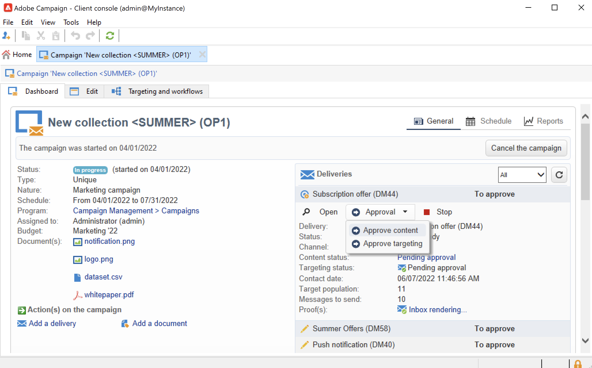

# 프로그램 및 캠페인 만들기{#create-programs-and-campaigns}

Campaign 오케스트레이션 구성 요소는 **[!UICONTROL Campaigns]** 탭: 마케팅 프로그램 및 캠페인과 관련 요소에 대한 개요를 여기에서 볼 수 있습니다.

마케팅 프로그램은 게재, 리소스 등으로 구성된 캠페인으로 구성됩니다. 게재, 예산, 검토자 및 연결된 문서에 대한 모든 정보는 캠페인에서 그룹화됩니다.

 [비디오에서 프로그램 및 캠페인 살펴보기](#video)

## 프로그램 및 계획 작업{#work-with-plan-and-program}

### 계획 및 프로그램 계층 생성 {#create-plan-and-program}

각 캠페인은 계획에 속하는 프로그램에 속합니다. 모든 계획, 프로그램 및 캠페인은 **[!UICONTROL Campaign calendar]** 메뉴의 **캠페인** 탭.

캠페인 및 게재 작성을 시작하기 전에 마케팅 계획 및 프로그램에 대한 폴더 계층 구조를 구성합니다.

1. 을(를) 클릭합니다. **탐색기** 아이콘을 클릭합니다.
1. 계획을 생성할 폴더를 마우스 오른쪽 단추로 클릭합니다.
1. 선택 **새 폴더 추가 > Campaign Management > 계획**.

   

1. 계획 이름을 변경합니다.
1. 새로 생성된 계획을 마우스 오른쪽 단추로 클릭하고 **속성...**.
1. 에서 **일반** 탭에서 수정합니다 **내부 이름** 패키지 내보내기 중에 중복을 방지하려면 다음을 수행하십시오.

   

1. **저장**&#x200B;을 클릭합니다.
1. 새로 생성된 계획을 마우스 오른쪽 단추로 클릭하고 **새 &#39;프로그램&#39; 폴더 만들기**.

   

1. 위의 단계를 반복하여 새 프로그램 폴더와 내부 이름을 변경합니다.

### 프로그램 구성 {#edit-a-program}

프로그램을 편집할 때 아래 설명된 탭을 사용하여 프로그램을 탐색하고 구성합니다.

* 다음 **예약** 탭에는 달력 헤더에서 클릭하는 탭에 따라 월, 주 또는 일의 프로그램 달력이 표시됩니다. 이 페이지에서 캠페인, 프로그램 또는 작업을 만들 수 있습니다. [자세히 알아보기](#campaign-calendar)

* 다음 **편집** 탭에서는 프로그램을 개인화할 수 있습니다. 이름, 시작 및 종료 날짜, 예산, 링크된 문서 등

   

## 캠페인을 사용한 작업{#work-with-campaigns}

### 캠페인 만들기 {#create-a-campaign}

캠페인 목록을 통해 캠페인을 만들 수 있습니다. 이 보기를 표시하려면 **[!UICONTROL Campaigns]** 메뉴의 **[!UICONTROL Campaigns]** 대시보드 를 클릭하고 **[!UICONTROL Create]**.

다음 **[!UICONTROL Program]** 필드를 사용하면 캠페인을 첨부할 프로그램을 선택할 수 있습니다. 이 정보는 필수입니다.

캠페인이나 프로그램 달력에서 캠페인을 만들 수도 있습니다. [자세히 알아보기](#campaign-calendar)

캠페인 만들기 창에서 캠페인 템플릿을 선택하고 캠페인에 대한 이름과 설명을 추가합니다. 캠페인 시작 및 종료 날짜를 지정할 수도 있습니다.

클릭 **[!UICONTROL OK]** 캠페인을 만들려면 프로그램 일정 및 캠페인 목록에 추가됩니다.

그런 다음 방금 만든 캠페인을 편집하고 매개 변수를 정의할 수 있습니다. 이 캠페인을 열고 구성하려면 다음을 수행할 수 있습니다.

1. 캠페인 달력을 탐색하고 표시할 캠페인을 선택한 다음 **[!UICONTROL Open]** 링크를 클릭합니다.
1. 찾아보기 **[!UICONTROL Schedule]** 프로그램의 탭에서 캠페인을 선택하고 엽니다.
1. 캠페인 목록을 탐색하고 편집할 캠페인의 이름을 클릭합니다.

이러한 모든 작업을 수행하면 캠페인 대시보드가 표시됩니다.

다음 섹션에 액세스하여 캠페인 구성 방법을 알아보십시오.

* [게재 추가](marketing-campaign-deliveries.md)
* [자산 및 문서 관리](marketing-campaign-assets.md)
* [타겟 대상 작성](marketing-campaign-target.md)
* [승인 프로세스 설정](marketing-campaign-approval.md)
* [주식 및 예산 관리](providers--stocks-and-budgets.md)

### 캠페인 설정 편집 {#campaign-settings}

캠페인은 캠페인 템플릿을 통해 만들어집니다. 일부 옵션을 선택하고 다른 설정이 이미 저장된 재사용 가능한 템플릿을 구성할 수 있습니다.

각 캠페인에 대해 다음 기능을 사용할 수 있습니다.

* 참조 문서 및 리소스: 캠페인에 문서(개요, 보고서, 이미지 등)를 연결할 수 있습니다. 모든 문서 형식이 지원됩니다. [자세히 알아보기](marketing-campaign-deliveries.md#manage-associated-documents)
* 비용 정의: Adobe Campaign에서는 각 캠페인에 대해 마케팅 캠페인을 만들 때 사용할 수 있는 비용 항목 및 비용 계산 구조를 정의할 수 있습니다. 예: 인쇄비, 외부 기관의 사용, 객실 대여 등 [자세히 알아보기](providers--stocks-and-budgets.md#defining-cost-categories)
* 목표 정의: 캠페인의 수량 가능한 목표(예: 구독자 수, 비즈니스 볼륨 등)를 정의할 수 있습니다. 이 정보는 나중에 캠페인 보고서에서 사용됩니다.
* 시드 주소 및 제어 그룹을 관리합니다. [자세히 알아보기](marketing-campaign-deliveries.md#defining-a-control-group)
* 승인 관리: 승인할 처리를 선택할 수 있으며, 필요한 경우 검토 연산자 또는 연산자 그룹을 선택합니다. [자세히 알아보기](marketing-campaign-approval.md#checking-and-approving-deliveries)

>[!NOTE]
>
>캠페인 설정에 액세스하여 업데이트하려면 **[!UICONTROL Advanced campaign parameters...]** 링크 위치 **[!UICONTROL Edit]** 탭.

### 캠페인 모니터링 {#monitor-a-campaign}

각 캠페인에 대해 작업, 리소스 및 게재가 대시보드에서 중앙 집중화되었습니다. 이 인터페이스를 사용하면 마케팅 작업을 관리하고 오케스트레이션할 수 있습니다.

Adobe Campaign을 사용하면 캠페인의 다양한 단계를 만들고 승인하기 위한 공동 작업 프로세스를 설정할 수 있습니다. 예산, 대상, 콘텐츠 등의 승인 이 오케스트레이션은 [이 섹션](marketing-campaign-approval.md).

>[!NOTE]
>
>캠페인에서 사용할 수 있는 구성 요소는 해당 템플릿에 따라 다릅니다. 캠페인 템플릿 구성은 [이 섹션](marketing-campaign-templates.md#campaign-templates).

캠페인이 수행되면 **[!UICONTROL Reports]** 링크를 클릭하여 캠페인 보고서에 액세스합니다.

## 캠페인 달력 {#campaign-calendar}

캠페인 달력에 모든 프로그램, 계획, 캠페인 및 게재가 표시됩니다.

계획, 프로그램, 캠페인 또는 게재를 편집하려면 달력에서 해당 이름을 찾은 다음 **[!UICONTROL Open]** 링크를 클릭합니다. 그러면 다음과 같이 새 탭에 표시됩니다.

캠페인 달력에 표시되는 정보를 필터링할 수 있습니다. 이렇게 하려면 **[!UICONTROL Filter]** 을(를) 연결하고 필터링 기준을 선택합니다.

>[!NOTE]
>
>날짜를 필터링하면 시작 날짜가 지정된 날짜보다 이후이거나 지정된 날짜보다 빠른 종료 날짜가 있는 모든 캠페인이 표시됩니다. 각 필드 오른쪽의 달력을 사용하여 날짜가 선택됩니다.

를 사용할 수도 있습니다 **[!UICONTROL Search]** 필드를 사용하여 표시된 항목을 필터링합니다.

각 항목에 연결된 아이콘을 사용하여 해당 상태를 볼 수 있습니다. 완료, 진행 중, 편집 중 등

표시할 캠페인을 필터링하려면 **[!UICONTROL Filter]** 을 링크하고 표시할 캠페인의 상태를 선택합니다.

달력을 검색할 때 프로그램 또는 캠페인을 만들 수도 있습니다.

를 통해 캠페인을 만들 때 **[!UICONTROL Schedule]** 프로그램의 탭에서 캠페인이 관련 프로그램에 자동으로 연결됩니다. 다음 **[!UICONTROL Program]** 이 경우 필드는 표시되지 않습니다.

## 웹 인터페이스 사용 {#use-the-web-interface-}

인터넷 브라우저를 통해 Adobe Campaign 콘솔 화면에 액세스하여 모든 캠페인 및 게재, 데이터베이스의 프로필에 대한 보고서 및 정보를 볼 수 있습니다. 이 액세스로 레코드를 만들 수 없습니다. 운영자 권한에 따라 데이터베이스의 데이터를 보거나 작업할 수 있습니다. 예를 들어 캠페인 콘텐츠와 타깃팅을 승인하거나, 게재를 다시 시작하거나 중지할 수 있습니다.

1. https://을 통해 평소대로 로그온합니다.`<your instance>:<port>/view/home`.
1. 메뉴를 사용하여 개요 보기에 액세스합니다.

   

캠페인 간을 탐색하고 볼 수 있을 뿐만 아니라 다음과 같은 유형의 작업을 수행할 수 있습니다.

* 인스턴스의 활동 모니터링
* 게재 콘텐츠를 승인하거나 거부하는 등의 유효성 검사 프로세스에 참여합니다
* 다른 빠른 작업 수행(예: 워크플로우 일시 중지)
* 모든 보고 기능에 액세스
* 포럼 토론 참여

이 표에는 브라우저에서 캠페인에 수행할 수 있는 작업이 요약되어 있습니다.

| 페이지  | 작업 |
| --- | --- |
| 캠페인, 게재, 오퍼 등 목록 | 목록 항목 삭제 |
| 캠페인 | 캠페인 취소 |
| 게재 | 게재 콘텐츠 및 타겟 승인 게재 콘텐츠 제출 게재 확인 게재 일시 중지 및 중지 |
| 웹 애플리케이션 | 웹 애플리케이션 만들기 애플리케이션 컨텐츠 및 속성 편집 애플리케이션 컨텐츠를 템플릿으로 저장 애플리케이션 게시 |
| 오퍼 | 오퍼 컨텐츠 및 자격 조건을 승인합니다 온라인 오퍼 비활성화 |
| 작업 | 작업 완료 작업 취소 |
| 마케팅 리소스 | 리소스 승인 리소스 잠금 및 잠금 해제 |
| 캠페인 패키지 | 승인을 위해 패키지 제출 패키지 승인 또는 거부 패키지 취소 |
| 캠페인 주문 | 주문 만들기 주문 수락 또는 거부 |
| 재고 | 재고 라인 삭제 |
| 오퍼 시뮬레이션 | 시뮬레이션 시작 및 중지 |
| 타겟팅 워크플로우 | 워크플로우 시작, 일시 중지 및 중지 |
| 보고서 | 보고서 기록에 현재 데이터를 저장합니다 |
| 포럼 | 토론 추가 토론 중 메시지에 회신 토론을 따라 구독 취소하십시오 |

### 승인 관리

웹 액세스를 통해 타겟 또는 게재 컨텐츠에 대한 승인을 수행할 수 있습니다.

알림 메시지에 포함된 링크를 사용할 수도 있습니다. 이 작업에 대한 자세한 정보는 [이 섹션](marketing-campaign-approval.md#checking-and-approving-deliveries)을 참조하십시오.

## 튜토리얼 비디오 {#video}

이 비디오에서는 마케팅 계획, 프로그램 및 캠페인을 만드는 방법을 보여줍니다.

>[!VIDEO](https://video.tv.adobe.com/v/333810?quality=12)
