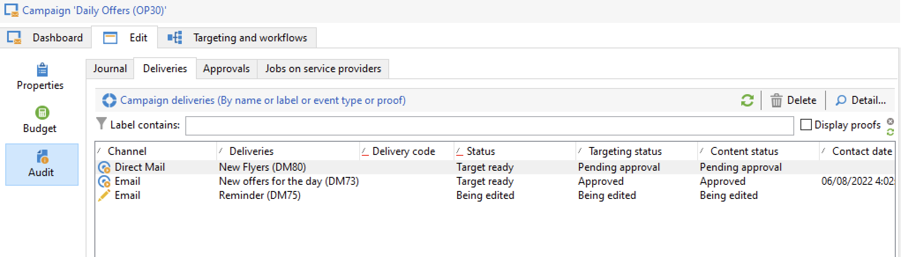

# 마케팅 캠페인 모니터링 {#monitor-marketing-campaigns}

## 캠페인 추적 {#tracking-a-campaign}

각 캠페인에 대해 **[!UICONTROL Tracking]** 탭에서 모든 작업과 해당 상태를 볼 수 있습니다.

이 하위 탭을 통해 다음 정보에 액세스할 수 있습니다.

* **[!UICONTROL Audit]** 하위 탭에 활동 저널이 표시됩니다. 여기에는 워크플로우 생성 또는 시작, 승인, 추출, 재고 관리 등 캠페인에서 실행되는 작업이 포함됩니다.

  

* **[!UICONTROL Deliveries]** 하위 탭에는 캠페인의 모든 게재가 포함되어 있습니다. 이 보기에서 편집할 수 있습니다. 이렇게 하려면 게재를 선택하고 **[!UICONTROL Detail]** 아이콘을 클릭합니다.

  

* **[!UICONTROL Approvals]** 하위 탭에는 캠페인에 대한 모든 승인 프로세스가 포함되어 있습니다. 세부 정보 및 주석을 확인할 수 있습니다

* 서비스 공급자에 대한 메시지를 만들기 위해 만든 워크플로가 **[!UICONTROL Jobs on service providers]** 하위 탭에 표시됩니다. **[!UICONTROL Detail]** 아이콘을 클릭하여 선택한 워크플로우를 표시합니다.

## 게재 추적 {#delivery-tracking}

게재 목록은 캠페인 노드의 **[!UICONTROL Deliveries]** 링크를 통해 사용할 수 있습니다.

각 게재에 대해 상태, 타겟팅된 수신자 수, 연결된 캠페인 등의 주요 지표에 액세스할 수 있습니다.

게재 상태를 확인하려면 게재를 편집하고 해당 대시보드와 탭을 확인합니다.

<!--
>[!NOTE]
>
>Information concerning delivery details is available in [this section](../../delivery/using/about-message-tracking.md) section.
-->

## 실행 추적 {#execution-tracking}

Adobe Campaign 홈 페이지를 통해 액세스할 수 있는 **[!UICONTROL Deliveries]**&#x200B;을(를) 클릭하여 게재 상태를 확인할 수 있습니다.

캠페인에서 실행된 프로세스에 대한 세부 정보는 캠페인의 **[!UICONTROL Edit > Audit]** 탭에서 수집됩니다. 캠페인에서 게재 목록을 볼 수 있습니다. [자세히 알아보기](#tracking-a-campaign).
