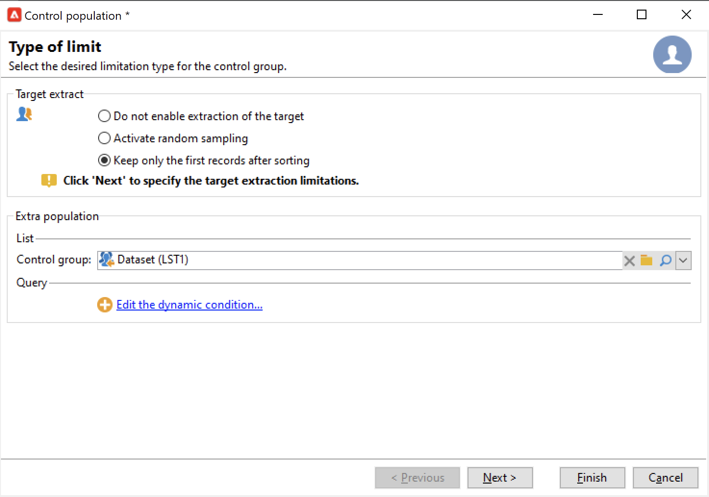

# 캠페인 대상자 선택 {#marketing-campaign-deliveries}

마케팅 캠페인에서 각 게재에 대해 다음을 정의할 수 있습니다.

* 타겟 대상자입니다. [받는 사람 목록](#send-to-a-group)에 메시지를 보내거나 워크플로우에서 [대상자를 만들 수 있습니다](#build-the-main-target-in-a-workflow)
* 컨트롤 그룹입니다. 메시지 게재 후 받는 사람 동작을 모니터링하기 위해 [컨트롤 그룹을 추가](#add-a-control-group)할 수 있습니다.
* 시드 주소 - 자세한 내용은 [이 섹션](../../v8/audiences/test-profiles.md)을 참조하세요.—>

이 정보 중 일부는 [캠페인 템플릿](marketing-campaign-templates.md#campaign-templates)에서 상속될 수 있습니다.

<!--
To build the delivery target, you can define filtering criteria for the recipients in the database. This recipient selection mode is presented in [this section](../../delivery/using/steps-defining-the-target-population.md).
-->

## 그룹에 보내기{#send-to-a-group}

모집단을 목록으로 가져온 다음 게재에서 이 목록을 타겟팅할 수 있습니다. 이렇게 하려면 아래 단계를 수행합니다.

1. 게재를 편집하고 **[!UICONTROL To]** 링크를 클릭하여 대상 모집단을 변경합니다.
1. **[!UICONTROL Main target]** 탭에서 **[!UICONTROL Defined via the database]** 옵션을 선택하고 **[!UICONTROL Add]**&#x200B;을(를) 클릭하여 수신자를 선택합니다.

   

1. **[!UICONTROL A list of recipients]**&#x200B;을(를) 선택하십시오.

   

1. 목록을 선택하려면 **[!UICONTROL Next]**&#x200B;을(를) 클릭하십시오.

   

   새 필터링 기준을 추가하여 대상을 세분화할 수 있습니다.

1. 모든 기준이 정의되면 **[!UICONTROL Finish]**&#x200B;을(를) 클릭하고 기본 대상을 저장합니다.

## 캠페인 워크플로우에서 대상자 작성 {#build-the-main-target-in-a-workflow}

게재의 기본 대상은 캠페인 워크플로우에서도 정의할 수 있습니다. 이 그래픽 환경을 사용하면 쿼리, 테스트 및 연산자(결합, 중복 제거, 공유 등)를 사용하여 대상을 작성할 수 있습니다.

>[!IMPORTANT]
>
>캠페인에 28개 이상의 워크플로우를 추가해서는 안 됩니다. 이 제한을 초과하면 추가 워크플로우가 인터페이스에 표시되지 않고 오류를 생성할 수 있습니다.

### 워크플로 만들기 {#create-a-targeting-workflow}

타겟팅은 워크플로우의 그래픽 시퀀스에서 필터링 조건의 조합을 통해 만들 수 있습니다. 요구 사항에 따라 타겟팅할 모집단과 하위 모집단을 만들 수 있습니다. 워크플로우 편집기를 표시하려면 캠페인 대시보드에서 **[!UICONTROL Targeting and workflows]** 탭을 클릭합니다.

대상 모집단은 워크플로우에 배치된 하나 이상의 쿼리를 통해 Adobe Campaign 데이터베이스에서 추출됩니다. [이 섹션](../workflow/query.md)에서 쿼리를 작성하는 방법을 알아봅니다.

유니온, 교차, 공유, 제외 등의 상자를 통해 쿼리를 시작하고 모집단을 공유할 수 있습니다.

작업공간 왼쪽에 있는 목록에서 객체를 선택하고 링크하여 대상을 구성합니다.

다이어그램에서 대상 구성에 필요한 타깃팅 및 예약 쿼리를 다이어그램에 연결합니다. 구축이 진행되는 동안 타깃팅을 실행하여 데이터베이스에서 추출한 모집단을 확인할 수 있습니다.

>[!NOTE]
>
>쿼리를 정의하는 예제와 프로시저는 [이 섹션](../workflow/query.md)에 자세히 설명되어 있습니다.

편집기의 왼쪽 섹션에는 활동을 나타내는 그래픽 객체 라이브러리가 포함되어 있습니다. 첫 번째 탭에는 타깃팅 활동이 포함되어 있고 두 번째 탭에는 타깃팅 활동을 조정하는 데 간혹 사용되는 흐름 제어 활동이 포함되어 있습니다.

타겟팅 워크플로우 실행 및 서식 지정 기능은 다이어그램 편집기 도구 모음을 통해 액세스할 수 있습니다.

>[!NOTE]
>
>다이어그램을 만드는 데 사용할 수 있는 활동과 모든 표시 및 레이아웃 기능은 [이 섹션](../workflow/about-workflows.md)에 자세히 설명되어 있습니다.

단일 캠페인에 대해 여러 타겟팅 워크플로우를 만들 수 있습니다. 워크플로우를 추가하려면 다음 작업을 수행하십시오.

1. 워크플로우 만들기 영역의 왼쪽 상단 섹션으로 이동하여 마우스 오른쪽 단추를 클릭하고 **[!UICONTROL Add]**&#x200B;을(를) 선택합니다. 이 영역 위에 있는 **[!UICONTROL New]** 단추도 사용할 수 있습니다.

   

1. **[!UICONTROL New workflow]** 템플릿을 선택하고 이 워크플로의 이름을 지정하십시오.
1. **[!UICONTROL OK]**&#x200B;을(를) 클릭하여 워크플로 만들기를 확인한 다음 이 워크플로에 대한 다이어그램을 만듭니다.

### 워크플로우 실행 {#execute-a-workflow}

적절한 권한이 있는 경우 도구 모음의 **[!UICONTROL Start]** 단추를 통해 타겟팅 워크플로우를 수동으로 시작할 수 있습니다.

타겟팅은 스케줄(스케줄러) 또는 이벤트(외부 신호, 파일 가져오기 등)에 따라 자동 실행을 위해 프로그래밍될 수 있다.

타겟팅 워크플로우 실행과 관련된 작업(실행, 중지, 일시 중지 등) **비동기** 프로세스입니다. 명령이 저장되며 서버에서 명령을 적용할 수 있는 즉시 적용됩니다.

도구 모음 아이콘을 사용하면 타겟팅 워크플로우 실행에 관한 작업을 수행할 수 있습니다.

* 시작 또는 재시작

   * **[!UICONTROL Start]** 아이콘을 사용하면 타겟팅 워크플로우를 시작할 수 있습니다. 이 아이콘을 클릭하면 입력 전환이 없는 모든 활동이 활성화됩니다(끝점 이동 제외).

     

     서버가 요청을 고려합니다(상태: **[!UICONTROL Start as soon as possible]**).

   * 적절한 도구 모음 아이콘을 통해 타겟팅 워크플로우를 다시 시작할 수 있습니다. 이 명령은 타겟팅 워크플로우 중지가 진행 중인 경우와 같이 **[!UICONTROL Start]** 아이콘을 사용할 수 없는 경우에 유용합니다. 이 경우 **[!UICONTROL Restart]** 아이콘을 클릭하여 다시 시작을 예상하세요. 서버에서 요청을 고려하며 상태는 **[!UICONTROL Restart requested]**&#x200B;입니다.

* 중지 또는 일시 중지

   * 도구 모음 아이콘을 사용하면 진행 중인 타겟팅 워크플로우를 중지하거나 일시 중지할 수 있습니다.

     **[!UICONTROL Pause]**&#x200B;을(를) 클릭하면 진행 중인 작업 **[!UICONTROL are not]**&#x200B;이(가) 일시 중지되었지만 다음 다시 시작할 때까지 다른 작업이 시작되지 않습니다.

     

     서버는 상태가 **[!UICONTROL Pause requested]**&#x200B;인 명령을 고려합니다.

     타겟팅 워크플로우 실행이 특정 활동에 도달하면 자동으로 일시 중지할 수도 있습니다. 이렇게 하려면 타겟팅 워크플로우를 일시 중지할 활동을 마우스 오른쪽 단추로 클릭하고 **[!UICONTROL Enable but do not execute]**&#x200B;을(를) 선택합니다.

     

     이 구성은 특수 아이콘으로 표시됩니다.

     

     >[!NOTE]
     >
     >이 옵션은 고급 타겟팅 캠페인 디자인 및 테스트 단계 중에 유용합니다.

     실행을 다시 시작하려면 **[!UICONTROL Start]**&#x200B;을(를) 클릭하십시오.

   * 진행 중인 실행을 중지하려면 **[!UICONTROL Stop]** 아이콘을 클릭하십시오.

     

     서버는 상태가 **[!UICONTROL Stop requested]**&#x200B;인 명령을 고려합니다.

  실행이 활동에 도달하면 타겟팅 워크플로우를 자동으로 중지할 수도 있습니다. 이렇게 하려면 타깃팅 워크플로우가 중지될 활동을 마우스 오른쪽 단추로 클릭하고 **[!UICONTROL Do not activate]**&#x200B;을(를) 선택합니다.

  

  이 구성은 특수 아이콘으로 표시됩니다.

  

  >[!NOTE]
  >
  >이 옵션은 고급 타겟팅 캠페인 디자인 및 테스트 단계 중에 유용합니다.

* 무조건 정지

  탐색기에서 **[!UICONTROL Administration > Production > Object created automatically > Campaign workflows]**&#x200B;을(를) 선택하여 모든 캠페인 워크플로에 액세스하고 작업을 수행합니다.

  **[!UICONTROL Actions]** 아이콘을 클릭하고 **[!UICONTROL Unconditional]** 중지를 선택하여 워크플로우를 무조건적으로 중지할 수 있습니다. 이 작업은 캠페인 워크플로우를 종료합니다.

  

## 컨트롤 그룹 추가 {#add-a-control-group}

컨트롤 그룹은 게재를 받지 않는 모집단으로, 게재를 받은 대상 모집단의 행동과 비교하여 게재 후 행동 및 캠페인 영향을 추적하는 데 사용됩니다.

컨트롤 그룹은 주 대상에서 추출되거나 특정 그룹 또는 쿼리에서 추출될 수 있습니다.

### 캠페인에 대한 컨트롤 그룹 활성화 {#activate-the-control-group-for-a-campaign}

캠페인 수준에서 컨트롤 그룹을 정의할 수 있습니다. 이 경우 컨트롤 그룹은 해당 캠페인의 각 게재에 적용됩니다.

1. 관련 캠페인을 편집하고 **[!UICONTROL Edit]** 탭을 클릭합니다.
1. **[!UICONTROL Advanced campaign parameters...]**&#x200B;를 클릭합니다.

   

1. **[!UICONTROL Enable and edit control group configuration]** 옵션을 선택하십시오.
1. 컨트롤 그룹을 구성하려면 **[!UICONTROL Edit...]**&#x200B;을(를) 클릭하십시오.

   

전체 프로시저는 [이 섹션](#extract-the-control-group-from-the-main-target)에 자세히 설명되어 있습니다. [이 섹션](#add-a-population)에서 컨트롤 그룹에 대해 자세히 알아보세요.

### 게재에 대한 컨트롤 그룹 활성화 {#activate-the-control-group-for-a-delivery}

게재 수준에서 컨트롤 그룹을 정의할 수 있습니다. 이 경우 컨트롤 그룹은 관련 캠페인의 각 게재에 적용됩니다.

기본적으로 캠페인 수준에서 정의된 컨트롤 그룹 구성은 해당 캠페인의 모든 게재에 적용됩니다. 그러나 개별 게재에 대해 컨트롤 그룹을 조정할 수 있습니다.

>[!NOTE]
>
>캠페인에 대한 컨트롤 그룹을 정의했으며 이 캠페인에 연결된 게재에도 구성한 경우 게재에 대해 정의된 컨트롤 그룹만 적용됩니다.

1. 관련 게재를 편집한 다음 **[!UICONTROL To]** 링크를 클릭합니다.
1. **[!UICONTROL Control group]** 탭을 클릭한 다음 **[!UICONTROL Enable and edit control group configuration]**&#x200B;을(를) 선택합니다.

   

1. 컨트롤 그룹을 구성하려면 **[!UICONTROL Edit...]**&#x200B;을(를) 클릭하십시오.

전체 프로시저는 [이 섹션](#extract-the-control-group-from-the-main-target)에 자세히 설명되어 있습니다.

### 새 모집단을 컨트롤 그룹으로 사용 {#add-a-population}

컨트롤 그룹에는 특정 모집단을 사용할 수 있습니다. 이 경우 관련 필드에서 컨트롤 그룹으로 사용할 목록을 선택합니다.

이 모집단은 수신자 목록에서 가져오거나 특정 쿼리를 통해 정의할 수 있습니다.

>[!NOTE]
>
>Adobe Campaign 쿼리 편집기가 [이 섹션](../workflow/query.md)에 표시됩니다.

### 주 대상에서 컨트롤 그룹 추출 {#extract-the-control-group-from-the-main-target}

게재의 기본 대상에서 수신자를 추출할 수도 있습니다. 이 경우 수신자는 이 구성의 영향을 받는 게재 작업 대상에서 제거됩니다. 이 추출은 무작위적이거나 수신자를 정렬한 결과일 수 있습니다.

컨트롤 그룹을 추출하려면 캠페인 또는 게재에 컨트롤 그룹을 사용하도록 설정하고 **[!UICONTROL Activate random sampling]** 또는 **[!UICONTROL Keep only the first records after sorting]** 옵션 중 하나를 선택합니다.

* 기본 모집단의 받는 사람에게 무작위 샘플링을 적용하려면 **[!UICONTROL Activate random sampling]** 옵션을 사용하십시오. 그런 다음 임계값을 100으로 설정하면 대상 모집단에서 임의로 선택한 100명의 수신자로 컨트롤 그룹이 구성됩니다. 임의 샘플링은 데이터베이스 엔진에 따라 다릅니다.
* 하나 이상의 정렬 명령을 기준으로 제한을 정의하려면 **[!UICONTROL Keep only the first records after sorting]** 옵션을 사용하십시오. **[!UICONTROL Age]** 필드를 정렬 기준으로 선택한 다음 100을 임계값으로 정의하면 컨트롤 그룹은 가장 최연소 받는 사람 100명으로 구성됩니다. 예를 들어 구매 횟수가 적은 수신자 또는 빈번한 구매를 수행하는 수신자를 포함하는 컨트롤 그룹을 정의하고, 해당 동작을 연락한 수신자의 행동과 비교하는 것이 좋습니다.

**[!UICONTROL Next]**&#x200B;을(를) 클릭하여 정렬 순서를 정의하고(필요한 경우) 수신자 제한 모드를 선택합니다.

이 구성은 워크플로우의 **[!UICONTROL Split]** 활동과 동일하며, 이를 통해 대상을 하위 집합으로 나눌 수 있습니다. 컨트롤 그룹은 이러한 하위 집합 중 하나입니다.

### 튜토리얼 비디오 {#create-email-video}

이 비디오에서는 캠페인에 컨트롤 그룹을 추가하는 방법을 설명합니다.

>[!VIDEO](https://video.tv.adobe.com/v/335606?quality=12)

추가 캠페인 사용 방법 비디오를 [여기](https://experienceleague.adobe.com/docs/campaign-learn/tutorials/getting-started/introduction-to-adobe-campaign.html){target="_blank"}에서 사용할 수 있습니다.
