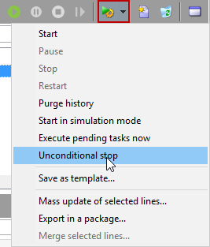

# 캠페인 대상 선택 {#marketing-campaign-deliveries}

마케팅 캠페인에서 각 게재에 대해 다음을 정의할 수 있습니다.

* 타겟 대상자입니다. 메시지를 [수신자 목록](#send-to-a-group) 또는 빌드 [워크플로우의 대상](#build-the-main-target-in-a-workflow)
* 컨트롤 그룹입니다. 다음을 수행할 수 있습니다 [컨트롤 그룹 추가](#add-a-control-group) 메시지 전달 후 수신자 동작을 모니터링합니다
<!--
* Seed addresses - Learn more in [this section](../../delivery/using/about-seed-addresses.md).-->

이 정보 중 일부는 [캠페인 템플릿](marketing-campaign-templates.md#campaign-templates).

<!--
To build the delivery target, you can define filtering criteria for the recipients in the database. This recipient selection mode is presented in [this section](../../delivery/using/steps-defining-the-target-population.md).
-->

## 그룹에 보내기{#send-to-a-group}

모집단을 목록으로 가져온 다음 게재에서 이 목록을 타겟팅할 수 있습니다. 이렇게 하려면 아래 단계를 수행합니다:

1. 게재를 편집하고 을(를) 클릭합니다. **[!UICONTROL To]** 링크를 클릭하여 타겟팅된 모집단을 변경합니다.
1. 에서 **[!UICONTROL Main target]** 탭에서 을 선택합니다 **[!UICONTROL Defined via the database]** 옵션을 선택하고 **[!UICONTROL Add]** 을 클릭하여 수신자를 선택합니다.

   

1. 선택 **[!UICONTROL A list of recipients]**.

   

1. 클릭 **[!UICONTROL Next]** 목록을 선택합니다.

   

   새 필터링 기준을 추가하여 대상을 세분화할 수 있습니다.

1. 클릭 **[!UICONTROL Finish]** 모든 기준이 정의되면 기본 대상을 저장합니다.

## 캠페인 워크플로우에서 대상자 작성 {#build-the-main-target-in-a-workflow}

게재의 주요 타겟은 캠페인 워크플로우에서도 정의할 수 있습니다. 이 그래픽 환경을 사용하면 쿼리, 테스트 및 연산자를 사용하여 대상을 작성할 수 있습니다. 결합, 중복 제거, 공유 등

>[!IMPORTANT]
>
>캠페인에 28개 이상의 워크플로우를 추가할 수 없습니다. 이 제한 이후에는 인터페이스에 추가 워크플로우가 표시되지 않으며 오류를 생성할 수 있습니다.

### 워크플로우 만들기 {#create-a-targeting-workflow}

워크플로우의 그래픽 시퀀스에서 필터링 조건을 결합하여 타깃팅을 만들 수 있습니다. 요구 사항에 따라 타겟팅할 모집단 및 하위 모집단을 만들 수 있습니다. 워크플로우 편집기를 표시하려면 **[!UICONTROL Targeting and workflows]** campaign 대시보드의 탭입니다.

대상 모집단은 워크플로우에 배치된 하나 이상의 쿼리를 통해 Adobe Campaign 데이터베이스에서 추출됩니다. 에서 쿼리를 만드는 방법을 알아봅니다. [이 섹션](../workflow/query.md).

결합, 교차, 공유, 제외 등과 같은 상자를 통해 쿼리를 실행하고 모집단을 공유할 수 있습니다.

작업 공간 왼쪽에 있는 목록에서 객체를 선택하고 해당 객체를 연결하여 대상을 구성합니다.

다이어그램에서 대상 구성에 필요한 타겟팅 및 예약 쿼리를 다이어그램에 연결합니다. 구성이 진행되는 동안 타겟팅을 실행하여 데이터베이스에서 추출한 모집단을 확인할 수 있습니다.

>[!NOTE]
>
>쿼리를 정의하는 예제 및 절차는 [이 섹션](../workflow/query.md).

편집기의 왼쪽 섹션에는 활동을 나타내는 그래픽 개체 라이브러리가 포함되어 있습니다. 첫 번째 탭에는 타겟팅 활동이 포함되어 있고, 두 번째 탭에는 타겟팅 활동을 조정하는 데 종종 사용되는 흐름 제어 활동이 포함되어 있습니다.

타겟팅 워크플로우 실행 및 서식 기능은 다이어그램 편집기 도구 모음을 통해 액세스할 수 있습니다.

>[!NOTE]
>
>다이어그램을 만드는 데 사용할 수 있는 활동과 모든 표시 및 레이아웃 기능은 [이 섹션](../workflow/about-workflows.md).

단일 캠페인에 대해 여러 타깃팅 워크플로우를 만들 수 있습니다. 워크플로우를 추가하려면 다음을 수행하십시오.

1. 워크플로우 만들기 영역의 왼쪽 위 섹션으로 이동하고 마우스 오른쪽 단추를 클릭한 다음 을 선택합니다 **[!UICONTROL Add]**. 를 사용할 수도 있습니다 **[!UICONTROL New]** 이 영역 위에 있는 단추입니다.

   

1. 을(를) 선택합니다 **[!UICONTROL New workflow]** 이 워크플로우의 템플릿과 이름을 지정합니다.
1. 클릭 **[!UICONTROL OK]** 워크플로우 만들기를 확인한 다음 이 워크플로우에 대한 다이어그램을 만듭니다.

### 워크플로우 실행 {#execute-a-workflow}

을(를) 통해 수동으로 타겟팅 워크플로우를 시작할 수 있습니다. **[!UICONTROL Start]** 적절한 권한이 있을 경우 버튼을 클릭합니다.

타겟팅은 일정(스케줄러) 또는 이벤트(외부 신호, 파일 가져오기 등)에 따라 자동 실행되도록 프로그래밍할 수 있습니다.

타겟팅 워크플로우 실행(실행, 중지, 일시 중지 등)과 관련된 작업 is **비동기** 프로세스: 명령이 저장되고 서버가 적용되는 즉시 적용됩니다.

도구 모음 아이콘을 사용하면 타겟팅 워크플로우 실행에 대한 작업을 수행할 수 있습니다.

* 시작 또는 다시 시작

   * 다음 **[!UICONTROL Start]** 아이콘을 사용하면 타겟팅 워크플로우를 시작할 수 있습니다. 이 아이콘을 클릭하면 입력 전환이 없는 모든 활동이 활성화됩니다(끝점 점프를 제외).

      

      서버는 해당 상태에 표시된 대로 요청을 고려합니다. **[!UICONTROL Start as soon as possible]**.

   * 적절한 도구 모음 아이콘을 통해 타겟팅 워크플로우를 다시 시작할 수 있습니다. 이 명령은 **[!UICONTROL Start]** 타겟팅 워크플로우 중지가 진행 중인 경우와 같이 아이콘을 사용할 수 없습니다. 이 경우 **[!UICONTROL Restart]** 아이콘을 사용하여 다시 시작할 것을 예상할 수 있습니다. 서버는 상태가 표시하듯이 요청을 고려합니다. **[!UICONTROL Restart requested]**.

* 중지 또는 일시 중지

   * 도구 모음 아이콘을 사용하면 진행 중인 타깃팅 워크플로우를 중지하거나 일시 중지할 수 있습니다.

      를 클릭하면 **[!UICONTROL Pause]**, 작업 진행 중 **[!UICONTROL are not]** 일시 중지되었지만, 다음 다시 시작할 때까지 다른 활동은 시작되지 않습니다.

      

      서버가 명령을 고려할 때 해당 상태는 다음과 같습니다. **[!UICONTROL Pause requested]**.

      실행 시간이 특정 활동에 도달하면 자동으로 타겟팅 워크플로우를 일시 중단할 수도 있습니다. 이렇게 하려면 타겟팅 워크플로우를 일시 중지할 활동을 마우스 오른쪽 단추로 클릭하고 을(를) 선택합니다 **[!UICONTROL Enable but do not execute]**.

      

      이 구성은 특수 아이콘으로 표시됩니다.

      

      >[!NOTE]
      >
      >이 옵션은 고급 타깃팅 캠페인 디자인 및 테스트 단계 동안 유용합니다.

      클릭 **[!UICONTROL Start]** 실행을 재개합니다.

   * 을(를) 클릭합니다. **[!UICONTROL Stop]** 아이콘 을 클릭하여 진행 중인 실행을 중지합니다.

      

      서버가 명령을 고려할 때 해당 상태는 다음과 같습니다. **[!UICONTROL Stop requested]**.
   실행이 활동에 도달하면 타겟팅 워크플로우를 자동으로 중지할 수도 있습니다. 이렇게 하려면 타겟팅 워크플로우가 중지될 활동을 마우스 오른쪽 단추로 클릭하고 을(를) 선택합니다 **[!UICONTROL Do not activate]**.

   

   이 구성은 특수 아이콘으로 표시됩니다.

   

   >[!NOTE]
   >
   >이 옵션은 고급 타깃팅 캠페인 디자인 및 테스트 단계 동안 유용합니다.

* 무조건 정지

   탐색기에서 **[!UICONTROL Administration > Production > Object created automatically > Campaign workflows]** 모든 캠페인 워크플로우에 액세스하여 작업할 수 있습니다.

   을(를) 클릭하여 워크플로우를 무조건 중단할 수 있습니다. **[!UICONTROL Actions]** 아이콘 및 선택 **[!UICONTROL Unconditional]** 멈춰 이 작업은 캠페인 워크플로우를 종료합니다.

   

## 컨트롤 그룹 추가 {#add-a-control-group}

컨트롤 그룹은 게재를 받지 않는 모집단입니다. 게재를 받은 대상 모집단 행동과의 비교를 통해 게재 후 동작 및 캠페인 영향을 추적하는 데 사용됩니다.

컨트롤 그룹은 기본 대상에서 추출하거나 특정 그룹 또는 쿼리에서 추출할 수 있습니다.

### 캠페인에 대한 컨트롤 그룹 활성화 {#activate-the-control-group-for-a-campaign}

캠페인 수준에서 컨트롤 그룹을 정의할 수 있습니다. 이 경우 컨트롤 그룹이 해당 캠페인의 각 게재에 적용됩니다.

1. 관련 캠페인을 편집하고 을(를) 클릭합니다. **[!UICONTROL Edit]** 탭.
1. **[!UICONTROL Advanced campaign parameters...]**&#x200B;를 클릭합니다.

   

1. 을(를) 선택합니다 **[!UICONTROL Enable and edit control group configuration]** 선택 사항입니다.
1. 클릭 **[!UICONTROL Edit...]** 컨트롤 그룹을 구성하려면 다음을 수행하십시오.

   

전체 절차는 [이 섹션](#extract-the-control-group-from-the-main-target). 의 컨트롤 그룹에 대해 자세히 알아보십시오 [이 섹션](#add-a-population).

### 게재할 컨트롤 그룹 활성화 {#activate-the-control-group-for-a-delivery}

전달 수준에서 컨트롤 그룹을 정의할 수 있습니다. 이 경우 컨트롤 그룹이 해당 캠페인의 각 게재에 적용됩니다.

기본적으로 캠페인 수준에서 정의된 컨트롤 그룹 구성은 해당 캠페인의 모든 게재에 적용됩니다. 그러나 개별 게재에 대해 컨트롤 그룹을 조정할 수 있습니다.

>[!NOTE]
>
>캠페인에 대한 컨트롤 그룹을 정의하고 이 캠페인에 연결된 게재에 대해 구성한 경우 게재에 대해 정의된 컨트롤 그룹만 적용됩니다.

1. 관련 게재를 편집한 다음 **[!UICONTROL To]** 링크를 클릭합니다.
1. 을(를) 클릭합니다. **[!UICONTROL Control group]** 탭을 선택하고 **[!UICONTROL Enable and edit control group configuration]**.

   

1. 클릭 **[!UICONTROL Edit...]** 컨트롤 그룹을 구성하려면 다음을 수행하십시오.

전체 절차는 [이 섹션](#extract-the-control-group-from-the-main-target).

### 새 모집단을 컨트롤 그룹으로 사용 {#add-a-population}

컨트롤 그룹에 특정 모집단을 사용할 수 있습니다. 이 경우 관련 필드에서 컨트롤 그룹으로 사용할 목록을 선택합니다.

이 모집단은 수신자 목록에서 오거나 특정 쿼리를 통해 정의할 수 있습니다.

>[!NOTE]
>
>Adobe Campaign 쿼리 편집기는 [이 섹션](../workflow/query.md).

### 기본 대상에서 컨트롤 그룹 추출 {#extract-the-control-group-from-the-main-target}

게재의 기본 대상에서 수신자를 추출할 수도 있습니다. 이 경우 수신자는 이 구성의 영향을 받는 게재 작업 대상에서 제거됩니다. 이 추출은 임의로 또는 수신자를 정렬한 결과일 수 있습니다.

컨트롤 그룹을 추출하려면 캠페인이나 게재에 대해 컨트롤 그룹을 활성화하고 다음 옵션 중 하나를 선택합니다. **[!UICONTROL Activate random sampling]** 또는 **[!UICONTROL Keep only the first records after sorting]**.

* 를 사용하십시오 **[!UICONTROL Activate random sampling]** 기본 모집단에서 수신자에게 임의 샘플링을 적용하는 옵션. 그런 다음 임계값을 100으로 설정하면 대상 모집단에서 임의로 선택한 100명의 수신자로 컨트롤 그룹이 구성됩니다. 임의 샘플링은 데이터베이스 엔진에 따라 다릅니다.
* 를 사용하십시오 **[!UICONTROL Keep only the first records after sorting]** 하나 이상의 정렬 명령을 기준으로 제한을 정의하는 옵션입니다. 을(를) 선택하는 경우 **[!UICONTROL Age]** 필드를 정렬 기준으로 정의한 다음 100을 임계값으로 정의하면 컨트롤 그룹이 100명의 가장 어린 수신자로 구성됩니다. 예를 들어 구매를 거의 하지 않는 수신자나 구매 횟수가 많은 수신자를 포함하는 컨트롤 그룹을 정의하고, 해당 행동을 연락을 한 수신자의 행동과 비교해보면 좋은 정보를 얻을 수 있습니다.

클릭 **[!UICONTROL Next]** 정렬 순서를 정의하고(필요한 경우) 수신자 제한 모드를 선택합니다.

이 구성은 **[!UICONTROL Split]** 활동 을 만들 수 있습니다. 컨트롤 그룹은 이러한 하위 집합 중 하나입니다.

#### 튜토리얼 비디오 {#create-email-video}

이 비디오에서는 Adobe Campaign에서 캠페인 및 이메일을 만드는 방법을 설명합니다.

>[!VIDEO](https://video.tv.adobe.com/v/25604?quality=12)

추가 Campaign 방법 비디오를 사용할 수 있습니다 [여기](https://experienceleague.adobe.com/docs/campaign-learn/tutorials/getting-started/introduction-to-adobe-campaign.html){target="_blank"}.
