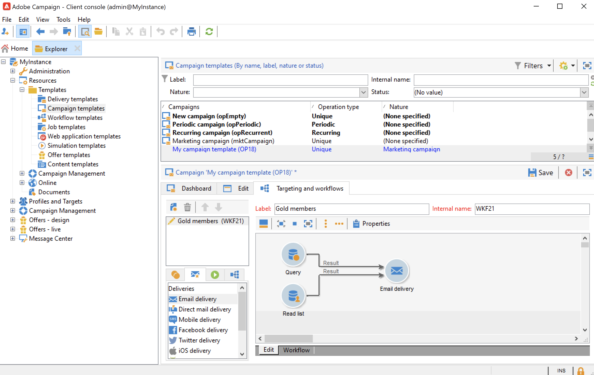
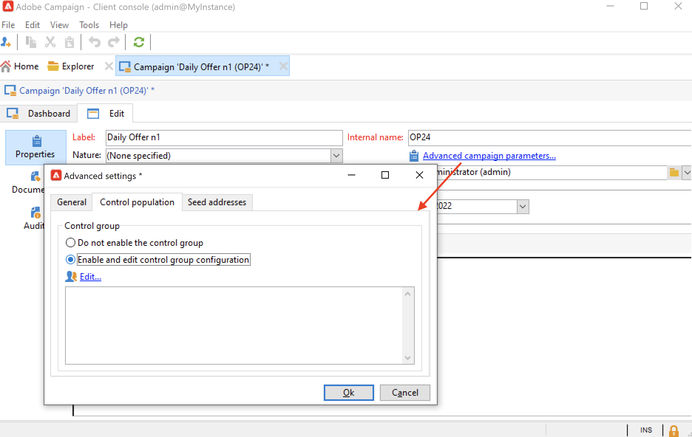

# Campaign 템플릿 만들기 및 구성 {#campaign-templates}

모든 마케팅 캠페인은 주요 특성과 기능을 저장하는 템플릿을 기반으로 합니다. Campaign에는 캠페인을 만들기 위한 기본 제공 템플릿이 포함되어 있습니다. 이 템플릿에는 문서, 시드 주소, 승인, 게재 개요 등 모든 기능이 활성화되어 있습니다.

사용 가능한 기능은 사용 권한, 추가 기능 및 Adobe Campaign 플랫폼의 구성에 따라 다릅니다.

>[!NOTE]
>
>홈페이지에서 **[!UICONTROL Explorer]** 아이콘을 클릭하면 트리가 표시됩니다.

특정 구성이 정의되지 않은 캠페인을 만들기 위해 기본 제공 템플릿이 제공됩니다. 캠페인 템플릿을 만들고 구성한 다음 그 템플릿에서 캠페인을 만들 수 있습니다.

## 캠페인 템플릿 만들기 {#create-a-campaign-template}

캠페인 템플릿을 만들려면 아래 단계를 수행하십시오.

1. Campaign **탐색기**&#x200B;를 열고 **리소스 > 템플릿 > 캠페인 템플릿**&#x200B;으로 이동합니다.
1. 템플릿 목록 위에 있는 도구 모음에서 **새로 만들기**&#x200B;를 클릭합니다.

기본 제공 템플릿을 **복제**&#x200B;하여 다시 사용하고 구성을 조정할 수도 있습니다. 이렇게 하려면 템플릿을 마우스 오른쪽 단추로 클릭하고 **복제**&#x200B;를 선택합니다.

1. 새 캠페인 템플릿의 레이블을 입력합니다.
1. **저장**&#x200B;을 클릭하고 서식 파일을 다시 엽니다.
1. **편집** 탭에서 템플릿 속성을 정의합니다.
1. **고급 캠페인 매개 변수...** 링크를 선택하여 캠페인 템플릿에 워크플로우를 추가합니다.

   

1. **타깃팅 및 워크플로** 값을 **예**(으)로 변경하고 확인하십시오. [이 섹션](#typology-of-enabled-modules)에서 기능을 추가하는 방법을 알아보세요.
1. **타깃팅 및 워크플로** 탭이 템플릿에 추가됩니다. **워크플로 추가...**&#x200B;를 클릭하고 **레이블**&#x200B;을 입력한 다음 **확인**&#x200B;을 클릭합니다.
1. 필요에 따라 워크플로우를 만듭니다.

   

1. **저장**&#x200B;을 클릭합니다. 이제 템플릿을 사용하여 새 캠페인을 만들 준비가 되었습니다.

캠페인 템플릿의 다양한 탭과 하위 탭을 사용하여 [일반 구성](#general-configuration)에 설명된 설정에 액세스할 수 있습니다.

## 모듈 선택 {#select-modules}

**[!UICONTROL Advanced campaign parameters...]** 링크를 사용하면 이 템플릿을 기반으로 캠페인에 대한 작업을 활성화 및 비활성화할 수 있습니다. 이 템플릿을 기반으로 만든 캠페인에서 활성화할 기능을 선택합니다.

기능을 선택하지 않으면 프로세스와 관련된 요소(메뉴, 아이콘, 옵션, 탭, 하위 탭 등)가 템플릿 인터페이스나 이 템플릿을 기반으로 하는 캠페인에 표시되지 않습니다. 캠페인 세부 정보의 왼쪽에 있는 탭과 사용 가능한 탭은 템플릿에서 선택한 기능과 일치합니다. 예를 들어 **경비 및 목표** 기능을 사용할 수 없으므로 이 템플릿을 기반으로 하는 캠페인에 해당 **[!UICONTROL Budget]** 탭이 표시되지 않습니다.

또한 구성 창에 대한 단축키가 캠페인 대시보드에 추가됩니다. 기능을 활성화하면 직접 링크를 통해 캠페인 대시보드에서 액세스할 수 있습니다.

### 구성 샘플

* 예를 들어 다음 설정을 사용합니다.

  

  캠페인 대시보드에는 다음이 표시됩니다.

  

  **[!UICONTROL Targeting and workflows]** 탭이 없습니다.

  다음 기능을 사용할 수 있습니다.

  

  **[!UICONTROL Budget]** 탭이 없습니다.

  캠페인 고급 설정도 이 구성을 반영합니다.

  

  **[!UICONTROL Approvals]** 탭을 사용할 수 없습니다.

* 이 구성:
  

  캠페인 대시보드에는 다음이 표시됩니다.

  

  **[!UICONTROL Targeting and workflows]** 탭을 사용할 수 있지만 **문서 추가** 링크가 없습니다.

  다음 기능을 사용할 수 있습니다.

  

  **[!UICONTROL Budget]** 탭을 사용할 수 있습니다.

  캠페인 고급 설정도 이 구성을 반영합니다.

  

  **[!UICONTROL Approvals]** 탭을 사용할 수 있지만 **[!UICONTROL Control population]** 및 **[!UICONTROL Seed addresses]** 탭은 사용할 수 없습니다.

## 모듈 유형화 {#typology-of-enabled-modules}

* **컨트롤 그룹**

  이 모듈을 선택하면 템플릿 및 이 템플릿을 기반으로 하는 캠페인의 고급 설정에 추가 탭이 추가됩니다. 템플릿을 통해 또는 각 캠페인에 대해 개별적으로 구성을 정의할 수 있습니다. [이 섹션](marketing-campaign-deliveries.md#defining-a-control-group)에서 컨트롤 그룹에 대해 자세히 알아보세요.

  

* **시드 주소**

  이 모듈을 선택하면 템플릿 및 이 템플릿을 기반으로 하는 캠페인의 고급 설정에 추가 탭이 추가됩니다. 템플릿을 통해 또는 각 캠페인에 대해 개별적으로 구성을 정의할 수 있습니다.

  

* **문서**

  이 모듈을 선택하면 템플릿의 **[!UICONTROL Edit]** 탭과 이 템플릿을 기반으로 하는 캠페인에 추가 탭이 추가됩니다. 첨부된 문서는 템플릿에서 또는 각 캠페인에 대해 개별적으로 추가할 수 있습니다. [이 섹션](marketing-campaign-deliveries.md#manage-associated-documents)의 문서에 대해 자세히 알아보세요.

  

* **게재 개요**

  이 모듈을 선택하면 **[!UICONTROL Delivery outlines]** 탭에 **[!UICONTROL Documents]** 하위 탭이 추가되어 캠페인에 대한 게재 개요를 정의합니다. [이 섹션](marketing-campaign-assets.md#delivery-outlines)에서 게재 개요에 대해 자세히 알아보세요.

  

* **타깃팅 및 워크플로**

  **[!UICONTROL Targeting and workflows]** 모듈을 선택하면 이 템플릿을 기반으로 캠페인용 워크플로우를 하나 이상 만들 수 있는 탭이 추가됩니다. 이 템플릿을 기반으로 각 캠페인에 대해 개별적으로 워크플로우를 구성할 수도 있습니다. [이 섹션](marketing-campaign-deliveries.md#build-the-main-target-in-a-workflow)에서 캠페인 워크플로우에 대해 자세히 알아보세요.

  

  이 모듈을 사용하면 **[!UICONTROL Jobs]** 탭이 캠페인의 고급 설정에 추가되어 프로세스 실행 순서를 정의합니다.

* **승인**

  **[!UICONTROL Approvals]**&#x200B;을(를) 사용하도록 설정하면 승인할 프로세스와 승인을 담당하는 연산자를 선택할 수 있습니다. [이 섹션](marketing-campaign-approval.md#select-reviewers)에서 승인에 대해 자세히 알아보세요.

  

  템플릿 고급 설정 섹션의 **[!UICONTROL Approvals]** 탭을 통해 프로세스 승인을 사용할지 여부를 선택할 수 있습니다.

* **경비 및 목표**

  이 모듈을 선택하면 연결된 예산을 선택할 수 있도록 **[!UICONTROL Budget]** 탭이 템플릿 및 이 템플릿을 기반으로 하는 캠페인의 세부 정보에 추가됩니다.

  

## 템플릿 속성 {#template-properties}

캠페인 템플릿을 만들 때 다음 정보를 입력해야 합니다.

* 템플릿의 **레이블**&#x200B;을(를) 입력하십시오. 레이블은 필수이며 이 템플릿을 기반으로 하는 모든 캠페인에 대한 기본 레이블입니다.
* 드롭다운 목록에서 캠페인 **자연**&#x200B;을(를) 선택합니다. 이 목록에서 사용할 수 있는 값은 **[!UICONTROL natureOp]** 열거에 저장된 값입니다.

  [이 페이지](../../v8/config/enumerations.md)에서 열거형에 액세스하고 구성하는 방법을 알아보세요.

* **캠페인 유형**(고유, 반복 또는 정기)을 선택하십시오. 기본적으로 캠페인 템플릿은 고유한 캠페인에 적용됩니다. 반복 및 정기 캠페인은 [이 섹션](recurring-periodic-campaigns.md)에 자세히 설명되어 있습니다.
* 캠페인 기간, 즉 캠페인이 진행될 일 수를 지정합니다. 이 템플릿을 기반으로 캠페인을 만들 때 캠페인 시작 및 종료 날짜가 자동으로 채워집니다.

  캠페인이 반복되면 템플릿에서 직접 캠페인 시작 및 종료 날짜를 지정해야 합니다.

* 템플릿의 **관련 프로그램**&#x200B;을 지정하십시오. 이 템플릿을 기반으로 하는 캠페인이 선택한 프로그램에 연결되어 있습니다.

<!--
## Track campaign execution{#campaign-reverse-scheduling}

You can create a schedule for a campaign and track accomplishments, for instance to prepare an event schedule for a specific date. Campaign templates now let you calculate the start date of a task based on the end date of a campaign.

In the task configuration box, go to the **[!UICONTROL Implementation schedule]** area and check the **[!UICONTROL The start date is calculated based on the campaign end date]** box. (Here, "start date" is the task start date). Go to the **[!UICONTROL Start]** field and enter an interval: the task will start this long before the campaign end date. If you enter a period which is longer than the campaign is set to last, the task will begin before the campaign.

When you create a campaign using this template, the task start date will be calculated automatically. However, you can always change it later.-->
