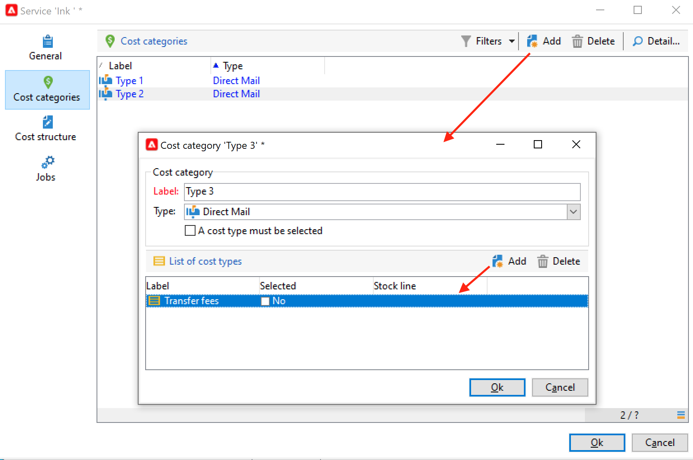

# 공급자, 재고 및 예산{#providers-stocks-and-budgets}

Adobe Campaign을 사용하면 캠페인 내에서 수행되는 작업에 참여할 서비스 공급자를 정의할 수 있습니다. 서비스 공급자 및 관련 비용 구조에 대한 정보는 기본 보기에서 Adobe Campaign 관리자가 정의합니다. 서비스 공급자가 게재에서 참조되고, 비용 구조를 통해 이 게재와 관련된 비용과 해당 주식의 관리를 계산할 수 있습니다.

## 서비스 공급자 및 비용 구조 생성 {#create-service-providers-and-their-cost-structures}

각 서비스 공급자는 연락처 정보, 서비스 템플릿 및 관련 작업이 있는 파일에 저장됩니다.

서비스 공급자는 **[!UICONTROL Administration > Campaign management]** 노드 아래에 있어야 합니다.

게재 중에 수행되는 작업은 서비스 제공자가 수행합니다. 특히 DM 및 모바일 채널에 대해 수행합니다. 예를 들어 이러한 서비스 공급업체는 메시지 인쇄 또는 배포에 관여할 수 있습니다. 이러한 작업에는 각 서비스 공급자와 관련된 구성 및 비용이 포함됩니다. 서비스 공급자 구성에는 4단계가 포함됩니다.

1. Adobe Campaign에서 서비스 공급자 생성. [자세히 알아보기](#add-a-service-provider)

1. 관련 서비스 템플릿의 비용 범주 및 구조 정의 [자세히 알아보기](#define-cost-categories)

1. 프로세스 구성 [자세히 알아보기](#configure-processes-associated-with-a-service)

1. 캠페인 수준에서 서비스 공급자를 참조합니다. [자세히 알아보기](#associate-a-service-with-a-campaign)

### 서비스 공급자 및 해당 비용 범주 만들기 {#create-a-service-provider-and-its-cost-categories}

#### 서비스 공급자 추가 {#add-a-service-provider}

게재에 필요한 수만큼 서비스 공급자를 만들 수 있습니다. 서비스 공급자를 추가하는 절차는 다음과 같습니다.

1. 을(를) 클릭합니다. **[!UICONTROL New]** 서비스 공급자 목록 위의 단추.
1. 창의 아래 섹션에서 서비스 공급자의 이름과 연락처 세부 정보를 지정합니다.

   

1. 을(를) 클릭합니다. **[!UICONTROL Save]** 목록에 서비스 공급자를 추가하는 단추.

#### 비용 범주 정의 {#define-cost-categories}

이제 서비스 템플릿을 각 서비스 공급자와 연결할 수 있습니다. 이러한 템플릿에서 먼저 비용 범주와 필요한 경우 해당 주식을 식별해야 합니다. 그런 다음 원가 구조를 통해 각 범주에 대한 원가 계산 규칙을 생성할 수 있습니다. [자세히 알아보기](#define-the-cost-structure)

비용 범주는 게재 유형(이메일, DM, SMS 등)에 적합한 비용 세트를 포함하는 엔티티입니다. 비용 범주는 서비스 제공자와 연관된 서비스 템플릿으로 그룹화됩니다. 각 서비스 공급자는 하나 이상의 서비스 템플릿을 참조할 수 있습니다.

서비스 템플릿을 만들고 해당 컨텐츠를 정의하려면 아래 단계를 수행합니다.

1. 에서 **[!UICONTROL Services]** 서비스 공급자 탭에서 **[!UICONTROL Add]** 버튼을 클릭하고 서비스 템플릿의 이름을 입력합니다.

   

1. 각 프로세스 유형에 대한 비용 범주를 만듭니다(DM/이메일 등으로 제공). 또는 작업)을 수행할 수 있습니다. 이렇게 하려면 **[!UICONTROL Cost categories]** 탭한 다음 **[!UICONTROL Add]** 버튼을 누르고 각 원가 범주의 매개변수를 입력합니다.

   

   * 이 원가 범주에 대한 레이블을 입력하고 관련 프로세스 유형을 선택합니다. **[!UICONTROL Direct mail]**, **[!UICONTROL Email]**, **[!UICONTROL Mobile]**&#x200B;등
   * 을(를) 클릭합니다. **[!UICONTROL Add]** 버튼을 눌러 이 범주와 연관된 원가 유형을 정의합니다.
   * 필요한 경우 사용된 수량이 기존 주식과 자동으로 관련되도록 재고 라인을 각 원가 유형과 연관시킵니다.

      >[!NOTE]
      >
      >스톡 라인은 **[!UICONTROL Stock management]** 노드 아래에 있어야 합니다. [자세히 알아보기](#stock-and-order-management)

1. 이 비용 범주의 값을 미리 선택할 수 있습니다. 이 값은 서비스 공급자 비용 범주의 기본값입니다(빈 값이 아니라). 이렇게 하려면 **예** 옵션 **[!UICONTROL Selected]** 관련 범주 유형에 대한 열:

   

   게재 수준에서 기본적으로 값이 선택됩니다.

### 비용 구조 정의 {#define-the-cost-structure}

각 원가 유형에 대해 원가 구조는 적용할 계산 규칙을 지정합니다.

을(를) 클릭합니다. **[!UICONTROL Cost structure]** 탭하여 각 원가 범주 및 유형에 대한 원가 계산을 구성합니다. 클릭 **[!UICONTROL Add]** 그리고 비용 구조를 입력합니다.

* 원가 구조를 생성하려면 드롭다운 목록에서 메시지 유형 및 관련 비용 범주를 선택하고, 계산 규칙이 적용될 원가 유형을 선택합니다. 이러한 드롭다운 목록의 컨텐츠는 **[!UICONTROL Cost categories]** 탭.

   원가 구조에 레이블을 지정해야 합니다. 기본적으로 다음과 같은 게재 아웃라인이 있습니다. **원가 범주 - 원가 유형**.

   그러나 이름을 바꿀 수 있습니다. 원하는 값을 **[!UICONTROL Label]** 필드.

* 원가 계산 공식은 창의 하부에 정의됩니다.

   이 수식은 메시지 수에 따라 수정하거나 계산할 수 있습니다.

   메시지 수에 따라 원가 계산 구조가 달라질 수 있습니다. **[!UICONTROL Linear]**, **[!UICONTROL Linear by threshold]**, 또는 **[!UICONTROL Constant by threshold]**.

#### 선형 구조 {#linear-structure}

메시지(또는 메시지 일괄 처리)에 대해 총 메시지 수와 관계없이 금액이 항상 동일한 경우 을 선택합니다 **[!UICONTROL Linear]** 각 메시지의 비용을 입력합니다.

이 금액이 메시지 배치에 적용되는 경우 **[!UICONTROL for]** 필드.

#### 임계값별 선형 구조 {#linear-structure-by-threshold}

각 메시지에 대한 임계값별로 금액이 적용되는 경우 **[!UICONTROL Linear by threshold]** 계산 구조. 이러한 유형의 비용 구조에서 각 메시지는 총 메시지 수가 1에서 100 사이인 경우 0.13 비용이 발생하고 100~1000개의 메시지를 보낸 경우 0.12 또는 1000개의 메시지를 초과하는 0.11 비용이 듭니다.

구성은 다음과 같습니다.

임계값을 추가하려면 **[!UICONTROL Add]** 목록의 오른쪽에 있는 단추.

#### 임계값별 상수 구조 {#constant-structure-by-threshold}

마지막으로, 총 메시지 수에 따라 비용 계산을 구성할 수 있습니다. 이렇게 하려면 **[!UICONTROL Constant by threshold]** 계산 구조. 예를 들어, 비용은 1~100개의 메시지에 대해 12.00개의 고정된 금액으로, 101~1000개의 메시지 전달에 대해서는 100.00에서, 총 개수에 관계없이 1000개 이상의 메시지에 대해서는 500.00으로 설정됩니다.

### 서비스와 연결된 작업 구성 {#configure-processes-associated-with-a-service}

를 통해 서비스 공급자와 연관된 프로세스에 대한 정보를 연결할 수 있습니다 **[!UICONTROL Jobs]** 탭. 이 섹션에서는 라우터에 정보를 보내도록 구성할 수 있습니다.

* 다음 **[!UICONTROL File extraction]** 섹션은 이 서비스를 선택할 때 게재에 사용되는 내보내기 템플릿을 나타냅니다. 에서 출력 파일의 이름을 나타낼 수 있습니다 **[!UICONTROL Extraction file]** 필드. 필드 오른쪽의 버튼을 사용하여 변수를 삽입할 수 있습니다.

* 다음 **[!UICONTROL Notification email]** 섹션을 통해 파일을 보낸 후 서비스 공급자에게 알리는 템플릿을 지정할 수 있습니다. 경고 메시지와 수신자 그룹을 만드는 데 사용되는 템플릿을 선택합니다.

   기본적으로 알림 메시지의 게재 템플릿은 **[!UICONTROL Administration > Campaign management > Technical delivery templates]** 노드 - 일반 보기에서 액세스할 수 있습니다.

* 다음 **[!UICONTROL Post-processing]** 섹션을 통해 게재를 승인한 후 시작할 워크플로우를 선택할 수 있습니다. 워크플로우 템플릿을 입력하면 승인이 적용된 즉시 워크플로우 인스턴스가 자동으로 만들어지고 실행됩니다. 이 워크플로우는 예를 들어 처리를 위해 추출 파일을 외부 서비스 공급자에게 보낼 수 있습니다.

### 서비스와 캠페인 연결 {#associate-a-service-with-a-campaign}

서비스 공급자는 캠페인 게재와 연결됩니다. 이 템플릿을 통해 만든 게재에서 서비스를 제공하기 위해 게재 템플릿에서 참조됩니다.

서비스를 선택하면 게재 유형에 해당하는 비용 범주(DM, 이메일 등)가 정의된 처리 옵션과 함께 중앙 테이블에 자동으로 표시됩니다.

>[!NOTE]
>
>서비스를 선택할 때 비용 범주가 표시되지 않으면 이 유형의 프로세스에 대해 비용 범주가 정의되지 않은 것입니다. 예를 들어 이메일 게재의 경우, 없을 경우 **[!UICONTROL Email]** 유형 비용 범주가 정의되었으며 범주가 표시되지 않으며 서비스를 선택하면 영향을 주지 않습니다.

* DM 게재의 경우 구성 창에서 서비스를 선택할 수 있습니다.

   

* 모바일 채널 또는 전화로 게재하는 경우 동일한 선택 모드가 적용됩니다.
* 이메일 게재의 경우, 서비스는 **[!UICONTROL Advanced]** 다음 예와 같이 게재 속성의 탭입니다.

   

다음 **[!UICONTROL Amount to surcharge]** 열을 사용하면 관련 게재 또는 작업 컨텍스트에서 이 카테고리의 비용을 추가할 수 있습니다.

납품에 대한 원가 범주 정의 중에 원가 유형에 대한 필수 선택을 정의할 수 있습니다. 이렇게 하려면 을(를) 선택합니다. **[!UICONTROL A cost type must be selected]**.

## 주식 및 주문 관리 {#stock-and-order-management}

경고, 공급 추적 및 실행 주문을 처리하기 위해 원가 유형을 재고 라인과 연관시킬 수 있습니다.

Adobe Campaign에서 재고 및 주문 관리를 설정하고, 게재에 대한 공급이 충분하지 않은 경우 운영자에게 알리는 절차는 다음과 같습니다.

1. 관련 서비스 공급자의 주식 생성 및 참조. [자세히 알아보기](#create-a-stock)

1. 재고 라인 추가 [자세히 알아보기](#add-stock-lines)

1. 경고 이벤트 시 연산자에게 알림. [자세히 알아보기](#alert-operators)

1. 주문 및 공급. [자세히 알아보기](#orders)

### 주식 관리 {#stock-management}

Adobe Campaign은 재고가 부족하거나 최소 임계값에 도달하면 연산자 그룹에 경고를 줄 수 있습니다. 스톡 수준은 **[!UICONTROL Stocks]** 링크 **[!UICONTROL Campaigns]** 를 통해 탭 **[!UICONTROL Other choices]** 탐색 영역의 링크입니다.

#### 스톡 만들기 {#creating-a-stock}

다음 단계를 적용하여 새 주식을 만듭니다.

1. 을(를) 클릭합니다. **[!UICONTROL Create]** 주식 목록 위의 단추.
1. 스톡 레이블을 입력하고 드롭다운 목록에서 스톡 레이블이 연관된 서비스 공급자를 선택합니다. [자세히 알아보기](#create-service-providers-and-their-cost-structures)

#### 재고 라인 추가 {#add-stock-lines}

주식은 다양한 주식라인을 포함한다. 재고 라인에는 게재에서 소비되는 초기 자원 수량이 포함됩니다. 각 재고 라인은 소비 수량, 재고 수량 및 주문 수량을 나타냅니다.

스톡 페이지를 만들 때 **[!UICONTROL Stock lines]** 탭하여 새 줄을 추가합니다.

재고가 생성되면 대시보드에서 스톡 라인을 만들고 모니터링합니다.

을(를) 클릭합니다. **[!UICONTROL Create]** 새 재고 라인을 추가하는 버튼.

* 처음에 재고가 있는 수량을 **[!UICONTROL Initial stock]** 필드. 다음 **[!UICONTROL Consumed]** 및 **[!UICONTROL In stock]** 필드는 캠페인 진행으로 자동으로 계산되고 업데이트됩니다.

   

* 연산자에게 주문하도록 지시해야 하는 임계값을 지정합니다 **[!UICONTROL Alert level]** 필드. 경고 수준에 도달하면 이 재고를 사용하여 게재의 승인 창에 경고 메시지가 표시됩니다.

#### 재고 및 원가 범주 연관 {#associate-a-stock-with-cost-categories}

특정 서비스 공급자의 경우, 서비스 내에서 다음과 같이 비용 범주 중 하나에서 스톡 라인을 참조할 수 있습니다.

### 스톡 추적 {#stock-tracking}

#### 경고 연산자 {#alert-operators}

게재에서 참조된 재고가 충분하지 않으면 경고가 표시됩니다. 예를 들어 추출 파일이 승인되면 다음 경고가 표시됩니다.

#### 주문 {#orders}

다음 **[!UICONTROL Orders]** 하위 탭에서는 현재 주문을 보고 새 주문을 저장할 수 있습니다.

주문을 저장하려면 타깃팅된 재고 라인을 편집하고 **[!UICONTROL Add]** 버튼을 클릭하고 배달 일자 및 주문 수량을 지정합니다.

>[!NOTE]
>
>납품 일자에 도달하면 주문 재고 라인이 자동으로 사라지고 **[!UICONTROL Volume on order]** 필드가 **[!UICONTROL Tracking]** 탭. 이 수량은 자동으로 재고 수량에 추가됩니다.

다음 **[!UICONTROL Consumptions]** 탭에는 캠페인당 소비되는 볼륨이 포함되어 있습니다. 이 탭의 정보는 수행된 게재에 따라 자동으로 입력됩니다. 을(를) 클릭합니다. **[!UICONTROL Edit]** 단추를 클릭하여 해당 캠페인을 엽니다.

## 예산 계산 {#calculate-budgets}

### 원칙 {#principle}

비용은 게재 및 캠페인에 대해 관리됩니다. 진행 상황에 따라, 이러한 비용은 예산에 할당된다.

캠페인에 대한 게재 비용은 캠페인 수준에서 통합되며, 프로그램의 모든 캠페인 비용은 캠페인이 연결된 프로그램으로 전달됩니다. 전용 보고서를 사용하면 전체 플랫폼 또는 각 계획 및 프로그램에 대한 예산을 추적할 수 있습니다.

### 구현 {#implementation}

캠페인에서 예산을 선택하는 경우 초기 금액을 입력해야 합니다. 계산된 비용은 입력된 금액의 약정 레벨(비용, 예상, 예약, 약정)에 따라 자동으로 갱신됩니다.

<!--
See [Calculating amounts](../../mrm/using/controlling-costs.md#calculating-amounts).

>[!NOTE]
>
>The procedure for creating budgets is presented in [Creating a budget](../../mrm/using/controlling-costs.md#creating-a-budget).
-->
