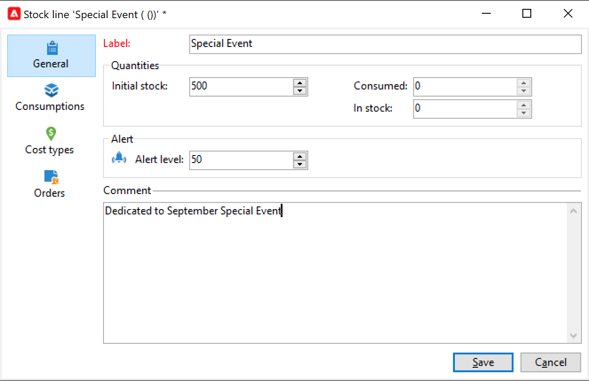

# 공급자, 재고 및 예산{#providers-stocks-and-budgets}

Adobe Campaign을 사용하면 캠페인 내에서 수행되는 작업에 참여할 서비스 공급자를 정의할 수 있습니다. 서비스 제공자 및 관련 비용 구조에 대한 정보는 기본 보기에서 Adobe Campaign 관리자에 의해 정의됩니다. 서비스 제공자는 게재에서 참조되며, 해당 비용 구조를 통해 해당 게재와 관련된 비용 계산은 물론 해당 주식의 관리를 수행할 수 있습니다.

## 서비스 공급자 및 해당 비용 구조 만들기 {#create-service-providers-and-their-cost-structures}

각 서비스 공급자는 연락처 세부 정보, 서비스 템플릿 및 관련 작업이 포함된 파일에 저장됩니다.

서비스 공급자는에 구성됩니다. **[!UICONTROL Administration > Campaign management]** Campaign 탐색기 폴더.

게재 중에 수행되는 작업은 서비스 공급자(특히 DM 및 모바일 채널)가 수행합니다. 이러한 서비스 제공자는 예를 들어 메시지를 인쇄하거나 배포하는 데 관여할 수 있습니다. 이러한 작업에는 각 서비스 공급업체별 구성과 비용이 포함됩니다. 서비스 공급자 구성은 다음 네 가지 단계로 구성됩니다.

1. Adobe Campaign에서 서비스 공급자 생성. [자세히 알아보기](#add-a-service-provider)

1. 비용 범주 및 관련 서비스 템플릿의 구조를 정의합니다. [자세히 알아보기](#define-cost-categories)

1. 프로세스 구성 [자세히 알아보기](#configure-processes-associated-with-a-service)

1. 캠페인 수준에서 서비스 공급자 참조. [자세히 알아보기](#associate-a-service-with-a-campaign)

### 서비스 공급자 및 해당 비용 범주 만들기 {#create-a-service-provider-and-its-cost-categories}

#### 서비스 공급자 추가 {#add-a-service-provider}

게재에 필요한 수만큼 서비스 공급자를 만들 수 있습니다. 서비스 제공자를 추가하는 절차는 다음과 같습니다.

1. 다음을 클릭합니다. **[!UICONTROL New]** 서비스 공급자 목록 위에 있는 단추입니다.
1. 창의 아래 섹션에서 서비스 공급자의 이름과 연락처 세부 정보를 지정합니다.

   

1. 다음을 클릭합니다. **[!UICONTROL Save]** 서비스 공급자를 목록에 추가하는 단추입니다.

#### 비용 범주 정의 {#define-cost-categories}

이제 서비스 템플릿을 각 서비스 공급자와 연결할 수 있습니다. 이러한 템플릿에서 먼저 비용 범주와 필요한 경우 관련 재고를 식별해야 합니다. 그런 다음 원가 구조를 통해 각 범주에 대한 원가 계산 규칙을 생성할 수 있습니다. [자세히 알아보기](#define-the-cost-structure)

비용 카테고리는 게재 유형(이메일, DM, SMS 등)에 적합한 비용 세트가 포함된 엔티티입니다. 비용 범주는 서비스 제공자와 연관된 서비스 템플릿으로 그룹화됩니다. 각 서비스 제공자는 하나 이상의 서비스 템플릿을 참조할 수 있습니다.

서비스 템플릿을 만들고 콘텐츠를 정의하려면 아래 단계를 수행합니다.

1. 다음에서 **[!UICONTROL Services]** 서비스 공급자의 탭에서 **[!UICONTROL Add]** 버튼을 클릭하고 서비스 템플릿의 이름을 입력합니다.

   

1. 각 프로세스 유형(DM/이메일 등을 통한 게재)에 대한 비용 범주를 만듭니다. 또는 작업)을 참조하십시오. 이렇게 하려면 **[!UICONTROL Cost categories]** 탭을 클릭한 다음 **[!UICONTROL Add]** 버튼을 누르고 각 원가 범주의 매개변수를 입력합니다.

   

   * 이 원가 범주에 대한 라벨을 입력하고 관련 프로세스 유형을 선택합니다. **[!UICONTROL Direct mail]**, **[!UICONTROL Email]**, **[!UICONTROL Mobile]**&#x200B;등
   * 다음을 클릭합니다. **[!UICONTROL Add]** 버튼을 눌러 이 범주와 연관된 비용 유형을 정의합니다.
   * 필요한 경우, 사용된 수량이 자동으로 기존 주식에 관련되도록 각 원가 유형과 재고 라인을 연관시킵니다.

     >[!NOTE]
     >
     >재고 라인은에 정의되어 있습니다 **[!UICONTROL Stock management]** 노드. [자세히 알아보기](#stock-and-order-management)

1. 이 비용 범주의 값을 미리 선택할 수 있습니다. 이 값은 서비스 공급자 비용 범주의 기본값입니다(빈 값 대신). 이렇게 하려면 다음을 활성화합니다. **예** 의 옵션 **[!UICONTROL Selected]** 관련 범주 유형에 대한 열:

   

   게재 수준에서 기본적으로 값이 선택됩니다.

### 비용 구조 정의 {#define-the-cost-structure}

각 원가 유형에 대해 원가 구조는 적용할 계산 규칙을 지정합니다.

다음을 클릭합니다. **[!UICONTROL Cost structure]** 탭으로 이동하여 각 원가 범주 및 유형에 대한 원가 계산을 구성합니다. 클릭 **[!UICONTROL Add]** 비용 구조를 입력합니다.

* 비용 구조를 생성하려면 계산 규칙이 적용될 비용 유형뿐만 아니라 드롭다운 목록에서 메시지 유형 및 관련 비용 범주를 선택합니다. 이러한 드롭다운 목록의 콘텐츠는 다음을 통해 입력한 정보에서 가져옵니다. **[!UICONTROL Cost categories]** 탭.

  원가 구조에 레이블을 지정해야 합니다. 기본적으로 다음과 같은 게재 개요가 있습니다. **비용 범주 - 비용 유형**.

  그러나 이름을 바꿀 수 있습니다. 원하는 값을 **[!UICONTROL Label]** 필드.

* 원가 계산 공식은 창의 아래 섹션에 정의되어 있습니다.

  이 수식은 고정(메시지 수에 상관없이)하거나 메시지 수에 따라 계산할 수 있습니다.

  메시지 수에 따라 달라지는 경우 비용 계산 구조는 다음과 같을 수 있습니다. **[!UICONTROL Linear]**, **[!UICONTROL Linear by threshold]**, 또는 **[!UICONTROL Constant by threshold]**.

#### 선형 구조 {#linear-structure}

메시지(또는 메시지 묶음)의 금액이 총 메시지 수와 관계없이 항상 동일하면 다음을 선택합니다. **[!UICONTROL Linear]** 각 메시지의 비용을 입력합니다.

이 금액이 메시지 배치에 적용되는 경우 **[!UICONTROL for]** 필드.

#### 임계값에 따른 선형 구조 {#linear-structure-by-threshold}

금액이 각 메시지에 대해 임계값별로 적용되는 경우 다음을 정의해야 합니다. **[!UICONTROL Linear by threshold]** 계산 구조입니다. 이러한 유형의 비용 구조에서, 예를 들어 총 메시지 수가 1과 100 사이인 경우 각 메시지의 비용은 0.13이 되며, 전송된 메시지 100개에서 1000개까지 또는 메시지 1000개를 초과하는 경우 0.12가 듭니다.

구성은 다음과 같습니다.

임계값을 추가하려면 **[!UICONTROL Add]** 목록 오른쪽에 있는 단추입니다.

#### 임계값에 의한 상수 구조 {#constant-structure-by-threshold}

마지막으로, 총 메시지 수에 따라 비용 계산을 구성할 수 있습니다. 이렇게 하려면 **[!UICONTROL Constant by threshold]** 계산 구조입니다. 예를 들어 비용은 메시지 1개부터 100개까지 고정된 12.00, 메시지 101개부터 1000개까지 전달된 경우 100.00, 메시지 1000개를 초과하는 전달된 경우 500.00개로 설정됩니다(전체 메시지 수에 상관없이).

### 서비스와 연결된 작업 구성 {#configure-processes-associated-with-a-service}

다음을 통해 서비스 공급자와 연관된 프로세스에 대한 정보를 연관시킬 수 있습니다. **[!UICONTROL Jobs]** 탭. 이 섹션에서는 라우터로 정보를 전송하도록 구성할 수 있습니다.

* 다음 **[!UICONTROL File extraction]** 섹션은 이 서비스를 선택할 때 게재에 사용되는 내보내기 템플릿을 나타냅니다. 에서 출력 파일의 이름을 나타낼 수 있습니다. **[!UICONTROL Extraction file]** 필드. 필드 오른쪽에 있는 버튼을 사용하여 변수를 삽입할 수 있습니다.

* 다음 **[!UICONTROL Notification email]** 섹션 을 사용하면 파일을 보낸 후 서비스 공급자에게 알릴 템플릿을 지정할 수 있습니다. 경고 메시지를 만드는 데 사용되는 템플릿과 수신자 그룹을 선택합니다.

  기본적으로 알림 메시지의 게재 템플릿은 **[!UICONTROL Administration > Campaign management > Technical delivery templates]** 일반 보기에서 액세스할 수 있는 폴더

* 다음 **[!UICONTROL Post-processing]** 섹션 에서는 게재가 승인된 후 실행할 워크플로우를 선택할 수 있습니다. 워크플로 템플릿을 입력하면 승인이 적용되는 즉시 워크플로 인스턴스가 자동으로 만들어지고 시작됩니다. 예를 들어 이 워크플로우는 외부 서비스 공급자에게 추출 파일을 보내어 처리할 수 있습니다.

### 서비스를 캠페인에 연결 {#associate-a-service-with-a-campaign}

서비스 공급자는 캠페인 게재와 연결됩니다. 게재 템플릿에서 참조되어 이 템플릿을 통해 만든 게재에서 서비스를 제공합니다.

서비스를 선택하면 게재 유형(DM, 이메일 등)에 해당하는 비용 범주 정의된 처리 옵션과 함께 중앙 테이블에 자동으로 표시됩니다.

>[!NOTE]
>
>서비스를 선택할 때 비용 범주가 표시되지 않으면 이 유형의 프로세스에 대해 정의된 비용 범주가 없음을 의미합니다. 예를 들어 이메일 게재의 경우 없는 경우 **[!UICONTROL Email]** 유형 비용 범주가 정의되었으며, 범주가 표시되지 않으며, 서비스를 선택해도 영향을 주지 않습니다.

* DM 게재의 경우 구성 창에서 서비스를 선택할 수 있습니다.

  

* 모바일 채널 또는 전화에서 전송하는 경우에도 동일한 선택 모드가 적용됩니다.
* 이메일 게재의 경우 다음에서 서비스가 선택됩니다. **[!UICONTROL Advanced]** 다음 예제와 같이 게재 속성에서 탭을 선택합니다.

  

다음 **[!UICONTROL Amount to surcharge]** 열을 사용하면 관련 게재 또는 작업의 컨텍스트에서 이 범주에 대한 비용을 추가할 수 있습니다.

게재에 대한 비용 범주를 정의하는 동안 비용 유형의 필수 선택을 정의할 수 있습니다. 이렇게 하려면 다음을 선택합니다. **[!UICONTROL A cost type must be selected]**.

## 재고 및 주문 관리 {#stock-and-order-management}

경고를 처리하고, 공급을 추적하고, 주문을 실행하기 위해 원가 유형을 재고 라인과 연관시킬 수 있습니다.

Adobe Campaign에서 재고 및 주문 관리를 설정하고, 납품할 물량이 부족할 경우 운영자에게 경고하는 절차는 다음과 같습니다.

1. 관련 서비스 공급자에 대한 스톡 생성 및 참조. [자세히 알아보기](#create-a-stock)

1. 재고 라인 추가 [자세히 알아보기](#add-stock-lines)

1. 경고 발생 시 운영자에게 알림. [자세히 알아보기](#alert-operators)

1. 주문 및 공급 [자세히 알아보기](#orders)

### 재고 관리 {#stock-management}

Adobe Campaign은 재고가 소진되거나 최소 임계값에 도달한 경우 운영자 그룹에 경고할 수 있습니다. 재고 수준은 **[!UICONTROL Stocks]** 링크 **[!UICONTROL Campaigns]** 를 통한 탭 **[!UICONTROL Other choices]** 탐색 영역 링크.

#### 스톡 만들기 {#creating-a-stock}

새 재고를 생성하려면 다음 단계를 적용합니다.

1. 다음을 클릭합니다. **[!UICONTROL Create]** 재고 목록 위에 있는 단추입니다.
1. 재고의 레이블을 입력하고 드롭다운 목록에서 해당 재고와 연관된 서비스 공급자를 선택합니다. [자세히 알아보기](#create-service-providers-and-their-cost-structures)

#### 재고 라인 추가 {#add-stock-lines}

스톡은 다양한 스톡 라인으로 구성됩니다. 재고 라인에는 게재에서 사용할 초기 자원 수량이 포함됩니다. 각 재고 라인은 소비된 수량, 재고 수량 및 주문 수량을 나타냅니다.

스톡을 생성할 때 **[!UICONTROL Stock lines]** 탭을 사용하여 새 줄을 추가합니다.

스톡이 생성되면 대시보드를 사용하여 스톡 라인을 생성하고 모니터링합니다.

다음을 클릭합니다. **[!UICONTROL Create]** 새 재고 라인을 추가하는 버튼.

* 초기 재고 수량을 나타냅니다. **[!UICONTROL Initial stock]** 필드. 다음 **[!UICONTROL Consumed]** 및 **[!UICONTROL In stock]** 필드는 캠페인 진행에 따라 자동으로 계산되고 업데이트됩니다.

  

* 운영자가 주문 재고에 대해 알림을 받아야 하는 임계값을 나타냅니다. **[!UICONTROL Alert level]** 필드. 경고 수준에 도달하면 이 재고를 사용하는 게재의 승인 창에 경고 메시지가 표시됩니다.

#### 원가분류와 재고 연결 {#associate-a-stock-with-cost-categories}

특정 서비스 공급자의 경우 서비스에서 다음과 같이 비용 범주 중 하나에 의해 재고 라인을 참조할 수 있습니다.

### Stock 추적 {#stock-tracking}

#### 경고 연산자 {#alert-operators}

게재에서 참조한 스톡이 부족하면 경고가 표시됩니다. 예를 들어 추출 파일이 승인되면 다음 경고가 표시됩니다.

#### 주문 {#orders}

다음 **[!UICONTROL Orders]** 하위 탭에서는 현재 주문을 보고 새 주문을 저장할 수 있습니다.

주문을 저장하려면 대상 재고 라인을 편집하고 **[!UICONTROL Add]** 버튼을 누르고 납품 일자와 주문 수량을 지정합니다.

>[!NOTE]
>
>납품 일자에 도달하면 주문된 재고 라인이 자동으로 사라지고 수량이에 입력된 수량이 **[!UICONTROL Volume on order]** 필드가 다음에 추가됩니다. **[!UICONTROL Tracking]** 탭. 이 수량은 자동으로 재고 수량에 추가됩니다.

다음 **[!UICONTROL Consumptions]** 탭에는 캠페인당 소비된 볼륨이 포함되어 있습니다. 이 탭의 정보는 수행된 게재에 따라 자동으로 입력됩니다. 다음을 클릭합니다. **[!UICONTROL Edit]** 단추를 클릭하여 관련 캠페인을 엽니다.

## 예산 계산 {#calculate-budgets}

### 원칙 {#principle}

게재 및 캠페인에 대한 비용을 관리합니다. 진행 상황에 따라 이러한 비용은 예산에 할당됩니다.

캠페인에 대한 게재 비용은 캠페인 수준에서 통합되며, 프로그램의 모든 캠페인 비용은 해당 캠페인과 관련된 프로그램으로 전달됩니다. 전용 보고서를 사용하면 전체 플랫폼 또는 각 플랜과 각 프로그램에 대한 예산을 추적할 수 있습니다.

### 구현 {#implementation}

캠페인에서 예산을 선택할 때는 초기 금액을 입력해야 합니다. 계산된 원가는 입력된 금액(수행된 비용, 예상 비용, 예약된 비용, 약정된 비용)의 약정 수준에 따라 자동으로 업데이트됩니다.

<!--
See [Calculating amounts](../../mrm/using/controlling-costs.md#calculating-amounts).

>[!NOTE]
>
>The procedure for creating budgets is presented in [Creating a budget](../../mrm/using/controlling-costs.md#creating-a-budget).
-->
