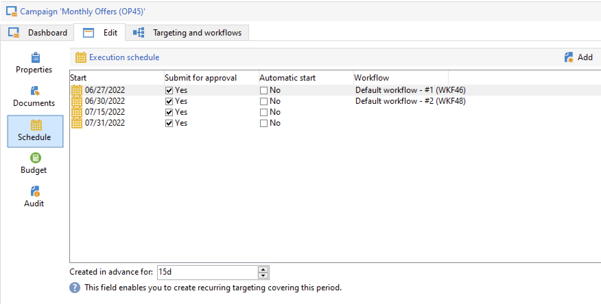

# 반복 및 정기 캠페인 {#recurring-and-periodic-campaigns}

A **반복 캠페인** 은 연관된 일정에 따라 워크플로우를 실행하도록 구성된 특정 템플릿을 기반으로 하는 캠페인입니다. 타깃팅은 각 실행 시 복제되며 다양한 프로세스 및 타겟 모집단을 추적합니다.  구성이 완료되면 반복 캠페인이 자동으로 새 워크플로우를 만들고(워크플로우 템플릿을 복제하여) 실행합니다. 예를 들어 대상 세그먼트에 월별 미리 알림을 보내야 하는 경우 매년 초에 12개의 워크플로우를 만들어 매월 하나씩 만들도록 반복 캠페인을 구성합니다. [자세히 알아보기](#create-a-recurring-campaign)

A **주기적인 캠페인** 은 실행 일정을 기반으로 캠페인 인스턴스를 만들 수 있는 특정 템플릿을 기반으로 하는 캠페인입니다. 캠페인 인스턴스는 템플릿 예약에 정의된 빈도에 따라 주기적 캠페인 템플릿을 기반으로 자동으로 만들어집니다. [자세히 알아보기](#create-a-periodic-campaign)

## 반복 캠페인 만들기 {#create-a-recurring-campaign}

반복 캠페인은 실행할 워크플로우 템플릿 및 실행 일정을 정의하는 특정 템플릿에서 만들어집니다.

### 반복 캠페인용 템플릿 만들기 {#create-the-campaign-template}

반복 캠페인에 대한 템플릿을 만들려면 아래 단계를 수행하십시오.

1. Campaign 탐색기를 열고 다음 위치로 이동합니다. **[!UICONTROL Resources > Templates > Campaign templates]**.
1. 기본 제공 복제 **[!UICONTROL Recurring campaign]** 템플릿.
   
1. 템플릿의 이름과 캠페인 기간을 입력합니다.
1. 이 유형의 캠페인의 경우, **[!UICONTROL Schedule]** 템플릿 실행 일정을 만들기 위해 탭이 추가되었습니다. 이 탭을 사용하여 이 템플릿을 기반으로 캠페인의 실행 날짜를 정의합니다.
   

   실행 스케줄의 구성 모드는 **[!UICONTROL Scheduler]** Workflow의 객체입니다. [자세히 알아보기](../workflow/scheduler.md)

   >[!CAUTION]
   >
   >실행 일정 구성을 신중하게 수행해야 합니다. 반복 캠페인은 지정된 스케줄에 따라 템플릿의 워크플로우를 복제합니다. 이 작업은 데이터베이스를 오버로드할 수 있습니다.

1. 에서 값을 지정합니다. **[!UICONTROL Create in advance for]** 지정된 기간 동안 해당 워크플로우를 만들기 위한 필드입니다.
1. 에서 **[!UICONTROL Targeting and workflows]** 탭에서 이 템플릿을 기반으로 캠페인에 사용할 워크플로우 템플릿을 디자인합니다. 이 워크플로우에는 타겟팅 매개 변수와 하나 이상의 게재가 타이포그래프로 포함되어 있습니다.

   >[!NOTE]
   >
   >이 워크플로우는 반복 워크플로우 템플릿으로 저장해야 합니다. 이렇게 하려면 워크플로우 속성을 편집하고 **[!UICONTROL Recurring workflow template]** 옵션 **[!UICONTROL Execution]** 탭.

   

### 반복 캠페인 만들기 {#create-the-recurring-campaign}

템플릿에 정의된 일정에 따라 반복 캠페인을 만들고 워크플로우를 실행하려면 다음을 수행해야 합니다.

1. 되풀이하는 캠페인 템플릿을 기반으로 새 캠페인을 만듭니다.
1. 워크플로우 실행 일정을 입력합니다. **[!UICONTROL Schedule]** 탭. 캠페인 일정을 사용하면 각 라인에 대해 자동 워크플로우 생성 또는 실행 시작 날짜를 입력할 수 있습니다.

   각 행에 대해 다음 추가 옵션을 추가할 수 있습니다.

   * 를 활성화합니다 **[!UICONTROL To be approved]** 워크플로우에서 게재 승인 요청을 강제 적용하는 옵션.
   * 를 활성화합니다 **[!UICONTROL To be started]** 시작 날짜에 도달했을 때 워크플로우를 시작하는 옵션.

   다음 **[!UICONTROL Create in advance for]** 필드를 사용하면 입력한 기간을 포함하는 모든 워크플로우를 만들 수 있습니다.

   실행 시 **[!UICONTROL Jobs on campaigns]** 워크플로우에서 전용 워크플로우는 캠페인 예약에 정의된 발생 횟수를 기반으로 만들어집니다. 따라서 각 실행 날짜에 대한 워크플로우가 만들어집니다.

1. 되풀이하는 워크플로우는 캠페인에 있는 워크플로우 템플릿에서 자동으로 만들어집니다. 이 변수는 **[!UICONTROL Targeting and workflows]** 캠페인 탭을 클릭합니다.

   

   반복 워크플로우 인스턴스의 레이블은 해당 템플릿 레이블과 워크플로우 번호로 구성되며, 그 사이에 # 문자가 있습니다.

   예약에서 만든 워크플로우는 **[!UICONTROL Workflow]** 열 **[!UICONTROL Schedule]** 탭.

   

   각 워크플로우는 이 탭에서 편집할 수 있습니다.

   >[!NOTE]
   >
   >워크플로우의 변수에서 워크플로우와 연관된 스케줄 라인의 시작 날짜를 사용할 수 있습니다.\
   >`$date(instance/vars/@startPlanningDate)`

## 주기적인 캠페인 만들기 {#create-a-periodic-campaign}

주기적 캠페인은 실행 일정을 기반으로 캠페인 인스턴스를 만들 수 있는 특정 템플릿을 기반으로 하는 캠페인입니다. 캠페인 인스턴스는 템플릿 예약에 정의된 빈도에 따라 주기적 캠페인 템플릿을 기반으로 자동으로 만들어집니다.

### 캠페인 템플릿 만들기 {#create-the-campaign-template-1}

1. Campaign 탐색기를 열고 다음 위치로 이동합니다. **[!UICONTROL Resources > Templates > Campaign templates]**.
1. 기본 제공 복제 **[!UICONTROL Periodic campaign]** 템플릿.
1. 템플릿의 속성을 입력합니다.

   >[!NOTE]
   >
   >템플릿이 할당된 운영자에게는 선택한 프로그램에서 캠페인을 만들 수 있는 적절한 권한이 있어야 합니다.

1. 이 템플릿과 연결된 워크플로우를 만듭니다. 이 워크플로우는 템플릿에서 만든 모든 주기적 캠페인에 복제됩니다.

   >[!NOTE]
   >
   >이 워크플로우는 워크플로우 템플릿입니다. 캠페인 템플릿에서 실행할 수 없습니다.

1. 반복 캠페인 템플릿에 대해 실행 일정을 완료합니다. 를 클릭합니다. **[!UICONTROL Add]** 버튼을 클릭하고 시작 및 종료 날짜를 정의하거나 링크를 통해 실행 일정을 입력합니다.

   >[!CAUTION]
   >
   >주기적인 캠페인 템플릿은 위에 정의된 일정에 따라 새 캠페인을 만듭니다. 따라서 Adobe Campaign 데이터베이스가 오버로드되지 않도록 주의해서 완료해야 합니다.

1. 실행 시작 날짜에 도달하면 일치하는 캠페인이 자동으로 생성됩니다. 템플릿의 모든 특성을 사용합니다.

   템플릿 일정을 통해 각 캠페인을 편집할 수 있습니다.

   각 주기적 캠페인에는 동일한 요소가 포함됩니다. 만들어진 후에는 표준 캠페인으로 관리됩니다.
