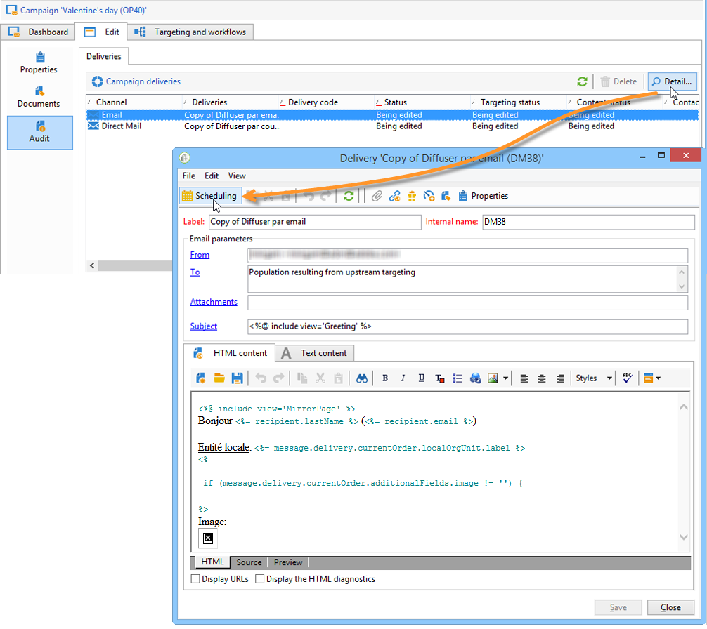
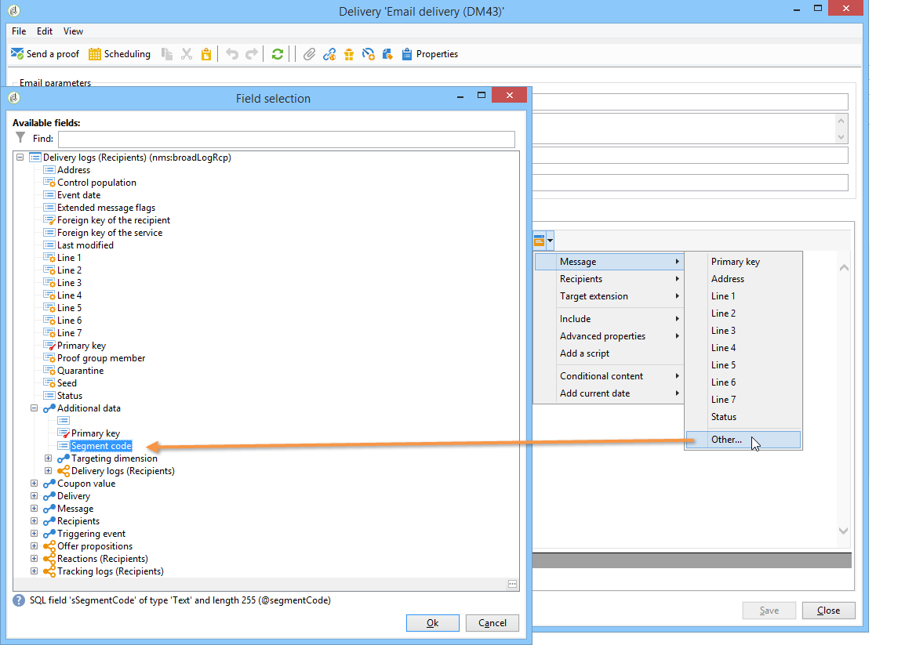
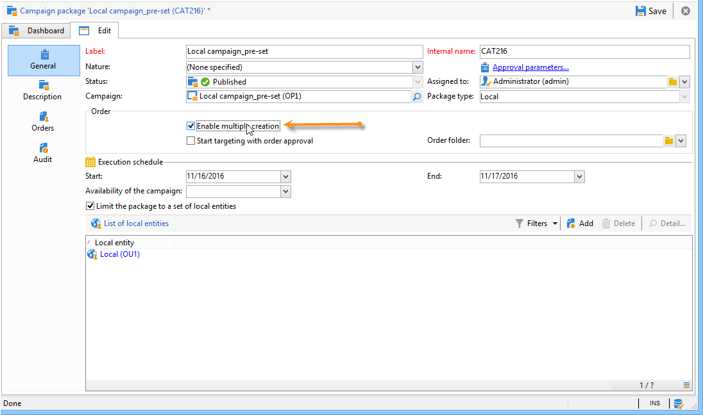

# 로컬 캠페인 만들기{#creating-a-local-campaign}

로컬 캠페인은 목록에서 참조된 템플릿으로 만든 인스턴스입니다. **[!UICONTROL campaign packages]** 포함 **특정 실행 일정**. 중앙 엔티티에 의해 설정 및 구성된 캠페인 템플릿을 사용하여 로컬 통신 요구 사항을 충족하는 것이 목표입니다. 로컬 작업을 구현하는 주요 단계는 다음과 같습니다.

**중앙 엔티티의 경우**

1. 로컬 캠페인 템플릿 만들기.
1. 템플릿에서 캠페인 패키지 만들기
1. 캠페인 패키지 게시.
1. 주문 승인.

**로컬 엔티티의 경우**

1. 캠페인 주문.
1. 캠페인 실행.

## 로컬 캠페인 템플릿 만들기 {#creating-a-local-campaign-template}

캠페인 패키지를 만들려면 먼저 **캠페인 템플릿** 를 통해 **[!UICONTROL Resources > Templates]** 노드.

새 로컬 템플릿을 만들려면 기본값을 복제합니다 **[!UICONTROL Local campaign (opLocal)]** 템플릿.

캠페인 템플릿 이름을 지정하고 사용 가능한 필드를 작성합니다.

캠페인 창에서 **[!UICONTROL Edit]** 탭을 클릭한 다음 **[!UICONTROL Advanced campaign parameters...]** 링크를 클릭합니다.

### 웹 인터페이스 {#web-interface}

다음에서 **분산 마케팅** 탭에서 웹 인터페이스 유형을 선택하고 로컬 엔티티가 주문을 할 때 입력할 기본값과 매개변수를 지정할 수 있습니다.

웹 인터페이스는 캠페인 주문 시 로컬 엔티티가 채울 양식에 해당합니다.

템플릿에서 만든 캠페인에 적용할 웹 인터페이스 유형을 선택합니다.

다음 네 가지 유형의 웹 인터페이스를 사용할 수 있습니다.

* **[!UICONTROL By brief]** : 로컬 엔티티는 캠페인 구성을 설명하는 설명을 제공해야 합니다. 주문이 승인되면 중앙 엔티티는 캠페인 전체를 구성하고 실행합니다.

  

* **[!UICONTROL By form]** : 로컬 엔티티는 사용된 템플릿에 따라, 콘텐츠, 타겟, 최대 크기, 개인화 필드를 사용한 생성 및 추출 날짜를 편집할 수 있는 웹 양식에 액세스할 수 있습니다. 로컬 엔티티는 이 웹 양식에서 타겟을 평가하고 콘텐츠를 미리 볼 수 있습니다.

  

  제공된 양식은 의 드롭다운 목록에서 선택해야 하는 웹 애플리케이션에 지정됩니다. **[!UICONTROL web Interface]** 템플릿의 필드 **[!UICONTROL Advanced campaign parameters...]** 링크를 클릭합니다. 을(를) 참조하십시오 [로컬 캠페인 만들기(양식별)](examples.md#creating-a-local-campaign--by-form-).

  >[!NOTE]
  >
  >이 예제에 사용된 웹 응용 프로그램이 예입니다. 양식을 사용하려면 특정 웹 앱을 만들어야 합니다.

  

* **[!UICONTROL By external form]** : 로컬 엔티티는 엑스트라넷의 캠페인 매개 변수에 액세스할 수 있습니다(Adobe Campaign 아님). 이러한 매개변수는 의 매개변수와 동일합니다. **로컬 캠페인(양식 기준)**.
* **[!UICONTROL Pre-set]** : 로컬 엔티티는 현지화하지 않고 기본 양식을 사용하여 캠페인을 주문합니다.

  

### 기본값 {#default-values}

다음 항목 선택 **[!UICONTROL Default values]** 로컬 엔티티에 의해 완료됩니다. 예제:

* 연락 및 추출 일자,
* 대상 특성(연령 세그먼트 등).

다음을 완료합니다. **[!UICONTROL Parent marketing program]** 및 **[!UICONTROL Charge]** 필드.

### 승인 {#approvals}

다음에서 **[!UICONTROL Advanced parameters for campaign entry]** 최대 검토자 수를 지정할 수 있습니다.

검토자는 캠페인 주문 시 로컬 엔티티에 의해 입력됩니다.

캠페인에 대한 검토자의 이름을 지정하지 않으려면 0을 입력합니다.

### 문서 {#documents}

로컬 엔티티 운영자가 문서(텍스트 파일, 스프레드시트, 이미지, 캠페인 설명 등)를 연결할 수 있도록 할 수 있습니다. 주문을 생성할 때 로컬 캠페인에 사용됩니다. 다음 **[!UICONTROL Advanced parameters for campaign entry...]** 링크를 사용하여 문서 수를 제한할 수 있습니다. 이렇게 하려면 다음에서 허용되는 최대 수를 입력합니다. **[!UICONTROL Number of documents]** 필드.

캠페인 패키지를 주문할 때 양식에서 템플릿의 해당 필드에 표시된 만큼의 문서를 연결할 것을 제안합니다.

문서 업로드 필드를 표시하지 않으려면 을(를) 입력합니다 **[!UICONTROL 0]** 다음에서 **[!UICONTROL Number of documents]** 필드.

>[!NOTE]
>
>다음 **[!UICONTROL Advanced parameters for campaign entry]** 을(를) 확인함으로써 비활성화할 수 있음 **[!UICONTROL Do not display the page used to enter the campaign parameters]**.

### 워크플로우 {#workflow}

다음에서 **[!UICONTROL Targeting and workflows]** 탭에서 다음을 수집하는 캠페인 워크플로우를 만듭니다. **[!UICONTROL Default values]** 다음에 지정됨: **[!UICONTROL Advanced campaign parameters...]** 게재를 생성합니다.

를 두 번 클릭합니다. **[!UICONTROL Query]** 지정된 대로 구성하는 활동 **[!UICONTROL Default values]**.

### 게재 {#delivery}

다음에서 **[!UICONTROL Audit]** 탭을 클릭하고 **[!UICONTROL Detail...]** 보기 아이콘 **[!UICONTROL Scheduling]** 선택한 게재에 대해.

다음 **[!UICONTROL Scheduling]** 아이콘을 사용하면 게재의 연락처 및 실행 날짜를 구성할 수 있습니다.

필요한 경우 게재의 최대 크기를 구성합니다.

게재 HTML을 찾습니다. 예를 들어, **[!UICONTROL Delivery > Current order > Additional fields]**, 사용 **[!UICONTROL Age segment]** 대상 나이에 따라 게재를 찾을 필드입니다.

캠페인 템플릿을 저장합니다. 이제 다음에서 사용할 수 있습니다. **[!UICONTROL Campaign packages]** 다음에서 보기 **[!UICONTROL Campaigns]** 탭을 클릭하고 **[!UICONTROL Create]** 단추를 클릭합니다.

>[!NOTE]
>
>캠페인 템플릿 및 일반 구성에 대해서는 다음에서 자세히 설명합니다. [이 페이지](../campaigns/marketing-campaign-templates.md).

## 캠페인 패키지 만들기 {#creating-the-campaign-package}

캠페인 템플릿을 로컬 엔티티에서 사용할 수 있으려면 목록에 추가해야 합니다. 이를 위해서는 중앙 기관이 새로운 패키지를 만들 필요가 있다.

다음 단계를 적용합니다.

1. 다음에서 **[!UICONTROL Navigation]** 다음에 대한 섹션 **캠페인** 페이지를 클릭하고 **[!UICONTROL Campaign packages]** 링크를 클릭합니다.
1. **[!UICONTROL Create]** 버튼을 클릭합니다.

   

1. 창 위의 섹션에서 다음을 선택할 수 있습니다. [이전에](#creating-a-local-campaign-template) 지정된 캠페인 패키지 템플릿입니다.

   기본적으로 **[!UICONTROL New local campaign package (localEmpty)]** 템플릿은 로컬 캠페인에 사용됩니다.

1. 캠페인 패키지의 레이블, 폴더 및 실행 일정을 지정합니다.

### 날짜 {#dates}

시작 및 종료 날짜는 캠페인 패키지 목록에서 캠페인의 가시성 기간을 정의합니다.

가용 일자는 로컬 엔티티(주문)가 캠페인을 사용할 수 있는 일자입니다.

>[!CAUTION]
>
>마감일 이전에 지역 엔티티가 캠페인을 예약하지 않으면 사용할 수 없습니다.

이 정보는 아래와 같이 로컬 에이전시로 전송되는 알림 메시지에서 찾을 수 있습니다.

### 대상자 {#audience}

로컬 캠페인의 경우 중앙 엔터티는 다음을 확인하여 관련 로컬 엔터티를 지정할 수 있습니다. **[!UICONTROL Limit the package to a set of local entities]**.

### 추가 설정 {#additional-settings}

패키지가 저장되면 중앙 엔티티는에서 편집할 수 있습니다 **[!UICONTROL Edit]** 탭.

다음에서 **[!UICONTROL General]** 탭에서는 중앙 엔티티가 다음과 같은 작업을 수행할 수 있습니다.

* 에서 campaign 패키지 검토자 구성 **[!UICONTROL Approval parameters...]** 링크,
* 실행 일정 검토,
* 로컬 엔티티를 추가하거나 삭제합니다.

>[!NOTE]
>
>기본적으로 각 엔티티는 **로컬 캠페인** 한 번만.
>   
>다음 확인: **[!UICONTROL Enable multiple creation]** 캠페인 패키지에서 여러 로컬 캠페인을 만들 수 있는 옵션입니다.

### 알림 {#notifications}

캠페인을 사용할 수 있거나 등록 기한에 도달하면 로컬 알림 그룹의 운영자에게 메시지가 전송됩니다. 자세한 내용은 다음을 참조하십시오. [조직 엔티티](about-distributed-marketing.md#organizational-entities).

## 캠페인 주문 {#ordering-a-campaign}

로컬 엔티티가 승인되고 구현 기간이 시작되면 Campaign 패키지에 액세스할 수 있습니다. 로컬 엔티티는 새 캠페인 패키지를 사용할 수 있음을 알리는 이메일을 받습니다(사용 가능한 날짜에 도달하자마자).

>[!NOTE]
>
>캠페인 패키지를 생성할 때 일부 로컬 엔티티를 지정한 경우 해당 엔티티만 알림을 받습니다. 로컬 엔티티를 지정하지 않은 경우 모든 로컬 엔티티에 알림이 전송됩니다.

중앙 엔티티가 제공하는 캠페인을 사용하려면 로컬 엔티티가 주문해야 합니다.

캠페인을 주문하려면 다음을 수행하십시오.

1. 클릭 **[!UICONTROL Order campaign]** 알림 메시지나 Adobe Campaign의 해당 단추에 있습니다.

   캠페인을 주문하려면 ID와 암호를 입력합니다. 인터페이스는 웹 애플리케이션에 정의된 페이지 세트로 구성됩니다.

1. 첫 페이지(주문 레이블 및 주석)에 필요한 정보를 입력하고 **[!UICONTROL Next]**.

   

1. 사용 가능한 매개 변수를 완료하고 주문을 승인합니다.

1. 이 주문을 승인하려면 로컬 엔티티가 속한 조직 엔티티의 관리자에게 알림이 전송됩니다.

   

1. 이 정보는 로컬 및 중앙 엔티티에 반환됩니다. 로컬 엔티티는 자체 주문만 볼 수 있지만, 중앙 엔티티는 아래와 같이 로컬 엔티티의 모든 주문을 볼 수 있습니다.

   

   연산자는 주문 세부 사항을 표시할 수 있습니다.

   

   다음 **[!UICONTROL Edit]** 탭에는 캠페인 주문 시 로컬 엔티티가 입력한 정보가 포함되어 있습니다.

   

1. 이 명령은 최종 확정되려면 중앙 기관의 승인을 받아야 한다.

   

   자세한 내용은 [승인 프로세스](#approval-process) 섹션.

1. 그런 다음 로컬 운영자에게 캠페인이 사용 가능하다는 알림이 표시됩니다. 캠페인 가용성은 캠페인 패키지 목록에서 찾을 수 있습니다. **캠페인** 탭. 그런 다음 캠페인을 사용할 수 있습니다. 자세한 내용은 다음을 참조하십시오. [캠페인 액세스](accessing-campaigns.md).

   다음 **[!UICONTROL Start targeting with order approval]** 옵션을 사용하면 주문이 승인되는 즉시 로컬 엔티티가 캠페인을 실행할 수 있습니다.

   

## 주문 승인 {#approving-an-order}

캠페인 주문을 확인하려면 중앙 엔티티가 승인해야 합니다.

다음 **[!UICONTROL Campaign orders]** 개요, 를 통해 액세스 **캠페인** 탭에서는 캠페인 주문 상태를 보고 승인할 수 있습니다.

>[!NOTE]
>
>로컬 엔티티는 승인될 때까지 순서를 변경할 수 있습니다.

### 승인 프로세스 {#approval-process}

#### 이메일 알림 {#email-notification}

캠페인이 로컬 엔티티에 의해 주문되면 해당 검토자는 아래와 같이 이메일로 알림을 받습니다.

>[!NOTE]
>
>검토자 선택은에 표시됩니다. [검토자](#reviewers) 섹션. 그들은 그 명령을 받아들이거나 거부할 수 있다.

#### 클라이언트 콘솔을 통해 승인 {#approving-via-the-adobe-campaign-console}

캠페인 주문 개요에서 클라이언트 콘솔을 통해 주문을 승인할 수도 있습니다. 주문을 승인하려면 주문을 선택하고 **[!UICONTROL Approve the order]**.

>[!NOTE]
>
>캠페인 가용 날짜까지 캠페인을 계속 편집 및 재구성할 수 있습니다. 로컬 엔티티가 캠페인을 거부할 수도 있습니다. **[!UICONTROL Cancel]** 단추를 클릭합니다.

#### 캠페인 만들기 {#creating-a-campaign}

캠페인 주문이 승인되면 로컬 엔티티에 의해 구성되고 실행될 수 있습니다.

자세한 내용은 다음을 참조하십시오. [캠페인 액세스](accessing-campaigns.md).

### 승인 거부 {#rejecting-an-approval}

승인을 담당하는 운영자는 주문이나 캠페인 패키지를 거부할 수 있습니다.

검토자가 주문을 거부하면 관련 알림이 관련 로컬 엔티티에 자동으로 전송됩니다. 여기에는 승인을 거부한 운영자가 입력한 댓글이 표시됩니다.

정보는 캠페인 패키지 목록 페이지 또는 캠페인 주문 페이지에 표시됩니다. Adobe Campaign 클라이언트 콘솔에 액세스할 수 있는 경우 로컬 엔티티에 이 거부에 대한 알림이 표시됩니다.

캠페인 패키지의 관련 주석을 볼 수 있습니다. **[!UICONTROL Edit]** 탭.

### 검토자 {#reviewers}

승인이 필요할 때마다 검토자에게 이메일로 알림이 전송됩니다.

각 로컬 엔티티에 대해 캠페인 주문 승인 및 캠페인 승인을 위해 검토자가 선택됩니다. 로컬 검토자 선택에 대한 자세한 내용은 [조직 엔티티](about-distributed-marketing.md#organizational-entities).

>[!NOTE]
>
>이 선택이 가능하려면 주문 승인이 아직 효과적이지 않아야 합니다.

### 주문 취소 {#canceling-an-order}

중앙 에이전시는 다음을 사용하여 주문을 취소할 수 있습니다. **[!UICONTROL Delete]** 주문 대시보드에 있는 단추입니다.

의 캠페인이 취소됩니다. **[!UICONTROL Campaign orders]** 보기.
