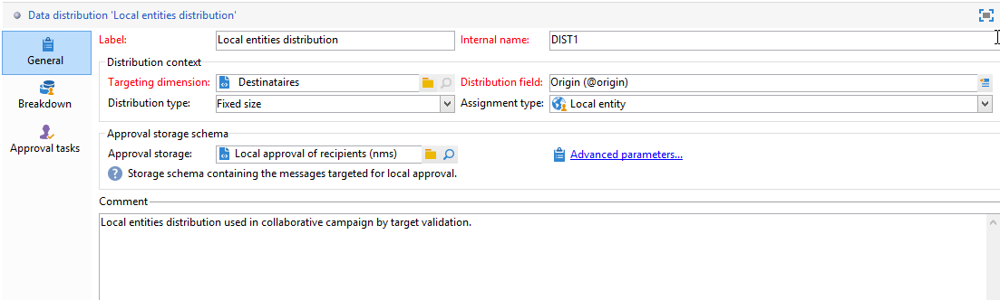

# 분산 마케팅 샘플{#distributed-marketing-samples}


## 로컬 캠페인 만들기(양식 기준) {#creating-a-local-campaign--by-form-}

다음 **양식 기준** 유형 웹 인터페이스 사용 **웹 애플리케이션**. 구성에 따라 이 웹 애플리케이션에는 정의된 개인화된 요소의 유형이 포함될 수 있습니다. 예를 들어 대상, 예산, 콘텐츠 등을 평가하는 링크를 제안할 수 있습니다. 전용 API를 통해

>[!NOTE]
>
>API는 전용 문서에 자세히 설명되어 있습니다. .
>
>이 예제에 사용되는 웹 애플리케이션은 Adobe Campaign을 통해 기본적으로 제공되는 웹 앱이 아닙니다. 캠페인에서 양식을 사용하려면 전용 웹 애플리케이션을 만들어야 합니다.

캠페인 템플릿을 만들 때 **[!UICONTROL Zoom]** 아이콘 내 **[!UICONTROL Web interface]** 옵션 **[!UICONTROL Advanced campaign parameters...]** 링크를 눌러 웹 응용 프로그램의 세부 정보에 액세스합니다.


>[!NOTE]
>
>웹 애플리케이션 매개 변수는 캠페인 템플릿에서만 사용할 수 있습니다.

에서 **[!UICONTROL Edit]** 탭에서 을 선택합니다 **캠페인 순서** 활동을 열고 콘텐츠를 액세스합니다.


이 예에서 **캠페인 순서** 활동 포함 항목:

* 주문 중에 로컬 엔티티가 입력할 필드

   

* 로컬 엔티티가 캠페인을 평가할 수 있도록 해주는 링크(예: 대상, 예산, 콘텐츠 등),

   

* 이러한 평가의 결과를 계산하고 표시할 수 있는 스크립트입니다.

   

이 예에서는 다음 API가 사용됩니다.

* 타겟 평가를 위해

   ```
   var res = nms.localOrder.EvaluateTarget(ctx.localOrder);
   ```

* 예산 평가를 위해

   ```
   var res = nms.localOrder.EvaluateDeliveryBudget(ctx.@deliveryId, NL.XTK.parseNumber(ctx.@compt));
   ```

* 컨텐츠 평가를 위해

   ```
   var res = nms.localOrder.EvaluateContent(ctx.localOrder, ctx.@deliveryId, "html", resSeed.@id);
   ```

## 공동 작업 캠페인 만들기(대상 승인별) {#creating-a-collaborative-campaign--by-target-approval-}

### 소개 {#introduction}

당신은 미국 전역에 온라인 매장과 여러 부티크가 있는 대형 의류 브랜드의 마케팅 매니저입니다. 봄이 온 지금, 당신은 최고의 고객에게 당신의 카탈로그의 모든 드레스를 50퍼센트 할인해주는 특별 제안을 만들기로 결심한다.

이 오퍼는 연초 이후 300달러 이상을 소비한 미국 상점 최고의 고객을 대상으로 합니다.

따라서 특별 오퍼가 포함된 이메일 배달을 받을 스토어의 우수 고객(지역별 그룹화된)을 선택할 수 있는 협업 캠페인(타겟 승인별)을 만들기 위해 분산 마케팅을 사용하도록 결정합니다.

이 예제의 첫 번째 부분에서는 캠페인 만들기 알림을 받는 로컬 엔티티와 캠페인 만들기 알림을 사용하여 캠페인을 평가하고 순서를 지정하는 방법을 보여줍니다.

이 예제의 두 번째 부분에서는 캠페인을 만드는 방법을 설명합니다.

단계는 다음과 같습니다.

**로컬 엔티티에 대해**

1. 캠페인 만들기 알림을 사용하여 중앙 엔티티가 선택한 연락처 목록에 액세스합니다.
1. 연락처를 선택하고 기여도를 승인합니다.

**중앙 엔티티의 경우:**

1. 만들기 **[!UICONTROL Data distribution]** 활동.
1. 공동 작업 캠페인을 만듭니다.
1. 캠페인을 게시합니다.

### 로컬 엔티티 사이드 {#local-entity-side}

1. 캠페인에 참여하도록 선택한 로컬 엔티티는 이메일 알림을 받게 됩니다.

   

1. 을 클릭하여 **[!UICONTROL Access your contact list and approve targeting]** 링크를 클릭하면 로컬 엔티티에 웹 브라우저를 통해 캠페인에 대해 선택한 클라이언트 목록에 액세스할 수 있습니다.

   

1. 해당 지역 엔티티는 연초부터 이미 유사한 오퍼에 접촉하여 목록에서 특정 연락처를 확인 해제합니다.

   

확인이 승인되면 캠페인이 자동으로 시작될 수 있습니다.

### 중앙 엔티티 쪽 {#central-entity-side}

#### 데이터 배포 활동 만들기 {#creating-a-data-distribution-activity}

1. 공동 작업 캠페인을 설정하려면(대상 승인을 통해) 먼저 **[!UICONTROL Data distribution activity]**. 을(를) 클릭합니다. **[!UICONTROL New]** 아이콘( **[!UICONTROL Resources > Campaign management > Data distribution]** 노드 아래에 있어야 합니다.

   

1. 에서 **[!UICONTROL General]** 탭에서 다음을 지정해야 합니다.

   * a **[!UICONTROL Targeting dimension]**. 여기에서 **데이터 배포** 다음 작업을 수행합니다. **수신자**.
   * a **[!UICONTROL Distribution type]**. 을(를) 선택할 수 있습니다 **고정 크기** 또는 **백분율 크기**.
   * a **[!UICONTROL Assignment type]**. 을(를) 선택합니다 **로컬 엔티티** 선택 사항입니다.
   * a **[!UICONTROL Distribution type]**. 여기, 이게 바로 **[!UICONTROL Origin (@origin)]** 연락처와 로컬 엔티티 간의 관계를 식별할 수 있는 수신자 테이블에 있는 필드
   * 다음 **[!UICONTROL Approval storage]** 필드. 을(를) 선택합니다 **수신자의 로컬 승인** 선택 사항입니다.

1. 에서 **[!UICONTROL Breakdown]** 탭에서 다음을 지정합니다.

   * a **[!UICONTROL Distribution field value]**: 향후 캠페인에 포함된 로컬 엔티티에 해당합니다.
   * 로컬 엔터티 **[!UICONTROL label]**.
   * a **[!UICONTROL Size]** (고정 또는 백분율) 다음 **기본값** 에는 로컬 엔티티에 연결된 모든 수신자를 선택하는 작업이 포함됩니다.

   

1. 새 데이터 배포를 저장합니다.

#### 공동 캠페인 만들기 {#creating-a-collaborative-campaign}

1. 에서 **[!UICONTROL Campaign management > Campaign]** 노드, 새 만들기 **[!UICONTROL collaborative campaign (by target approval)]**.
1. 에서 **[!UICONTROL Targeting and workflows]** 탭에서 캠페인에 대한 워크플로우를 만듭니다. 여기에는 다음이 포함되어야 합니다 **분할** 활동 **[!UICONTROL Record count limitation]** 는 **[!UICONTROL Data distribution]** 활동.

   

1. 추가 **[!UICONTROL Local approval]** 작업을 지정할 수 있습니다.

   * 알림에서 로컬 엔티티로 전송할 메시지 콘텐츠,
   * 승인 알림
   * 캠페인의 예상 처리.

   

1. 레코드를 저장합니다.

#### 캠페인 게시 {#publishing-the-campaign}

이제 다음을 추가할 수 있습니다 **캠페인 패키지** 에서 **[!UICONTROL Campaigns]** 탭.

1. 선택 **[!UICONTROL Reference campaign]**. 에서 **[!UICONTROL Edit]** 패키지의 탭에서 **[!UICONTROL Approval mode]** 캠페인에 를 사용하려면:

   * in **수동** 모드에서는 로컬 엔티티가 중앙 엔티티의 초대를 수락하면 캠페인에 참여합니다. 사전 선택된 연락처가 캠페인의 참여를 확인하기 위해 필요한 경우 삭제하고 관리자의 승인이 필요한 경우 삭제할 수 있습니다.
   * in **자동** 모드에서는 로컬 엔티티가 캠페인에 참여해야 합니다. 이때 로컬 엔티티가 캠페인에 참여하는 동안 자체 등록을 취소하지 않습니다. 승인이 필요 없이 연락처를 삭제할 수 있습니다.

   

1. 에서 **[!UICONTROL Description]** 탭에서 캠페인에 대한 설명과 로컬 엔티티로 전송할 문서를 추가할 수 있습니다.

   

1. 캠페인 패키지를 승인한 다음 워크플로우를 시작하여 패키지를 게시하고 패키지 목록의 모든 로컬 엔티티가 사용할 수 있도록 합니다.

   

## 공동 작업 캠페인 만들기(양식 기준) {#creating-a-collaborative-campaign--by-form-}

### 소개 {#introduction-1}

여러분은 미국 전역에 온라인 가게와 몇 개의 부티크가 있는 큰 화장 브랜드의 마케팅 매니저입니다. 겨울 스톡을 언로드하고 새 주식을 위한 공간을 만들려면 두 가지 클라이언트 카테고리를 대상으로 하는 특별 오퍼를 생성하기로 합니다. 나이 들어갈 수록 민감한 피부관리 제품과 30대 미만은 기본이다.

따라서 나이 범위별로 서로 다른 저장소에서 클라이언트를 선택할 수 있는 공동 작업 캠페인(양식 기준)을 만들기 위해 분산 마케팅을 사용하도록 결정합니다. 이러한 고객은 연령 범위에 따라 개인화된 특별 오퍼와 함께 이메일 배달을 받게 됩니다.

이 예제의 첫 번째 부분에서는 캠페인 만들기 알림을 받는 로컬 엔티티와 캠페인 만들기 알림을 사용하여 캠페인을 평가하고 순서를 지정하는 방법을 보여줍니다.

이 예제의 두 번째 부분에서는 캠페인을 만드는 방법을 설명합니다.

단계는 다음과 같습니다.

**로컬 엔티티에 대해**

1. 캠페인 만들기 알림을 사용하여 온라인 양식에 액세스합니다.
1. 캠페인(target, 콘텐츠, 게재 볼륨)을 개인화합니다.
1. 이러한 필드를 확인하고 필요한 경우 변경합니다.
1. 기여도를 승인합니다.
1. 로컬 엔티티(또는 중앙 엔티티)의 관리자가 구성 및 기여도를 승인합니다.

**중앙 엔티티의 경우:**

1. 공동 작업 캠페인을 만듭니다.
1. 구성 **[!UICONTROL Advanced campaign parameters...]** 지역 캠페인에서와 마찬가지로
1. 로컬 캠페인에 대해 하듯이 캠페인 워크플로우와 게재를 구성합니다.
1. 웹 양식을 업데이트합니다.
1. 캠페인 패키지를 만들고 게시합니다.

### 로컬 엔티티 사이드 {#local-entity-side-1}

1. 캠페인에 참여하도록 선택한 로컬 엔티티는 캠페인에 참여했음을 알리는 이메일 알림을 받습니다.

   

1. 로컬 엔티티는 개인화된 양식을 완료한 다음 다음과 같습니다.

   * 목표물과 예산을 평가하고
   * 게재 콘텐츠 미리 보기,
   * 기여도를 승인합니다.

      

1. 주문 유효성 검사를 담당하는 연산자가 참가 승인을 합니다.

   

### 중앙 엔티티 쪽 {#central-entity-side-1}

1. 공동 작업 캠페인을 구현하려면(양식 기준) **공동 작업 캠페인(양식 기준)** 템플릿.

   

1. 캠페인의 **[!UICONTROL Edit]** 탭에서 **[!UICONTROL Advanced campaign parameters...]** 링크를 클릭하여 로컬 캠페인으로 구성합니다. 을(를) 참조하십시오. [로컬 캠페인 만들기(양식 기준)](#creating-a-local-campaign--by-form-).

   

1. 캠페인 워크플로우와 웹 양식을 구성합니다. 을(를) 참조하십시오. [로컬 캠페인 만들기(양식 기준)](#creating-a-local-campaign--by-form-).
1. 실행 일정 및 관련 로컬 엔티티를 지정하여 캠페인 패키지를 만듭니다.

   

1. 에서 승인 모드를 선택하여 패키지 구성을 완료합니다 **[!UICONTROL Edit]** 탭.

   

1. 에서 **[!UICONTROL Description]** 탭에서 캠페인 패키지 설명, 패키지를 게시할 때 로컬 엔티티에 보낼 알림 메시지를 입력하고 모든 유용한 문서를 캠페인 패키지에 첨부할 수 있습니다.

   

1. 패키지를 승인하여 게시합니다.

   
