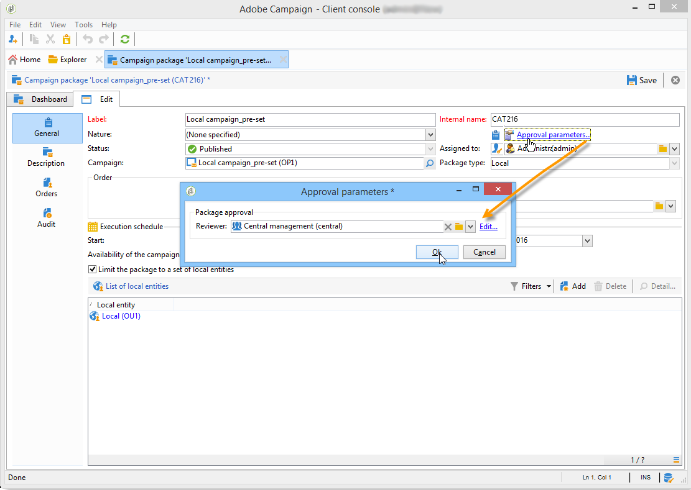

# 캠페인 패키지 게시{#publishing-the-campaign-package}

중앙 엔티티 운영자는 의 로컬 엔티티에 제공할 캠페인을 게시합니다 **[!UICONTROL list of campaign packages]**.

캠페인 패키지 목록에 게시하려면 먼저 중앙 엔티티가 캠페인 패키지를 승인해야 합니다. 이렇게 하려면 를 통해 검토자 또는 검토자 그룹을 지정할 수 있습니다 **[!UICONTROL Approval parameters]** 링크를 클릭합니다.

## 검토자 할당 {#assigning-a-reviewer}

검토자를 선택하려면 **[!UICONTROL Approval parameters]** campaign 패키지에서 링크를 설정하고 드롭다운 목록에서 관련 검토자를 선택합니다.

그런 다음 을 클릭하여 승인 프로세스를 시작할 수 있습니다 **[!UICONTROL Submit for approval]**.

그런 다음 알림 메시지를 검토자에게 보내어 이 캠페인 패키지의 가용성을 확인합니다. 메시지에 웹 액세스를 통해 승인을 수락하거나 거부할 링크가 포함되어 있습니다.

>[!NOTE]
>
>조직 엔터티 수준에서 검토자를 지정하여 주문을 승인할 수도 있습니다. 자세한 내용은 [조직 엔터티](about-distributed-marketing.md#organizational-entities).

## 다른 검토자 추가 {#adding-other-reviewers}

에서 다른 검토자를 추가할 수 있습니다 **[!UICONTROL Edit...]** 링크, 캠페인 패키지의 **[!UICONTROL Approval parameters...]** 탭.

## 승인 기간 {#approval-periods}

기본적으로 검토자는 제출 날짜로부터 3일 후에 승인을 처리합니다.

검토자 편집 창에서 캠페인 패키지가 승인되지 않은 경우 하나 이상의 메시지를 전송하도록 미리 알림을 설정할 수도 있습니다. 이렇게 하려면 **[!UICONTROL Add reminder]** 링크를 클릭한 다음 **[!UICONTROL Add]** 버튼을 클릭합니다.

미리 알림은 지정된 날짜 및/또는 **x** 제출 날짜 이후 일 수. 미리 알림 유형은 미리 알림 테이블의 첫 번째 열에 구성할 수 있습니다. 아래 예에서는 검토자는 29/01/2014일에 알림 메시지를 받게 됩니다(즉, 에서 선택한 날짜로부터 이틀 전) **[!UICONTROL Date]** 열과 두 번째 미리 알림은 승인 기간이 끝나기 하루 전에(예: 승인 날짜 제출 후 2일).

패키지가 정의되어 있고 패키지가 승인을 위해 제출되면 실행 스케줄이 **[!UICONTROL Audit]** 탭. 이전 구성에 따라 계산된 처리 마감일과 구성된 모든 미리 알림의 날짜를 표시합니다.

## Adobe Campaign 콘솔을 통한 승인 {#approving-via-the-adobe-campaign-console}

검토자가 지정되지 않았거나 알림 연산자가 패키지를 승인하지 않은 경우에는 **[!UICONTROL Approve the package]** 버튼을 사용하면 캠페인 패키지의 승인을 직접 진행할 수 있습니다 **[!UICONTROL Dashboard]** 또는 패키지 개요에서 확인하십시오.

승인 후 캠페인이 게시되어 목록에 추가되고, 가용성 날짜에 도달하면 로컬 엔티티가 캠페인을 사용할 수 있습니다. 캠페인을 만들 때 로컬 엔터티가 지정된 경우, 캠페인을 사용할 수 있음을 알리는 메시지가 알림 그룹의 운영자에게 전송됩니다. 미리 지정된 엔티티가 없는 경우 기본적으로 모든 로컬 엔티티가 캠페인을 사용할 수 있습니다. 자세한 내용은 [조직 엔터티](about-distributed-marketing.md#organizational-entities).
