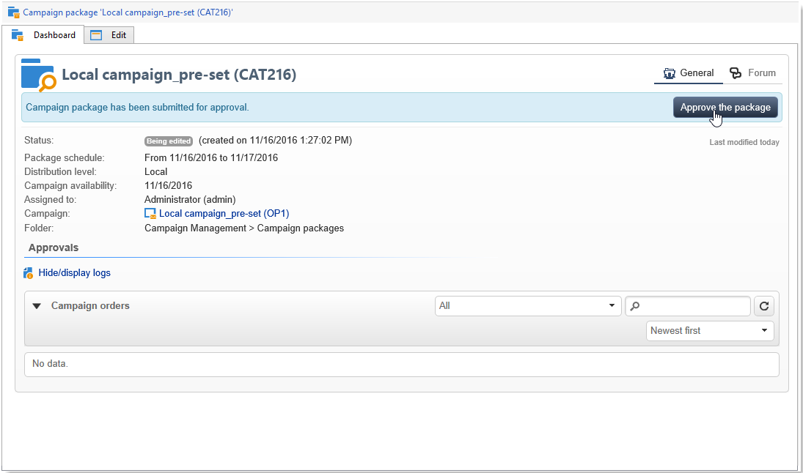

# 캠페인 패키지 게시{#publishing-the-campaign-package}

중앙 엔터티 운영자는 **[!UICONTROL list of campaign packages]**&#x200B;의 로컬 엔터티에 제공할 캠페인을 게시합니다.

캠페인 패키지 목록에 게시하려면 먼저 중앙 엔티티에서 캠페인 패키지를 승인해야 합니다. 이렇게 하려면 캠페인 패키지의 **[!UICONTROL Approval parameters]** 링크를 통해 검토자 또는 검토자 그룹을 지정할 수 있습니다.

## 검토자 할당 {#assigning-a-reviewer}

검토자를 선택하려면 캠페인 패키지에서 **[!UICONTROL Approval parameters]** 링크를 클릭하고 드롭다운 목록에서 관련 검토자를 선택하십시오.

**[!UICONTROL Submit for approval]**&#x200B;을(를) 클릭하여 승인 프로세스를 시작할 수 있습니다.

그런 다음 이 캠페인 패키지의 가용성을 확인하기 위해 검토자에게 알림 메시지가 전송됩니다. 메시지에는 웹 액세스를 통해 승인을 수락하거나 거부할 수 있는 링크가 포함되어 있습니다.

>[!NOTE]
>
>조직 엔티티 수준에서 주문을 승인할 검토자를 지정할 수도 있습니다. 자세한 내용은 [조직 엔터티](about-distributed-marketing.md#organizational-entities)를 참조하세요.

## 다른 검토자 추가 {#adding-other-reviewers}

캠페인 패키지의 **[!UICONTROL Approval parameters...]** 탭에 있는 **[!UICONTROL Edit...]** 링크에서 다른 검토자를 추가할 수 있습니다.

## 승인 타임라인 {#approval-periods}

기본적으로 검토자에게는 승인을 처리할 제출 날짜로부터 3일이 제공됩니다.

검토자 편집 창에서 캠페인 패키지가 승인되지 않은 경우 하나 이상의 메시지를 전송하도록 미리 알림을 설정할 수도 있습니다. 이렇게 하려면 **[!UICONTROL Add reminder]** 링크를 클릭한 다음 **[!UICONTROL Add]** 단추를 클릭합니다.

미리 알림은 지정된 날짜 및/또는 제출 날짜 후 **x**&#x200B;일에 보낼 수 있습니다. 미리 알림 유형은 미리 알림 테이블의 첫 번째 열에서 구성할 수 있습니다. 아래 예에서 검토자는 2023년 1월 11일에 미리 알림 메시지를 수신하게 됩니다. 즉, **[!UICONTROL Date]** 열에서 선택한 날짜의 2일 전, 승인 기간이 종료되기 1일 전, 즉 승인 날짜에 대한 제출 후 2일에 두 번째 미리 알림을 수신하게 됩니다.

패키지가 정의되고 승인을 위해 패키지가 제출되면 **[!UICONTROL Audit]** 탭에 실행 일정이 표시됩니다. 이전 구성을 기반으로 계산된 처리 기한과 구성된 모든 미리 알림의 날짜가 표시됩니다.

## 클라이언트 콘솔을 통해 승인 {#approving-via-the-adobe-campaign-console}

검토자가 지정되지 않았거나 통지된 운영자가 패키지를 승인하지 않은 경우 **[!UICONTROL Approve the package]** 버튼을 사용하면 캠페인 패키지 **[!UICONTROL Dashboard]** 또는 패키지 개요에서 바로 승인으로 진행할 수 있습니다.

승인 후 캠페인이 게시되고 목록에 추가되며, 사용 가능한 날짜에 도달하면 로컬 엔티티가 이를 사용할 수 있습니다. 캠페인을 생성할 때 로컬 엔티티가 지정된 경우 알림 그룹의 운영자에게 캠페인이 사용 가능함을 알리는 메시지가 전송됩니다. 미리 지정된 엔티티가 없는 경우 기본적으로 모든 로컬 엔티티가 이 캠페인을 사용할 수 있습니다. 자세한 내용은 [조직 엔터티](about-distributed-marketing.md#organizational-entities)를 참조하세요.
