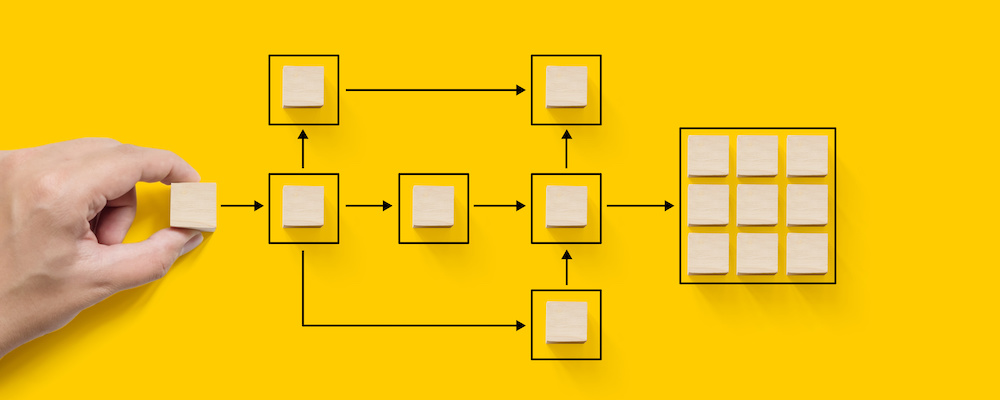

# Adobe Campaign 자동화 {#automation-home}

여러 마케팅 채널을 통해 고객과 소통하는 것이 본인이나 본인에게 도움이 될 수 있습니다. 다른 채널이 함께 작동하지 않을 때는 소음과 혼동이 있습니다. 동기화되면 두 고객이 결합하여 고객에게 브랜드와 강력하고 상호 보완적인 경험을 제공합니다.

Adobe Campaign을 사용하면 캠페인 오케스트레이션을 위한 편리한 단일 인터페이스를 통해 채널을 손쉽게 동기화할 수 있습니다. 이메일, 웹, 모바일, 소셜과 같은 온라인 채널은 DM, 콜 센터, 매장 등을 비롯한 오프라인 채널에 맞게 조정할 수 있습니다. 이를 통해 고객은 디지털 채널과 기존 채널 모두에서 일관되고 상황에 맞는 경험을 제공할 수 있습니다. 즉, Adobe Campaign을 사용하면 고객이 모든 채널에서 선택할 수 있는 모든 경로에 컨텐츠를 간편하게 전달할 수 있습니다.

아래 안내서를 방문하여 Adobe Campaign으로 자동화를 만드는 방법을 배웁니다.

>[!NOTE]
>
>일부 화면은 환경과 다를 수 있습니다.

<table>
<tr style="border: 0;">
  <td valign="top">
    

    <b>워크플로우</b>
    

     
    

    <a href="workflow/about-workflows.md">시작</a>
    

          
    

    <a href="workflow/build-a-workflow.md">첫 번째 워크플로우 만들기</a>
    

     
    

    <a href="workflow/workflow-use-cases.md">사용 사례</a>
    

     
  </td>
  <td valign="top">
    

    <b>Campaign 자동화</b>
    

     
    

    <a href="campaigns/set-up-campaigns.md">시작</a>
    

     
    

    <a href="campaigns/marketing-campaign-create.md">첫 번째 캠페인 만들기</a>
    

     
    

    <a href="campaigns/marketing-campaign-deliveries.md">캠페인에서 메시지 보내기</a>
    

     
  </td>
  <td valign="top">
    

    <b>추가 기능</b>
    

     
    

    <a href="distributed-marketing/about-distributed-marketing.md">분산 마케팅</a>
    

     
    

    <a href="campaign-opt/campaign-typologies.md">캠페인 최적화</a>
    

     
    

    <a href="mrm/about-marketing-resource-management.md">MRM(마케팅 리소스 관리)</a>
    

     
  </td>
</tr>
</table>
