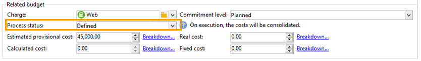
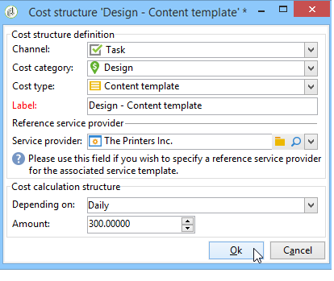
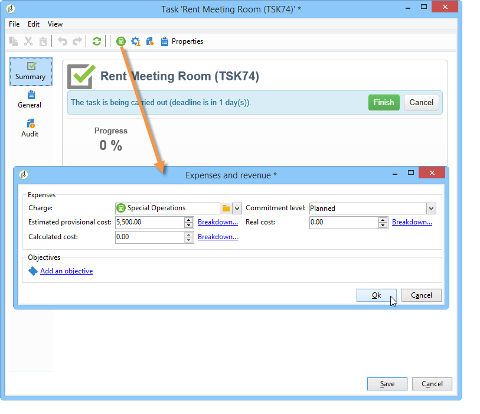

# 비용 제어{#controlling-costs}

Adobe Campaign을 사용하면 예약, 약정 및 인보이스 발행 마케팅 비용을 제어하고 마케팅 리소스 관리 모듈을 사용하여 카테고리별로 분류할 수 있습니다.

캠페인의 다양한 프로세스를 위해 약정된 비용은 마케팅 부서에서 미리 정의한 예산에 부과됩니다. 금액을 여러 카테고리로 분류하여 정보를 보다 쉽게 읽을 수 있고 마케팅 투자에 대한 보다 자세한 보고를 제공할 수 있습니다.

예산의 관리 및 추적은 Adobe Campaign 트리의 전용 노드에서 중앙 집중화됩니다. 이렇게 하면 모든 예산에 대해 동일한 보기에서 할당, 예약, 약정 및 지출 금액을 모니터링할 수 있습니다.

MRM을 사용하여 예산 관리를 구현하려면 다음 단계를 적용해야 합니다.

1. 예산을 정의합니다. [자세히 알아보기](#creating-a-budget).

1. 원가 계산 방법을 정의합니다. 원가 구조는 서비스 공급자에 대해 정의됩니다. [자세히 알아보기](../campaigns/providers-stocks-and-budgets.md).

1. 캠페인 비용(게재/작업) 정의: 게재 및 작업으로 발생한 비용은 캠페인 템플릿에 대해 개별적으로 또는 전체적으로 입력됩니다. [자세히 알아보기](../campaigns/marketing-campaign-deliveries.md#compute-costs-and-stocks).

1. 통합: 작업, 게재 및 캠페인의 진행 상태에 따라 비용이 계산되고 해당 예산에 전달됩니다. 캠페인 생성이 충분히 진행되면 캠페인 예산의 진행 상태를 **[!UICONTROL Specified]**(으)로 변경할 수 있습니다. 그런 다음 프로그램의 계산된 비용은 캠페인에서 계산된 비용과 함께 자동으로 입력됩니다. [자세히 알아보기](#cost-commitment--calculation-and-charging).

## 예산 만들기 {#creating-a-budget}

예산을 생성하려면 아래 단계를 수행합니다.

1. Campaign 탐색기의 **[!UICONTROL Campaign management > Budgets]** 폴더를 찾습니다.
1. **[!UICONTROL New]** 아이콘, 이름을 클릭하고 예산을 저장합니다.
1. 초기 금액을 입력합니다. 관련 필드에 할당된 금액을 나타냅니다. 다른 금액은 자동으로 입력됩니다. [자세히 알아보기](#calculating-amounts).
1. 시작 및 종료 일자를 입력하여 유효 기간을 정의합니다. 이 정보는 지시용입니다.
1. 캠페인, 작업 등에 대해 이 예산에 할당된 비용에 대한 경비 범주를 만듭니다. 연결할 수 있습니다. [자세히 알아보기](#expense-categories).

>[!NOTE]
>
>관련 예산을 선택할 수 있습니다. 이 작업에 대한 자세한 정보는 [이 섹션](#linking-a-budget-to-another)을 참조하십시오.
>

### 금액 계산 {#calculating-amounts}

각 예산은 다양한 캠페인, 게재 또는 관련 작업이 예약되거나 수행된 후 해당 비용과 관련된 초기 비용으로 정의됩니다. 금액(계획, 예약, 약정, 지출 또는 송장 발행)의 상태는 캠페인, 게재 또는 작업에 정의된 비용 유형과 약정 수준에 따라 다릅니다.

>[!NOTE]
>
>범주에 입력한 금액은 **[!UICONTROL Allocated]** 필드에 정의된 예산 봉투와 일치해야 합니다.

캠페인의 경우 약정 수준에 따라 미래 작업을 위해 비용을 계획, 약정 또는 예약할 수 있습니다.

>[!CAUTION]
>
>캠페인을 만들 때 실행 시 비용을 고려하려면 **[!UICONTROL Budget]**&#x200B;의 진행 상태를 **[!UICONTROL Defined]**(으)로 설정해야 합니다. 상태가 **[!UICONTROL Being edited]**&#x200B;이면 비용이 통합되지 않습니다.
>   
>옵션 **[!UICONTROL Commitment level]**&#x200B;은(는) 예산에 부과되기 전에 미래의 비용 예측을 나타냅니다. 캠페인, 작업 또는 게재 진행 상황에 따라 더 높거나 낮은 약정 수준(1)을 할당할 것을 결정할 수 있습니다. 계획됨, 2. 예약됨, 3. 커밋됨)을 사용했습니다.

예를 들어 웹 캠페인의 예상 계획된 비용은 45,000유로입니다.

캠페인의 경우 예산 생성 상태가 **[!UICONTROL Defined]**(으)로 설정되면 캠페인의 실제 비용(또는 없는 경우 계산된 비용)이 예산 합계에 이월됩니다.

캠페인 예산의 약정 수준에 따라 **[!UICONTROL Planned]**, **[!UICONTROL Reserved]** 또는 **[!UICONTROL Committed]** 필드에 금액이 입력됩니다.

약정 수준은 다음과 같이 수정할 수 있습니다.

* **campaign** 수준의 **[!UICONTROL Budget]** 창에서 **[!UICONTROL Edit]** 탭에 있습니다. 여기서 예산, 비용 및 경비가 구성됩니다.
* **[!UICONTROL Expenses and revenues]** 창의 **작업** 수준에서.

예산이 **[!UICONTROL Reserved]**&#x200B;이면 청구된 예산에 대해 업데이트가 자동으로 수행됩니다.

프로시저는 작업 수준에서 동일합니다.

지출이 청구서를 발생시키고 청구서가 지급되면 그 금액이 **[!UICONTROL Invoiced]** 필드에 입력됩니다.

### 경비 범주 {#expense-categories}

이 금액은 데이터의 가독성을 높이고 마케팅 투자에 대한 보다 자세한 보고를 위해 여러 비용 범주로 배포할 수 있습니다. 경비 범주는 예산 생성 중에 트리의 **[!UICONTROL Budgets]** 노드를 통해 정의됩니다.

범주를 추가하려면 창의 아래 섹션에서 **[!UICONTROL Add]** 단추를 클릭하십시오.

기존 범주에서 범주를 선택하거나 필드에 직접 범주를 입력하여 새 범주를 정의할 수 있습니다. 입력을 확인하면 확인 메시지를 사용하여 이 범주를 기존 범주 목록에 추가하고 필요한 경우 자연어와 연결할 수 있습니다. 이 정보는 예산 보고서에 사용됩니다.

### 예산을 다른 프로젝트에 연결 {#linking-a-budget-to-another}

예산을 주 예산에 연결할 수 있습니다. 이렇게 하려면 보조 예산의 **[!UICONTROL related budget]** 필드에서 기본 예산을 선택합니다.

관련 예산 목록을 표시하기 위해 기본 예산에 추가 탭이 추가됩니다.

이 정보는 예산 보고서로 전달됩니다.

## 경비 라인 추가 {#adding-expense-lines}

경비 라인이 예산에 자동으로 추가됩니다. 게재 분석 도중 및 작업이 완료되면 생성됩니다.

각 캠페인, 게재 또는 태스크에 대해 생성된 원가는 부과된 예산의 경비 라인에 그룹화됩니다. 이러한 비용 라인은 관련 서비스 공급자의 비용 라인에 따라 생성되고 관련 비용 구조를 통해 계산됩니다.

따라서 각 비용 라인에는 다음 정보가 포함됩니다.

* 캠페인과 관련된 게재 또는 작업
* 비용 구조 또는 예상 잠정 비용에서 계산된 금액
* 관련 게재 또는 작업의 실제 비용
* 해당 송장 라인(MRM만 해당)
* 원가 범주별로 계산된 원가 목록(원가 구조가 있는 경우)

위의 예에서 편집된 경비 줄에는 **충성도 스프링 팩** 캠페인에 대한 **새 카드** 배달에 대해 계산된 비용이 포함되어 있습니다. 게재를 편집하면 **[!UICONTROL Direct Mail]** 탭에서 경비 라인 계산 방법을 확인할 수 있습니다.

이 게재에 대한 비용 계산은 관련 서비스 공급업체에 대해 선택한 비용 범주를 기반으로 합니다.

선택한 원가 범주에 따라 원가 라인을 계산하기 위해 해당 원가 구조가 적용됩니다. 이 예에서 관련 서비스 공급자의 비용 구조는 다음과 같습니다.

>[!NOTE]
>
>비용 범주 및 구조가 [이 페이지](../campaigns/providers-stocks-and-budgets.md#create-a-service-provider-and-its-cost-categories)에 표시됩니다.

## 비용 약정, 계산 및 과금 {#cost-commitment--calculation-and-charging}

게재 및 작업에 대해 비용을 약정할 수 있습니다. 관련된 프로세스의 진행에 따라, 비용의 상태가 갱신된다.

### 비용 계산 프로세스 {#cost-calculation-process}

비용은 세 가지 범주로 나뉩니다.

1. 예상 비용

   예상 비용은 캠페인의 프로세스에 대한 비용의 추정값입니다. 편집되는 한 입력된 금액은 통합되지 않습니다. 계산에 고려할 입력 금액에 대해 **[!UICONTROL Specified]** 상태가 있어야 합니다.

   이 금액은 수동으로 입력되며 여러 경비 범주로 분류할 수 있습니다. 비용을 계산하려면 **[!UICONTROL Breakdown...]** 링크를 클릭한 다음 **[!UICONTROL Add]** 단추를 클릭하여 새 금액을 정의합니다.

   

   비용 범주별 원가 분석을 나중에 관련 예산 및 예산 보고서에서 볼 수 있도록 각 원가를 범주와 연관시킬 수 있습니다.

1. 계산된 비용

   계산된 비용은 관련 요소(캠페인, 게재, 작업 등)와 상태(편집 중, 진행 중, 완료 중)에 따라 다릅니다. 어떤 경우든 실질 원가가 특정되면 계산된 원가는 이 금액을 사용하게 된다.

   실제 비용이 제공되지 않는 경우 다음 규칙이 적용됩니다.

   * 편집 중인 캠페인의 경우, 계산된 비용은 캠페인의 예상 임시 비용이거나, 이 비용이 정의되지 않은 경우, 계산된 비용은 캠페인의 게재 및 작업의 모든 임시 비용의 합계가 됩니다. 캠페인이 완료되면 캠페인의 계산된 비용이 계산된 모든 비용의 합계가 됩니다.
   * 아직 분석되지 않은 배송의 경우, 계산된 비용은 추정 잠정 비용입니다. 분석이 이미 수행된 경우, 계산된 비용은 서비스 제공 비용 구조와 타겟팅된 수신자 수에서 계산된 모든 비용의 합계가 됩니다.
   * 진행 중인 작업에 대해 계산된 비용은 예상 비용을 사용합니다. 작업이 완료되면 계산된 비용은 서비스 제공자 비용 구조와 완료 일수에서 계산된 모든 비용의 합계가 됩니다.
   * 마케팅 플랜의 경우 프로그램의 경우 계산된 비용은 캠페인에 대해 계산된 비용의 합계입니다. 이러한 비용을 명시하지 않은 경우 산정된 비용은 추정잠정비용을 사용하게 된다.

   >[!NOTE]
   >
   >**[!UICONTROL Breakdown]** 링크를 사용하여 계산 세부 정보와 마지막 비용 계산 날짜를 볼 수 있습니다.

1. 실질 비용

   실제 비용은 수동으로 입력되며, 필요한 경우 다른 경비 범주로 분류됩니다.

### 계산 및 과금 {#calculation-and-charging}

비용은 비용 구조를 통해 계산되며 캠페인, 게재 또는 관련 작업에서 선택한 예산에 부과됩니다.

예산 승인을 통해 캠페인에 약정된 금액에 대해 검사를 수행할 수 있습니다. 다른 승인을 설정하기 위해 캠페인에 체크포인트 스타일 작업을 추가로 만들 수 있습니다. [작업 유형](creating-and-managing-tasks.md#types-of-task)을 참조하세요.

### 예제 {#example}

다음과 함께 캠페인을 만듭니다.

* 서비스 공급업체의 비용 구조를 사용한 DM 게재
* 고정 비용이 있는 작업
* 일일 비용이 포함된 작업

#### 1단계 - 예산 만들기 {#step-1---creating-the-budget}

1. **[!UICONTROL Campaign management > Budgets]** 노드를 통해 새 예산을 만듭니다.

1. **[!UICONTROL Amounts]** 섹션의 **[!UICONTROL Allocated]** 필드에 10,000유로의 예산을 정의합니다. 창의 아래 섹션에 두 개의 경비 범주를 추가합니다.

#### 2단계 - 서비스 공급자 구성 및 원가 구조 정의 {#step-2---configuring-the-service-provider-and-defining-the-cost-structures}

1. **[!UICONTROL Administration > Campaigns]** 노드에서 비용 구조로 서비스 공급자와 서비스 템플릿을 만듭니다. 이 작업에 대한 자세한 정보는 [이 섹션](../campaigns/providers-stocks-and-budgets.md#create-a-service-provider-and-its-cost-categories)을 참조하십시오.

   DM 게재의 경우 비용 범주 **[!UICONTROL Envelopes]**(유형 114x229 및 162x229), **[!UICONTROL Postage]** 및 **[!UICONTROL Print]**(유형 A3 및 A4)을(를) 만듭니다. 그런 다음 다음과 같은 비용 구조를 생성합니다.

   

1. 계산이 고정되어 있고 금액이 비어 있고(해당 비용 구조에서) 각 납품에 대해 개별적으로 지정되는 고정 비용(비용 범주 내)을 추가합니다.

   

   작업의 경우 다음 두 가지 비용 범주를 생성합니다.

   * **[!UICONTROL Room reservation]**(Small Room 및 Large Room), 300유로 및 500유로 규모의 **고정** 비용 구조:

   

   * **[!UICONTROL Creation]**(**콘텐츠 템플릿** 형식), **일별** 비용 구조가 300유로:

   

#### 3단계 - 캠페인에서 예산 청구 {#step-3---charging-the-budget-in-the-campaign}

1. 캠페인을 만들고 1단계에서 만든 예산을 선택합니다.

   >[!NOTE]
   >
   >기본적으로 프로그램에 대해 선택된 예산은 프로그램의 모든 캠페인에 적용됩니다.

   

1. 다음과 같이 분류와 함께 예상 비용을 지정합니다.

   

1. **[!UICONTROL Ok]**&#x200B;을(를) 클릭한 다음 **[!UICONTROL Save]**&#x200B;을(를) 클릭하여 이 정보를 확인합니다. 그런 다음 캠페인의 계산된 비용이 예상 예상 비용으로 업데이트됩니다.

#### 4단계 - DM 게재 만들기 {#step-4---creating-the-direct-mail-delivery}

1. 캠페인에 대한 워크플로우를 만들고 대상을 선택하도록 쿼리 활동을 배치합니다(경고, 수신자 우편 주소를 지정해야 함).

1. DM 게재를 만들고 2단계에서 만든 서비스 공급자를 선택합니다. 비용 범주가 자동으로 표시됩니다.

1. 봉투 비용을 대체하고 고정 비용을 추가합니다. 또한 이러한 비용에 관련된 범주를 선택합니다.

   

   >[!NOTE]
   >
   >비용 범주 중 하나를 사용하지 않으면 비용이 발생하지 않습니다.

1. 분석을 시작하고 비용을 계산하기 위해 방금 만든 워크플로우를 시작합니다.

   

1. 이 캠페인에 대해 예산 승인이 활성화된 경우 대시보드에서 예산을 승인합니다. 비용 범주의 승인을 확인할 수 있습니다.

   

게재와 관련된 경비 줄이 캠페인의 **[!UICONTROL Edit > Budget]** 탭에 추가됩니다. 이를 편집하여 계산의 세부 사항을 확인합니다.

게재에 대해 계산된 비용이 다음 정보로 업데이트됩니다.

계산된 원가를 편집할 때 원가 분류 및 원가 계산 상태 및 일자를 확인할 수 있습니다.

#### 5단계 - 작업 만들기 {#step-5---creating-tasks}

이 캠페인에 비용 구조가 [이전에 만들어진](#step-2---configuring-the-service-provider-and-defining-the-cost-structures)인 두 작업을 추가합니다.

이렇게 하려면 캠페인 대시보드에서 **[!UICONTROL Add a task]** 단추를 클릭하십시오. 작업 이름을 지정하고 **[!UICONTROL Save]**&#x200B;을(를) 클릭합니다.

1. 그러면 작업이 작업 목록에 추가됩니다. 이를 구성하려면 편집해야 합니다.

1. **[!UICONTROL Properties]** 탭에서 서비스 및 해당 비용 범주를 선택합니다.

   

1. 그런 다음 작업의 **[!UICONTROL Expenses and revenue]** 아이콘을 클릭하고 예상 비용을 지정합니다.

   

   작업이 저장되면 계산된 비용은 예상 비용에 대해 입력된 값으로 지정됩니다.

   작업이 완료되면(상태 **[!UICONTROL Finished]**) 계산된 비용이 비용 구조에 입력된 대로 Large Room의 비용으로 자동 업데이트됩니다. 이 비용은 분류의 이 범주에도 표시됩니다.

1. 그런 다음 동일한 절차에 따라 두 번째 작업을 만듭니다. 5일 동안 예약되고 이전에 만든 비용 구조와 관련되어 있습니다.

   

   작업이 완료되면 계산된 비용이 관련 비용 구조의 값(예: 이 예에서는 1500유로(5일 x 300유로)으로 지정됩니다.

   

#### 6단계 - 캠페인 예산 상태 업데이트 {#step-6---update-the-campaign-budget-status}

캠페인이 구성되면 **[!UICONTROL Specified]**(으)로 설정하여 해당 상태를 업데이트할 수 있습니다. 그런 다음 캠페인 계산된 비용에는 게재 계산된 비용과 캠페인 작업의 합계가 표시됩니다.

#### 예산 승인 {#budget-approval}

승인이 활성화되면 캠페인 대시보드에서 예산을 승인할 수 있는 특수 링크를 사용할 수 있습니다. 이 링크는 타겟팅 워크플로우가 시작되고 DM 게재를 승인해야 하는 경우 표시됩니다.

그런 다음 링크를 클릭하여 승인을 부여하거나 거부하거나, 이 캠페인에 대해 알림이 활성화된 경우 알림 이메일의 링크를 사용할 수 있습니다.

예산이 승인되고 게재가 완료되면 비용은 특별 기술 워크플로우를 통해 자동으로 업로드됩니다.

## 주문 및 송장 {#orders-and-invoices}

MRM의 컨텍스트에서는 서비스 공급자와 함께 주문을 저장하고 송장을 발행할 수 있습니다. 이러한 주문 및 송장의 전체 라이프 사이클은 Adobe Campaign 인터페이스를 통해 관리할 수 있습니다.

### 주문 제작 {#order-creation}

서비스 공급자에 새 주문을 저장하려면 트리의 **[!UICONTROL MRM > Orders]** 노드를 클릭한 다음 **[!UICONTROL New]** 단추를 클릭합니다.

주문 번호, 관련 서비스 공급자 및 주문 총액을 지정합니다.

### 송장 발행 및 추적 {#issuing-and-tracking-invoices}

각 서비스 공급자에 대해 송장을 저장하고 해당 상태와 부과된 예산을 정의할 수 있습니다.

인보이스가 만들어지고 Adobe Campaign 트리의 **[!UICONTROL MRM > Invoices]** 노드에 저장됩니다.

송장은 합계가 금액을 자동으로 계산할 수 있도록 하는 송장 라인으로 구성됩니다. 이러한 줄은 **[!UICONTROL Invoice lines]** 탭에서 수동으로 만들어집니다. 주문에 연결하여 정보를 업로드할 수 있습니다.

각 서비스 공급자의 송장은 프로필의 **[!UICONTROL Invoices]** 탭에 표시됩니다.

**[!UICONTROL Details]** 탭에서 인보이스 내용을 표시할 수 있습니다.

새 송장을 만들려면 **[!UICONTROL Add]**&#x200B;을(를) 클릭하십시오.
