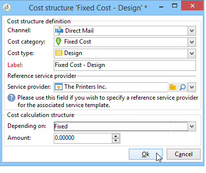
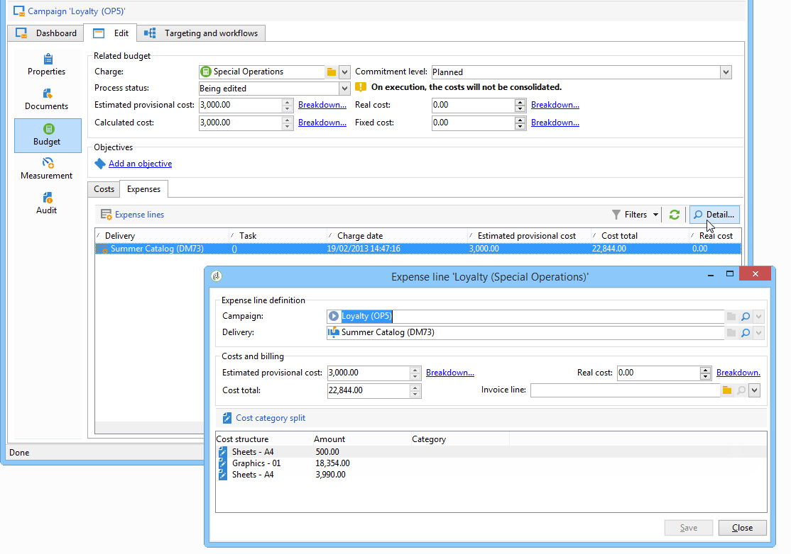
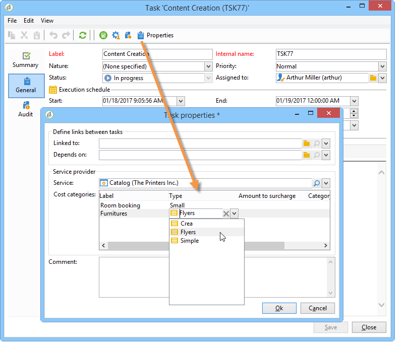
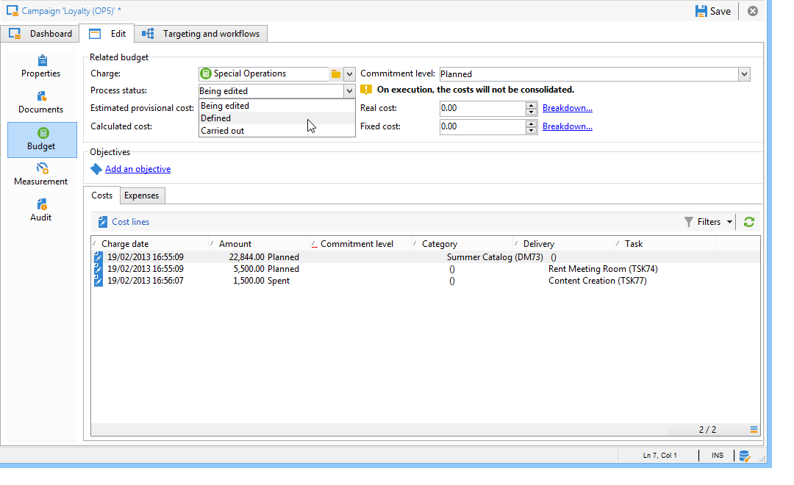

# 비용 제어{#controlling-costs}

Adobe Campaign을 사용하면 예약, 약정 및 송장 발행 마케팅 비용을 제어하고 마케팅 리소스 관리 모듈을 사용하여 카테고리별로 분류할 수 있습니다.

캠페인의 다양한 과정에 대해 커밋된 비용은 마케팅 부서에서 미리 정의한 예산에 부과됩니다. 금액을 여러 카테고리로 분류하여 정보를 더 읽기 쉽게 만들고 마케팅 투자에 대한 보다 자세한 보고를 제공할 수 있습니다.

예산 관리 및 추적은 Adobe Campaign 트리의 전용 노드에서 중앙 집중화되었습니다. 이를 통해 동일한 뷰와 모든 예산에 대해 할당된 금액, 예약, 약정 및 지출 금액을 모니터링할 수 있습니다.

MRM을 사용하여 예산 관리를 구현하려면 다음 단계를 적용해야 합니다.

1. 예산을 정의합니다. [자세히 알아보기](#creating-a-budget)

1. 원가 계산 방법을 정의합니다. 서비스 공급자에 대해 비용 구조가 정의됩니다. [자세히 알아보기](../campaigns/providers--stocks-and-budgets.md)

1. 캠페인 비용(게재/작업) 정의 : 게재 및 작업으로 인한 비용은 캠페인 템플릿에 대해 개별적으로 또는 전체적으로 입력할 수 있습니다. [자세히 알아보기](../campaigns/marketing-campaign-deliveries.md#compute-costs-and-stocks)

1. 통합: 작업, 게재 및 캠페인의 진행 상태에 따라 비용이 계산되어 해당 예산으로 전달됩니다. 캠페인 만들기가 충분히 진행되면 캠페인 예산의 진행 상태를 다음으로 변경할 수 있습니다. **[!UICONTROL Specified]**. 그런 다음 프로그램의 계산된 비용이 캠페인에 계산된 비용과 함께 자동으로 입력됩니다. [자세히 알아보기](#cost-commitment--calculation-and-charging)

## 예산 생성 {#creating-a-budget}

예산을 생성하려면 아래 절차를 따르십시오.

1. 다음 위치로 이동합니다. **[!UICONTROL Campaign management > Budgets]** Campaign 탐색기의 노드.
1. 을(를) 클릭합니다. **[!UICONTROL New]** 아이콘, 이름을 지정하고 예산을 저장합니다.
1. 초기 금액을 입력합니다. 관련 필드에 할당된 금액을 지정합니다. 다른 금액은 자동으로 입력됩니다. [자세히 알아보기](#calculating-amounts)
1. 시작 및 종료 일자를 입력하여 유효 기간을 정의합니다. 이 정보는 설명만 합니다.
1. 캠페인, 작업 등에 대해 이 예산에 할당된 비용이 드는 비용 범주를 만듭니다. 연결할 수 있습니다. [자세히 알아보기](#expense-categories)

>[!NOTE]
>
>관련 예산을 선택할 수 있습니다. 이 작업에 대한 자세한 정보는 [이 섹션](#linking-a-budget-to-another)을 참조하십시오.

### 금액 계산 {#calculating-amounts}

각 예산은 예약 또는 수행한 후 다양한 캠페인, 게재 또는 작업과 관련된 비용에서 감소하는 초기 금액으로 정의됩니다. 금액의 상태(계획, 예약, 약정, 지출 또는 송장)는 비용 유형과 캠페인, 납품 또는 태스크에 정의된 약정 수준에 따라 달라집니다.

>[!NOTE]
>
>범주에 대해 입력한 금액은 **[!UICONTROL Allocated]** 필드.

캠페인의 경우, 약정 수준에 따라 향후 조치를 위해 비용을 계획, 약정 또는 예약할 수 있습니다.

>[!CAUTION]
>
>캠페인을 만들 때 진행 상태는 **[!UICONTROL Budget]** 를 로 설정해야 합니다. **[!UICONTROL Defined]** 실행시 고려되는 비용을 고려합니다. 상태가 인 경우 **[!UICONTROL Being edited]**&#x200B;로 설정되면 비용은 통합되지 않습니다.
>   
>옵션 **[!UICONTROL Commitment level]** 예산을 투입하기 전에 미래의 비용 예측을 나타냅니다. 캠페인, 작업 또는 게재의 진행 상태에 따라 더 높은 약정 수준(1)을 지정하도록 결정할 수 있습니다. 예정, 2. 예약됨, 3. 커밋됨) 콤보 상자를 사용합니다.

예를 들어, 웹 캠페인의 계획된 비용은 45,000유로입니다.

캠페인의 경우, 예산 생성 상태가 **[!UICONTROL Defined]**&#x200B;를 입력하면 캠페인의 실제 비용(또는 없는 경우 계산된 비용)이 예산 합계에 전달됩니다.

캠페인 예산의 약정 수준에 따라, 금액은 **[!UICONTROL Planned]**, **[!UICONTROL Reserved]** 또는 **[!UICONTROL Committed]** 필드.

약정 수준은 다음과 같이 수정할 수 있습니다.

* 에서 **campaign** 수준, **[!UICONTROL Budget]** 창의 **[!UICONTROL Edit]** 탭. 여기에 예산, 비용 및 비용이 구성됩니다.
* 에서 **작업** 수준, **[!UICONTROL Expenses and revenues]** 창을 엽니다.

예산이 **[!UICONTROL Reserved]**&#x200B;를 업데이트하면 부과된 예산에 대해 자동으로 업데이트가 수행됩니다.

작업 수준에서는 프로시저가 동일합니다.

비용이 송장을 발생시키고 송장이 지급되면 그 금액은 **[!UICONTROL Invoiced]** 필드.

### 비용 범주 {#expense-categories}

이 금액은 데이터의 가독성을 높이고 마케팅 투자에 대한 자세한 보고를 위해 여러 비용 범주로 분배할 수 있습니다. 비용 범주는 예산 생성 중에 다음을 통해 정의됩니다 **[!UICONTROL Budgets]** 노드 아래에 있어야 합니다.

카테고리를 추가하려면 **[!UICONTROL Add]** 창의 아래 섹션에 있는 단추입니다.

기존 카테고리에서 카테고리를 선택하거나 필드에 직접 카테고리를 입력하여 새 카테고리를 정의할 수 있습니다. 입력을 확인하면 확인 메시지를 통해 이 카테고리를 기존 카테고리 목록에 추가하고 필요한 경우 속성과 연결할 수 있습니다. 이 정보는 예산 보고서에 사용됩니다.

### 예산을 다른 항목에 연결 {#linking-a-budget-to-another}

예산을 주 예산에 연결할 수 있습니다. 이렇게 하려면 **[!UICONTROL related budget]** 보조 예산의 필드.

관련 예산 목록을 표시하기 위해 기본 예산에 추가 탭이 추가됩니다.

이 정보는 예산 보고서에 전달됩니다.

## 비용 라인 추가 {#adding-expense-lines}

비용 라인은 예산에 자동으로 추가됩니다. 게재 분석 중에 및 작업이 완료되면 만들어집니다.

각 캠페인, 게재 또는 작업에 대해 생성된 비용은 청구 대상인 예산의 비용 라인에 그룹화됩니다. 이러한 비용 라인은 해당 서비스 공급자의 비용 라인에 따라 생성되고 관련 비용 구조를 통해 계산됩니다.

따라서 각 비용 라인에는 다음 정보가 포함됩니다.

* 캠페인 및 캠페인과 관련된 게재 또는 작업
* 원가 구조 또는 예상 잠정 원가로부터 계산된 금액
* 관련 배달 또는 작업의 실제 비용
* 해당 송장 라인(MRM만 해당)
* 원가 범주별로 계산된 원가 목록(원가 구조가 존재하는 경우)

위의 예에서 편집된 비용 라인에는 **새 카드** 전달 **충성도 봄 팩** campaign. 게재를 편집할 때 **[!UICONTROL Direct Mail]** 탭에서는 비용 라인이 계산되는 방식을 볼 수 있습니다.

이 게재에 대한 비용 계산은 해당 서비스 제공자에 대해 선택한 비용 범주를 기반으로 합니다.

선택한 원가 범주에 따라 원가 라인을 계산하기 위해 해당 원가 구조가 적용됩니다. 이 예에서 관련 서비스 제공자의 경우 비용 구조는 다음과 같습니다.

>[!NOTE]
>
>비용 범주 및 구조는 [이 페이지](../campaigns/providers--stocks-and-budgets.md#create-a-service-provider-and-its-cost-categories)

## 비용 약정, 계산 및 과금 {#cost-commitment--calculation-and-charging}

납품 및 작업에 대한 비용을 커밋할 수 있습니다. 관련된 프로세스의 진행 상태에 따라 비용 상태가 업데이트됩니다.

### 원가 계산 프로세스 {#cost-calculation-process}

비용은 세 가지 범주로 구분됩니다.

1. 예상 비용

   예상되는 잠정 비용은 캠페인의 프로세스에 대한 예상 비용이다. 편집하고 있는 한, 입력된 금액은 통합되지 않습니다. 분명히 **[!UICONTROL Specified]** 계산에서 고려할 금액 입력의 상태입니다.

   이 금액은 수동으로 입력되며 여러 비용 범주로 분류할 수 있습니다. 비용을 줄이려면 **[!UICONTROL Breakdown...]** 링크를 클릭한 다음 **[!UICONTROL Add]** 버튼을 눌러 신규 금액을 정의합니다.

   

   비용 범주별 원가 분류를 나중에 관련 예산 및 예산 보고서에서 볼 수 있도록 각 원가를 범주에 연관시킬 수 있습니다.

1. 계산된 비용

   계산된 비용은 관련 요소(캠페인, 게재, 작업 등)에 따라 다릅니다. 및 해당 상태(편집 중, 진행 중, 완료)입니다. 어떤 경우든 실제 비용이 지정되면 계산된 비용이 이 금액을 사용합니다.

   실제 비용을 제공하지 않으면 다음 규칙이 적용됩니다.

   * 편집 중인 캠페인의 경우, 계산된 비용은 캠페인의 예상 임시 비용이거나, 이 비용이 정의되지 않으면 계산된 비용이 캠페인의 모든 임시 비용과 작업의 합계입니다. 캠페인이 완료되면 캠페인의 계산된 비용이 모든 계산된 비용의 합계입니다.
   * 아직 분석되지 않은 게재의 경우, 계산된 비용은 예상 임시 비용입니다. 분석이 이미 수행된 경우 계산된 비용은 서비스 제공 비용 구조 및 타겟팅된 수신자 수의 계산된 모든 비용의 합계입니다.
   * 진행 중인 작업의 경우, 계산된 원가는 예상 임시 비용을 사용합니다. 작업이 완료되면, 계산된 비용은 서비스 공급자 비용 구조에서 계산된 모든 비용과 완료된 일 수의 합입니다.
   * 마케팅 계획의 경우 프로그램에 대해 계산된 비용은 캠페인에 대해 계산된 비용의 합계입니다. 이러한 비용이 지정되지 않은 경우, 계산된 비용은 예상되는 임시 비용을 사용합니다.

   >[!NOTE]
   >
   >다음 **[!UICONTROL Breakdown]** 링크를 통해 계산의 세부 정보와 마지막 원가 계산 날짜를 볼 수 있습니다.

1. 실질 비용

   실제 비용은 수동으로 입력되며, 필요한 경우 다른 비용 범주로 분류됩니다.

### 계산 및 과금 {#calculation-and-charging}

비용은 비용 구조를 통해 계산되며 관련 캠페인, 게재 또는 작업에서 선택한 예산에 청구됩니다.

예산 승인을 통해 캠페인에 커밋된 금액에 대해 검사할 수 있습니다. 다른 승인을 설정하기 위해 캠페인에 추가 체크포인트 스타일 작업을 만들 수 있습니다. 자세한 내용은 [작업 유형](creating-and-managing-tasks.md#types-of-task).

### 예제 {#example}

다음과 같이 캠페인을 만듭니다.

* 서비스 공급자의 비용 구조를 사용한 DM 게재
* 고정 비용이 있는 작업
* 일별 비용이 포함된 작업

#### 1단계 - 예산 생성 {#step-1---creating-the-budget}

1. 을 통해 새 예산 만들기 **[!UICONTROL Campaign management > Budgets]** 노드 아래에 있어야 합니다.

1. 10,000유로의 예산을 **[!UICONTROL Allocated]** 필드 **[!UICONTROL Amounts]** 섹션을 참조하십시오. 창의 아래 섹션에 두 가지 비용 범주를 추가합니다.

#### 2단계 - 서비스 공급자를 구성하고 비용 구조를 정의합니다 {#step-2---configuring-the-service-provider-and-defining-the-cost-structures}

1. 비용 구조를 사용하여 서비스 공급자 및 서비스 템플릿을 만듭니다. **[!UICONTROL Administration > Campaigns]** 노드 아래에 있어야 합니다. 이 작업에 대한 자세한 정보는 [이 섹션](../campaigns/providers--stocks-and-budgets.md#create-a-service-provider-and-its-cost-categories)을 참조하십시오.

   DM 게재의 경우 비용 범주를 생성합니다 **[!UICONTROL Envelopes]** (유형 114x229 및 162x229), **[!UICONTROL Postage]** 및 **[!UICONTROL Print]** (유형 A3 및 A4) 그리고 다음 비용 구조를 생성합니다.

   

1. 계산이 고정되고 금액이 비어 있는 고정 원가(원가 범주)를 추가하고 각 납품에 대해 개별적으로 지정할 고정 원가를 추가합니다.

   

   태스크에 대해 다음 두 가지 원가 범주를 생성합니다.

   * **[!UICONTROL Room reservation]** (작은 방 및 큰 방), **고정** 비용 구조는 300유로 및 500유로 입니다.

   

   * **[!UICONTROL Creation]** (**컨텐츠 템플릿** type), **일별** 300유로 비용 구조:

   

#### 3단계 - 캠페인에서 예산 부과 {#step-3---charging-the-budget-in-the-campaign}

1. 캠페인을 만들고 1단계에서 생성된 예산을 선택합니다.

   >[!NOTE]
   >
   >기본적으로 프로그램에 대해 선택한 예산이 프로그램의 모든 캠페인에 적용됩니다.

   

1. 분류와 함께 예상 잠정 비용을 지정합니다.

   

1. 클릭 **[!UICONTROL Ok]** 그리고 **[!UICONTROL Save]** 을 클릭하여 이 정보를 확인합니다. 그런 다음 캠페인의 계산된 비용이 예상되는 임시 비용으로 업데이트됩니다.

#### 4단계 - DM 게재 만들기 {#step-4---creating-the-direct-mail-delivery}

1. 캠페인에 대한 워크플로우를 만들고 쿼리 활동을 배치하여 타겟을 선택합니다(경고: 수신자 우편 주소를 지정해야 함).

1. DM 게재를 만들고 2단계에서 만든 서비스 공급자를 선택합니다. 원가 범주가 자동으로 표시됩니다.

1. 봉투의 비용을 무시하고 고정 비용을 추가합니다. 또한 이러한 비용에 관련된 카테고리를 선택합니다.

   

   >[!NOTE]
   >
   >비용 범주 중 하나를 사용하지 않으면 비용이 생성되지 않습니다.

1. 방금 만든 워크플로우를 시작하여 분석을 시작하고 비용을 계산합니다.

   

1. 이 캠페인에 대해 예산 승인이 활성화되어 있으면 대시보드에서 예산을 승인합니다. 원가 범주의 승인을 확인할 수 있습니다.

   

게재에 대한 비용 라인은 **[!UICONTROL Edit > Budget]** 캠페인 탭을 클릭합니다. 계산 세부 사항을 보려면 이 필드를 편집합니다.

게재에 대해 계산된 비용은 다음 정보로 업데이트됩니다.

계산된 원가를 편집할 때 원가 분류와 원가 계산의 상태 및 일자를 확인할 수 있습니다.

#### 5단계 - 작업 만들기 {#step-5---creating-tasks}

이 캠페인에 비용 구조가 있는 두 가지 작업을 추가합니다 [이전에 생성됨](#step-2---configuring-the-service-provider-and-defining-the-cost-structures).

이렇게 하려면 캠페인 대시보드에서 **[!UICONTROL Add a task]** 버튼을 클릭합니다. 작업 이름을 지정하고 **[!UICONTROL Save]**.

1. 그런 다음 작업이 작업 목록에 추가됩니다. 이를 구성하려면 해당 쿠키를 편집해야 합니다.

1. 에서 **[!UICONTROL Properties]** 탭에서 서비스와 해당 비용 범주를 선택합니다.

   

1. 그런 다음 **[!UICONTROL Expenses and revenue]** 작업 아이콘과 예상 임시 비용을 지정합니다.

   

   작업이 저장되면 계산된 비용이 예상 임시 비용에 대해 입력한 값으로 지정됩니다.

   작업이 완료되면(상태) **[!UICONTROL Finished]** )를 입력하면, 계산된 비용이 비용 구조에 입력된 대로 큰 방의 비용으로 자동 업데이트됩니다. 이 비용은 분류에서 이 카테고리에 나타납니다.

1. 그런 다음 동일한 절차에 따라 두 번째 작업을 만듭니다. 5일 동안 예약되며 이전에 만든 비용 구조와 관련되어 있습니다.

   

   작업이 완료되면 계산된 비용이 관련 비용 구조의 값과 함께 지정됩니다(예: 1500유로(예: 5일 x 300유로).

   

#### 6단계 - 캠페인 예산 상태 업데이트 {#step-6---update-the-campaign-budget-status}

캠페인이 구성되면 캠페인을 로 설정하여 상태를 업데이트할 수 있습니다 **[!UICONTROL Specified]**. 그런 다음 캠페인의 계산된 비용이 게재의 계산된 비용과 캠페인의 작업의 합계를 나타냅니다.

#### 예산 승인 {#budget-approval}

승인이 활성화되면, 특수 링크를 통해 캠페인 대시보드에서 예산을 승인할 수 있습니다. 이 링크는 타겟팅 워크플로우를 시작하고 DM 게재를 승인해야 할 때 표시됩니다.

그런 다음 링크를 클릭하여 승인을 부여하거나 거부하거나, 이 캠페인에 대해 알림이 활성화된 경우 알림 이메일의 링크를 사용할 수 있습니다.

예산이 승인되고 게재가 완료되면 특별한 기술 워크플로우를 통해 비용이 자동으로 업로드됩니다.

## 주문 및 송장 {#orders-and-invoices}

MRM 컨텍스트에서 서비스 공급자와 함께 주문을 저장하고 송장을 발행할 수 있습니다. 이러한 주문 및 송장의 전체 라이프 사이클은 Adobe Campaign 인터페이스를 통해 관리할 수 있습니다.

### 주문 생성 {#order-creation}

서비스 공급자를 통해 새 주문을 저장하려면 **[!UICONTROL MRM > Orders]** 트리의 노드를 클릭한 다음 **[!UICONTROL New]** 버튼을 클릭합니다.

주문 번호, 관련 서비스 공급자 및 주문 총 금액을 지정합니다.

### 송장 발행 및 추적 {#issuing-and-tracking-invoices}

각 서비스 공급자에 대해 송장을 저장하고 해당 상태와 부과된 예산을 정의할 수 있습니다.

송장이 생성되어 **[!UICONTROL MRM > Invoices]** 노드 아래에 나열된 상태로 남아 있습니다.

송장은 합계가 금액을 자동으로 계산할 수 있는 송장 라인으로 구성됩니다. 이러한 선은 **[!UICONTROL Invoice lines]** 탭. 이러한 ID를 주문에 연결하여 주문에 정보를 업로드할 수 있습니다.

각 서비스 공급자의 송장이 **[!UICONTROL Invoices]** 프로필의 탭:

다음 **[!UICONTROL Details]** 탭에서 송장의 내용을 표시할 수 있습니다.

클릭 **[!UICONTROL Add]** 신규 송장을 생성하려면
