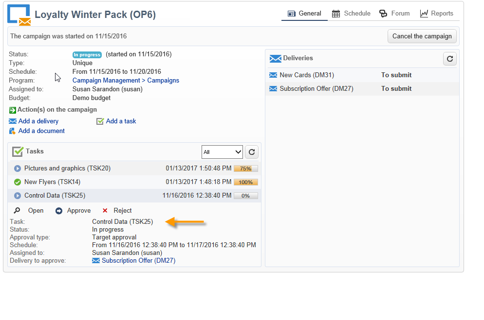

# 작업 만들기 및 관리{#creating-and-managing-tasks}

Adobe Campaign을 사용하면 작업을 만들고 애플리케이션에서 작업의 전체 주기를 직접 관리할 수 있습니다. 프로그램 및 캠페인 구현은 Adobe Campaign 운영자 또는 외부 서비스 공급자에게 할당된 작업으로 분류할 수 있습니다. 이 작업 모드를 사용하면 모든 프로그램 참여자와 외부 참여자를 포함하는 개방형 공동 작업 환경을 만들 수 있습니다.

작업 목록 또는 캠페인 대시보드에서 작업을 만들고, 보고, 모니터링할 수 있습니다. 마케팅 계획, 프로그램 및 캠페인의 일정에서 보고 추적할 수도 있습니다.

작업은 캠페인에 첨부되며 종속성, 즉 연결된 작업을 가질 수 있습니다. 각 작업에는 상태, 우선 순위, 예상 로드 및 관련 비용이 있습니다.

모든 작업은 **캠페인** 탭을 통해 액세스할 수 있는 목록으로 그룹화됩니다. 자세한 내용은 [액세스 작업](#accessing-tasks)을 참조하세요.

이들은 자신이 속한 프로그램의 일정에 표시될 수 있다.

## 작업 액세스 {#accessing-tasks}

### 작업 표시 {#displaying-tasks}

작업은 **[!UICONTROL Campaigns]** 탭을 통해 액세스할 수 있는 작업 목록에 표시됩니다.

현재 연산자의 모든 작업을 볼 수 있습니다.

자세한 내용은 [작업 실행 상태](#execution-status-of-a-task) 및 [작업 진행 상태](#progress-status-of-a-task)를 참조하세요.

### 작업 필터링 {#filtering-tasks}

이 보기를 표시하면 **현재 연산자 작업**&#x200B;만 표시되도록 자동으로 필터링됩니다. 창의 위쪽 섹션에 있는 필드를 사용하여 작업을 필터링할 수도 있습니다.

### 작업 편집 {#editing-tasks}

편집할 작업을 클릭합니다.

## 새 작업 만들기 {#creating-a-new-task}

작업을 만들려면 아래 단계를 수행합니다.

1. **[!UICONTROL Campaigns]** 탭에서 **[!UICONTROL Tasks]** 링크로 이동하여 **[!UICONTROL Create]**&#x200B;을(를) 클릭합니다.

   

1. 작업의 이름을 입력하고 연결된 캠페인을 선택합니다.
1. 시작 및 종료 날짜를 설정합니다.
1. 작업을 만들려면 **[!UICONTROL Save]**&#x200B;을(를) 클릭하십시오.

   

캠페인의 대시보드를 통해 작업을 생성할 수도 있습니다. 이 경우 작업이 생성된 캠페인에 자동으로 연결됩니다.

작업이 생성되면 캠페인 일정, 캠페인 대시보드 및 작업 목록에 추가됩니다. 작업을 편집하려면 작업 목록에서 해당 이름을 클릭하거나 일정 또는 캠페인 대시보드에서 선택한 다음 **[!UICONTROL Open]**&#x200B;을(를) 클릭합니다.

생성되면 다음을 정의하여 작업을 구성할 수 있습니다.

* 관리자와 참가자입니다. [자세히 알아보기](#manager-and-participants)
* 생성 일정. [자세히 알아보기](#execution-schedule)
* 약정된 비용. [자세히 알아보기](#expenses-and-revenues)

[검토자](#reviewers) 및 [참조 문서](#documents-referenced)를 추가할 수도 있습니다.

작업 수명 주기가 [이 섹션](#life-cycle)에 표시됩니다.

### 관리자 및 참가자 {#manager-and-participants}

기본적으로 작업은 만든 운영자에게 할당됩니다. 이 연산자는 해당 작업에 작업이 필요한 경우 알림을 받습니다.

**[!UICONTROL Assigned to]** 드롭다운 목록에서 다른 연산자를 선택할 수 있습니다.

>[!NOTE]
>
>연산자 관리는 [이 섹션](../../v8/start/gs-permissions.md)에 자세히 설명되어 있습니다.
>
>업무를 담당하는 운영자만 휴업을 할 수 있도록 하고 있다.

작업을 수행하는 데 더 많은 연산자를 지정할 수 있습니다. 이러한 운영자는 작업을 닫을 수 없습니다. 자신에게 할당된 작업만 승인할 수 있습니다.

작업 연산자를 추가하려면 아래 단계를 수행합니다.

1. 작업 도구 모음에서 **[!UICONTROL Resources]** 아이콘을 클릭합니다.

   

1. **[!UICONTROL Add]**&#x200B;을(를) 클릭하고 관련 연산자를 선택합니다.
1. 사용률을 입력합니다. 이 값은 작업 실행 기간 동안 운영자에게 할당된 작업량을 나타냅니다. 이 비율은 표시 전용이며 백분율로 표시됩니다.

   

   예를 들어 실행 일정이 10일로 설정된 작업의 경우 사용률이 50%인 운영자는 10일 동안 작업 시간의 절반 동안 이 작업에 동원됩니다.

   각 연산자에 대해 스케줄링된 작업 로드 및 실제 작업 로드를 입력할 수 있습니다. 이 기간은 또한 정보 용도로만 사용됩니다.

1. **[!UICONTROL Add a reminder...]** 링크에서 미리 알림을 구성할 수 있습니다. 종료 날짜 이전에 작업에 관련된 모든 운영자에게 이메일 알림이 전송됩니다.

   

1. 작업이 시작되기 전에 알림을 보낼 수도 있습니다. 이를 설정하려면 **[!UICONTROL Initial notification]** 필드에서 날짜를 선택하십시오.
1. 종료 날짜에 도달하고 작업이 종료되지 않은 경우 **[!UICONTROL Assignee]** 드롭다운 목록에서 선택한 피할당자 또는 피할당자 그룹에 알림을 보낼 수 있습니다.

연산자 대시보드를 사용하면 작업 로드(진행 중인 다른 작업)를 확인할 수 있습니다.

### 작업 승인 {#reviewers}

참여자 외에 작업이 종료된 후 검토할 운영자를 정의할 수 있습니다.

이렇게 하려면 **[!UICONTROL Resources]** 창의 아래 섹션에서 **[!UICONTROL Enable task approval]** 옵션을 클릭합니다. 개별 연산자, 연산자 그룹 또는 연산자 목록일 수 있습니다.

연산자 목록을 지정하려면 첫 번째 검토자의 오른쪽에 있는 **[!UICONTROL Edit...]** 링크를 클릭하고 아래와 같이 필요한 만큼 연산자를 추가합니다.

구성 창의 아래 섹션에서 태스크에 대한 승인 일정을 정의할 수 있습니다. 기본적으로 검토자는 작업을 승인하기 위해 제출 날짜로부터 3일을 받습니다. 미리 알림을 추가할 수도 있습니다. 이 미리 알림은 승인 기한 전에 관련 운영자에게 자동으로 전송됩니다.

이미 다른 사업자에게 이를 수행하도록 할당한 경우에도 업무 담당자는 자신에게 이를 승인하는 업무를 할당할 수 있다. 정의된 검토자가 없는 경우 알림이 작업 담당자에게 전송됩니다. **[!UICONTROL Administrator]** 권한이 있는 다른 모든 Adobe Campaign 연산자도 작업을 승인할 수 있습니다. 하지만 알림은 수신되지 않습니다.

### 참조된 문서 {#documents-referenced}

[문서 및 마케팅 리소스](managing-marketing-resources.md)를 작업에 추가할 수 있습니다.

다음을 수행하십시오.

1. 작업을 열고 작업 도구 모음에서 **[!UICONTROL Documents]** 아이콘을 클릭합니다.

   

1. **[!UICONTROL Add]**&#x200B;을(를) 클릭하고 작업에 추가할 문서를 선택하십시오. 마케팅 리소스에 동일한 프로세스를 적용합니다.

참조된 문서가 작업과 관련된 운영자에게 전송된 알림에 추가됩니다. 작업 대시보드에도 추가됩니다.

### 실행 일정 {#execution-schedule}

작업의 유효 기간이 **[!UICONTROL Start]** 및 **[!UICONTROL End]** 필드에 표시됩니다. 스케줄된 부하는 해당 기간 동안 수행될 작업량을 표현한다. 일 또는 시간 단위로 표시됩니다.

>[!NOTE]
>
>작업의 수명 주기는 [수명 주기](#life-cycle)에 표시됩니다.

**[!UICONTROL Workload performed]** 필드도 일 및 시간 단위로 표시되므로 예약된 작업 로드와 관련된 작업의 진행 상황을 수동으로 업데이트할 수 있습니다.

백분율로 표시된 작업의 **[!UICONTROL Progress status]**&#x200B;은(는) 관련된 운영자가 수행하는 작업에 따라 자동으로 업데이트됩니다. 수동으로 입력할 수 있습니다.

이 정보는 작업 대시보드에서 볼 수 있습니다.

캠페인 탭에도 표시됩니다.

작업 실행 일정 종료 날짜에 도달했지만 작업이 완료되지 않은 경우 작업은 **[!UICONTROL Late]**&#x200B;이(가) 됩니다. 경고 운영자에게 경고 메시지도 표시됩니다.

자세한 내용은 [작업 진행 상태](#progress-status-of-a-task)를 참조하세요.

### 경비 및 수익 {#expenses-and-revenues}

각 태스크에 대해 관련 비용을 정의하고 수익을 예측할 수 있습니다. 작업이 첨부된 캠페인에 대해 계산된 다음 통합됩니다.

이 정보를 지정하려면 작업 도구 모음에서 **[!UICONTROL Expenses and revenue]** 아이콘을 클릭합니다.

기본적으로 부과된 예산은 작업이 첨부된 캠페인의 예산입니다. 작업 세부 정보에 표시됩니다.

>[!NOTE]
>
>경비 및 예산에 대한 자세한 내용은 [이 섹션](../campaigns/providers-stocks-and-budgets.md#cost-commitment--calculation-and-charging)을 참조하세요.

이 창에서는 도달할 목표를 정의할 수도 있습니다. 목표는 해당 작업의 예측 매출로 표시됩니다.

### 서비스 공급자 {#service-providers}

외부 서비스 공급자는 작업 관리에 관여할 수 있습니다.

이렇게 하려면 작업 속성을 편집하고 관련 서비스 공급자를 선택합니다. 서비스 제공자와 연관된 비용 범주가 창의 중앙 섹션에 자동으로 나열됩니다.

작업 실행과 관련된 비용 범주를 선택합니다. 이를 위해 비용 유형을 선택하고 필요한 경우 추가 비용에 금액을 추가합니다.

>[!NOTE]
>
>예산 및 비용 관리 방법은 [비용 관리](controlling-costs.md)에 나와 있습니다.

서비스 공급자를 선택하면 작업 대시보드에 표시됩니다.

### 지연된 작업 {#late-tasks}

상태가 **[!UICONTROL Finished]**(으)로 변경되지 않고 작업이 종료 날짜에 도달하면 늦습니다. 작업이 지연되면 기본적으로 어떤 연산자도 경고되지 않습니다. 알림 이메일의 전달을 구성할 수 있습니다. 모든 운영자는 작업에 참여하지 않더라도 알림을 받을 수 있습니다.

**[!UICONTROL Resources]** 상자로 이동하여 **[!UICONTROL Assignation]** 필드에 연산자를 추가하십시오. 여러 사람에게 알리려면 연산자 그룹을 선택합니다.

### 초기 알림 {#initial-notifications}

시작일이 미래인 작업을 만들거나 수정할 때, Adobe Campaign에서는 작업 담당자에게 이메일을 보내어 시작일을 알려 준다고 제안합니다.

하지만 만들고 있는 작업이 너무 먼 경우에는 작업이 시작되기 전에 알림을 보내도록 예약하는 것이 좋습니다. 예를 들어 한 달 후에 작업이 시작되면 작업이 시작되기 1주일 전에 담당자에게 알릴 수 있습니다.

알림을 예약하려면 **[!UICONTROL Resources]** 상자로 이동하여 **[!UICONTROL Initial notification]** 필드를 사용하십시오.

* 캠페인 내의 작업에 대해 특정 날짜 및 시간을 선택합니다.
* 캠페인 템플릿 내의 작업의 경우 알림 시간은 작업이 시작되기 전까지 남은 시간으로 표시됩니다(예: **[!UICONTROL Initial notification]** 필드에 2d를 입력하면 작업 시작 날짜보다 2일 전에 이메일이 전송됨).

알림을 예약한 경우 작업을 저장하면 Adobe Campaign에서 알림을 즉시 전송할 오퍼를 중지합니다. 전송하기로 결정할 수 있으며, 이렇게 하면 예약된 알림이 대체되지 않습니다.

### 프로그램에 연결된 작업 {#task-linked-to-a-program}

특정 캠페인(예: 프로그램 내에서 예정된 캠페인의 테마를 논의하는 회의)이 아닌 전체 조직과 관련된 작업을 관리하기 위해 프로그램에서 직접 작업을 만들 수 있습니다. 작업이 프로그램 일정에 나타납니다.

프로그램에 직접 연결된 작업을 만들려면 다음 작업을 수행하십시오.

1. 프로그램 일정을 엽니다. 홈 페이지에서 **[!UICONTROL Campaigns > Browse > Other choices > Programs]**(으)로 이동합니다. 창의 오른쪽 섹션에 전체 프로그램 일정이 열립니다.
1. 일정에서 원하는 프로그램을 클릭합니다. 창에 프로그램이 표시됩니다.
1. 이 창에서 **[!UICONTROL Open]**&#x200B;을(를) 클릭합니다. 프로그램 일정이 열립니다.
1. 오른쪽의 일정 위에 있는 **[!UICONTROL Add]** 단추를 클릭한 다음 **[!UICONTROL Add a task]**&#x200B;을(를) 클릭합니다.

### 운영자 가용성 {#operator-availability}

작업 대시보드에서 운영자 이름 옆에 있는 아이콘은 작업이 적용되는 기간 동안 다른 작업 또는 이벤트에서 이미 작업 중임을 나타냅니다. 운영자가 담당하거나 관련된 작업이 **[!UICONTROL Assigned to]** 필드 또는 **[!UICONTROL Resources]** 작업 상자에 나타납니다.

### 워크플로우의 작업 {#task-in-a-workflow}

캠페인 워크플로우에서 **[!UICONTROL Task]** 요소를 사용하면 작업 승인 여부에 따라 두 가지 시나리오를 정의할 수 있습니다.

캠페인 워크플로우에서 **[!UICONTROL Task]** 활동이 **[!UICONTROL Flow control]** 탭에 있습니다.

## 작업 유형 {#types-of-task}

캠페인을 통해 작업을 만들 때 특정 작업을 만들 수 있습니다. 선택한 템플릿에 작업 유형이 정의되어 있습니다.

다음 작업을 예약할 수 있습니다.

* [제어 작업](#control-tasks),
* [그룹화 작업](#grouping-task),
* [그룹화 작업](#grouping-task),
* [알림 작업](#notification-task).

>[!NOTE]
>
>캠페인 대시보드를 통해 **[!UICONTROL Control task]** 및 **[!UICONTROL Grouping]** 작업을 **전용**&#x200B;할 수 있습니다.\
>지정된 연산자의 작업 맵에 표시됩니다. [액세스 작업](#accessing-tasks)을 참조하세요.

### 작업 제어 {#control-tasks}

**[!UICONTROL Control task]**&#x200B;이(가) 게재 승인(타기팅, 콘텐츠, 추출 파일, 예산 또는 증명 승인)에 연결되어 있습니다.

작업이 생성되면 캠페인 대시보드에 작업이 추가됩니다.

그런 다음 편집하고 매개 변수를 지정할 수 있습니다.

### 마케팅 리소스 만들기 작업 {#marketing-resource-creation-task}

마케팅 리소스 만들기 작업은 마케팅 리소스의 만들기 및 게시를 관리하는 데 사용할 수 있습니다. 리소스 자체가 아니라 작업을 통해 리소스를 관리하는 경우 다음을 수행할 수 있습니다.

* 캠페인을 통해 리소스 만들기 프로세스를 제어합니다.
* 일정에서 리소스 만들기 프로세스를 봅니다.
* 리소스 만들기 프로세스(미리 알림, 알림)를 관리합니다.
* 리소스 만들기에 연결된 비용을 계산하고 제어합니다.
* 작업을 통해 리소스를 승인하고 게시합니다(관련 옵션이 활성화된 경우).

#### 작업과 연결된 리소스 간의 상호 작용 {#interaction-between-the-task-and-its-linked-resource}

마케팅 리소스 만들기 작업은 연결된 리소스와 상호 작용합니다. 이것은 다음을 의미합니다.

* 리소스 만들기 일정 및 연결된 비용은 작업을 통해 관리됩니다.
* 운영자는 일반(다운로드 또는 업로드, 잠금 및 잠금 해제)과 같은 리소스 작업을 할 수 있습니다. 이는 작업에 영향을 주지 않습니다.
* 작업을 통해 리소스 승인 및 게시를 수행할 수 있습니다. **[!UICONTROL Publish the marketing resource]** 옵션이 활성화된 경우 작업이 완료되면 리소스가 자동으로 승인 및 게시됩니다. 옵션이 활성화되지 않은 경우 작업과 리소스는 상호 작용하지 않습니다. 한 작업에 대해 동작해도 다른 작업에 영향을 주지 않습니다.

  일련의 연결된 작업을 사용하여 전체 승인 주기를 정의할 수 있습니다. 마지막 작업에 대해서만 **[!UICONTROL Publish the marketing resource]** 옵션을 선택하십시오. 리소스를 게시하려면 모든 작업을 완료해야 합니다. 또한 하위 마케팅 리소스 작업을 만들면 하위 작업에서 리소스가 자동으로 선택됩니다.

   * **리소스를 통해**: 승인을 위해 리소스를 제출하거나 승인하면 이러한 작업은 작업에 영향을 주지 않습니다.
   * **작업을 통해**: 작업에서 **[!UICONTROL Publish the marketing resource]** 옵션이 선택된 경우 작업이 완료되면 리소스가 자동으로 승인되고 게시됩니다(위 참조). 이 옵션을 선택하지 않으면 작업과 리소스가 상호 작용하지 않습니다. 한 작업에 대해 작업을 수행해도 다른 작업에는 영향을 주지 않습니다.

#### 마케팅 리소스 만들기 작업 구성 {#configuring-a-marketing-resource-creation-task}

작업을 검토하는 사람은 리소스에 정의된 콘텐츠를 검토하는 사람과 같지 않습니다. 그러나 **[!UICONTROL Publish the marketing resource]** 옵션을 선택하면(아래 참조) 작업을 완료하면 리소스가 자동으로 승인되므로(또는 검토자가 정의되지 않은 경우 작업 관리자) 작업 검토자는 리소스 콘텐츠를 승인할 수 있습니다.

**[!UICONTROL Marketing resource]** 필드에서 이 작업을 통해 관리할 리소스를 정의합니다. 다음을 수행할 수 있습니다.

* 기존 리소스를 선택하십시오. 드롭다운 목록에서는 상태가 **[!UICONTROL Being edited]**&#x200B;인 모든 리소스를 제공합니다.
* 리소스 만들기: **[!UICONTROL Select the link]** 아이콘을 클릭한 다음 **[!UICONTROL Create]** 아이콘을 클릭합니다.

**[!UICONTROL Publish the marketing resource]** 옵션을 사용하면 리소스 게시를 자동화할 수 있습니다. 작업이 **[!UICONTROL Finished]**&#x200B;이면 작업을 완료한 검토자가 리소스에 정의된 콘텐츠 검토자가 아닌 경우를 포함하여 승인을 위해 제출되거나 승인되지 않은 경우에도 리소스의 상태가 자동으로 **[!UICONTROL Published]**(으)로 전환됩니다.

**[!UICONTROL Publish the resource]** 단추를 사용할 수 있고 리소스 게시 검토자는 게시 준비가 되었음을 알리는 알림 이메일을 수신합니다. **[!UICONTROL Edit > Tracking]** 탭에서 작업 검토자의 검토 및 게시가 표시됩니다. 리소스 사후 처리 워크플로우가 정의된 경우 이제 실행됩니다.

### 그룹 작업 {#grouping-task}

**[!UICONTROL Grouping task]** 유형 작업을 사용하면 여러 작업을 그룹화하고 진행 상황 및 승인 관리를 동기화할 수 있습니다.

그룹화 작업에 연결된 경비 또는 리소스가 없습니다.

그룹화 작업으로 그룹화된 모든 작업은 자체 대시보드에서 볼 수 있습니다. 원하는 작업 목록만 표시하도록 작업 목록을 필터링할 수 있습니다.

그룹화 작업에는 그룹화된 작업을 쉽게 만들 수 있는 링크가 있습니다.

그룹화 작업을 기반으로 그룹화된 작업을 만들려면 캠페인 대시보드로 이동하여 그룹화 작업의 이름을 클릭하여 설명을 표시한 다음 **[!UICONTROL Add a task]**&#x200B;을(를) 클릭합니다.

그러나 그룹화 작업에 연결할 작업을 이미 만든 경우 **[!UICONTROL Properties]** 상자의 **[!UICONTROL Linked to]** 필드를 통해 해당 작업을 수행할 수 있습니다.

### 알림 작업 {#notification-task}

알림 작업을 사용하면 (운영자, 운영자 그룹, 서비스 공급자 등) 이메일 게재를 예약할 수 있습니다. 이를 통해 캠페인이 곧 완료됨을 누군가에게 알리거나, 운영자가 준비할 수 있도록 캠페인이 시작되기 전에 문서를 보내기 위한 미리 알림을 예약할 수 있습니다. 즉, 캠페인이나 프로그램 내의 커뮤니케이션을 추적하고 수행된 작업을 자세히 볼 수 있습니다.

#### 라이프 사이클 {#life-cycle}

알림 작업은 승인이 필요하지 않습니다. 즉, 라이프 사이클이 표준 작업보다 간단합니다.

알림 작업에는 다음과 같은 상태가 있을 수 있습니다.

* 전자 메일이 전송될 때까지 **[!UICONTROL Scheduled]**
* 전자 메일을 보낸 후 종료 날짜에 도달할 때까지 **[!UICONTROL In progress]**
* 종료 날짜에 도달하면 **[!UICONTROL Finished]**.

#### 구성 {#configuration}

만드는 동안 작업에 다음 요소를 입력해야 합니다.

* **[!UICONTROL Assigned to]**: 전자 메일을 받을 운영자 또는 운영자 그룹입니다. 이메일을 보낸 후 작업을 다시 할당하면 새 운영자에게 이메일이 전송되지 않습니다(이렇게 하려면 작업을 다시 초기화하고 시작 날짜를 변경해야 함).
* **작업 시작 날짜**: 알림 전자 메일을 보낼 날짜입니다. 이 날짜는 작업 기록 시 미래여야 합니다.
* **작업 종료 날짜**: 작업 상태가 **[!UICONTROL Finished]**(으)로 변경되는 날짜. 기본적으로 종료 날짜는 시작 날짜와 동일합니다. 그러나 작업에 기간을 할당하면 필요한 경우 운영자가 일정에서 수행해야 하는 시간을 상징할 수 있습니다.
* **[!UICONTROL Description]**: 여기에 입력한 텍스트가 알림 전자 메일의 본문에 나타납니다.

  

작업 및 알림 이메일에 첨부 파일을 추가할 수 있습니다. 이렇게 하려면 오른쪽 상단의 도구 모음에서 **[!UICONTROL Documents]** 아이콘을 클릭합니다.

## 라이프 사이클 {#life-cycle-1}

### 작업 간 링크 {#links-between-tasks}

각 작업의 **[!UICONTROL Properties]** 단추를 사용하면 캠페인에서 작업 간의 연결을 정의할 수 있습니다. 그룹화 작업을 사용하여 작업을 하위 작업으로 분할하거나([연결된 작업](#linked-tasks) 참조) 작업 간의 종속성을 정의할 수 있습니다([그룹화 작업](#grouping-tasks) 참조).

#### 연결된 작업 {#linked-tasks}

**[!UICONTROL Linked task]** 필드를 사용하여 작업을 그룹화 작업과 연결합니다. [작업 유형](#types-of-task)을 참조하세요.

다음 예에서는 타겟팅 승인이 네 개의 하위 작업으로 분류됩니다.

각 하위 과제는 주 과제와 연계되는 표준 과제이다.

#### 작업 그룹화 {#grouping-tasks}

**[!UICONTROL Grouped to]** 필드를 사용하여 작업 실행이 다른 작업 실행에 따라 달라지도록 합니다.

작업 간의 종속성은 캠페인 대시보드의 화살표로 표시됩니다.

그룹화된 작업의 경우 Adobe Campaign은 상위 작업의 종료 날짜를 하위 작업에 시작 날짜로 자동 할당합니다. 예를 들어 **초대 만들기** 작업이 10월 15일 오후 3시 30분에 끝나는 경우 **초대 이메일 보내기** 하위 작업은 10월 15일 오후 3시 30분에 시작됩니다.

또한 상위 작업의 종료를 연기하면 일부 하위 작업이 영향을 받을 수 있습니다. 이 작업은 상태가 **[!UICONTROL Scheduled]**&#x200B;이고 시작 날짜가 상위 작업의 새 종료 날짜보다 이전인 하위 작업입니다. 작업 기간은 동일하게 유지됩니다. 하위 작업의 시작 날짜가 상위 작업의 새 종료 날짜보다 이후인 경우 하위 작업은 영향을 받지 않습니다.

**예제**

10월 9일 오후 5시에 종료될 예정인 상위 작업에는 작업 A와 작업 B라는 두 개의 하위 작업이 있습니다. 작업 A는 10월 10일 오후 2시에 시작될 예정이며 작업 B는 10월 12일 오전 8시에 시작될 예정입니다.

상위 작업을 연기하겠습니다. 이제 10월 11일 오후 1시에 종료됩니다. A 작업만 연기되어 10월 11일 오후 1시에 시작됩니다.

### 작업 실행 상태 {#execution-status-of-a-task}

작업 맵에서 작업 상태를 볼 수 있습니다. 작업 실행 상태는 운영자 작업에 따라 자동으로 업데이트됩니다.

작업은 **[!UICONTROL Scheduled]**, **[!UICONTROL In progress]**, **[!UICONTROL Finished]**, **[!UICONTROL Canceled]**, **[!UICONTROL Pending approval]** 또는 **[!UICONTROL Rejected]**&#x200B;일 수 있습니다.

* 작업이 만들어지면 시작 날짜가 미래인 경우 **[!UICONTROL Scheduled]**&#x200B;입니다. 시작 날짜에 도달할 때까지 이 상태를 유지합니다.
* 작업이 시작되면 **[!UICONTROL In progress]**&#x200B;이(가) 됩니다. 작업 담당자가 작업을 닫으면 **[!UICONTROL Finished]**(으)로 변경됩니다.
* 검토자가 정의된 경우, 담당자가 해당 작업을 닫고 검토자가 승인할 때까지 작업은 **[!UICONTROL Pending approval]**&#x200B;이(가) 됩니다. 검토자가 거부하면 작업은 **[!UICONTROL Rejected]**&#x200B;이(가) 됩니다.
* 작업을 담당하는 사람이 **[!UICONTROL Cancel]** 단추를 클릭하여 대시보드 또는 **[!UICONTROL Task map]**&#x200B;을(를) 통해 작업을 취소할 수 있습니다.
* 작업을 예약하려면 미래의 시작 날짜를 입력합니다. 그런 다음 작업 수행과 관련된 Adobe Campaign 운영자에게 첫 번째 알림을 보낼 수 있습니다. [작업 수명 주기 완료](#complete-task-life-cycle)를 참조하세요.

>[!NOTE]
>
>* 작업 상태가 자동으로 업데이트됩니다.
>* 유효기간이 종료되었더라도 종결되지 않은 업무는 계속 진행 중인 업무 목록에 나타난다. 경고는 작업이 지연되었음을 운영자에게 알립니다.
>

### 작업 진행 상태 {#progress-status-of-a-task}

실행 상태 외에 작업을 진행 상태와 연결할 수 있습니다. **[!UICONTROL Late]**, **[!UICONTROL To approve]**, **[!UICONTROL To do today]** 또는 **[!UICONTROL To do this week]**. 이 정보는 작업 일정에 따라 자동으로 입력됩니다.

프로세스 또는 진행 상태별로 작업 목록을 필터링할 수 있습니다.

자세한 내용은 [작업 액세스](#accessing-tasks)를 참조하세요.

### 작업 수명 주기 완료 {#complete-task-life-cycle}

다음은 담당자가 참여자 및 검토자를 정의한 전체 작업 수명 주기 단계입니다.

1. 담당자가 업무를 만들고 다양한 분야로 진출한다. 자세한 내용은 [새 작업 만들기](#creating-a-new-task)를 참조하세요.

   **앞으로 예약된 작업**&#x200B;을(를) 만들고 편집할 때(작업 시작 날짜에 도달하지 않은 경우) 참가자 및 관리자에게 알림을 보내 새 작업이 예약되었음을 알릴 수 있습니다.

   

   이 첫 번째 알림을 보내려면 **[!UICONTROL Yes]**&#x200B;을(를) 클릭합니다. 이 알림은 다음 작업에 대해 알려주며 콘텐츠에 대한 세부 정보와 마감까지 남은 일 수를 포함합니다.

   작업을 만들고 나중에 예약하면 상태가 **[!UICONTROL Scheduled]**&#x200B;입니다.

1. 작업 시작일에 책임자 및 참여자는 작업이 시작되었음을 알리는 알림을 받습니다. 상태가 **[!UICONTROL In progress]**(으)로 변경됩니다.
1. 참가자에게 할당된 섹션을 완료한 후 참가자는 다음 중 한 가지 방법으로 작업을 승인할 수 있습니다.

   * 알림 이메일을 통해
   * 클라이언트 콘솔 또는 웹 인터페이스를 통해 작업 대시보드를 만듭니다.

     

1. 참가자가 작업을 승인할 때마다 작업의 진행 상태가 업데이트됩니다.

   

1. 검토자는 운영자가 자신에게 할당된 섹션을 완료했다는 알림 이메일을 수신합니다.

   작업 대시보드의 진행률을 따를 수 있습니다.

   

1. 작업 책임자가 작업이 완료되었다고 결정하면 작업을 시작할 때 전송된 알림 이메일의 링크, 클라이언트 콘솔 또는 인터페이스를 사용하여 작업을 닫을 수 있습니다.

   

   >[!NOTE]
   >
   >업무 담당자는 결재가 없더라도 언제든지 마감할 수 있다. 진행 상태는 자동으로 100%로 변경됩니다.

1. 작업 상태가 **[!UICONTROL To approve]**(으)로 변경되고 검토자에게 알림이 전송됩니다.

   알림 이메일, 클라이언트 콘솔 또는 웹 인터페이스를 통해 작업을 승인합니다.

   캠페인 대시보드를 통해 다음 작업을 수행할 수 있습니다.

   

   또한 작업 승인 버튼을 사용할 수도 있습니다.

   

   >[!NOTE]
   >
   >작업의 **[!UICONTROL Resources]** 창에서 **[!UICONTROL Enable task validation]** 옵션을 활성화한 경우에만 작업 상태가 **[!UICONTROL To approve]**(으)로 변경됩니다.\
   >검토자가 작업을 거부하면 상태가 **[!UICONTROL Rejected]**(으)로 변경되고 작업 수명 주기가 자동으로 다시 시작됩니다.

1. 작업 상태가 **[!UICONTROL Finished]**(으)로 변경됩니다. 관련된 모든 사람에게 알림이 전송됩니다.

   >[!NOTE]
   >
   >작업이 완료되면 담당자는 해당 작업의 수명 주기를 다시 초기화할 수 있습니다. 이렇게 하려면 작업을 열고 대시보드 맨 아래에 있는 **[!UICONTROL Reset task to execute it again...]** 링크를 클릭합니다.
