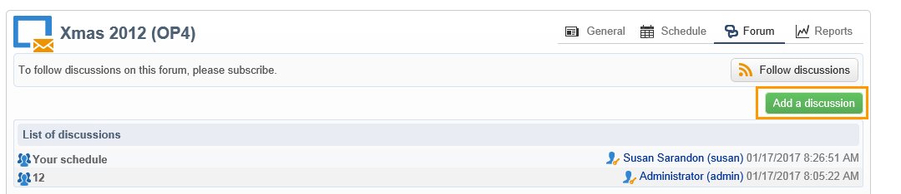

# 토론 포럼{#discussion-forums}

Adobe Campaign 운영자는 토론 포럼을 사용하여 정보를 공유할 수 있습니다. 다음 요소에는 각각 고유한 포럼이 있습니다. 계획, 프로그램, 캠페인, 리소스, 시뮬레이션, 주식. 운영자마다 개인 포럼이 있습니다. 모든 토론은 공개적이고, 심지어 개인 포럼에서도 공개됩니다.

운영자는 메시지가 게시될 때마다 알림 이메일을 받기 위해 포럼에 가입할 수 있습니다.

## 포럼 액세스 {#accessing-a-forum}

캠페인 포럼, 운영자 등을 방문하려면 해당 대시보드로 이동하여 **[!UICONTROL Forum]** 오른쪽 상단 모서리에 연결합니다. 또한 이 링크를 통해 포럼에 포함된 총 메시지 수를 확인할 수 있습니다.

## 포럼 사용 {#using-a-forum}

메시지와 해당 응답이 시간 순서대로(최신 메시지부터 가장 오래된 순서로) 표시됩니다.

메시지 콘텐츠를 표시하려면 메시지 헤더를 클릭합니다.

**새 토론 시작**

새 토론을 시작하려면 **[!UICONTROL Add a discussion]** 오른쪽 상단 모서리의 단추. 다음 **[!UICONTROL Discussion forum]** 상자가 표시됩니다(아래 참조).

**기존 토론에 메시지 게시**

기존 토론에 메시지를 게시하려면 응답할 메시지를 연 다음 **[!UICONTROL Reply]** 왼쪽 상단 모서리에 연결합니다. 다음 **[!UICONTROL Discussion forum]** 상자가 표시됩니다(아래 참조).

메시지에 회신하면 원래 메시지를 게시한 사람에게 알림이 전송됩니다.

**메시지 작성**

에서 **[!UICONTROL Discussion forum]** 상자:

1. 에 텍스트를 입력합니다. **[!UICONTROL Message]** 의 필드 및 토론 제목 **[!UICONTROL Subject]** 필드.

   

1. 필요한 경우:

   * 포럼에 참여하지 않은 다른 사람이 토론에 참여하도록 하려면 **[!UICONTROL Operator to notify]** 필드. 운영자가 이 특정 메시지에 대한 알림 이메일을 받게 됩니다(해당 메시지는 포럼에 가입되지 않음). 여러 연산자에게 알리려면 연산자 그룹을 선택합니다.
   * 메시지에 첨부 파일을 추가하려면 **[!UICONTROL Browse]**. 첨부 파일은 알림 이메일에도 포함됩니다. 첨부 파일은 개별적으로 보낼 수 있습니다. 여러 파일을 보내려면 파일을 압축해야 합니다.

1. 클릭 **[!UICONTROL Create the message]** 게시물을 포럼에 게시합니다.

>[!NOTE]
>
>포럼에 메시지가 게시되면 더 이상 변경하거나 삭제할 수 없습니다.

## 연산자의 개인 포럼에 게시합니다. {#posting-to-the-personal-forum-of-an-operator}

예를 들어 특정 캠페인이 아닌 Adobe Campaign에서 대화를 계속 추적하려는 경우 운영자 포럼에 메시지를 게시할 수 있습니다. 개인 포럼은 공개적이며 모든 운영자가 메시지를 보게 됩니다. 운영자는 누군가 개인 포럼에 게시할 때마다 메시지를 수신합니다.

운영자 포럼에 액세스하려면

* 에 액세스하는 데 필요한 권한이 있는 경우 **[!UICONTROL Administration > Access management > Operators]** 탐색기의 노드에서 원하는 연산자의 대시보드를 열고 **[!UICONTROL Forum]** 오른쪽 상단 모서리에 연결합니다.
* 없는 경우 Adobe Campaign에서 운영자 이름(이 연산자가 포럼에 게시한 메시지를 통해, 할당되는 작업을 통해)을 찾아 해당 대시보드에 액세스하려면 이 연산자를 클릭하십시오. 관리자에게 운영자 폴더의 보기를 만들도록 요청할 수도 있습니다.

## 포럼 구독 {#subscribing-to-a-forum}

포럼에 가입하면 토론을 따를 수 있습니다. 포럼에 메시지가 게시될 때마다 이메일 알림을 받게 됩니다. 이 전자 메일에는 메시지 본문과 첨부 파일이 포함됩니다. 메시지에 답하려면 이메일 본문을 클릭한 다음 Adobe Campaign 웹 인터페이스에 로그인합니다. 포럼에 가입하면 모든 사람이 이 정보를 볼 수 있습니다.

* 포럼에 가입하려면 **[!UICONTROL Follow discussions]** 메시지 목록 위에 있는 오른쪽 상단 섹션에 있는 단추입니다.

   

   섹션이 파란색으로 표시되어 포럼에 가입했음을 보여줍니다.

* 포럼에서 구독을 취소하려면 **[!UICONTROL Unsubscribe]** 버튼을 클릭합니다.

   

* 개인 대시보드에 구독한 포럼이 나열됩니다. 을(를) 클릭합니다. **[!UICONTROL Subscription to discussion forums]** 링크를 클릭하여 목록을 표시한 다음 원하는 항목을 클릭하여 포럼에 액세스합니다.

   

* 포럼에 가입한 사용자를 보려면 **[!UICONTROL List of subscribers to this discussion forum]** 메시지 목록 위에 연결합니다.

   

## 알림 배달 확인 {#checking-notification-delivery}

포럼에 가입한 운영자가 예상대로 알림을 받지 않는 경우:

* 이메일 주소를 운영자 프로필에 입력했는지 확인합니다.
* 로 이동합니다. **[!UICONTROL Administration > Production > Technical workflows > Campaign processes]** 노드 및 **[!UICONTROL Jobs in discussion forums]** 워크플로우가 시작되었으며 오류가 없습니다.
* 게재 로그 보기:

   * Adobe Campaign 홈 페이지에서 **[!UICONTROL Campaigns > Navigation > Deliveries]**&#x200B;를 열고 **[!UICONTROL Discussion forum notification]** 게재.
   * 탐색기에서 **[!UICONTROL Administration > Production > Objects created automatically > Technical deliveries > Workflow notifications]**&#x200B;를 클릭한 다음 **[!UICONTROL Discussion forum notifications]**.
   에서 **[!UICONTROL Discussion forum notifications]** 상자에서 게재 로그는 **[!UICONTROL Edit > Delivery]** 탭. 또한 **[!UICONTROL Tracking > Log]** 그리고 **[!UICONTROL Exclusion causes]** 탭.
