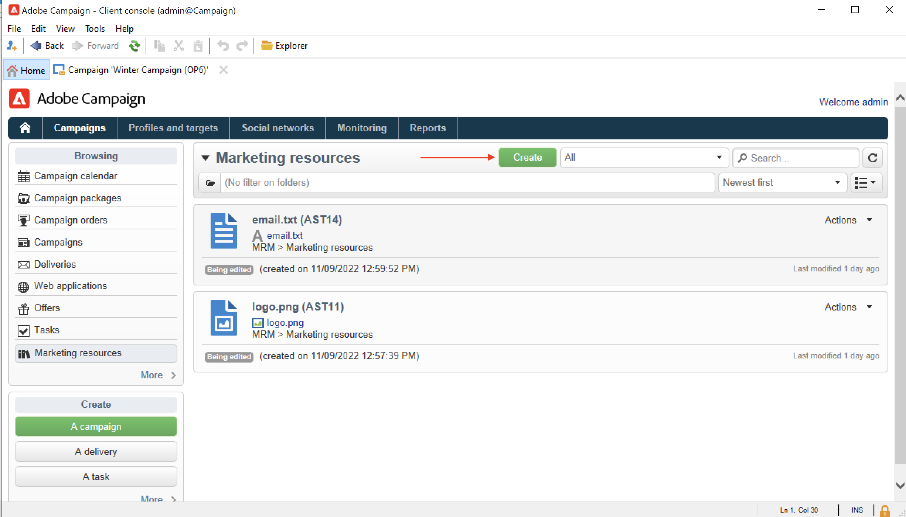
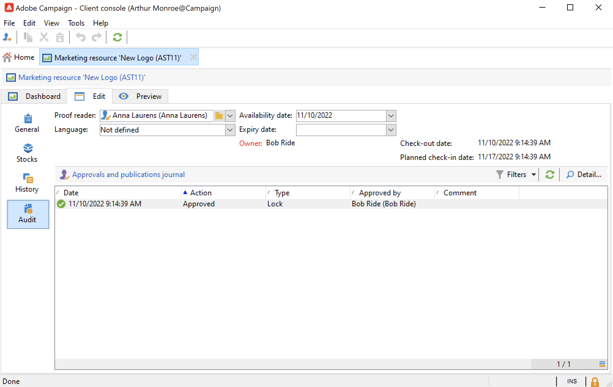

# 마케팅 리소스 관리{#managing-marketing-resources}

Adobe Campaign을 사용하여 캠페인 수명 주기와 관련된 마케팅 리소스를 관리하고 추적합니다. 이러한 마케팅 리소스는 백서, 데이터 파일, 로고 또는 캠페인과 관련된 기타 자산일 수 있습니다.

Adobe Campaign을 통해 관리되는 각 마케팅 리소스에 대해 언제든지 상태 및 내역을 추적하고 현재 버전을 볼 수 있습니다.

기본적으로 마케팅 리소스는 **[!UICONTROL MRM > Marketing resources]** Campaign 탐색기 폴더.

## 마케팅 리소스 추가 {#adding-a-marketing-resource}

마케팅 리소스를 추가하려면 아래 단계를 수행합니다.

1. 다음으로 이동 **[!UICONTROL Campaigns]** 탭을 클릭하고 다음을 선택합니다 **[!UICONTROL Marketing resouces]**.

1. **[!UICONTROL Create]** 버튼을 클릭합니다.
   
1. 마케팅 리소스 창에서 파일을 끌어다 놓아 Campaign 서버에 업로드합니다. 다음을 사용할 수도 있습니다 **[!UICONTROL Upload file to server...]** 링크를 클릭합니다.
   

업로드가 완료되면 리소스가 사용 가능한 리소스 목록에 추가됩니다.

## 마케팅 리소스 관리 {#manage-marketing-resources}

업로드되면 마케팅 리소스를 모든 Adobe Campaign 운영자가 사용할 수 있습니다. 보거나 사본을 만들어 수정하거나 서버에서 파일을 업데이트할 수 있습니다.

사용 **[!UICONTROL Assigned to]** 드롭다운 목록 **[!UICONTROL Edit]** 탭을 사용하여 리소스를 담당하는 운영자를 선택합니다.

리소스 유효성 검사와 리소스 게시를 담당하는 연산자 또는 연산자 그룹을 선택할 수도 있습니다. 이러한 옵션에 액세스하려면 다음을 클릭합니다.  **[!UICONTROL Advanced parameters]** 링크를 클릭합니다.

이러한 운영자는 리소스 유효성 검사 프로세스가 시작되면 이메일로 알림을 받습니다.

검토자를 선택하지 않으면 리소스 **[!UICONTROL cannot be]** 승인을 받아야 합니다.

사용 **[!UICONTROL Audit]** 탭을 사용하여 증명 리더를 추가하고 리소스의 가용성 날짜를 정의할 수 있습니다. 이 날짜 이후에 **[!UICONTROL Late]** 상태.

>[!NOTE]
>
>다음 **[!UICONTROL History]** 탭에는 리소스에 대한 다운로드 및 업데이트 로그가 포함되어 있습니다. 다음 **[!UICONTROL Details]** 버튼을 사용하면 선택한 버전을 볼 수 있습니다.
>
>다음 **[!UICONTROL Audit]** 탭에서는 승인, 승인 거부, 관련 댓글 또는 게시와 같은 리소스에 대해 수행되는 모든 작업을 모니터링할 수 있습니다.

### 리소스 잠금/잠금 해제 {#locking-unlocking-a-resource}

리소스가 만들어지면 마케팅 리소스 대시보드에서 사용할 수 있으며, 운영자는 리소스를 편집하고 수정할 수 있습니다.

연산자가 리소스 작업을 시작할 때 가장 좋은 방법은 다른 연산자가 동시에 수정하지 못하도록 리소스를 잠그는 것입니다. 그런 다음 리소스는 예약된 상태입니다. 이 리소스는 계속 액세스할 수 있지만 다른 운영자가 서버에 게시하거나 업데이트할 수 없습니다.

마케팅 리소스는 승인되지 않은 경우에만 잠글 수 있습니다.

리소스를 잠그려면 **[!UICONTROL Lock]** 리소스 대시보드의 버튼입니다.

리소스가 업데이트되면 **[!UICONTROL Lock]** 모든 운영자가 다시 사용할 수 있도록 하려면 리소스 대시보드의 버튼을 누릅니다.

특수 메시지는 액세스를 시도하는 모든 운영자에게 알립니다:

다음 **[!UICONTROL Tracking]** 탭은 리소스를 잠근 운영자의 이름을 나타냅니다.

>[!NOTE]
>
>리소스를 잠근 운영자와 관리자 권한이 있는 운영자만 리소스의 잠금을 해제할 권한이 있습니다.

### 토론 포럼 {#discussion-forums}

각 리소스에 대해 **[!UICONTROL Forum]** 탭에서는 참가자가 정보를 공유할 수 있습니다.

다음에서 자세히 알아보기 [토론 포럼](discussion-forums.md) 섹션.

### 승인 프로세스 {#approval-process}

예상 가용성 날짜가 리소스 세부 정보(에 지정된 경우)에 표시됩니다. **[!UICONTROL Tracking]** 탭. 이 날짜에 도달하면 다음을 사용하여 승인 프로세스를 실행할 수 있습니다. **[!UICONTROL Submit for approval]** 리소스 대시보드의 버튼입니다. 그러면 리소스 상태가 (으)로 변경됩니다. **[!UICONTROL Approval in progress]**.

리소스를 승인하려면 **[!UICONTROL Approve the resource]** 단추를 클릭합니다.

그런 다음 승인된 운영자는 승인을 수락하거나 거부할 수 있습니다. 이 작업은 다음 중 하나를 통해 수행할 수 있습니다. (알림 메시지의 링크를 클릭하여) 전송된 이메일 메시지를 통해 또는 클라이언트 콘솔을 통해 (다음을 클릭하여) **[!UICONTROL Approve]** ) 단추를 클릭합니다.

승인 창에서 설명을 입력할 수 있습니다.

다음으로 이동 **[!UICONTROL Tracking]** 탭을 클릭하여 승인을 확인합니다.

>[!NOTE]
>
>각 마케팅 리소스에 대해 지정된 검토자 외에도 관리자 권한과 리소스 매니저를 가진 운영자는 마케팅 리소스를 승인할 수 있는 권한이 있습니다.

### 리소스 게시 {#publishing-a-resource}

승인되면 마케팅 리소스를 게시해야 합니다. 출판 과정은 회사 요구사항에 따라 구체적인 시행이 이루어져야 한다. 즉, 엑스트라넷 또는 다른 서버에 리소스를 게시할 수 있으며, 특정 정보를 외부 서비스 공급자 등으로 전송할 수 있습니다.

리소스를 게시하려면 **[!UICONTROL Publish]** 마케팅 리소스 대시보드의 편집 영역 단추.

워크플로우를 통해 리소스 게시를 자동화할 수도 있습니다.

리소스를 게시하면 다른 작업(예: )에서 리소스를 사용할 수 있습니다. 이와 같은 게시는 리소스의 특성에 따라 다릅니다. 전단지의 경우 게시는 파일을 프린터에 보내는 것을 의미할 수 있으며, 웹 기관의 경우 웹 사이트에 게시하는 것을 의미할 수 있습니다.

Adobe Campaign을 게시하려면 적절한 워크플로우를 만들어 리소스에 연결해야 합니다. 이렇게 하려면 **[!UICONTROL Advanced settings...]** 리소스의 상자를 선택한 다음, **[!UICONTROL Post-processing]** 필드.

워크플로가 실행됩니다.

* 검토자가 **[!UICONTROL Publish resource]** 링크(또는 검토자가 정의되지 않은 경우 리소스 책임자).
* 마케팅 리소스 만들기 작업을 통해 리소스를 관리하는 경우 작업이 로 설정되면 이 리소스가 실행됩니다. **[!UICONTROL Finished]**, **[!UICONTROL Publish the marketing resource]** 작업에서는 상자가 선택되어 있습니다. [자세히 알아보기](creating-and-managing-tasks.md#marketing-resource-creation-task))

워크플로가 즉시 시작되지 않는 경우(예: 워크플로가 중지된 경우) 리소스의 상태가 (으)로 변경됩니다. **[!UICONTROL Pending publication]**. 워크플로우가 시작되면 리소스의 상태가 (으)로 변경됩니다. **[!UICONTROL Published]**. 이 상태는 게시 프로세스에서 발생할 수 있는 오류를 고려하지 않습니다. 워크플로우가 제대로 실행되었는지 워크플로우 상태를 확인합니다.

## 캠페인에 리소스 연결 {#linking-a-resource-to-a-campaign}

### 마케팅 리소스 참조 {#referencing-a-marketing-resource}

에서 이 기능을 선택한 경우 마케팅 리소스를 캠페인과 연결할 수 있습니다. [캠페인 템플릿](../campaigns/marketing-campaign-templates.md).

다음으로 이동 **[!UICONTROL Edit > Documents > Resources]** 캠페인 대시보드에서 탭을 클릭한 다음 을(를) 클릭합니다. **[!UICONTROL Add]** 관련 리소스를 선택합니다.

상태, 특성 또는 유형별로 리소스를 필터링하거나 개인화된 필터를 적용할 수 있습니다.

사용 **[!UICONTROL Details]** 단추를 클릭하여 리소스를 편집하고 미리 봅니다.

### 게재 개요에 마케팅 리소스 추가 {#adding-a-marketing-resource-to-a-delivery-outline}

마케팅 리소스는 게재 개요를 통해 게재와 연결할 수 있습니다.

에서 게재 개요에 대해 자세히 알아보기 [이 섹션](../campaigns/marketing-campaign-deliveries.md).

이렇게 하려면 게재 개요를 마우스 오른쪽 단추로 클릭하고 **새로 만들기 > 리소스**.

에셋의 이름을 입력하고 **마케팅 리소스** 드롭다운 목록입니다.

## 재고 관리 {#stock-management}

공급을 관리하고 재고가 부족한 경우 대시보드에 경고를 표시하기 위해 마케팅 리소스를 하나 이상의 재고에 연관시킬 수 있습니다.

마케팅 리소스를 주식과 연결하려면 아래 단계를 따르십시오.

1. 재고를 편집하거나 새 재고를 생성합니다. 의 주식에 대해 자세히 알아보기 [이 섹션](../campaigns/providers--stocks-and-budgets.md#stock-management).

1. 재고 라인을 추가하고 해당 마케팅 리소스를 선택합니다.

   

   다음을 통해 선택한 리소스를 편집할 수 있습니다. **[!UICONTROL Edit the link]** 리소스 선택 시 리소스 오른쪽에 있는 아이콘.

1. 초기 스톡과 경고 스톡을 지정한 다음 저장합니다.

재고는 마케팅 리소스에 표시됩니다 **재고** 탭.
