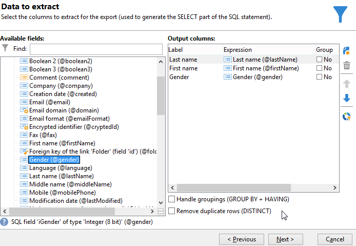

# 열거형 유형 계산 필드 추가 {#adding-an-enumeration-type-calculated-field}

여기에서는 다음을 사용하여 쿼리를 만들려고 합니다. **[!UICONTROL Enumerations]** 계산된 필드를 입력합니다. 이 필드는 데이터 미리 보기 창에서 추가 열을 생성합니다. 이 열은 각 수신자에 대한 결과로 반환되는 숫자 값(0, 1 및 2)을 지정합니다. 새 열의 각 값에 성별이 할당됩니다. 값이 &quot;0&quot;인 경우 &quot;남성&quot;이 &quot;1&quot;이면 &quot;여성&quot;, &quot;2&quot;이면 &quot;여성&quot; 또는 &quot;표시되지 않음&quot;.

* 어떤 테이블을 선택해야 합니까?

  수신자 테이블(nms:recipient)

* 출력 열에서 선택할 필드입니까?

  성, 이름, 성별

* 정보를 필터링할 기준

  수신자 언어

다음 단계를 적용합니다.

1. 일반 쿼리 편집기를 열고 수신자 테이블(**[!UICONTROL nms:recipient]**).
1. 다음에서 **[!UICONTROL Data to extract]** 창, 선택 **[!UICONTROL Last name]**, **[!UICONTROL First name]** 및 **[!UICONTROL Gender]**.

   

1. 다음에서 **[!UICONTROL Sorting]** 창에서 다음을 클릭: **[!UICONTROL Next]**: 이 예제에서는 정렬할 필요가 없습니다.
1. **[!UICONTROL Data filtering]**&#x200B;에서 **[!UICONTROL Filtering conditions]**&#x200B;을(를) 선택합니다.
1. 다음에서 **[!UICONTROL Target element]** 창, 필터 조건을 설정하여 영어를 사용하는 수신자를 수집합니다.

   

1. 다음에서 **[!UICONTROL Data formatting]** 창에서 다음을 클릭: **[!UICONTROL Add a calculated field]**.

   

1. 로 이동 **[!UICONTROL Type]** 의 창 **[!UICONTROL Export calculated field definition]** 창 및 선택 **[!UICONTROL Enumerations]**.

   새 계산된 필드가 참조해야 하는 열을 정의합니다. 이렇게 하려면 **[!UICONTROL Gender]** 열(드롭다운 메뉴) **[!UICONTROL Source column]** 필드: 대상 값이 **[!UICONTROL Gender]** 열.

   

   다음을 정의합니다. **소스** 및 **대상** 값: 대상 값을 사용하면 쿼리 결과를 더 쉽게 읽을 수 있습니다. 이 쿼리는 수신자 성별을 반환해야 하며 결과는 0, 1 또는 2가 됩니다.

   입력할 각 &quot;source-destination&quot; 행에 대해 **[!UICONTROL Add]** 다음에서 **[!UICONTROL List of enumeration values]**:

   * 다음에서 **[!UICONTROL Source]** 열에서 각 성별(0,1,2)의 소스 값을 새 라인에 입력합니다.
   * 다음에서 **[!UICONTROL Destination]** 열에서 &quot;0&quot;행에 &quot;Not indicated&quot;, &quot;1&quot;행에 &quot;Male&quot;, &quot;2&quot;행에 &quot;Female&quot; 값을 입력합니다.

   다음 항목 선택 **[!UICONTROL Keep the source value]** 함수.

   클릭 **[!UICONTROL OK]** 계산된 필드를 승인합니다.

   

1. 다음에서 **[!UICONTROL Data formatting]** 창에서 다음을 클릭: **[!UICONTROL Next]**.
1. 미리보기 창에서 **[!UICONTROL start the preview of the data]**.

   추가 열은 0, 1 및 2의 성별을 정의합니다.

   * &quot;표시되지 않음&quot;의 경우 0
   * &quot;Male&quot;의 경우 1
   * &quot;Female&quot;의 경우 2

   

   예를 들어 다음에 성별 &quot;2&quot;를 입력하지 않으면 **[!UICONTROL List of enumeration values]**&#x200B;및 **[!UICONTROL Generate a warning and continue]** 의 함수 **[!UICONTROL In other cases]** 필드를 선택하면 경고 로그가 표시됩니다. 이 로그는 성별 &quot;2&quot;(여성)가 입력되지 않았음을 나타냅니다. 다음 위치에 표시됩니다. **[!UICONTROL Logs generated during export]** 데이터 미리 보기 창의 필드.

   

   다른 예를 들어 열거형 값 &quot;2&quot;가 입력되지 않았다고 가정해 보겠습니다. 다음 항목 선택 **[!UICONTROL Generate an error and reject the line]** 함수: 모든 성별 &quot;2&quot; 수신자는 예외 항목과 기타 정보(성 및 이름 등)를 표시합니다. 은(는) 내보내지지 않습니다. 오류 로그가 **[!UICONTROL Logs generated during export]** 데이터 미리 보기 창의 필드. 이 로그는 열거형 값 &quot;2&quot;가 입력되지 않았음을 나타냅니다.

   
