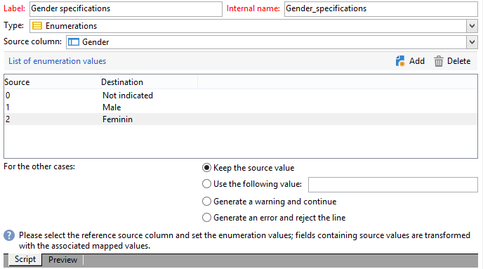

# 열거형 유형 계산 필드 추가 {#adding-an-enumeration-type-calculated-field}

여기서는 **[!UICONTROL Enumerations]** 유형의 계산된 필드가 있는 쿼리를 만듭니다. 이 필드는 데이터 미리 보기 창에서 추가 열을 생성합니다. 이 열은 각 수신자에 대한 결과로 반환되는 숫자 값(0, 1 및 2)을 지정합니다. 새 열의 각 값에 성별이 할당됩니다. 값이 &quot;0&quot;인 경우 &quot;남성&quot;이 &quot;1&quot;이면 &quot;여성&quot;, &quot;2&quot;이면 &quot;여성&quot; 또는 &quot;표시되지 않음&quot;.

* 어떤 테이블을 선택해야 합니까?

  수신자 테이블(nms:recipient)

* 출력 열에서 선택할 필드입니까?

  성, 이름, 성별

* 정보를 필터링할 기준

  수신자 언어

다음 단계를 적용합니다.

1. 제네릭 쿼리 편집기를 열고 수신자 테이블(**[!UICONTROL nms:recipient]**)을 선택합니다.
1. **[!UICONTROL Data to extract]** 창에서 **[!UICONTROL Last name]**, **[!UICONTROL First name]** 및 **[!UICONTROL Gender]**&#x200B;을(를) 선택합니다.

   

1. **[!UICONTROL Sorting]** 창에서 **[!UICONTROL Next]**&#x200B;을(를) 클릭합니다. 이 예제에서는 정렬이 필요하지 않습니다.
1. **[!UICONTROL Data filtering]**&#x200B;에서 **[!UICONTROL Filtering conditions]**&#x200B;을(를) 선택합니다.
1. **[!UICONTROL Target element]** 창에서 필터 조건을 설정하여 영어를 사용하는 수신자를 수집합니다.

   

1. **[!UICONTROL Data formatting]** 창에서 **[!UICONTROL Add a calculated field]**&#x200B;을(를) 클릭합니다.

   

1. **[!UICONTROL Export calculated field definition]** 창의 **[!UICONTROL Type]** 창으로 이동하여 **[!UICONTROL Enumerations]**&#x200B;을(를) 선택합니다.

   새 계산된 필드가 참조해야 하는 열을 정의합니다. 이렇게 하려면 **[!UICONTROL Source column]** 필드의 드롭다운 메뉴에서 **[!UICONTROL Gender]** 열을 선택합니다. 대상 값은 **[!UICONTROL Gender]** 열과 일치합니다.

   

   **Source** 및 **대상** 값을 정의합니다. 대상 값을 사용하면 쿼리 결과를 더 쉽게 읽을 수 있습니다. 이 쿼리는 수신자 성별을 반환해야 하며 결과는 0, 1 또는 2가 됩니다.

   입력할 각 &quot;source-destination&quot; 줄에 대해 **[!UICONTROL List of enumeration values]**&#x200B;에서 **[!UICONTROL Add]**&#x200B;을(를) 클릭합니다.

   * **[!UICONTROL Source]** 열에서 각 성별(0,1,2)의 원본 값을 새 줄에 입력하십시오.
   * **[!UICONTROL Destination]** 열에 줄 &quot;0&quot;에 &quot;Not indicated&quot;, 줄 &quot;1&quot;에 &quot;Male&quot;, 줄 &quot;2&quot;에 &quot;Female&quot; 값을 입력합니다.

   **[!UICONTROL Keep the source value]** 함수를 선택하십시오.

   계산된 필드를 승인하려면 **[!UICONTROL OK]**&#x200B;을(를) 클릭하십시오.

   

1. **[!UICONTROL Data formatting]** 창에서 **[!UICONTROL Next]**&#x200B;을(를) 클릭합니다.
1. 미리 보기 창에서 **[!UICONTROL start the preview of the data]**.

   추가 열은 0, 1 및 2의 성별을 정의합니다.

   * &quot;표시되지 않음&quot;의 경우 0
   * &quot;Male&quot;의 경우 1
   * &quot;Female&quot;의 경우 2

   

   예를 들어 **[!UICONTROL List of enumeration values]**&#x200B;에 성별 &quot;2&quot;를 입력하지 않고 **[!UICONTROL In other cases]** 필드의 **[!UICONTROL Generate a warning and continue]** 함수를 선택하면 경고 로그가 표시됩니다. 이 로그는 성별 &quot;2&quot;(여성)가 입력되지 않았음을 나타냅니다. 데이터 미리 보기 창의 **[!UICONTROL Logs generated during export]** 필드에 표시됩니다.

   

   다른 예를 들어 열거형 값 &quot;2&quot;가 입력되지 않았다고 가정해 보겠습니다. **[!UICONTROL Generate an error and reject the line]** 함수 선택: 모든 성별 &quot;2&quot; 받는 사람이 예외 항목 및 기타 정보(성 및 이름 등)를 줄바꿈합니다. 은(는) 내보내지지 않습니다. 데이터 미리 보기 창의 **[!UICONTROL Logs generated during export]** 필드에 오류 로그가 표시됩니다. 이 로그는 열거형 값 &quot;2&quot;가 입력되지 않았음을 나타냅니다.

   
