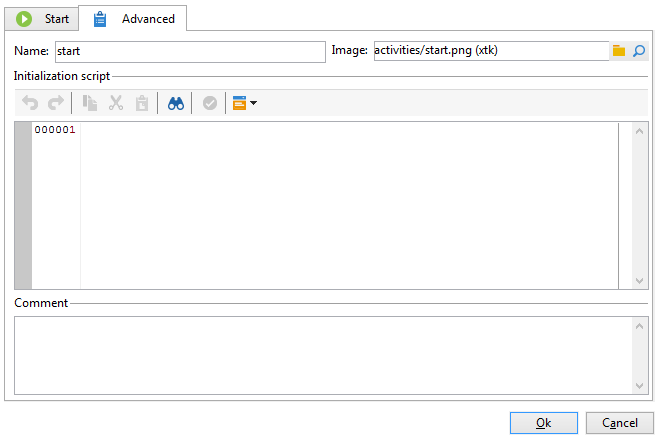
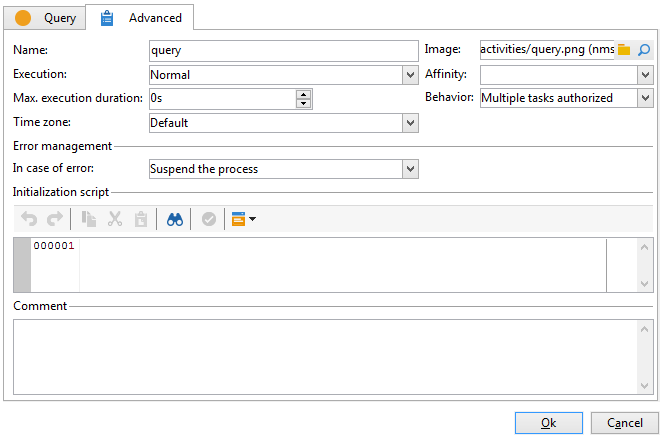

# 고급 매개 변수{#advanced-parameters}

활동의 속성 화면에는 **[!UICONTROL Advanced]** 오류가 발생하는 경우 해당 활동의 실행 기간, 활동을 실행할 수 있는 탭을 정의할 수 있습니다. 및 을 사용하여 초기화 스크립트를 입력할 수 있습니다. 이 탭에는 다음 두 가지 버전이 있습니다.

* 간소화된 버전(용) **[!UICONTROL Start]** 및 **[!UICONTROL End]** 인스턴스용 활동

   

* 더 자세한 버전(용) **[!UICONTROL Query]** 활동, 예

   

에 입력할 필드 **[!UICONTROL Advanced]** 탭은 다음 섹션에 자세히 설명되어 있습니다.

## 이름 {#name}

이 필드에는 활동의 내부 이름이 포함되어 있습니다.

## 이미지 {#image}

이 필드에서는 활동에 연결된 이미지를 변경할 수 있습니다. 자세한 내용은 [활동 이미지 변경](change-activity-images.md).

## 실행 {#execution}

이 필드에서는 작업이 트리거될 때 수행할 작업을 정의할 수 있습니다. 다음 세 가지 옵션을 사용할 수 있습니다.

일반적으로 이러한 옵션은 활동을 마우스 오른쪽 단추로 클릭하여 장바구니에서 선택됩니다.

* **[!UICONTROL Normal]**: 활동이 평소대로 실행됩니다.
* **[!UICONTROL Do not activate]**: 이 작업과 다음 작업(동일한 분기에 있음)이 모두 실행되지 않습니다.
* **[!UICONTROL Activate but do not execute]**: 이 작업과 다음 작업(동일한 분기에 있음)이 자동으로 중지됩니다. 이 기능은 작업이 시작될 때 해당 위치에 있기를 원하는 경우 유용합니다. 작업을 수동으로 실행하려면 활동을 마우스 오른쪽 단추로 클릭하고 을 선택합니다 **[!UICONTROL Normal execution]**.

## 선호도 {#affinity}

특정 컴퓨터에서 워크플로우 또는 워크플로우 활동을 강제로 실행하도록 선택할 수 있습니다. 이를 수행하려면 워크플로우 또는 관련 활동 수준에서 하나 이상의 자산을 정의해야 합니다.

## 맥스 실행 기간 {#max--execution-period}

이 필드를 사용하면 작업이 너무 오래 걸리는 경우에 대한 경고를 설정할 수 있습니다. 워크플로우 작업에는 영향을 주지 않습니다. 작업이 시간 내에 완료되지 않으면 **[!UICONTROL Max. execution period]** 다 끝났어 **[!UICONTROL Instance monitoring]** 페이지에 이 워크플로우에 대한 경고가 표시됩니다. 이 페이지는 **[!UICONTROL Monitoring]** 홈 페이지의 탭.

## 비헤이비어 {#behavior}

이 필드에서는 비동기 작업 사용에 적용할 동작을 정의할 수 있습니다. 다음 두 가지 옵션을 사용할 수 있습니다.

* **[!UICONTROL Several tasks authorized]**: 첫 번째 작업이 완료되지 않더라도 여러 작업이 한 번에 실행될 수 있습니다.
* **[!UICONTROL The current task has priority]**: 진행 중인 작업이 우선합니다. 작업이 진행 중인 한 다른 작업이 실행되지 않습니다.

## 시간대 {#time-zone}

이 필드에서는 활동의 시간대를 선택할 수 있습니다. 자세한 내용은 [시간대 관리](managing-time-zones.md).

## 오류의 경우 {#in-case-of-errors}

이 필드를 사용하면 활동에 오류가 있을 때 수행할 작업을 정의할 수 있습니다. 다음 두 가지 옵션을 사용할 수 있습니다.

* **[!UICONTROL Suspend the process]**: 워크플로우가 자동으로 중지됩니다. 상태가 **[!UICONTROL Failed]**. 문제가 해결되면 워크플로우를 다시 시작합니다.
* **[!UICONTROL Ignore]**: 이 작업과 다음 작업(동일한 분기에 있음)이 모두 실행되지 않습니다. 이 기능은 반복 작업에 유용할 수 있습니다. 분기에 업스트림에 스케줄러가 있으면 다음 실행 날짜에 평소대로 시작됩니다.
* **[!UICONTROL Abort on error]**: 워크플로우는 자동으로 중지되며 다시 시작할 수 없습니다. 상태가 **[!UICONTROL Failed]**.

## 초기화 스크립트 {#initialization-script}

이 필드를 사용하면 변수를 초기화하거나 활동 속성을 수정할 수 있습니다. 자세한 내용은 다음을 참조하십시오. [JavaScript 스크립트 및 템플릿](javascript-scripts-and-templates.md).

## 댓글 {#comment}

다음 **[!UICONTROL Comment]** 필드는 설명을 추가할 수 있는 자유 필드입니다.
