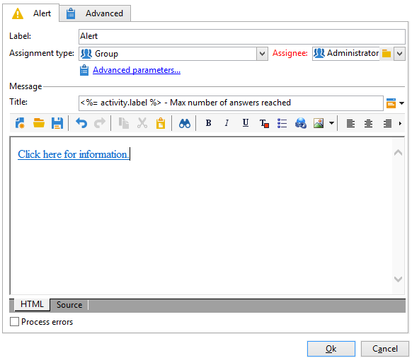

# 경고{#alert}

An **경고** 활동이 운영자 그룹에 메시지를 보냅니다. 승인 활동과 동일하게 운영되나 이 경우 어떠한 반응도 예상되지 않는다.

경고는 영구적이지 않으므로 콘솔에서 볼 수 없습니다. 알림을 받으려면 할당된 그룹의 운영자에게 전체 이메일 주소가 있어야 합니다. 이 활동의 구성은 의 구성과 유사합니다. **승인**. 운영자에게 경고하는 데 사용되는 기본 게재 템플릿은 &#39;alertAssignee&#39;입니다.
