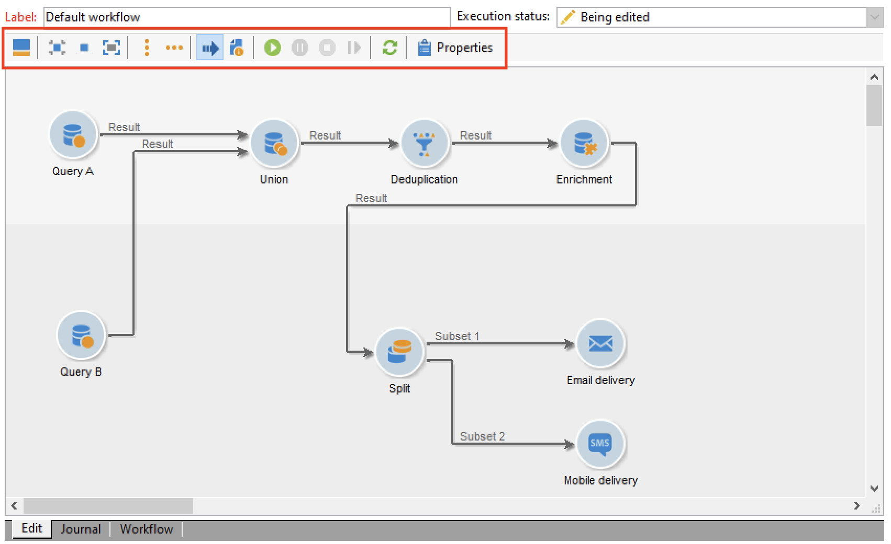

# 워크플로우 구축 {#build-a-workflow}

## 새 워크플로우 만들기 {#create-a-new-workflow}

워크플로 생성 흐름은 워크플로 유형에 따라 다릅니다. 다음을 수행할 수 있습니다.

* 만들기 [타겟팅 워크플로우](#targeting-workflows) 다음에서 **[!UICONTROL Profiles and Targets]** > **[!UICONTROL Jobs]** > **[!UICONTROL Targeting workflows]** Explorer의 노드 또는 **[!UICONTROL Profiles and Targets]** 을 통해 홈 페이지의 탭 **[!UICONTROL Targeting workflows]** 하위 탭.

  

* 만들기 [캠페인 워크플로우](#campaign-workflows) 다음에서 **[!UICONTROL Targeting and workflows]** 캠페인의 탭

* 만들기 [기술 워크플로우](#technical-workflows) 다음에서 **[!UICONTROL Administration]** > **[!UICONTROL Production]** > **[!UICONTROL Technical workflows]** 탐색기의 노드입니다. 가장 좋은 방법은 기술 워크플로우를 저장할 특정 워크플로우 폴더를 만드는 것입니다.

다음을 클릭합니다. **[!UICONTROL New]** 워크플로 목록 위에 있는 단추입니다.

레이블을 입력하고 클릭 **[!UICONTROL Save]**.

## 활동 추가 및 연결 {#add-and-link-activities}

이제 다양한 활동을 정의하고 이를 다이어그램에서 함께 연결해야 합니다. 이 구성 단계에서는 다이어그램 레이블 및 워크플로 상태(편집 진행 중)를 볼 수 있습니다. 창의 아래 섹션은 다이어그램을 편집하는 데만 사용됩니다. 여기에는 도구 모음, 활동 팔레트(왼쪽) 및 다이어그램 자체(오른쪽)가 포함되어 있습니다.

>[!NOTE]
>
>팔레트가 표시되지 않으면 워크플로 도구 모음의 첫 번째 버튼을 클릭하여 표시합니다.

활동은 팔레트의 다른 탭에서 카테고리별로 그룹화됩니다. 사용 가능한 탭 및 활동은 워크플로우 유형(기술, 타겟팅 또는 캠페인 워크플로우)에 따라 달라질 수 있습니다.

* 첫 번째 탭에는 타겟팅 및 데이터 조작 활동이 포함되어 있습니다. 이러한 활동은에 자세히 설명되어 있습니다. [타겟팅 활동](targeting-activities.md).
* 두 번째 탭에는 주로 다른 활동을 조정하는 데 사용되는 예약 활동이 포함되어 있습니다. 이러한 활동은에 자세히 설명되어 있습니다. [흐름 제어 활동](flow-control-activities.md).
* 세 번째 탭에는 워크플로우에서 사용할 수 있는 도구와 작업이 포함되어 있습니다. 이러한 활동은에 자세히 설명되어 있습니다. [작업 활동](action-activities.md).
* 네 번째 탭에는 전자 메일 수신 또는 서버에서의 파일 도착과 같이 주어진 이벤트에 의존하는 활동이 포함되어 있습니다. 이러한 활동은에 자세히 설명되어 있습니다. [이벤트 활동](event-activities.md).

다이어그램을 만들려면

1. 팔레트에서 활동을 선택하고 끌어서 놓기 작업을 사용하여 다이어그램으로 이동하여 활동을 추가합니다.

   추가 **시작** 활동 및 **게재** 다이어그램에 대한 활동.

   

1. 을(를) 끌어서 활동을 함께 연결합니다. **시작** 활동 전환 및 삭제 **게재** 활동.

   

   전환 끝에 새 활동을 배치하여 활동을 이전 활동에 자동으로 연결할 수 있습니다.

1. 아래 다이어그램에 표시된 대로 필요한 활동을 추가하고 함께 연결합니다.

   

>[!CAUTION]
>
>동일한 워크플로우 내에서 활동을 복사하여 붙여넣을 수 있습니다. 하지만 다른 워크플로우에서는 붙여넣기 활동을 복사하지 않는 것이 좋습니다. 게재 및 스케줄러와 같은 활동에 첨부된 일부 설정은 대상 워크플로우를 실행하는 동안 충돌 및 오류를 초래할 수 있습니다. 대신 다음을 추천했습니다.  **복제** 워크플로. 자세한 내용은 [중복 워크플로우](#duplicate-workflows).

다음 요소를 사용하여 차트의 표시 및 레이아웃을 변경할 수 있습니다.

* **도구 모음 사용**

  다이어그램 편집 도구 모음을 사용하면 워크플로우의 레이아웃 및 실행 기능에 액세스할 수 있습니다.

  

  이렇게 하면 팔레트 표시와 그래픽 객체의 개요, 크기 및 정렬과 같은 편집 도구의 레이아웃을 조정할 수 있습니다.

  

  진행률 및 로그 표시와 관련된 아이콘은 다음 섹션에 자세히 설명되어 있습니다.

   * [진행 상황 표시](monitor-workflow-execution.md#displaying-progress)
   * [로그 표시](monitor-workflow-execution.md#displaying-logs)

* **개체 정렬**

  아이콘을 정렬하려면 아이콘을 선택하고 **[!UICONTROL Align vertically]** 또는 **[!UICONTROL Align horizontally]** 아이콘.

  사용 **CTRL** 키를 눌러 여러 분산 활동을 선택하거나 하나 이상의 활동을 선택 해제합니다. 다이어그램 배경을 클릭하여 모든 항목을 선택 취소합니다.

* **이미지 관리**

  다이어그램의 배경 이미지와 다양한 활동과 관련된 배경 이미지를 사용자 지정할 수 있습니다. 을(를) 참조하십시오 [활동 이미지 변경](change-activity-images.md).

## 활동 구성 {#configure-activities}

활동을 두 번 클릭하여 구성하거나 마우스 오른쪽 단추를 클릭하고 다음을 선택합니다. **[!UICONTROL Open...]**.

>[!NOTE]
>
>캠페인 워크플로우 활동에 대해서는 다음에서 자세히 설명합니다. [이 섹션](activities.md).

첫 번째 탭에는 기본 구성이 포함되어 있습니다. 다음 **[!UICONTROL Advanced]** 탭에는 특히 오류가 발생할 때 동작을 정의하고, 활동의 실행 기간을 지정하고, 초기화 스크립트를 입력하는 데 사용되는 추가 매개 변수가 포함되어 있습니다.

활동을 더 잘 이해하고 워크플로우 가독성을 높이기 위해 활동에 주석을 입력할 수 있습니다.

이러한 주석은 운영자가 활동을 스크롤할 때 자동으로 표시됩니다.

## 워크플로 템플릿 {#workflow-templates}

워크플로우 템플릿에는 속성의 전체 구성과 다이어그램 내에서 연결되는 다양한 활동이 포함됩니다. 이 구성은 특정 수의 사전 구성된 요소를 포함하는 새 워크플로를 만드는 데 재사용할 수 있습니다

기존 템플릿을 기반으로 새 워크플로우 템플릿을 만들거나 워크플로우를 템플릿으로 직접 변경할 수 있습니다.

워크플로 템플릿은에 저장됩니다. **[!UICONTROL Resources > Templates > Workflow templates]** 탐색기의 노드입니다.

일반적인 워크플로우 속성 외에도 템플릿 속성을 사용하여 이 템플릿을 기반으로 만든 워크플로우의 실행 파일을 지정할 수 있습니다.

## 중복 워크플로우 {#duplicate-workflows}

다양한 유형의 워크플로우를 복제할 수 있습니다. 복제되고 나면 워크플로우의 수정 사항이 워크플로우의 복사본으로 옮겨지지 않습니다.

>[!CAUTION]
>
>워크플로우에서 복사-붙여넣기를 사용할 수 있지만 다음을 사용하는 것이 좋습니다. **복제**. 활동을 복사하면 전체 구성이 유지됩니다. 게재 활동(이메일, SMS, 푸시 알림...)의 경우 활동에 첨부된 게재 개체도 복사되며 이로 인해 충돌이 발생할 수 있습니다.

1. 워크플로우를 마우스 오른쪽 버튼으로 클릭합니다.
1. 클릭 **복제**.

   

1. 워크플로우 창에서 워크플로우 레이블을 변경합니다.
1. **저장**&#x200B;을 클릭합니다.

중복 기능은 캠페인 보기에서 직접 사용할 수 없습니다.

하지만 인스턴스의 모든 워크플로를 표시하는 보기를 만들 수 있습니다. 이 보기에서 다음을 사용하여 워크플로우를 복제할 수 있습니다. **복제 대상**.

**보기 만들기**

1. 위치 **탐색기**&#x200B;에서 보기를 만들어야 하는 폴더로 이동합니다.
1. 마우스 오른쪽 버튼을 클릭하고 다음 위치로 이동 **새 폴더 추가** > **프로세스**, 선택 **워크플로**.

   

새 폴더 **워크플로** 이(가) 만들어졌습니다.

1. 마우스 오른쪽 단추를 클릭하고 선택 **속성**.
1. 다음에서 **제한** 탭, 활성화 **이 폴더는 보기입니다.** 옵션 및 클릭 **저장**.

   

이제 폴더가 인스턴스의 모든 워크플로우로 채워집니다.

**캠페인 워크플로우 복제**

1. 워크플로우 보기에서 캠페인 워크플로우를 선택합니다.
1. 마우스 오른쪽 버튼 클릭 **복제 대상**.
1. 레이블을 변경합니다.
1. **저장**&#x200B;을 클릭합니다.

워크플로우 보기에서 복제된 워크플로우를 볼 수 있습니다.
