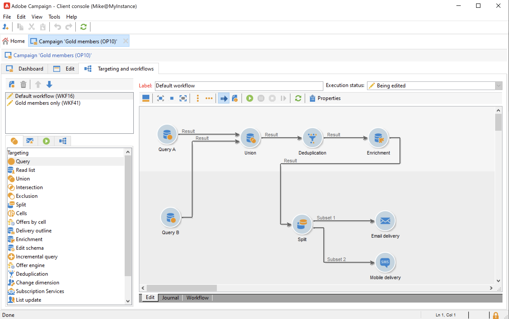

# 캠페인 워크플로 {#campaign-workflows}

각 캠페인에 대해 **[!UICONTROL Targeting and workflows]** 탭. 이러한 워크플로우는 캠페인에만 적용됩니다.

이 탭에는 모든 워크플로우와 동일한 활동이 포함되어 있습니다. [자세히 알아보기](#implementation-steps-)

캠페인 워크플로우를 타겟팅 캠페인 외에, 사용 가능한 모든 채널에 대해 게재를 완전히 만들고 구성할 수 있습니다. 워크플로우에서 만든 후, 캠페인의 대시보드에서 이러한 게재를 사용할 수 있습니다.

모든 캠페인 워크플로우는 **[!UICONTROL Administration > Production > Objects created automatically > Campaign workflows]** 노드 아래에 있어야 합니다.

캠페인 워크플로우 및 구현 예는 [이 섹션](../campaigns/marketing-campaign-target.md).
