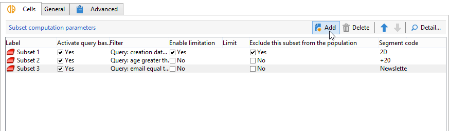
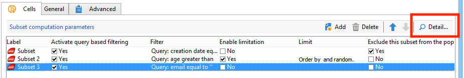
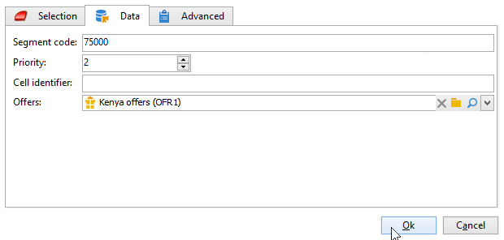

# 셀{#cells}

**[!UICONTROL Cells]** 활동은 다양한 하위 집합의 보기를 데이터 열로 제공합니다. 하위 집합 조작을 용이하게 하고 개인화 기능을 활용하도록 설계되었습니다.



이 활동은 사용자 요구에 따라 특정 매개 변수를 입력하도록 구성할 수 있습니다. 기본적으로 각 하위 집합의 세부 정보는 **[!UICONTROL Cells]** 및 **[!UICONTROL Advanced]** 탭을 통해 전용 창에 자세히 표시됩니다.



아래 예에서는 입력 양식이 수정되었습니다. 각 하위 집합에 대해 오퍼와 우선 순위 수준을 연결할 수 있도록 **[!UICONTROL Data]** 탭이 추가되었습니다.



이 구성의 경우 Adobe Campaign 탐색기의 **[!UICONTROL Administration > Configurations > Input forms]** 노드에서 다음 정보가 워크플로 양식에 추가되었습니다.

```
<container img="nms:miniatures/mini-enrich.png" label="Data">
                <input xpath="@code"/>
                <container xpath="select/node[@alias='@numTest']">
                  <input alwaysActive="true" expr="'long'" type="expr" xpath="@type"/>
                  <input alwaysActive="true" expr="'Priority'" type="expr" xpath="@label"/>
                  <input label="Priority" maxValue="12" minValue="0" type="number"
                         xpath="@value" xpathEditFromType="@type"/>
                </container>
                <container xpath="select/node[@alias='@test']">
                  <input alwaysActive="true" expr="'string'" type="expr" xpath="@type"/>
                  <input alwaysActive="true" expr="'Identifier'" type="expr" xpath="@label"/>
                  <input label="Cell identifier" xpath="@value"/>
                </container>
                <container xpath="select/node[@alias='linkTest']">
                  <input alwaysActive="true" expr="'link'" type="expr" xpath="@type"/>
                  <input alwaysActive="true" expr="'nms:offer'" type="expr" xpath="@dataType"/>
                  <input alwaysActive="true" expr="'Offre'" type="expr" xpath="@label"/>
                  <input computeStringAlias="@valueLabel" label="Offers" notifyPathList="@_cs|@valueLabel"
                         schema="nms:offer" type="linkEdit" xpath="@value"/>
                </container>
```

Adobe Campaign의 입력 양식 개인화는 전문가 사용자용으로 예약되어 있습니다.