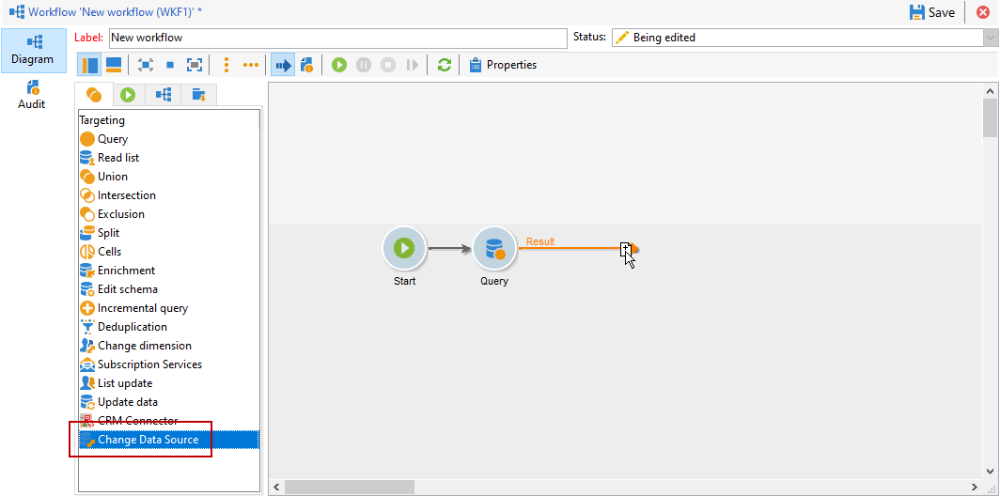

# 데이터 소스 변경 {#change-data-source}

**[!UICONTROL Change data source]** 활동을 사용하여 [워크플로 작업 테이블](use-workflow-data.md#workflow-temporary-work-table)의 데이터 원본을 변경합니다. 이 활동을 통해 FDA(Federated Data Access), FFDA(Campaign Cloud Database) 및 Campaign 로컬 데이터베이스와 같은 다양한 데이터 소스에서 데이터를 보다 유연하게 관리할 수 있습니다.

워크플로우 **[!UICONTROL Working table]**&#x200B;은(는) 워크플로우 활동과 데이터를 처리하고 공유하는 데 사용됩니다.

기본적으로 **[!UICONTROL Working table]**&#x200B;은(는) 쿼리해야 하는 데이터의 원본과 동일한 데이터베이스에 만들어집니다.
예를 들어 클라우드 데이터베이스에 저장된 **[!UICONTROL Recipients]** 테이블을 쿼리하는 경우 워크플로우는 동일한 클라우드 데이터베이스에 **[!UICONTROL Working table]**&#x200B;을(를) 만듭니다.

**[!UICONTROL Change Data Source]** 활동을 사용하여 **[!UICONTROL Working table]**&#x200B;에 대해 다른 데이터 원본을 사용하십시오.

**[!UICONTROL Change Data Source]** 활동을 사용하는 경우 워크플로우 실행을 계속하려면 클라우드 데이터베이스로 다시 전환해야 합니다.

>[!IMPORTANT]
>
>**[!UICONTROL Change Dimension]** 및 **[!UICONTROL Change Data source]** 활동을 한 행에 추가해서는 안 됩니다. 두 활동을 연속해서 사용해야 하는 경우 두 활동 사이에 **[!UICONTROL Enrichement]** 활동을 포함해야 합니다. 이렇게 하면 적절한 실행이 보장되며 잠재적인 충돌 또는 오류가 방지됩니다.

**[!UICONTROL Change Data Source]** 활동을 사용하려면 다음을 수행해야 합니다.

1. 워크플로우를 만듭니다.

1. **[!UICONTROL Query]** 활동을 사용하여 타깃팅된 수신자를 쿼리합니다.

   **[!UICONTROL Query]** 활동에 대한 자세한 내용은 이 [페이지](query.md#create-a-query)를 참조하세요.

1. **[!UICONTROL Change data source]** 활동을 추가합니다.

   

1. **[!UICONTROL Change data source]** 활동을 편집하여 **[!UICONTROL Default data source]**&#x200B;을(를) 선택하십시오.

   그러면 쿼리 결과가 포함된 작업 테이블이 기본 Campaign 로컬 데이터베이스로 이동합니다.

   

1. 작업 테이블에서 단일 작업을 수행하려면 **[!UICONTROL JavaScript code]** 활동을 추가하십시오.

   **[!UICONTROL JavaScript code]** 활동에 대한 자세한 내용은 [이 페이지](sql-code-and-javascript-code.md#javascript-code)를 참조하세요.

1. 클라우드 데이터베이스로 다시 전환하려면 다른 **[!UICONTROL Change data source]** 활동을 추가하십시오.

1. 이 활동을 편집하고 **[!UICONTROL Active FDA external account]** 및 해당 **[!UICONTROL External database]** 외부 계정을 선택합니다.

   

1. 이제 워크플로우를 시작할 수 있습니다.
