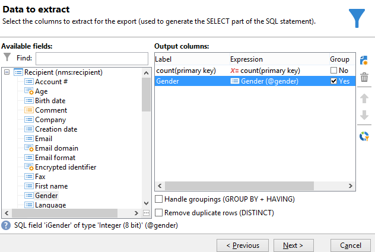

# 집계 계산 수행 {#performing-aggregate-computing}

이 예제에서는 성별에 따라 런던에 거주하는 수신자 수를 세려고 합니다.

* 어떤 테이블을 선택해야 합니까?

  수신자 테이블(**nms:recipient**)

* 출력 열에서 어떤 필드를 선택해야 합니까?

  기본 키(개수 포함) 및 성별

* 필터링된 정보는 어떤 조건을 기반으로 합니까?

  London에 거주하는 수신자 기준

이 예제를 만들려면 다음 단계를 적용합니다.

1. **[!UICONTROL Data to extract]**&#x200B;에서 기본 키의 개수를 정의합니다(이전 예제와 같이). 출력 열에 **[!UICONTROL Gender]** 필드를 추가합니다. **[!UICONTROL Gender]** 열에서 **[!UICONTROL Group]** 옵션을 선택하십시오. 이렇게 하면 수신자를 성별에 따라 그룹화합니다.

   

1. **[!UICONTROL Sorting]** 창에서 **[!UICONTROL Next]**&#x200B;을(를) 클릭합니다. 여기에는 정렬이 필요하지 않습니다.
1. 데이터 필터링을 구성합니다. 여기서는 런던에 거주하는 연락처로 선택을 제한합니다.

   

   >[!NOTE]
   >
   >값은 대/소문자를 구분합니다. 대문자가 없는 조건에 &#39;London&#39; 값을 입력하고 수신자 목록에 대문자가 있는 단어 &quot;London&quot;이 포함된 경우 쿼리가 실패합니다.

1. **[!UICONTROL Data formatting]** 창에서 **[!UICONTROL Next]**&#x200B;을(를) 클릭합니다. 이 예제는 서식이 필요하지 않습니다.
1. 미리 보기 창에서 **[!UICONTROL Launch data preview]**&#x200B;을(를) 클릭합니다.

   성별을 기준으로 정렬되는 각 값에는 세 개의 값이 있습니다. 여성의 경우 **2**, 남성의 경우 **1**, 성별을 알 수 없는 경우 **0**. 이 예에서는 여성 10명, 남성 16명, 성별이 알려지지 않은 2명의 명단이 포함되어 있다.

   
