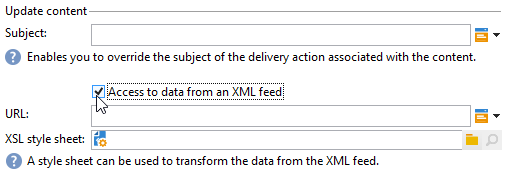

# 콘텐츠 관리{#content-management}

A **콘텐츠 관리** 활동을 사용하면 컨텐츠를 만들고 조작하고 이 컨텐츠를 기반으로 파일을 생성할 수 있습니다. 그런 다음 &#39;배달&#39; 활동을 통해 이 콘텐츠를 전달할 수 있습니다.

>[!CAUTION]
>
>컨텐츠 관리는 선택 사항인 Adobe Campaign 모듈입니다. 사용권 계약을 확인하십시오.

활동의 속성은 다음 세 단계로 나누어집니다.

* **콘텐츠 선택**: 콘텐츠는 이전에 만들거나 활동을 통해 만들 수 있습니다.
* **콘텐츠 업데이트**: 작업은 컨텐츠의 제목을 수정하거나 모든 XML 내용을 가져올 수 있습니다.
* **작업**: 결과 컨텐츠를 저장하거나 생성할 수 있습니다.

   

1. **콘텐츠**

   * **[!UICONTROL Specified in the transition]**

      이 옵션을 사용하면 전환에 지정된 컨텐츠, 즉 컨텐츠 관리를 활성화하는 이벤트에 다음을 포함해야 합니다 **[!UICONTROL contentId]** 변수를 채우는 방법을 설명합니다. 이 변수는 이전 콘텐츠 관리 또는 스크립트로 설정할 수 있습니다.

   * **[!UICONTROL Explicit]**

      이 옵션을 사용하면 **[!UICONTROL Content]** 필드. 이 필드는 **[!UICONTROL Explicit]** 옵션이 선택되어 있습니다.

      

   * **[!UICONTROL Calculated by a script]**

      콘텐츠 식별자는 스크립트로 계산됩니다. 다음 **[!UICONTROL Script]** 필드를 사용하면 컨텐츠의 식별자(기본 키)를 평가하는 JavaScript 템플릿을 정의할 수 있습니다. 이 필드는 **[!UICONTROL Calculated by a script]** 옵션이 선택되어 있습니다.

      

   * **[!UICONTROL New, created from a publication template]**

      게시 템플릿에서 새 컨텐츠를 만듭니다. 이 새 컨텐츠는 **[!UICONTROL String]** 필드. 다음 **[!UICONTROL Template]** 필드에서는 컨텐츠를 만드는 데 사용할 게시 템플릿을 지정합니다.

      

1. **콘텐츠 업데이트**

   * **[!UICONTROL Subject]**

      이 필드에서는 컨텐츠의 주제를 수정할 수 있습니다.

   * **[!UICONTROL Access to data from an XML feed]**

      이 옵션을 사용하면 XSL 스타일시트를 통해 다운로드한 XML 문서에서 컨텐츠를 구성할 수 있습니다. 이 옵션을 선택하면 **[!UICONTROL URL]** 필드에서는 URL을 다운로드하는 XML 콘텐츠를 지정합니다. 다음 **[!UICONTROL XSL stylesheet]** 다운로드한 XML 문서를 변형하는 데 사용할 스타일시트를 지정할 수 있습니다. 이 속성은 선택 사항입니다.

      

1. **실행할 작업**

   * **[!UICONTROL Save]**

      이 옵션은 만들거나 수정한 콘텐츠를 저장합니다.

      아웃바운드 전환은 컨텐츠를에 저장하고 한 번만 활성화됩니다 **[!UICONTROL contentId]** 변수를 매개 변수로 사용하십시오.

   * **[!UICONTROL Generate]**

      이 옵션은 컨텐츠를 저장한 다음 &#39;파일&#39; 유형 게시가 있는 각 변형 템플릿의 출력 파일을 생성합니다.

      

      아웃바운드 전환은 **[!UICONTROL contentId]** 변수를 해당 매개 변수로 사용하고 **[!UICONTROL filename]** 변수를 채우는 방법을 설명합니다.

## 입력 매개 변수 {#input-parameters}

* contentId

다음 경우에 사용할 컨텐츠의 식별자입니다. **[!UICONTROL Specified in the transition]** 옵션이 활성화되어 있습니다.

## 출력 매개 변수 {#output-parameters}

* contentId

   콘텐츠 식별자.

* 파일

   선택한 작업이 있는 경우 생성된 파일의 전체 이름 **[!UICONTROL Generate]**.
