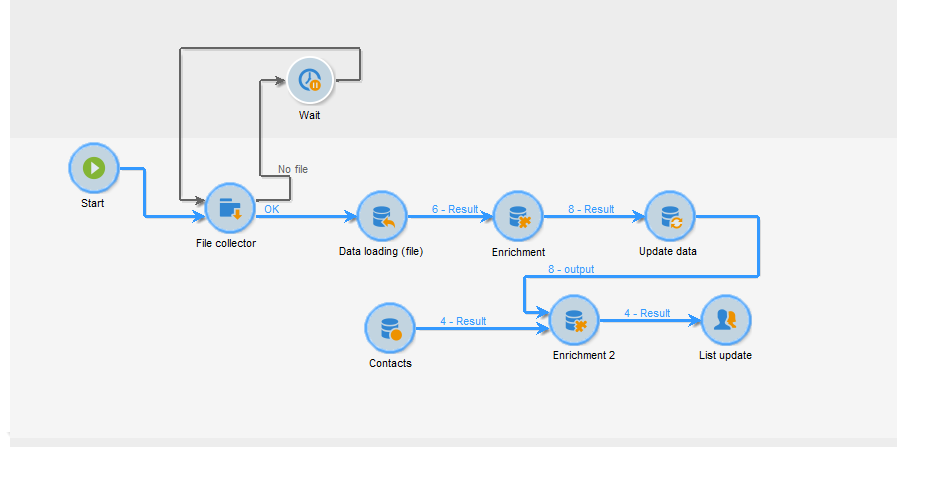
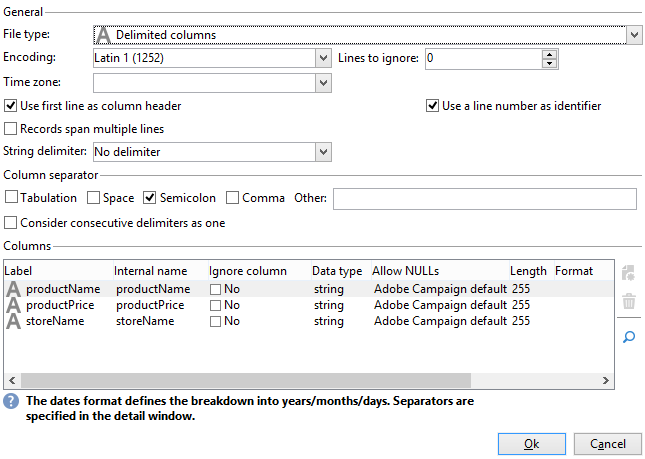
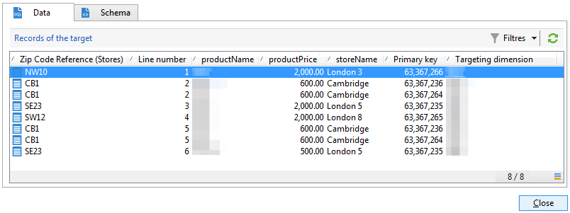
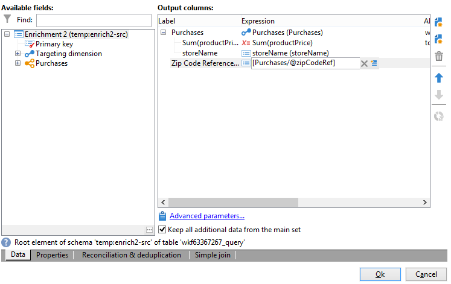

# 요약 목록 만들기{#creating-a-summary-list}

이 사용 사례에서는 파일을 수집한 후 여러 추가 작업을 수행한 후 요약 목록을 만들 수 있는 워크플로우 작성을 자세히 설명합니다. 이 예제에서는 스토어에서 구입한 연락처 목록을 기반으로 합니다.



다음 데이터 구조가 사용됩니다.


이것의 목적은 다음과 같습니다.

* 데이터 보강 활동의 다양한 옵션을 사용하려면
* 조정 후 데이터베이스의 데이터를 업데이트하려면
* 보강된 데이터에 대한 글로벌 &quot;보기&quot;를 만들려면

요약 목록을 만들려면 다음 단계를 수행해야 합니다.

1. 워크플로우의 작업 테이블에서 &quot;구매&quot; 파일 수집 및 로드
1. 참조 테이블에 대한 링크를 만들어 가져온 데이터 보강
1. 보강된 데이터로 &quot;구매&quot; 테이블 업데이트
1. &quot;구매&quot; 테이블에서 합계를 사용하여 &quot;연락처&quot; 데이터 보강
1. 요약 목록 만들기

## 1단계: 파일을 로드하고 가져온 데이터를 조정합니다 {#step-1--loading-the-file-and-reconciling-the-imported-data}

로드할 데이터는 다음 형식의 &quot;구매&quot; 관련 데이터입니다.

```
Product Name;Product price;Store
Computer;2000;London 3
Tablet;600;Cambridge
Computer;2000;London 5
Computer;2000;London 8
Tablet;600;Cambridge
Phone;500;London 5
```

이 데이터는 &quot;Purchases.txt&quot; 텍스트 파일에 포함되어 있습니다.

1. 추가 **파일 수집기** 및 **데이터 로드(파일)** 활동 을 워크플로우에 추가합니다.

   다음 **파일 수집기** 활동을 통해 Adobe Campaign 서버에서 파일을 수집 및 전송할 수 있습니다.

   다음 **데이터 로드(파일)** 활동을 사용하면 수집된 데이터로 워크플로우의 작업 테이블을 보강할 수 있습니다.

   이 활동에 대한 자세한 내용은 을 참조하십시오.

1. 구성 **파일 수집기** 텍스트를 수집할 활동(&#42;.txt) 선택한 디렉토리에서 파일을 입력합니다.

   

   다음 **파일 수집기** 활동을 통해 소스 디렉토리에 파일이 없는 것을 관리할 수 있습니다. 이렇게 하려면 **[!UICONTROL Process file nonexistence]** 선택 사항입니다. 이 워크플로우에서는 **대기** 수집 시 디렉터리에서 누락된 경우 다른 파일 컬렉션을 시도하기 위해 활동이 추가되었습니다.

1. 구성 **데이터 로드(파일)** 가져올 데이터와 동일한 형식의 샘플 파일을 사용하는 활동.

   

   을(를) 클릭합니다. **[!UICONTROL Click here to change the file format...]** 링크를 클릭하여 &quot;구매&quot; 테이블의 내부 이름과 레이블을 사용하여 열의 이름을 변경합니다.

   

데이터를 가져온 후에는 &quot;저장소&quot; 스키마와 일치하는 참조 테이블에 대한 링크를 만들어 데이터 보강이 수행됩니다.

데이터 보강 활동을 추가하고 다음과 같이 구성합니다.

1. 에서 데이터로 구성된 기본 세트를 선택합니다 **데이터 로드(파일)** 활동.

   

1. 클릭 **[!UICONTROL Add data]**&#x200B;를 선택한 다음, **[!UICONTROL A link]** 선택 사항입니다.

   

1. 을(를) 선택합니다 **[!UICONTROL Define a collection]** 선택 사항입니다.
1. &quot;저장소&quot; 스키마를 대상으로 선택합니다.

   

다양한 링크 유형에 대한 자세한 내용은 [데이터 강화 및 수정](targeting-workflows.md#enrich-and-modify-data).

다음 창에서는 데이터 조정을 구성하기 위해 소스 필드(기본 세트에서)와 대상 필드(&quot;저장소&quot; 스키마에 속하는)를 선택하여 조인 조건을 만들어야 합니다.


링크가 만들어지면 &quot;저장소&quot; 스키마에서 워크플로우의 작업 테이블에 열을 추가하겠습니다. &quot;ZipCode 참조&quot; 필드입니다.

1. 데이터 보강 활동을 엽니다.
1. **[!UICONTROL Edit additional data]**&#x200B;를 클릭합니다.
1. &quot;ZipCode 참조&quot; 필드를 **[!UICONTROL Output columns]**.


데이터 보강 후 워크플로우의 작업 테이블에 있는 데이터는 다음과 같습니다.



## 2단계: &#39;구매&#39; 표에 보강된 데이터 쓰기 {#step-2--writing-enriched-data-to-the--purchases--table}

이 단계에서는 가져온 및 보강한 데이터를 &quot;구매&quot; 표에 작성하는 방법에 대해 자세히 설명합니다. 이를 위해서는 **데이터 업데이트** 활동.

워크플로우의 작업 테이블에 있는 데이터와 **구매** 타겟팅 차원은 **구매** 테이블이 업데이트되었습니다.

1. 을(를) 클릭합니다. **[!UICONTROL Reconciliation]** 데이터 보강 활동의 탭입니다.
1. 이 경우 타겟팅 차원인 &quot;구매&quot; 스키마를 선택합니다.
1. 워크플로우 테이블의 데이터에 대한 &quot;소스 표현식&quot;을 선택합니다(이 경우 &quot;storeName&quot; 필드).
1. &quot;구매&quot; 테이블(이 경우 &quot;storname&quot; 필드)에서 데이터의 &quot;대상 표현식&quot;을 선택합니다.
1. **[!UICONTROL Keep unreconciled data coming from the work table]** 옵션을 선택합니다.


에서 **데이터 업데이트** 활동을 수행하려면 다음 구성이 필요합니다.

1. 을(를) 선택합니다 **[!UICONTROL Insert or update]** 옵션 **[!UICONTROL Operation type]** 필드를 사용하여 파일을 수집할 때마다 새 레코드를 만들 수 없습니다.
1. 을(를) 선택합니다 **[!UICONTROL By directly using the targeting dimension]** 값 **[!UICONTROL Record identification]** 선택 사항입니다.
1. 구매 스키마 를 **[!UICONTROL Document type]**.
1. 업데이트할 필드 목록을 지정합니다. 다음 **[!UICONTROL Destination]** 열에서 &quot;구매&quot; 스키마의 필드를 정의할 수 있습니다. 다음 **[!UICONTROL Expression]** 열에서 작업 테이블에서 매핑을 수행할 필드를 선택할 수 있습니다.
1. 을(를) 클릭합니다. **[!UICONTROL Generate an outbound transition]** 선택 사항입니다.


## 3단계: &#39;연락처&#39; 데이터 보강 {#step-3--enriching--contact--data-}

연락처 스키마는 &quot;구매&quot; 스키마에 실제로 연결됩니다. 즉, &quot;데이터 보강&quot; 옵션의 다른 옵션을 사용할 수 있습니다. 필터링 차원에 연결된 데이터 추가

이 두 번째 데이터 보강은 구매 스키마에서 합계를 만들어 식별된 각 연락처에 대한 총 구매 금액을 계산하는 것입니다.

1. 추가 **쿼리** 모두 복구할 수 있는 활동 유형 **연락처** 저장.
1. 추가 **데이터 보강** 활동을 선택한 다음 이전 쿼리에서 얻은 기본 세트를 선택합니다.
1. add 를 클릭합니다. **[!UICONTROL Data]**.
1. 을(를) 클릭합니다. **[!UICONTROL Data linked to the targeting dimension]** 선택 사항입니다.
1. 을(를) 클릭합니다. **[!UICONTROL Data linked to the filtering dimension]** 옵션 **[!UICONTROL Select fields to add]** 창을 엽니다.
1. 을(를) 선택합니다 **[!UICONTROL Purchases]** node then click **[!UICONTROL Next]**.

   

1. 변경 **[!UICONTROL Collected data]** 필드를 선택하여 **[!UICONTROL Aggregates]** 선택 사항입니다.

   

1. **[!UICONTROL Next]**&#x200B;를 클릭합니다.
1. 각 연락처에 대한 구매 합계를 계산하려면 다음 표현식을 추가합니다. &quot;Sum(@prodprice)&quot;

   

요약 목록을 준비하려면 &quot;구매&quot; 필드와 첫 번째 데이터 보강 필드에서 필드를 추가해야 합니다. &quot;ZipCode 참조&quot; 필드입니다.

1. 을(를) 클릭합니다. **[!UICONTROL Edit additional data...]** 링크를 클릭합니다.
1. &quot;스토어 이름&quot; 및 &quot;구매/우편 번호 참조&quot; 필드를 추가합니다.

   

1. 을(를) 클릭합니다. **[!UICONTROL Properties]** 탭.
1. 두 번째 링크를 변경하여 한 줄만 만듭니다.

## 4단계: 만들기 및 요약 목록에 추가 {#step-4--creating-and-adding-to-a-summary-list}

마지막 단계에는 보강된 모든 데이터를 목록에 쓰는 작업이 포함됩니다.

1. 추가 **목록 업데이트** 활동을 워크플로우에 추가합니다. 이 활동은 두 번째 데이터 보강 활동의 아웃바운드 전환과 연결되어 있어야 합니다.
1. 을(를) 선택합니다 **[!UICONTROL Create the list if necessary (Calculated name)]** 선택 사항입니다.
1. 계산된 이름의 값을 선택합니다. 목록에 대해 선택한 레이블은 현재 날짜입니다. &lt;%= formatDate(new Date(), &quot;%2D/%2M/%2Y&quot;) %>

워크플로우가 실행되면 목록에 다음이 포함됩니다.

* 연락처 목록
* &quot;총 구매&quot; 열,
* 저장소 이름 열,
* 저장소 참조 스키마에 포함된 모든 저장소에 대해 입력된 &quot;우편번호 참조&quot; 열입니다.


