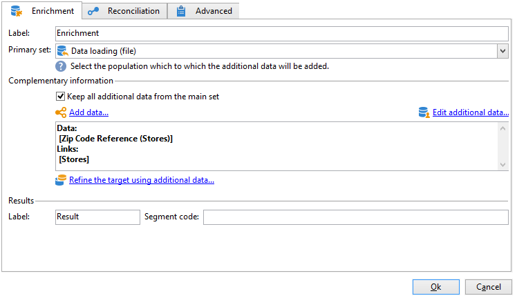

# 요약 목록 만들기{#creating-a-summary-list}

이 사용 사례에서는 파일을 수집하고 몇 가지 개선 사항을 수행한 후 요약 목록을 만들 수 있는 워크플로우 만들기에 대해 자세히 설명합니다. 이 예제는 스토어에서 구입한 연락처 목록을 기반으로 합니다.


다음 데이터 구조가 사용됩니다.


목적은 다음과 같습니다.

* 데이터 보강 활동의 다양한 옵션을 사용하려면
* 조정 후 데이터베이스의 데이터를 업데이트하려면
* 보강된 데이터의 글로벌 &quot;보기&quot;를 만들려면

요약 목록을 만들려면 다음 단계를 수행해야 합니다.

1. 워크플로우의 작업 테이블에서 &quot;구매&quot; 파일 수집 및 로드
1. 참조 테이블에 대한 링크를 만들어 가져온 데이터 보강
1. 보강된 데이터로 &quot;구매&quot; 테이블 업데이트
1. &quot;구매&quot; 테이블의 집계 계산으로 &quot;연락처&quot; 데이터 보강
1. 요약 목록 만들기

## 1단계: 파일을 로드하고 가져온 데이터를 조정합니다. {#step-1--loading-the-file-and-reconciling-the-imported-data}

로드할 데이터는 다음 형식의 &quot;구매&quot; 관련 데이터입니다.

```
Product Name;Product price;Store
Computer;2000;London 3
Tablet;600;Cambridge
Computer;2000;London 5
Computer;2000;London 8
Tablet;600;Cambridge
Phone;500;London 5
```

이 데이터는 &quot;Purchases.txt&quot; 텍스트 파일에 포함되어 있습니다.

1. **파일 수집기** 및 **데이터 로드(파일)** 활동을 워크플로우에 추가하십시오.

   **파일 수집기** 활동을 사용하면 Adobe Campaign 서버에서 파일을 수집하여 보낼 수 있습니다.

   **데이터 로드(파일)** 활동을 사용하면 수집된 데이터로 워크플로우의 작업 테이블을 보강할 수 있습니다. 이 활동에 대한 자세한 정보는 [이 페이지](data-loading-file.md)를 참조하세요.

1. 선택한 디렉터리에서 텍스트(&#42;.txt) 형식 파일을 수집하도록 **파일 수집기** 활동을 구성하십시오.

   

   **파일 수집기** 활동을 사용하면 원본 디렉터리에 파일이 없는 것을 관리할 수 있습니다. 이렇게 하려면 **[!UICONTROL Process file nonexistence]** 옵션을 선택하십시오. 이 워크플로우에서는 **대기** 활동이 추가되어 수집 시 디렉터리에서 누락된 다른 파일 수집을 시도할 수 있습니다.

1. 가져올 데이터와 같은 형식의 샘플 파일을 사용하여 **데이터 로드(파일)** 활동을 구성하십시오.

   

   **[!UICONTROL Click here to change the file format...]** 링크를 클릭하여 &quot;구매&quot; 테이블의 내부 이름과 레이블을 사용하여 열 이름을 변경합니다.

   

데이터를 가져오면 &quot;저장소&quot; 스키마와 일치하는 참조 테이블에 대한 링크를 생성하여 데이터 보강이 수행됩니다.

데이터 보강 활동을 추가하고 다음과 같이 구성합니다.

1. **데이터 로드(파일)** 활동에서 데이터로 구성된 기본 집합을 선택하십시오.

   

1. **[!UICONTROL Add data]**&#x200B;을(를) 클릭한 다음 **[!UICONTROL A link]** 옵션을 선택합니다.

   

1. **[!UICONTROL Define a collection]** 옵션을 선택합니다.
1. 대상으로 &quot;저장소&quot; 스키마를 선택합니다.

   

다양한 유형의 링크에 대한 자세한 내용은 [데이터 보강 및 수정](targeting-workflows.md#enrich-and-modify-data)을 참조하세요.

다음 창에서 데이터 조정을 구성하려면 (주 집합에서) 소스 필드와 (&quot;저장소&quot; 스키마에 속하는) 대상 필드를 선택하여 조인 조건을 생성해야 합니다.


이제 링크가 만들어졌으므로 &quot;스토어&quot; 스키마, 즉 &quot;우편번호 참조&quot; 필드에서 워크플로우의 작업 테이블에 열을 추가합니다.

1. 데이터 보강 활동을 엽니다.
1. **[!UICONTROL Edit additional data]**&#x200B;를 클릭합니다.
1. **[!UICONTROL Output columns]**&#x200B;에 &quot;우편번호 참조&quot; 필드를 추가합니다.


데이터 보강 후 워크플로우의 작업 테이블에 있는 데이터는 다음과 같습니다.


## 2단계: &#39;구매&#39; 표에 보강된 데이터 쓰기 {#step-2--writing-enriched-data-to-the--purchases--table}

이 단계에서는 &quot;구매&quot; 표에 가져오고 보강된 데이터를 작성하는 방법에 대해 자세히 설명합니다. 이렇게 하려면 **데이터 업데이트** 활동을 사용해야 합니다.

**구매** 테이블의 데이터를 업데이트하기 전에 워크플로우의 작업 테이블의 데이터와 **구매** 타겟팅 차원 간의 조정을 수행해야 합니다.

1. 데이터 보강 활동의 **[!UICONTROL Reconciliation]** 탭을 클릭합니다.
1. 타겟팅 차원, 이 경우 &quot;구매&quot; 스키마를 선택합니다.
1. 워크플로 테이블(이 경우 &quot;storeName&quot; 필드)의 데이터에 대한 &quot;Source 표현식&quot;을 선택합니다.
1. &quot;구매&quot; 테이블(이 경우 &quot;상점 이름&quot; 필드)의 데이터에 대한 &quot;대상 표현식&quot;을 선택합니다.
1. **[!UICONTROL Keep unreconciled data coming from the work table]** 옵션을 선택합니다.


**데이터 업데이트** 활동에서는 다음 구성이 필요합니다.

1. 파일을 수집할 때마다 새 레코드를 만들지 않으려면 **[!UICONTROL Operation type]** 필드에서 **[!UICONTROL Insert or update]** 옵션을 선택하십시오.
1. **[!UICONTROL Record identification]** 옵션의 **[!UICONTROL By directly using the targeting dimension]** 값을 선택하십시오.
1. **[!UICONTROL Document type]**(으)로 &quot;구매&quot; 스키마를 선택하세요.
1. 업데이트할 필드 목록을 지정하십시오. **[!UICONTROL Destination]** 열에서 &quot;구매&quot; 스키마의 필드를 정의할 수 있습니다. **[!UICONTROL Expression]** 열에서 매핑을 수행할 작업 테이블의 필드를 선택할 수 있습니다.
1. **[!UICONTROL Generate an outbound transition]** 옵션을 클릭합니다.


## 3단계: &#39;연락처&#39; 데이터 강화 {#step-3--enriching--contact--data-}

&quot;연락처&quot; 스키마는 &quot;구매&quot; 스키마와 물리적으로 연결되어 있습니다. 즉, &quot;데이터 보강&quot; 옵션의 다른 옵션인 필터링 차원에 연결된 데이터를 추가할 수 있습니다.

이 두 번째 보강의 목적은 구매 스키마에 대한 집계를 만들어 식별된 각 연락처에 대한 총 구매 금액을 계산하는 것입니다.

1. 저장된 **연락처**&#x200B;를 모두 복구할 수 있는 **쿼리** 유형 활동을 추가합니다.
1. **데이터 보강** 활동을 추가한 다음 이전 쿼리에서 얻은 기본 집합을 선택하십시오.
1. **[!UICONTROL Data]** 추가를 클릭합니다.
1. **[!UICONTROL Data linked to the targeting dimension]** 옵션을 클릭합니다.
1. **[!UICONTROL Select fields to add]** 창에서 **[!UICONTROL Data linked to the filtering dimension]** 옵션을 클릭합니다.
1. **[!UICONTROL Purchases]** 노드를 선택한 다음 **[!UICONTROL Next]**&#x200B;을(를) 클릭합니다.

   

1. **[!UICONTROL Aggregates]** 옵션을 선택하여 **[!UICONTROL Collected data]** 필드를 변경합니다.

   

1. **[!UICONTROL Next]**&#x200B;를 클릭합니다.
1. 각 연락처에 대한 구매 총액을 계산하려면 다음 표현식을 추가합니다. &quot;Sum(@prodprice)&quot;

   

요약 목록을 준비하려면 &quot;구매&quot; 필드 및 첫 번째 데이터 보강인 &quot;우편번호 참조&quot; 필드에서 필드를 추가해야 합니다.

1. 데이터 보강 활동에서 **[!UICONTROL Edit additional data...]** 링크를 클릭합니다.
1. &quot;스토어 이름&quot; 및 &quot;구매 / 우편 번호 참조&quot; 필드를 추가합니다.

   

1. **[!UICONTROL Properties]** 탭을 클릭합니다.
1. 두 번째 링크를 변경하여 한 줄만 만듭니다.

## 4단계: 요약 목록 만들기 및 추가 {#step-4--creating-and-adding-to-a-summary-list}

마지막 단계에는 보강된 모든 데이터를 목록에 작성하는 작업이 포함됩니다.

1. 워크플로우에 **목록 업데이트** 활동을 추가합니다. 이 활동은 두 번째 데이터 보강 활동의 아웃바운드 전환에 연결해야 합니다.
1. **[!UICONTROL Create the list if necessary (Calculated name)]** 옵션을 선택합니다.
1. 계산된 이름의 값을 선택합니다. 목록에 대해 선택한 레이블은 현재 날짜입니다. &lt;%= formatDate(new Date(), &quot;%2D/%2M/%2Y&quot;) %>.

워크플로우가 실행되면 목록에 다음이 포함됩니다.

* 연락처 목록,
* &quot;총 구매&quot; 열,
* &quot;스토어 이름&quot; 열,
* 스토어 참조 스키마에 포함된 모든 스토어에 대해 입력한 &quot;우편번호 참조&quot; 열.


