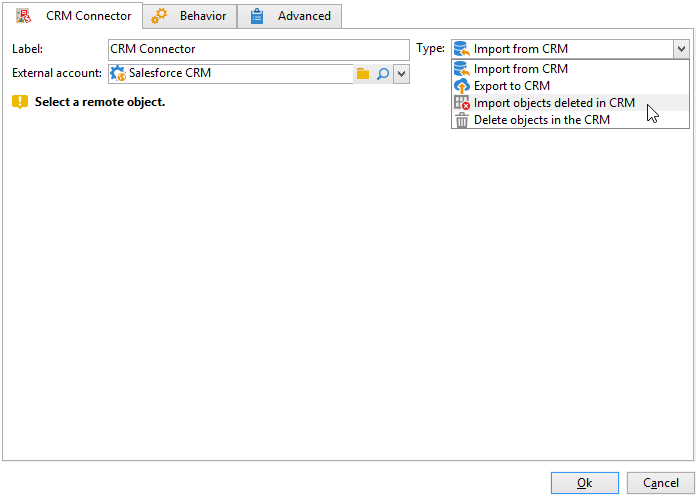

# CRM 커넥터{#crm-connector}

**CRM 커넥터** 활동을 통해 Adobe Campaign과 CRM 시스템 간의 데이터 동기화를 구성할 수 있습니다.

이 활동을 통해 다음을 수행할 수 있습니다.

* CRM에서 가져오기
* CRM으로 내보내기
* CRM에서 삭제된 오브젝트 가져오기
* CRM의 오브젝트 삭제

동기화를 구성할 CRM과 일치하는 외부 계정을 선택한 다음 동기화할 개체(계정, 기회, 연락처 등)를 선택합니다.

Adobe Campaign의 CRM 커넥터에 대한 자세한 내용은 [이 섹션](https://experienceleague.adobe.com/docs/campaign/campaign-v8/connect/ac-crm/crm.html){target="_blank"}을 참조하세요.
