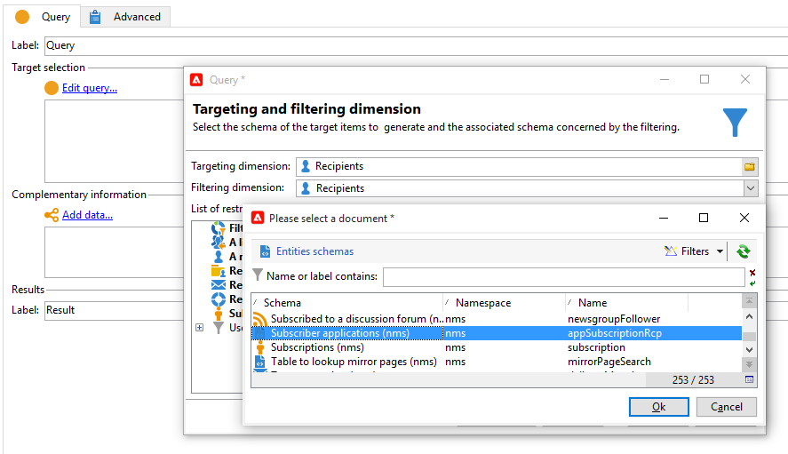
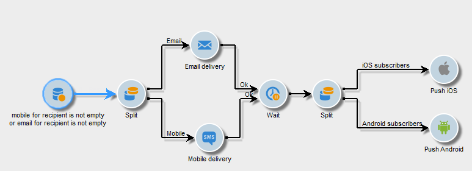

# 크로스 채널 게재{#cross-channel-deliveries}

크로스 채널 게재는 **[!UICONTROL Deliveries]** 탭 [캠페인 워크플로우](campaign-workflows.md) 활동.

게재를 기반으로 할 템플릿을 선택하고 해당 콘텐츠를 정의합니다.

다양한 타겟팅 활동을 사용하여 워크플로우의 게재 업스트림에 대한 타겟을 지정할 수 있습니다.

아래 예에서는 푸시 알림 가입자용 이메일 또는 SMS를 보내는 워크플로우를 만든 다음 1주일 후 푸시 알림을 전송하는 방법을 알아봅니다. 방법은 다음과 같습니다.

1. 캠페인 만들기.
1. 에서 **[!UICONTROL Targeting and workflows]** 캠페인의 탭에서 다음을 추가합니다 **[!UICONTROL Query]** 활동.
1. 쿼리를 구성합니다. 푸시 알림에 구독한 수신자를 타겟 차원으로 선택합니다.

   >[!NOTE]
   >
   >푸시 알림의 경우 **가입자 응용 프로그램** 대상 차원.

   

1. 쿼리에 필터 조건을 추가합니다. 이 경우 모바일 번호 또는 이메일 주소가 있는 수신자를 선택합니다.

   

1. 추가 **[!UICONTROL Split]** 활동을 워크플로우에 추가하여 모바일 번호가 있는 수신자와 이메일 주소가 있는 수신자를 구분할 수 있습니다.
1. 에서 **[!UICONTROL Delivery]** 탭에서 각 타겟에 대한 게재를 선택합니다.

   워크플로우에서 게재 활동을 두 번 클릭하여 클래식 게재 마법사와 동일한 방식으로 게재를 만듭니다.

   

1. 추가 및 구성 **[!UICONTROL Wait]** 받는 사람이 한 번에 너무 많은 게재를 받지 않도록 하는 활동.
1. 추가 **[!UICONTROL Split]** 활동을 통해 iOS 또는 Android 모바일 애플리케이션의 구독자를 분할합니다.

   각 운영 체제에 대한 서비스를 선택합니다.

   

1. 각 운영 체제에 대한 모바일 애플리케이션 전달을 선택하고 구성합니다.

   
