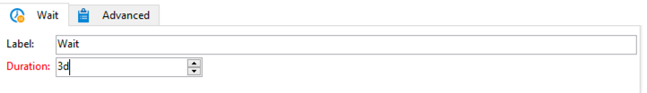

# 크로스 채널 게재 워크플로{#cross-channel-delivery-workflow}

이 사용 사례에서는 채널 간 게재 워크플로우와 관련된 예제를 제공합니다. 크로스 채널 게재의 일반적인 개념은 [이 섹션](cross-channel-deliveries.md)에 나와 있습니다.

목표는 데이터베이스 수신자의 대상자를 다른 그룹으로 세분화하여 이메일을 그룹에 보내고 SMS 메시지를 다른 그룹에 보내는 것입니다.

이 사용 사례의 주요 구현 단계는 다음과 같습니다.

1. 대상을 타기팅할 **[!UICONTROL Query]** 활동을 만드는 중입니다.
1. 오퍼에 대한 링크가 포함된 **[!UICONTROL Email delivery]** 활동을 만드는 중입니다.
1. **[!UICONTROL Split]** 활동을 사용하여 다음을 수행할 수 있습니다.

   * 첫 번째 이메일을 열지 않은 수신자에게 다른 이메일을 보냅니다.
   * 이메일을 열었지만 오퍼에 대한 링크를 클릭하지 않은 수신자에게 SMS를 보냅니다.
   * 이메일을 열고 링크를 클릭한 수신자를 데이터베이스에 추가합니다.

## 1단계: 대상 구축 {#step-1--build-the-audience}

대상을 정의하려면 수신자를 식별하는 쿼리를 만듭니다.

1. 캠페인을 만듭니다. [이 페이지](../campaigns/marketing-campaign-create.md)에서 자세히 알아보십시오.
1. 캠페인의 **[!UICONTROL Targeting and workflows]** 탭에서 **쿼리** 활동을 워크플로우에 추가합니다. 이 활동 사용에 대한 자세한 내용은 [이 섹션](query.md)을 참조하세요.
1. 게재를 받을 수신자를 정의합니다. 예를 들어 &#39;골드&#39; 멤버를 대상 차원으로 선택합니다.
1. 쿼리에 필터링 조건을 추가합니다. 이 예에서는 전자 메일 주소와 휴대폰 번호가 있는 수신자를 선택합니다.

   

1. 변경 내용을 저장합니다.

## 2단계: 오퍼를 포함하는 이메일 만들기 {#step-2--create-an-email-including-an-offer}

1. 이메일 게재를 만듭니다.
1. 메시지를 디자인하고 오퍼를 포함하는 링크를 콘텐츠에 삽입합니다.

   

   오퍼를 메시지 본문에 통합하는 방법에 대한 자세한 내용은 [이 페이지](../../v8/send/email.md)를 참조하세요.

1. 변경 내용을 저장합니다.
1. **[!UICONTROL Email delivery]** 활동을 마우스 오른쪽 단추로 클릭하여 엽니다.
1. 모집단과 추적 로그를 복구하려면 **[!UICONTROL Generate an outbound transition]** 옵션을 선택하십시오.

   

   이렇게 하면 첫 번째 이메일을 받을 때 이 정보를 사용하여 수신자의 행동에 따라 다른 게재를 보낼 수 있습니다.

1. 받는 사람이 며칠 동안 전자 메일을 열 수 있도록 하려면 **[!UICONTROL Wait]** 활동을 추가하세요.

   

## 3단계: 결과 대상자 세그먼트화 {#step-3--segment-the-resulting-audience}

타겟이 식별되고 첫 번째 게재가 생성되면 필터링 조건을 사용하여 타겟을 다양한 모집단으로 세분화해야 합니다.

1. 워크플로우에 **분할** 활동을 추가하고 엽니다. 이 활동 사용에 대한 자세한 내용은 [이 섹션](split.md)을 참조하세요.
1. 쿼리에서 업스트림으로 계산한 모집단에서 3개의 세그먼트를 만듭니다.

   

1. 첫 번째 하위 집합에 대해 **[!UICONTROL Add a filtering condition on the inbound population]** 옵션을 선택하고 **[!UICONTROL Edit]**&#x200B;을(를) 클릭합니다.

   

1. **[!UICONTROL Recipients of a delivery]**&#x200B;을(를) 제한 필터로 선택하고 **[!UICONTROL Next]**&#x200B;을(를) 클릭합니다.

   

1. 필터 설정의 **[!UICONTROL Behavior]** 드롭다운 목록에서 **[!UICONTROL Recipients who have not opened or clicked (email)]**&#x200B;을(를) 선택하고 게재 목록에서 보낼 오퍼가 포함된 이메일을 선택합니다. **[!UICONTROL Finish]**&#x200B;를 클릭합니다.

   

1. 두 번째 하위 집합도 유사하게 진행하고 **[!UICONTROL Behavior]** 드롭다운 목록에서 **[!UICONTROL Recipients who have not clicked (email)]**&#x200B;을(를) 선택하십시오.

   

1. 세 번째 하위 집합의 경우 **[!UICONTROL Add a filtering condition on the inbound population]**&#x200B;을(를) 선택하고 **[!UICONTROL Edit]**&#x200B;을(를) 클릭한 후 **[!UICONTROL Use a specific filtering dimension]** 옵션을 선택하십시오.
1. **[!UICONTROL Filtering dimension]** 드롭다운 목록에서 **[!UICONTROL Recipient tracking log]**&#x200B;을(를) 선택하고 **[!UICONTROL List of restriction filters]**&#x200B;에서 **[!UICONTROL Filtering conditions]**&#x200B;을(를) 강조 표시한 다음 **[!UICONTROL Next]**&#x200B;을(를) 클릭합니다.

   

1. 다음과 같이 필터 조건을 선택합니다.

   

1. 변경 내용을 저장하려면 **[!UICONTROL Finish]**&#x200B;을(를) 클릭합니다.

## 4단계: 워크플로우 완료 {#step-4--finalize-the-workflow}

1. **[!UICONTROL Split]** 활동에서 만들어진 세 개의 하위 집합 뒤에 관련 활동을 워크플로우에 추가합니다.

   * **[!UICONTROL Email delivery]** 활동을 추가하여 미리 알림 전자 메일을 첫 번째 하위 집합으로 보냅니다.
   * **[!UICONTROL Mobile delivery]** 활동을 추가하여 SMS 메시지를 두 번째 하위 집합으로 보냅니다.
   * **[!UICONTROL List update]** 활동을 추가하여 해당 수신자를 데이터베이스에 추가하십시오.

1. 워크플로우에서 게재 활동을 두 번 클릭하여 편집합니다.
1. **[!UICONTROL List update]** 활동을 두 번 클릭하고 **[!UICONTROL Generate an outbound transition]** 옵션을 선택합니다.
1. 워크플로를 실행하려면 작업 표시줄에서 **시작** 단추를 클릭하세요.

**쿼리** 활동에서 타겟팅한 모집단은 받는 사람의 행동에 따라 전자 메일 또는 SMS 게재를 받도록 세그먼트화됩니다. 나머지 모집단은 **[!UICONTROL List update]** 활동을 사용하여 데이터베이스에 추가됩니다.
