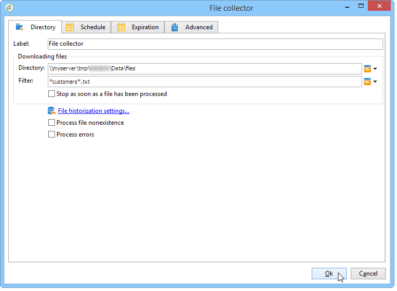
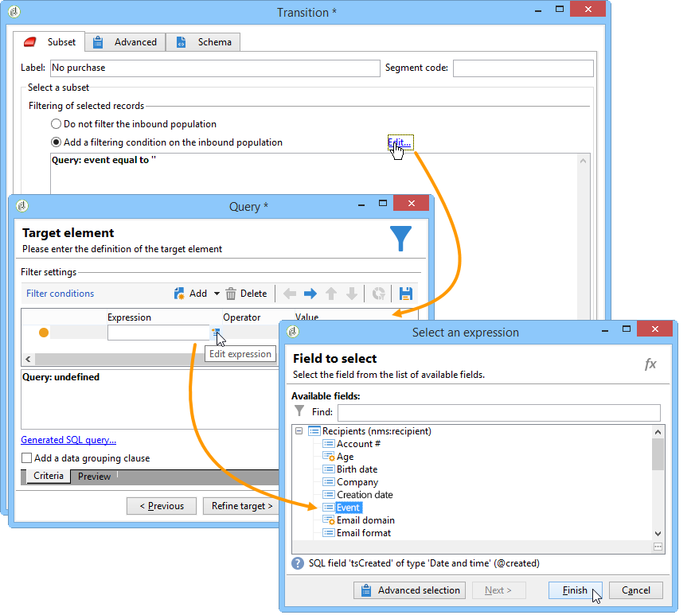

# 데이터 로딩(파일){#data-loading-file}

## 사용 {#use}

**[!UICONTROL Data loading (File)]** 활동을 사용하면 외부 데이터 소스에 직접 액세스하여 Adobe Campaign에서 사용할 수 있습니다. 실제로 타깃팅 작업에 필요한 모든 데이터가 항상 Adobe Campaign 데이터베이스에 있는 것은 아닙니다. 외부 파일에서 사용할 수 있도록 할 수 있습니다.

로드할 파일은 전환에 의해 지정하거나 이 활동을 실행하는 동안 계산할 수 있습니다. 예를 들어 외부 데이터베이스에서 구매를 관리하는 클라이언트의 즐겨찾기 제품 10개 목록이 될 수 있습니다.

이 활동에 대한 구성 창의 상단 섹션에서 파일 형식을 정의할 수 있습니다. 이렇게 하려면 가져올 파일과 동일한 형식의 샘플 파일을 사용합니다. 이 파일은 로컬 또는 서버에 저장할 수 있습니다.

>[!CAUTION]
>
>&quot;플랫&quot; 구조 파일만 지원됩니다(예: CSV, TXT 등). XML 형식은 사용하지 않는 것이 좋습니다. 클라이언트 콘솔을 사용하면 최대 150MB의 크기로 파일을 로드할 수 있습니다. 웹 사용자 인터페이스에서 파일 로드 활동의 제한은 50MB입니다. [자세히 알아보기](https://experienceleague.adobe.com/docs/campaign-web/v8/wf/design-workflows/load-file.html?lang=ko){target="_blank"}

예를 들어, 서버에서 파일의 압축을 풀지 않고(따라서 압축 해제된 파일에 대한 공간을 절약할 필요가 없음) 파일 처리 시 압축 해제를 포함할 수 있도록 파일 가져오기 중에 실행할 사전 프로세스를 정의할 수 있습니다. **[!UICONTROL Pre-process the file]** 옵션을 선택하고 **[!UICONTROL None]**, **[!UICONTROL Decompression]**(zcat) 또는 **[!UICONTROL Decrypt]**(gpg) 옵션 중 하나를 선택합니다.

>[!IMPORTANT]
>
>4Gb보다 큰 압축 파일은 압축을 풀 수 없습니다.

## 파일 형식 정의 {#defining-the-file-format}

파일을 로드하면 열 형식이 각 데이터 유형의 기본 매개 변수를 사용하여 자동으로 감지됩니다. 이 매개 변수를 수정하여 데이터에 적용할 특정 프로세스를 지정할 수 있습니다. 이는 특히 오류 또는 빈 값이 있는 경우에 유용합니다.

이렇게 하려면 **[!UICONTROL Data loading (file)]** 활동의 기본 창에서 **[!UICONTROL Click here to change the file format...]**&#x200B;을(를) 선택하십시오. 포맷 세부 정보 창이 열립니다.

그런 다음 파일의 일반 서식과 각 열의 서식을 수정할 수 있습니다.

일반적인 파일 형식을 사용하면 열을 인식하는 방법(파일 인코딩, 구분 기호 사용 등)을 정의할 수 있습니다.

열 포맷을 사용하면 각 열의 값 처리를 정의할 수 있습니다.

>[!NOTE]
>
>원하는 만큼 열을 추가할 수 있습니다. 각 열의 최대 값 길이는 선택한 데이터 형식에 의해 결정됩니다.

* **[!UICONTROL Ignore column]**: 데이터를 로드하는 동안 이 열을 처리하지 않습니다.
* **[!UICONTROL Data type]**: 각 열에 필요한 데이터 형식을 지정합니다.
* **[!UICONTROL Allow NULLs]**: 빈 값을 관리하는 방법을 지정합니다.

   * **[!UICONTROL Adobe Campaign default]**: 숫자 필드에 대해서만 오류를 생성하고, 다른 필드의 경우 NULL 값을 삽입합니다.
   * **[!UICONTROL Empty value allowed]**: 빈 값을 허용합니다. 따라서 NULL 값이 삽입됩니다.
   * **[!UICONTROL Always populated]**: 값이 비어 있는 경우 오류를 생성합니다.

* **[!UICONTROL Length]**: **문자열** 데이터 형식의 최대 문자 수를 지정합니다.
* **[!UICONTROL Format]**: 시간 및 날짜 형식을 정의합니다.
* **[!UICONTROL Data transformation]**: **문자열**&#x200B;에 대소문자 프로세스를 적용할지 여부를 정의합니다.

   * **[!UICONTROL None]**: 가져온 문자열이 수정되지 않았습니다.
   * **[!UICONTROL First letter in upper case]**: 문자열의 각 단어의 첫 번째 문자가 대문자로 시작합니다.
   * **[!UICONTROL Upper case]**: 문자열의 모든 문자가 대문자입니다.
   * **[!UICONTROL Lower case]**: 문자열의 모든 문자가 소문자입니다.

* **[!UICONTROL White space management]**: 문자열에서 특정 공백을 무시할지 여부를 지정합니다. **[!UICONTROL Ignore spaces]** 값은 문자열의 시작과 끝에 있는 공백만 무시할 수 있습니다.
* **[!UICONTROL Error processings]**: 오류가 발생하는 경우의 비헤이비어를 정의합니다.

   * **[!UICONTROL Ignore the value]**: 값이 무시됩니다. 워크플로 실행 로그에 경고가 생성됩니다.
   * **[!UICONTROL Reject line]**: 전체 줄을 처리하지 않습니다.
   * **[!UICONTROL Use a default value in case of error]**: 오류를 일으키는 값을 **[!UICONTROL Default value]** 필드에 정의된 기본값으로 바꿉니다.
   * **[!UICONTROL Reject the line when there is no remapping value]**: 잘못된 값에 대한 매핑이 정의되어 있지 않은 경우 전체 줄을 처리하지 않습니다(아래 **[!UICONTROL Mapping]** 옵션 참조).
   * **[!UICONTROL Use a default value in case the value is not remapped]**: 잘못된 값에 대한 매핑이 정의되어 있지 않은 경우, 오류를 일으키는 값을 **[!UICONTROL Default value]** 필드에 정의된 기본값으로 바꿉니다(아래 **[!UICONTROL Mapping]** 옵션 참조).

* **[!UICONTROL Default value]**: 선택한 오류 처리에 따라 기본값을 지정합니다.
* **[!UICONTROL Mapping]**: 이 필드는 열 세부 사항 구성(두 번 클릭 또는 열 목록 오른쪽의 옵션을 통해 액세스)에서만 사용할 수 있습니다. 이렇게 하면 특정 값을 가져올 때 변형됩니다. 예를 들어 &quot;셋&quot;을 &quot;3&quot;으로 변환할 수 있습니다.

## 예: 데이터를 수집하여 데이터베이스에 로드 {#example--collecting-data-and-loading-it-in-the-database}

다음 예제에서는 매일 서버에서 파일을 수집하고, 콘텐츠를 로드하고, 포함된 정보에 따라 데이터베이스의 데이터를 업데이트할 수 있도록 해줍니다. 수집 대상 파일에는 (3,000유로 이상 또는 미만) 구매를 하거나, 구매 시 환불을 요청하거나, 아무 것도 구매하지 않고 해당 매장을 방문했을 수 있는 고객 정보가 포함되어 있습니다. 이 정보에 따라 데이터베이스의 프로필에 다양한 프로세스가 적용됩니다.

1. 파일 컬렉터를 사용하면 지정된 빈도에 따라 디렉토리에 저장된 파일을 복구할 수 있습니다.

   **[!UICONTROL Directory]** 탭에는 복구할 파일에 대한 정보가 포함되어 있습니다. 이 예제에서 이름에 &#39;customers&#39;라는 단어가 포함되어 있고 서버의 tmp/Adobe/Data/files 디렉터리에 저장된 텍스트 형식의 모든 파일이 복구됩니다.

   **[!UICONTROL File collector]** 사용에 대해서는 [파일 수집기](file-collector.md) 섹션에 자세히 설명되어 있습니다.

   

   **[!UICONTROL Schedule]** 탭에서는 수집기 실행을 예약할 수 있습니다. 즉, 이러한 파일의 존재를 확인할 빈도를 지정할 수 있습니다.

   여기서는 매일 오후 9시에 컬렉터를 트리거하고 싶습니다.

   

   이렇게 하려면 편집 도구의 오른쪽 아래 섹션에 있는 **[!UICONTROL Change...]** 단추를 클릭하고 일정을 구성합니다.

   자세한 내용은 [스케줄러](scheduler.md)를 참조하세요.

1. 그런 다음 데이터 로드(파일) 활동을 구성하여 수집된 파일을 읽는 방법을 나타냅니다. 이렇게 하려면 로드할 파일과 구조가 같은 샘플 파일을 선택합니다.

   

   여기에서 파일에는 5개의 열이 포함되어 있습니다.

   * 첫 번째 열에는 이벤트와 일치하는 코드가 포함되어 있습니다. 구매 (3,000유로 이상 또는 미만), 하나 이상의 구매에 대한 구매 또는 환불 없음.
   * 다음 네 개의 열에는 클라이언트의 이름, 성, 이메일 및 계정 번호가 포함됩니다.

   로드할 파일의 형식 구성은 Adobe Campaign에서 데이터를 가져오는 동안 정의된 구성과 일치합니다.

1. 분할 활동에서 **Event** 열 값에 따라 만들 하위 집합을 지정합니다.

   분할 활동은 섹션에 자세히 설명되어 있습니다.

   

   각 하위 집합에 대해 **Event** 열에 값 중 하나를 지정합니다.

   

   따라서 **[!UICONTROL Split]** 활동에는 다음 정보가 포함됩니다.

   

1. 그런 다음 각 모집단 유형에 대해 수행할 프로세스를 지정합니다. 이 예제에서는 데이터베이스의 **[!UICONTROL Update the data]**&#x200B;을(를) 만듭니다. 이렇게 하려면 분할 활동에서 각 아웃바운드 전환 끝에 **[!UICONTROL Update data]** 활동을 배치합니다.

   **[!UICONTROL Update data]** 활동은 [데이터 업데이트](update-data.md) 섹션에 자세히 설명되어 있습니다.
