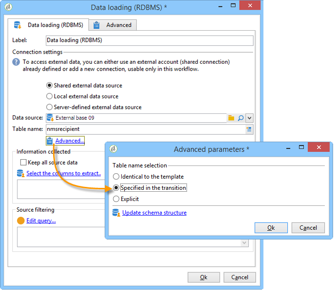

# 데이터 로딩(RDBMS){#data-loading-rdbms}

**[!UICONTROL Data loading (RDBMS)]** 활동을 사용하면 이 외부 데이터베이스에 직접 액세스하여 타깃팅에 필요한 데이터만 수집할 수 있습니다.

성능을 향상시키려면 쿼리 활동(외부 데이터베이스의 데이터를 사용할 수 있는 곳)을 사용하는 것이 좋습니다. 자세한 내용은 [외부 데이터베이스(FDA) 액세스](accessing-an-external-database-fda.md)를 참조하세요.

작업은 다음과 같습니다.

1. 목록에서 데이터 소스를 선택하고 추출할 데이터가 포함된 표의 이름을 입력합니다.

   

   해당 필드에 입력한 테이블 이름은 외부 데이터베이스에서 데이터를 수집하기 위한 템플릿으로 사용됩니다. 워크플로우에서 처리한 테이블의 이름은 데이터 로드 활동의 인바운드 전환으로 계산되거나 전달될 수 있습니다. 사용할 테이블을 선택하려면 **[!UICONTROL Advanced..]**&#x200B;을(를) 클릭하십시오. **[!UICONTROL Specified in the transition]** 또는 **[!UICONTROL Explicit]** 옵션을 연결하고 선택하십시오.

   

1. 데이터베이스에서 수집할 데이터를 선택하려면 **[!UICONTROL Select the columns to extract...]** 링크를 클릭하십시오.

   

1. 이 데이터에 대한 필터를 정의할 수 있습니다. 이렇게 하려면 **[!UICONTROL Edit query....]** 링크를 클릭하십시오.

   이렇게 수집된 데이터는 워크플로의 라이프 사이클 전체에서 사용할 수 있습니다.
