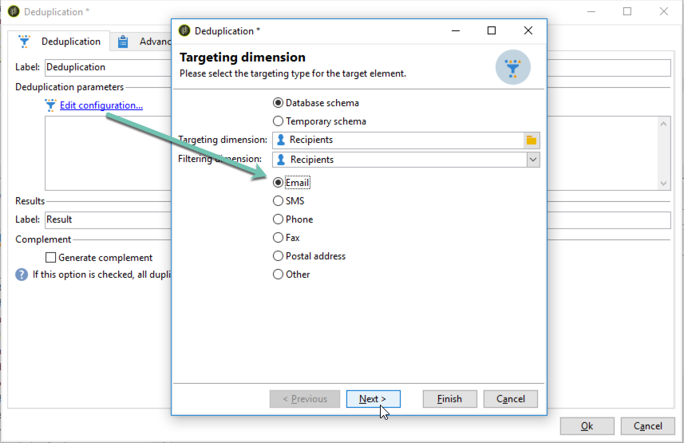
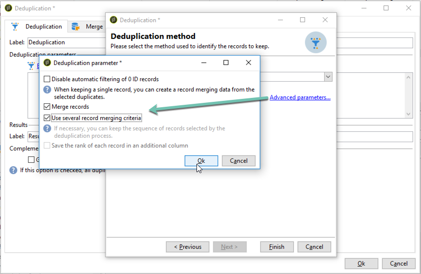

# 중복 제거 활동의 병합 기능 사용 {#deduplication-merge}

## 이 활용 사례 정보 {#about-this-use-case}

이 사용 사례에서는 **[!UICONTROL Deduplication]** 활동에서 **[!UICONTROL Merge]** 기능을 사용하는 방법을 설명합니다.

이 기능에 대한 자세한 내용은 [이 섹션](deduplication.md#merging-fields-into-single-record)을 참조하세요.

**[!UICONTROL Deduplication]** 활동은 데이터 집합에서 중복 행을 제거하는 데 사용됩니다. 이 사용 사례에서는 아래에 표시된 데이터가 이메일 필드를 기반으로 복제됩니다.

| 마지막 수정일 | 이름 | 성 | 이메일 | 휴대폰 | 휴대폰 |
|-----|------------|-----------|-------|--------------|------|
| 5/19/2020 | 로버트 | 티스너 | bob@mycompany.com | 444-444-444 | 777-777-7777 |
| 2020년 7월 22일 | 보비 | 티스너 | bob@mycompany.com | | 777-777-7777 |
| 10/03/2020 | Bob |  | bob@mycompany.com | | 888-888-8888 |

중복 제거 활동의 **[!UICONTROL Merge]** 특성을 사용하여 중복 제거에 대한 규칙 집합을 구성하여 단일 결과 데이터 레코드로 병합할 필드 그룹을 정의할 수 있습니다. 예를 들어 중복 레코드 집합이 있는 경우 가장 오래된 전화 번호나 가장 최근 이름을 유지하도록 선택할 수 있습니다.

## 병합 기능 활성화 {#activating-merge}

병합 기능을 사용하려면 먼저 **[!UICONTROL Deduplication]** 활동을 구성해야 합니다. 이렇게 하려면 다음 단계를 수행합니다.

1. 활동을 열고 **[구성 편집]** 링크를 클릭합니다.

1. 중복 제거에 사용할 조정 필드를 선택한 다음 **[!UICONTROL Next]**&#x200B;을(를) 클릭합니다. 이 예제에서는 이메일 필드를 기반으로 중복을 제거하려고 합니다.

   

1. **[!UICONTROL Advanced parameters]** 링크를 클릭한 다음 **[!UICONTROL Merge records]** 및 **[!UICONTROL Use several record merging criteria]** 옵션을 활성화합니다.

   

1. **[!UICONTROL Merge]** 탭이 **[!UICONTROL Deduplication]** 구성 화면에 추가됩니다. 이 탭을 사용하여 중복 제거를 수행할 때 병합할 데이터를 지정합니다.

## 병합할 필드 구성 {#configuring-rules}

다음은 데이터를 단일 레코드로 병합하는 데 사용할 규칙입니다.

* 가장 최근 이름(이름 및 성 필드)을 유지합니다.
* 최신 휴대폰을 보관하고,
* 가장 오래된 전화번호를 유지하고,
* 최종 레코드에 적격하려면 그룹의 모든 필드가 null이 아니어야 합니다.

이러한 규칙을 구성하려면 다음 단계를 수행합니다.

1. **[!UICONTROL Merge]** 탭을 열고 **[!UICONTROL Add]** 단추를 클릭합니다.

   

1. 병합할 필드 그룹의 식별자와 레이블을 지정합니다.

   

1. 고려할 레코드를 선택하는 조건을 나타냅니다.

   

1. 가장 최근 이름을 선택하려면 마지막 수정 날짜를 기준으로 정렬합니다.

   

1. 병합할 필드를 선택합니다. 이 예제에서는 이름과 성 필드를 유지하려고 합니다.

   

1. 필드는 병합할 데이터 집합에 추가되고 새 요소는 워크플로 스키마에 추가됩니다.

   휴대폰 및 휴대폰 필드를 구성하려면 다음 단계를 반복하십시오.

   

   

## 결과 {#results}

이러한 규칙을 구성한 후 **[!UICONTROL Deduplication]** 활동이 끝날 때 다음 데이터가 수신됩니다.

| 수정일 | 이름 | 성 | 이메일 | 휴대폰 | 휴대폰 |
|-----|------------|-----------|-------|--------------|------|
| 5/19/2020 | 로버트 | 티스너 | bob@mycompany.com | 444-444-444 | 777-777-7777 |
| 2020년 7월 22일 | 보비 | 티스너 | bob@mycompany.com | | 777-777-7777 |
| 10/03/2020 | Bob |  | bob@mycompany.com | | 888-888-8888 |

결과는 이전에 구성된 규칙에 따라 세 레코드에서 병합됩니다. 비교 결과, 원래의 전화번호와 함께 가장 최근의 이름과 휴대전화를 사용하는 것으로 결론이 난다.

| 이름 | 성 | 이메일 | 휴대폰 | 휴대폰 |
|------------|-----------|-------|--------------|------|
| 보비 | 티스너 | bob@mycompany.com | 444-444-4444 | 888-888-8888 |

>[!NOTE]
>
> 이름과 마지막 필드를 모두 사용하여 &quot;이름&quot; 규칙을 구성했으므로 병합된 이름은 &quot;Bobby&quot;입니다.
>
>따라서 관련된 성 필드가 비어 있으므로 &quot;Bob&quot;(가장 최근 이름)을 고려할 수 없습니다. 가장 최근의 성과 이름의 조합이 최종 기록에 병합되었다.
