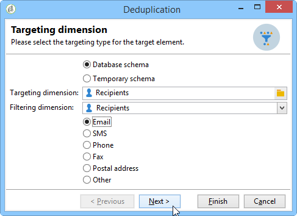

# 중복 제거{#deduplication}

중복 제거는 인바운드 활동의 결과에서 중복을 삭제합니다. 중복 제거는 이메일 주소, 전화 번호 또는 다른 필드에서 수행할 수 있습니다.

다음 **[!UICONTROL Deduplication]** 활동은 데이터 세트에서 중복 행을 제거하는 데 사용됩니다. 예를 들어, 아래 레코드는 동일한 이메일 주소와 동일한 모바일 및/또는 홈전화기가 있으므로 중복으로 간주될 수 있습니다.

| 마지막 수정 날짜 | 이름 | 성 | 이메일 | 휴대폰 | 휴대폰 |
-----|------------|-----------|-------|--------------|------
| 02/03/2020 | Bob | 티너 | bob@mycompany.com | 444-444-4444 | 888-888-8888 |
| 05/19/2020 | 로버트 | 티너 | bob@mycompany.com | 444-444-4444 | 777-777-7777 |
| 07/22/2020 | 바비 | 티너 | bob@mycompany.com | 444-444-4444 | 777-777-7777 |

다음 **[!UICONTROL Deduplication]** 활동에는 중복 항목이 식별된 후 고유한 레코드로 전체 행을 유지하는 기능이 있습니다. 예를 들어, 위의 사용 사례에서 활동이 가장 오래된 레코드만 유지하도록 구성된 경우 **[!UICONTROL Date]**&#x200B;로 설정되면 결과는 다음과 같습니다.

| 날짜 | 이름 | 성 | 이메일 | 휴대폰 | 휴대폰 |
-----|----------|------------|-------|--------------|------
| 02/03/2020 | Bob | 티너 | bob@mycompany.com | 444-444-4444 | 888-888-8888 |

선택한 기본 레코드는 중복 행의 다른 관련 데이터와 필드 데이터를 병합하지 않고 데이터를 전달합니다.

보완:

| 날짜 | 이름 | 성 | 이메일 | 휴대폰 | 휴대폰 |
-----|------------|-----------|-------|--------------|------
| 05/19/2020 | 로버트 | 티너 | bob@mycompany.com | 444-444-4444 | 777-777-7777 |
| 07/22/2020 | 바비 | 티너 | bob@mycompany.com | 444-444-4444 | 777-777-7777 |

## 모범 사례 {#best-practices}

중복 제거 중에 인바운드 흐름이 별도로 처리됩니다. 인스턴스 수신자 A가 쿼리 1의 결과와 쿼리 2의 결과에 있는 경우 중복 제거되지 않습니다.

이 문제는 다음과 같이 해결해야 합니다.

* 만들기 **결합** 활동은 각 인바운드 흐름을 통합합니다.
* 만들기 **중복 제거** 활동 후 **결합** 활동.

## 구성 {#configuration}

중복 제거를 구성하려면 해당 레이블, 방법, 중복 제거 기준 및 결과에 대한 옵션을 입력합니다.

1. 을(를) 클릭합니다. **[!UICONTROL Edit configuration...]** 중복 제거 모드를 정의하기 위한 링크입니다.

   

1. 이 활동에 대한 대상 유형(기본적으로 중복 제거는 수신자와 연결됨)과 사용할 기준(예: 동일한 값을 사용하여 중복을 식별할 수 있는 필드)을 선택합니다.

   >[!NOTE]
   >
   >외부 데이터를 입력으로 사용하는 경우(예: 외부 파일의 경우) 다음을 선택해야 합니다 **[!UICONTROL Temporary schema]** 선택 사항입니다.
   >
   >다음 단계에서 **[!UICONTROL Other]** 옵션을 사용하면 사용할 기준 또는 기준을 선택할 수 있습니다.

   

1. 다음 단계에서 **[!UICONTROL Other]** 옵션을 사용하면 동일한 값의 경우 사용할 기준이나 기준을 선택할 수 있습니다.

   

1. 드롭다운 목록에서 사용할 중복 제거 방법을 선택하고 유지할 중복 수를 입력합니다.

   

   다음 방법을 사용할 수 있습니다.

   * **[!UICONTROL Choose for me]**: 중복 중에서 유지할 레코드를 임의로 선택합니다.
   * **[!UICONTROL Following a list of values]**: 하나 이상의 필드에 대한 값 우선 순위를 정의할 수 있습니다. 값을 정의하려면 필드를 선택하거나 표현식을 만든 다음 해당 테이블에 값을 추가합니다. 새 필드를 정의하려면 값 목록 위에 있는 **[!UICONTROL Add]** 버튼을 클릭합니다.

      

   * **[!UICONTROL Non-empty value]**: 선택한 표현식의 값이 비어 있지 않은 레코드를 우선 순위로 유지할 수 있습니다.

      

   * **[!UICONTROL Using an expression]**: 지정된 표현식의 최저(또는 최고) 값으로 레코드를 유지할 수 있습니다.

      
   >[!NOTE]
   >
   >다음 **[!UICONTROL Merge]** 기능을 통해 액세스 가능 **[!UICONTROL Advanced parameters]** 링크: 필드 또는 필드 그룹을 하나의 결과 데이터 레코드로 병합하기 위해 규칙 세트를 구성할 수 있습니다. 자세한 내용은 [필드를 단일 레코드에 병합](#merging-fields-into-single-record).

1. 클릭 **[!UICONTROL Finish]** 선택한 중복 제거 방법을 승인하려면 다음을 수행하십시오.

   창의 중간 섹션에는 정의된 구성이 요약됩니다.

   활동 편집기 창의 아래 섹션에서는 그래픽 객체의 아웃바운드 전환에 대한 레이블을 수정하고 활동 결과와 연관될 세그먼트 코드를 입력할 수 있습니다. 이 코드는 나중에 타깃팅 기준으로 사용할 수 있습니다.

   

1. 을(를) 확인합니다. **[!UICONTROL Generate complement]** 나머지 모집단을 활용하려는 경우 선택합니다. 그 보수는 모든 중복으로 이루어져 있다. 그러면 다음과 같이 활동에 추가 전환이 추가됩니다.

   

## 예: 게재 전 중복 식별 {#example--identify-the-duplicates-before-a-delivery}

다음 예제에서는 중복 제거가 세 개의 쿼리의 결합에 대해 발생합니다.

워크플로우의 목적은 동일한 수신자에게 여러 번 보내지 않도록 중복을 제외하여 게재할 대상을 정의하는 것입니다.

식별된 중복은 필요한 경우 다시 사용할 수 있는 전용 중복 목록에 통합됩니다.

1. 워크플로우가 위에 표시된 대로 작동하는 데 필요한 다양한 활동을 추가하고 연결합니다.

   조합 활동은 여기에서 세 쿼리를 하나의 전환으로 &quot;통합&quot;하는 데 사용됩니다. 따라서 중복 제거는 각 쿼리에 대해 개별적으로 작동하지 않고 전체 쿼리 동안 작동합니다. 이 주제에 대한 자세한 내용은 [우수 사례](#best-practices).

1. 중복 제거 활동을 연 다음 **[!UICONTROL Edit configuration...]** 중복 제거 모드를 정의하기 위한 링크입니다.
1. 새 창에서 **[!UICONTROL Database schema]**.
1. 선택 **수신자** 타겟팅 및 필터링 차원.
1. 에 대한 ID 필드를 선택합니다 **[!UICONTROL Email]** 중복 항목을 사용하여 게재를 모든 이메일 주소로 한 번만 전송한 다음 를 클릭합니다 **[!UICONTROL Next]**.

   특정 필드에 중복 ID를 기반으로 하려면 을(를) 선택합니다 **[!UICONTROL Other]** 사용 가능한 필드 목록에 액세스하려면 다음을 수행하십시오.

1. 여러 수신자에 대해 동일한 이메일 주소가 식별되는 경우 하나의 항목만 유지하도록 선택합니다.
1. 을(를) 선택합니다 **[!UICONTROL Choose for me]** 중복 제거 모드를 사용하면 식별된 중복 시 저장된 레코드가 임의로 선택되도록 한 다음 **[!UICONTROL Finish]**.

워크플로우를 실행할 때 중복으로 식별된 모든 수신자는 결과에서 제외되고(따라서 게재)가 중복 목록에 추가됩니다. 이 목록은 중복을 다시 식별하지 않고 다시 사용할 수 있습니다.

## 필드를 단일 데이터 레코드에 병합 {#merging-fields-into-single-record}

다음 **[!UICONTROL Merge]** 기능을 사용하면 중복 제거에 대한 규칙 세트를 구성하여 하나의 결과 데이터 레코드에 병합할 필드 또는 필드 그룹을 정의할 수 있습니다.

예를 들어 중복 레코드 세트를 사용하여 가장 오래된 전화 번호 또는 가장 최근 이름을 유지하도록 선택할 수 있습니다.

이 기능을 활용하는 사용 사례는에서 사용할 수 있습니다. [이 섹션](deduplication-merge.md).

이렇게 하려면 다음 단계를 수행합니다.

1. 에서 **[!UICONTROL Deduplication method]** 선택 단계에서 **[!UICONTROL Advanced Parameters]** 링크를 클릭합니다.

   

1. 을(를) 선택합니다 **[!UICONTROL Merge records]** 옵션을 클릭하여 기능을 활성화합니다.

   각 병합 조건에 여러 데이터 필드를 그룹화하려면 **[!UICONTROL Use several record merging criteria]** 선택 사항입니다.

   

1. 기능을 활성화한 후 **[!UICONTROL Merge]** 탭이 **[!UICONTROL Deduplication]** 활동. 병합할 필드 그룹과 관련 규칙을 정의할 수 있습니다.

   자세한 내용은 [이 섹션](deduplication-merge.md).

## 입력 매개 변수 {#input-parameters}

* tableName
* 스키마

각 인바운드 이벤트는 이러한 매개 변수로 정의된 대상을 지정해야 합니다.

## 출력 매개 변수 {#output-parameters}

* tableName
* 스키마
* recCount

이 세 값 집합은 중복 제거로 인한 대상을 식별합니다. **[!UICONTROL tableName]** 대상 식별자를 저장하는 테이블의 이름입니다. **[!UICONTROL schema]** 는 모집단의 스키마(일반적으로 nms:recipient)이며 **[!UICONTROL recCount]** 는 테이블에 있는 요소의 수입니다.

보어와 연관된 전환에는 동일한 매개 변수가 있습니다.
