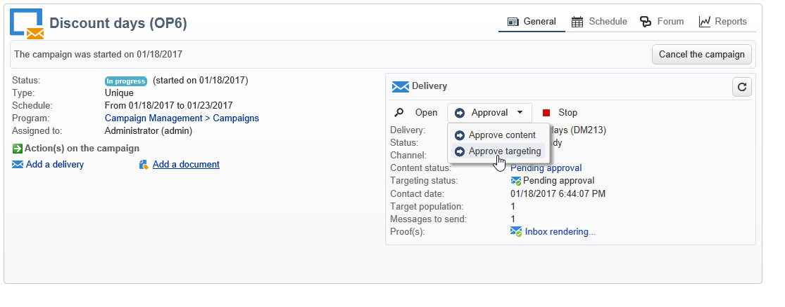

# 승인 정의 {#defining-approvals}


승인을 사용하면 운영자가 워크플로우를 관리하는 결정을 하거나 워크플로우의 지속적인 실행을 확인할 수 있습니다.

운영자 그룹에 메시지가 전송되고 워크플로우는 재개하기 전에 응답을 기다립니다. 워크플로우가 중지되지 않고 다른 작업이 수행될 수 있습니다. 예를 들어 여러 개의 동시 승인이 보류 중일 수 있습니다.

승인에는 연산자가 선택할 수 있는 여러 옵션이 포함될 수 있습니다. 하지만 타겟팅 수행과 같이 작업자에게 수행할 작업을 제출하기 위해 선택 사항 수를 1로 제한할 수 있습니다. 그런 다음 작업이 수행되면 연산자가 응답할 수 있습니다(그런 다음 프로세스가 다시 시작됩니다.). 다음 예에서는 이러한 유형의 승인을 보여줍니다.


운영에서는 승인이 필요한 모든 단계가 같은 원칙에 기초합니다.



승인 예는 에서 찾을 수 있습니다.

연산자는 다음 두 가지 방법 중 하나로 응답할 수 있습니다. 이메일 메시지 또는 콘솔을 통해 연결된 웹 페이지를 사용하여 유효성을 검사하는 중입니다.

>[!NOTE]
>
>응답이 저장되면 수정되지 않을 수 있습니다.

## 전자 메일로 승인 {#sending-emails}

응답할 수 있는 웹 페이지에 대한 링크가 포함된 승인 메시지를 받을 수 있습니다. 타겟팅된 운영자가 승인 이메일을 받으려면 운영자 이메일 주소를 완료해야 합니다. 그렇지 않은 경우 연산자가 콘솔을 사용하여 응답해야 합니다

운영자 관리에 대해서는 여기에 자세히 설명되어 있습니다.

승인 이메일은 계속 전송됩니다. 기본 게재 템플릿은 다음과 같습니다 **[!UICONTROL notifyAssignee]**: 이 변수는 **[!UICONTROL Administration > Campaign management > Technical delivery templates]** 폴더를 입력합니다. 이 시나리오를 사용자 지정할 수 있으며, 각 활동에 대한 템플릿을 복사하고 변경하는 것도 좋습니다.

이 템플릿을 통해 생성된 게재는 **[!UICONTROL Administration > Production > Objects created automatically > Technical deliveries > Workflow notifications]** 폴더를 입력합니다.

## 콘솔을 통한 승인 {#approval-via-the-console}

작업에서 승인할 요소가 캠페인 대시보드에 표시됩니다.

기술 워크플로우의 경우 사용자가 승인할 수 있는 작업은 의 트리 구조에서 액세스할 수 있습니다 **[!UICONTROL Administration > Production > Objects created automatically > Pending approvals]** 폴더를 입력합니다.


## 그룹 {#groups}

필터링 조건을 통해 선택한 연산자 그룹, 단일 연산자 또는 연산자 세트에 승인이 할당됩니다.

1. 가장 간단한 형태의 승인을 위해 연산자가 응답하는 즉시 작업이 완료됩니다. 응답하려는 다른 운영자에게는 누군가 이미 그것을 했다는 통보를 받게 됩니다.
1. 여러 승인을 보려면 [다중 승인](#multiple-approval).

승인을 위한 운영자 그룹은 명명된 개인이 아닌 역할 또는 기능으로 지정되어야 합니다. 예를 들어, &quot;캠페인 예산&quot; 그룹이 &quot;해리의 그룹&quot;보다 선호됩니다. 한 그룹에 작업을 승인할 수 있는 사람이 두 명 이상 있는 것이 좋습니다. 이렇게 하면 한 사람이 없으면 다른 사람이 응답할 수 있습니다.

## 만료 {#expirations}

만료는 다양한 유형의 활동에 사용되는 특정 전환이며, 특히 승인에 사용됩니다. 만료 기능을 사용하여 응답 없이 지정된 시간 후에 작업을 트리거할 수 있습니다. 예를 들어 워크플로우를 추적하고 다른 그룹에 승인을 지정하는 데 사용할 수도 있습니다.

활동 승인 속성의 두 번째 탭에서는 한 개 이상의 만료를 정의할 수 있습니다. 실제로 여러 만료 유형을 정의할 수 있습니다.


새 만료를 추가하려면 **[!UICONTROL Add]**. 생성된 각 만료에 전환이 추가됩니다. 다음을 수행할 수 있습니다.

* 목록에서 셀을 클릭하거나 F2 키를 눌러 일반적인 매개 변수를 직접 수정합니다.
* 또는 를 클릭하여 표현식을 편집합니다 **[!UICONTROL Detail...]** 버튼을 클릭합니다.

>[!NOTE]
>
>시간 순서대로 처리되므로 만료에 대한 순서를 지정할 필요가 없습니다.

다음 **[!UICONTROL Do not terminate the task]** 옵션을 선택하면 지연이 초과될 때 승인이 활성화됩니다. 이 모드에서는 승인을 활성 상태로 두는 동안 미리 알림을 관리할 수 있습니다. 연산자가 여전히 응답할 수 있습니다. 이 옵션은 기본적으로 비활성화되어 있으므로 작업이 만료 시 완료된 것으로 간주되며 연산자가 더 이상 응답하지 않을 수 있습니다.

다음 네 가지 유형의 만료를 만들 수 있습니다.

* **작업 시작 후 지연**: 만료는 승인이 활성화된 날짜에 지정된 시간을 추가하여 계산됩니다.
* **지정된 날짜 이후 지연**: 만료는 지정한 날짜에 시간 길이를 추가하여 계산됩니다.
* **지정된 날짜보다 지연**: 만료는 지정한 날짜에서 시간 길이를 뺀 값으로 계산됩니다.
* **스크립트로 계산된 만료**: 만료는 JavaScript를 사용하여 계산됩니다.

   다음 예제에서는 게재 시작 날짜(다음으로 식별됨) 24시간 전에 만료를 계산합니다 **vars.deliveryId**):

   ```
   var delivery = nms.delivery.get(vars.deliveryId)
   var expiration = delivery.scheduling.contactDate
   var oneDay = 1000*60*60*24
   expiration.setTime(expiration.getTime() - oneDay)
   return expiration
   ```

## 다중 승인 {#multiple-approval}

다중 승인은 모든 승인 연산자가 응답할 수 있는 메커니즘입니다. 각 응답에 대해 전환이 활성화됩니다.

여러 승인은 투표나 설문 조사 메커니즘에 유용합니다. 기한을 추가하여 답변을 계산하고 해당 기간 후에 결과를 처리할 수 있습니다.

## 필수 권한 {#required-rights}

승인 요청에 응답하려면 그룹의 연산자에 다음 권한이 있어야 합니다.

* 워크플로우에 대한 쓰기 권한.
* 승인할 작업이 포함된 폴더에 대한 읽기 및 쓰기 권한.

워크플로우 실행 그룹에는 이러한 권한이 있습니다. 이 그룹에 추가된 운영자에게는 승인 요청에 응답할 권한이 있습니다.
