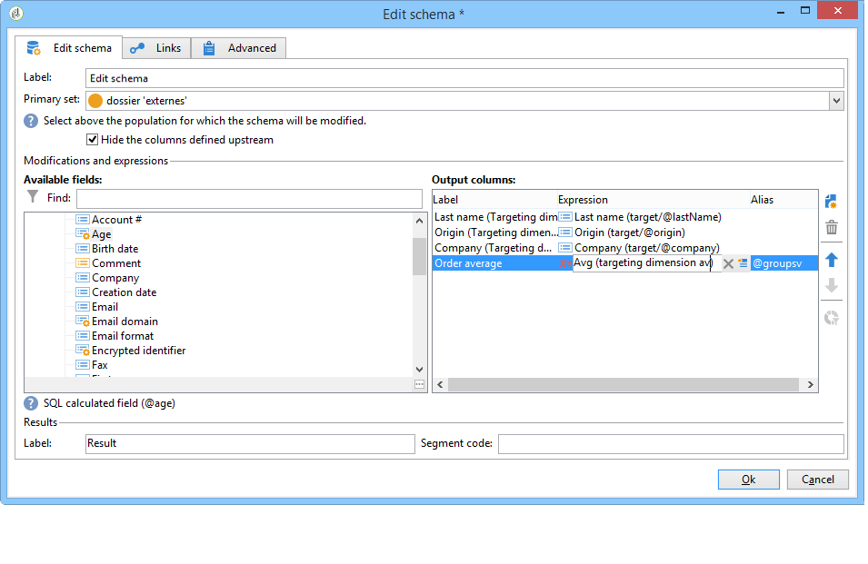

# 스키마 편집{#edit-schema}

데이터를 변환, 정규화하고, 필요한 경우 **[!UICONTROL Edit schema]** 활동을 사용하여 워크플로우에서 보강할 수 있습니다. 일반적으로 데이터 구조를 정규화하는 데 사용됩니다. 예를 들어 필드나 집계의 평균 값을 계산하여 출력 열의 이름을 바꾸거나 해당 내용을 수정할 수 있습니다.

이 활동은 작업 테이블의 데이터를 변경하지 않고 해당 스키마(데이터의 논리적 보기)만 변경합니다.

**[!UICONTROL Links]** 탭을 통해 다른 작업 테이블과 조인을 만들 수도 있습니다.

아래 섹션에서는 조인 조건 목록(두 테이블의 데이터를 조정하는 데 사용되는 기준)을 구성할 수 있습니다.
