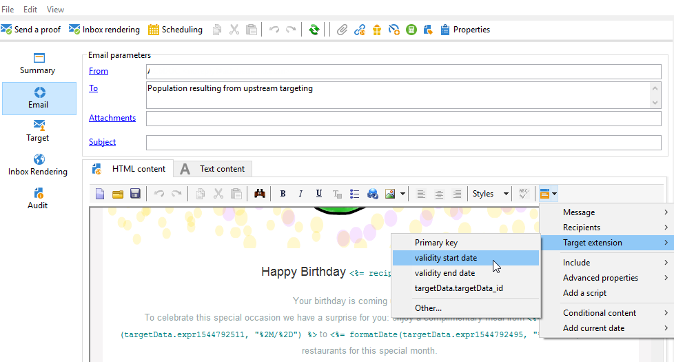

# 사용자 정의 날짜 필드를 통한 이메일 강화{#email-enrichment-with-custom-date-fields}


이 예제에서는 이번 달에 생일을 맞는 수신자에게 사용자 정의 데이터 필드가 포함된 이메일을 보내려고 합니다. 이메일에는 생일 전후 1주일 동안 사용할 수 있는 쿠폰이 포함됩니다.

**[!UICONTROL Split]** 활동으로 이번 달 생일을 축하하는 목록에서 받는 사람을 타겟팅해야 합니다. 그런 다음 **[!UICONTROL Enrichment]** 활동을 사용하면 사용자 지정 데이터 필드가 고객의 특별 오퍼에 대한 이메일의 유효 날짜로 작동합니다.


이 예제를 만들려면 다음 단계를 적용합니다.

1. 캠페인의 **[!UICONTROL Targeting and workflows]** 탭에서 **[!UICONTROL Read list]** 활동을 끌어다 놓아 수신자 목록을 타겟팅합니다.
1. 처리할 목록은 선택한 옵션과 여기에 정의된 매개 변수에 따라 스크립트로 계산되거나 동적으로 현지화되도록 명시적으로 지정할 수 있습니다.

   

1. **[!UICONTROL Split]** 활동을 추가하여 이번 달에 생일을 맞는 받는 사람을 다른 받는 사람과 구별합니다.
1. 목록을 분할하려면 **[!UICONTROL Filtering of selected records]** 범주에서 **[!UICONTROL Add a filtering condition on the inbound population]**&#x200B;을(를) 선택합니다. **[!UICONTROL Edit]**&#x200B;을(를) 클릭합니다.

   

1. **[!UICONTROL Filtering conditions]**&#x200B;을(를) 선택한 다음 **[!UICONTROL Edit expression]** 단추를 클릭하여 받는 사람의 생일 월을 필터링합니다.

   

1. **[!UICONTROL Advanced Selection]**&#x200B;을(를) 클릭한 다음 **[!UICONTROL Edit the formula using an expression]**&#x200B;을(를) 클릭하고 Month(@birthDate) 식을 추가합니다.
1. **[!UICONTROL Operator]** 열에서 **[!UICONTROL equal to]**&#x200B;을(를) 선택합니다.
1. 현재 날짜의 **[!UICONTROL Value]**&#x200B;개월(Month(GetDate())을 추가하여 조건을 추가로 필터링합니다.

   생일 월이 현재 월에 해당하는 수신자를 쿼리합니다.

   

1. **[!UICONTROL Finish]**&#x200B;을(를) 클릭합니다. 그런 다음 **[!UICONTROL Split]** 활동의 **[!UICONTROL General]** 탭에서 **[!UICONTROL Results]** 범주의 **[!UICONTROL Generate complement]**&#x200B;을(를) 클릭합니다.

   **[!UICONTROL Complement]** 결과를 사용하여 게재 활동을 추가하거나 목록을 업데이트할 수 있습니다. 여기에 **[!UICONTROL End]** 활동이 방금 추가되었습니다.

   

이제 **[!UICONTROL Enrichment]** 활동을 구성해야 합니다.

1. 하위 집합 뒤에 **[!UICONTROL Enrichment]** 활동을 추가하여 사용자 지정 날짜 필드를 추가하세요.

   

1. **[!UICONTROL Enrichment]** 활동을 엽니다. **[!UICONTROL Complementary information]** 범주에서 **[!UICONTROL Add data]**&#x200B;을(를) 클릭합니다.

   

1. **[!UICONTROL Data linked to the filtering dimension]**&#x200B;을(를) 선택한 후 **[!UICONTROL Data of the filtering dimension]**&#x200B;을(를) 선택합니다.
1. **[!UICONTROL Add]** 버튼을 클릭합니다.

   

1. **[!UICONTROL Label]** 추가. 그런 다음 **[!UICONTROL Expression]** 열에서 **[!UICONTROL Edit expression]**&#x200B;을(를) 클릭합니다.

   

1. 먼저 생년월일 이전 주를 **[!UICONTROL Expression]** **유효성 시작일**(으)로 타깃팅해야 합니다. `SubDays([target/@birthDate], 7)`.

   

1. 그런 다음 생년월일 다음 주를 대상으로 하는 사용자 지정 날짜 필드 **유효성 종료일**&#x200B;을(를) 만들려면 **[!UICONTROL Expression]**: `AddDays([target/@birthDate], 7)`을(를) 추가해야 합니다.

   표현식에 레이블을 추가할 수 있습니다.

   

1. **[!UICONTROL Ok]**&#x200B;을(를) 클릭합니다. 이제 데이터 보강이 완료되었습니다.

**[!UICONTROL Enrichment]** 활동 후에 게재를 추가할 수 있습니다. 이 경우 이달 생일을 축하하는 고객에게 유효일이 포함된 특별 오퍼를 수신자에게 보내도록 이메일 게재를 추가했습니다.

1. **[!UICONTROL Enrichment]** 활동 뒤에 **[!UICONTROL Email delivery]** 활동을 끌어다 놓습니다.

   

1. 게재 개인화를 시작하려면 **[!UICONTROL Email delivery]** 활동을 두 번 클릭하세요.
1. 게재에 **[!UICONTROL Label]**&#x200B;을(를) 추가하고 **[!UICONTROL Continue]**&#x200B;을(를) 클릭합니다.
1. 전자 메일 게재를 만들려면 **[!UICONTROL Save]**&#x200B;을(를) 클릭합니다.
1. **[!UICONTROL Confirm delivery before sending option]**&#x200B;이(가) 선택된 전자 메일 게재 **[!UICONTROL Properties]**&#x200B;의 **[!UICONTROL Approval]** 탭을 확인합니다.

   그런 다음 워크플로우를 시작하여 타겟팅된 정보로 아웃바운드 전환을 강화합니다.

   

이제 **[!UICONTROL Enrichment]** 활동에서 만든 사용자 지정 날짜 필드를 사용하여 전자 메일 게재 디자인을 시작할 수 있습니다.

1. **[!UICONTROL Email delivery]** 활동을 두 번 클릭합니다.
1. 이메일에 타겟 확장을 추가합니다. 유효 일자의 형식을 구성하려면 다음 표현식 내에 있어야 합니다.

   ```
   <%=
           formatDate(targetData.alias of your expression,"%2D.%2M")  %>
   ```

1. 을(를) 클릭합니다. **[!UICONTROL Target extension]**&#x200B;을(를) 선택한 다음 **[!UICONTROL Enrichment]** 활동으로 이전에 만든 사용자 지정 유효성 날짜를 선택하여 확장을 formatDate 식에 추가합니다.

   

1. 필요에 따라 이메일 콘텐츠를 구성합니다.

   

1. 사용자 정의 날짜 필드가 올바르게 구성되었는지 확인하기 위해 이메일 미리 보기

   

이제 이메일이 준비되었습니다. 증명을 보내기 시작하고 게재를 확인하여 생일 이메일을 보낼 수 있습니다.
