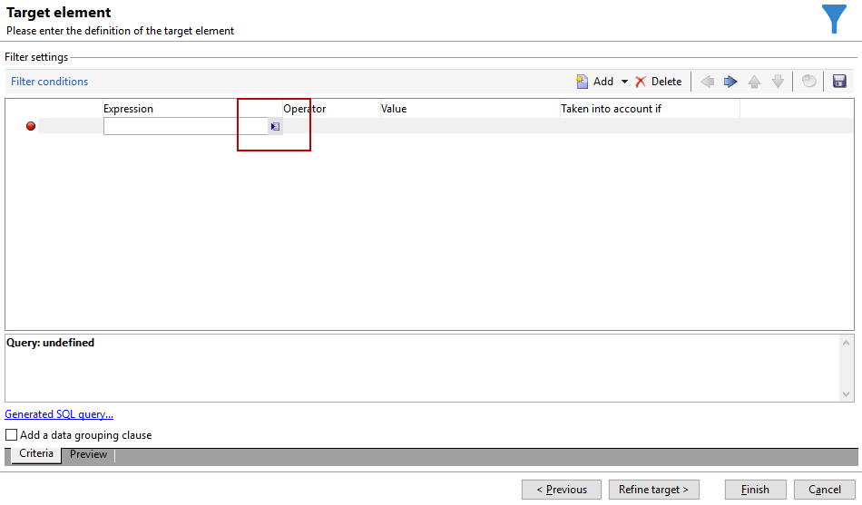

# 사용자 정의 날짜 필드를 통한 이메일 강화{#email-enrichment-with-custom-date-fields}


이 예제에서는 이번 달에 생일을 맞는 수신자에게 사용자 정의 데이터 필드가 포함된 이메일을 보내려고 합니다. 이메일에는 생일 전후 1주일 동안 사용할 수 있는 쿠폰이 포함됩니다.

이번 달 생일을 축하하는 목록에서 수신자를 타겟팅해야 합니다. **[!UICONTROL Split]** 활동. 그런 다음 를 사용합니다. **[!UICONTROL Enrichment]** 활동. 사용자 지정 데이터 필드는 고객의 특별 오퍼에 대한 이메일의 유효 일자로 작동합니다.


이 예제를 만들려면 다음 단계를 적용합니다.

1. 다음에서 **[!UICONTROL Targeting and workflows]** 캠페인의 탭, 드래그 앤 드롭 **[!UICONTROL Read list]** 활동을 통해 수신자 목록을 타겟팅할 수 있습니다.
1. 처리할 목록은 선택한 옵션과 여기에 정의된 매개 변수에 따라 스크립트로 계산되거나 동적으로 현지화되도록 명시적으로 지정할 수 있습니다.

   

1. 추가 **[!UICONTROL Split]** 활동은 이번 달에 생일을 축하하는 수신자를 다른 수신자와 구별하기 위한 것입니다.
1. 목록을 분할하려면 **[!UICONTROL Filtering of selected records]** 범주, 선택 **[!UICONTROL Add a filtering condition on the inbound population]**. 그런 다음 을 클릭합니다. **[!UICONTROL Edit]**.

   

1. 선택 **[!UICONTROL Filtering conditions]** 그런 다음 **[!UICONTROL Edit expression]** 수신자의 생일 월을 필터링하는 버튼입니다.

   

1. 클릭 **[!UICONTROL Advanced Selection]** 그러면 **[!UICONTROL Edit the formula using an expression]** Month(@birthDate) 식을 추가합니다.
1. 다음에서 **[!UICONTROL Operator]** 열에서 **[!UICONTROL equal to]**.
1. 다음을 추가하여 조건을 추가로 필터링합니다. **[!UICONTROL Value]** 현재 날짜의 월: 월(GetDate()).

   생일 월이 현재 월에 해당하는 수신자를 쿼리합니다.

   

1. **[!UICONTROL Finish]**&#x200B;을(를) 클릭합니다. 그런 다음 **[!UICONTROL General]** 의 탭 **[!UICONTROL Split]** 활동을 클릭하고 **[!UICONTROL Generate complement]** 다음에서 **[!UICONTROL Results]** 범주.

   포함 **[!UICONTROL Complement]** 따라서 게재 활동을 추가하거나 목록을 업데이트할 수 있습니다. 여기에 방금 을(를) 추가했습니다. **[!UICONTROL End]** 활동.

   

이제 을(를) 구성해야 합니다 **[!UICONTROL Enrichment]** 활동:

1. 추가 **[!UICONTROL Enrichment]** 활동 을 하위 집합 뒤에 추가하여 사용자 지정 날짜 필드를 추가합니다.

   

1. 을(를) 엽니다 **[!UICONTROL Enrichment]** 활동. 다음에서 **[!UICONTROL Complementary information]** 범주, 클릭 **[!UICONTROL Add data]**.

   

1. 선택 **[!UICONTROL Data linked to the filtering dimension]** 그러면 **[!UICONTROL Data of the filtering dimension]**.
1. **[!UICONTROL Add]** 버튼을 클릭합니다.

   

1. 추가 **[!UICONTROL Label]**. 그런 다음 **[!UICONTROL Expression]** 열, 클릭 **[!UICONTROL Edit expression]**.

   

1. 먼저, 생년월일 전주를 대상으로 해야 합니다. **유효성 시작일** 다음을 사용하여 **[!UICONTROL Expression]**: `SubDays([target/@birthDate], 7)`.

   

1. 그런 다음 사용자 정의 날짜 필드를 만들려면 **유효성 종료일** 생일 다음 주를 타겟팅하려면 다음을 추가해야 합니다. **[!UICONTROL Expression]**: `AddDays([target/@birthDate], 7)`.

   표현식에 레이블을 추가할 수 있습니다.

   

1. **[!UICONTROL Ok]**&#x200B;을(를) 클릭합니다. 이제 데이터 보강이 완료되었습니다.

다음 이후 **[!UICONTROL Enrichment]** 활동을 통해 게재를 추가할 수 있습니다. 이 경우 이달 생일을 축하하는 고객에게 유효일이 포함된 특별 오퍼를 수신자에게 보내도록 이메일 게재를 추가했습니다.

1. 드래그 앤 드롭 **[!UICONTROL Email delivery]** 다음 이후 활동 **[!UICONTROL Enrichment]** 활동.

   

1. 을(를) 두 번 클릭합니다. **[!UICONTROL Email delivery]** 활동은 게재를 개인화하기 시작합니다.
1. 추가 **[!UICONTROL Label]** 게재 후 클릭 **[!UICONTROL Continue]**.
1. 클릭 **[!UICONTROL Save]** 이메일 게재를 만들기 위해
1. 체크인 **[!UICONTROL Approval]** 이메일 게재 탭 **[!UICONTROL Properties]** 해당 **[!UICONTROL Confirm delivery before sending option]** 이(가) 선택되었습니다.

   그런 다음 워크플로우를 시작하여 타겟팅된 정보로 아웃바운드 전환을 강화합니다.

   

이제에서 만든 사용자 지정 날짜 필드를 사용하여 이메일 게재 디자인을 시작할 수 있습니다. **[!UICONTROL Enrichment]** 활동.

1. 을(를) 두 번 클릭합니다. **[!UICONTROL Email delivery]** 활동.
1. 이메일에 타겟 확장을 추가합니다. 유효 일자의 형식을 구성하려면 다음 표현식 내에 있어야 합니다.

   ```
   <%=
           formatDate(targetData.alias of your expression,"%2D.%2M")  %>
   ```

1. 을(를) 클릭합니다. 선택 **[!UICONTROL Target extension]** 그런 다음 이전에 만든 사용자 정의 유효성 날짜는 **[!UICONTROL Enrichment]** activity를 사용하여 formatDate 표현식에 확장을 추가합니다.

   

1. 필요에 따라 이메일 콘텐츠를 구성합니다.

   

1. 사용자 정의 날짜 필드가 올바르게 구성되었는지 확인하기 위해 이메일 미리 보기

   

이제 이메일이 준비되었습니다. 증명을 보내기 시작하고 게재를 확인하여 생일 이메일을 보낼 수 있습니다.
