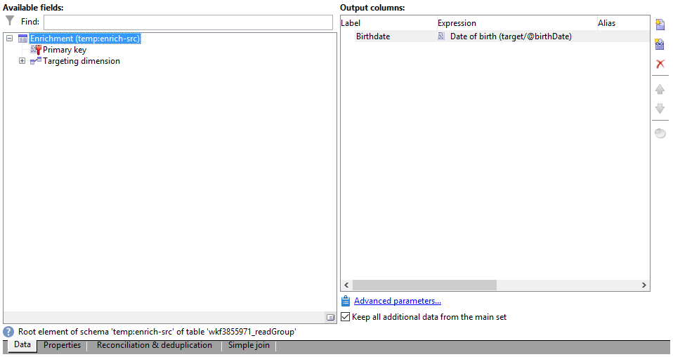
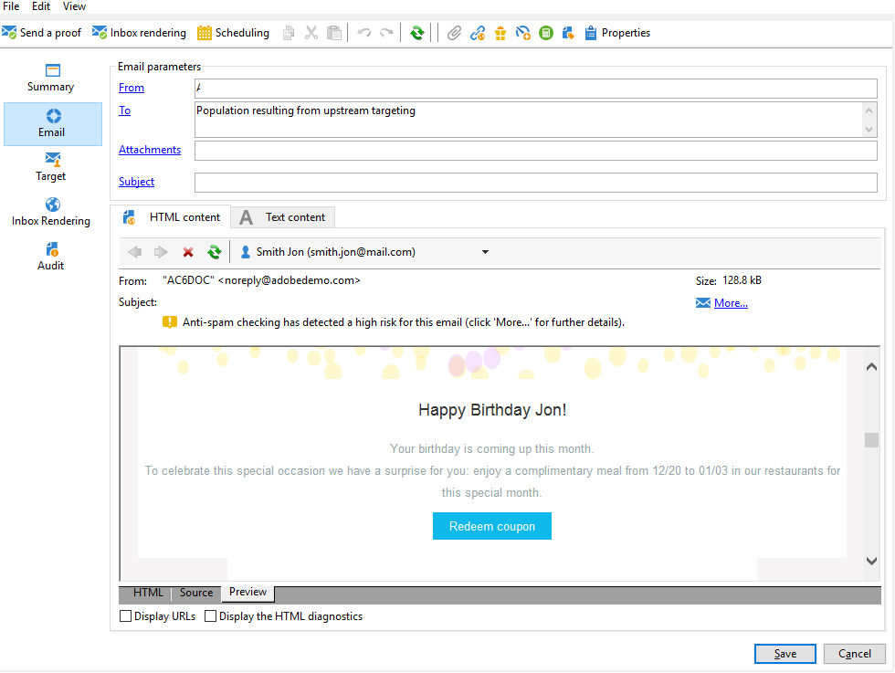

# 사용자 정의 날짜 필드를 통한 이메일 강화{#email-enrichment-with-custom-date-fields}


이 예제에서는 이번 달에 생일을 맞는 수신자에게 사용자 지정 데이터 필드가 포함된 이메일을 보내려고 합니다. 그 이메일에는 생일 전후로 일주일간 유효한 쿠폰이 포함될 것이다.

우리는 이번 달에 그들의 생일을 기념할 목록에서 받는 사람들을 타겟팅해야 합니다 **[!UICONTROL Split]** 활동. 그런 다음 **[!UICONTROL Enrichment]** 활동, 사용자 지정 데이터 필드는 고객의 특별 오퍼에 대한 이메일의 유효 날짜로 작동합니다.


이 예제를 만들려면 다음 단계를 적용합니다.

1. 에서 **[!UICONTROL Targeting and workflows]** 캠페인의 탭을 드래그하여 놓습니다 **[!UICONTROL Read list]** 활동을 타겟팅하여 수신자 목록을 만듭니다.
1. 처리할 목록은 스크립트로 계산하거나, 스크립트로 동적으로 계산하거나, 여기에서 정의한 옵션과 매개 변수에 따라 지정할 수 있습니다.

   

1. 추가 **[!UICONTROL Split]** 활동은 이번 달에 다른 수신자와 생일 축하를 할 수신자를 구분하기 위한 활동입니다.
1. 목록을 분할하려면 **[!UICONTROL Filtering of selected records]** 카테고리, 선택 **[!UICONTROL Add a filtering condition on the inbound population]**. 그런 다음 **[!UICONTROL Edit]**.

   

1. 선택 **[!UICONTROL Filtering conditions]** 그런 다음 **[!UICONTROL Edit expression]** 받는 사람의 생일 월을 필터링하는 단추.

   

1. 클릭 **[!UICONTROL Advanced Selection]** 그런 다음 **[!UICONTROL Edit the formula using an expression]** 및 다음 표현식을 추가합니다. 월(@birthDate).
1. 에서 **[!UICONTROL Operator]** 열을 선택하고 **[!UICONTROL equal to]**.
1. 를 추가하여 조건을 추가로 필터링합니다. **[!UICONTROL Value]** 현재 날짜의 월: Month(GetDate()).

   이렇게 하면 생일 월이 현재 달에 해당하는 수신자를 질의합니다.

   

1. **[!UICONTROL Finish]**&#x200B;을(를) 클릭합니다. 그런 다음 **[!UICONTROL General]** 탭 **[!UICONTROL Split]** 활동을 클릭하고 **[!UICONTROL Generate complement]** 에서 **[!UICONTROL Results]** 카테고리.

   사용 **[!UICONTROL Complement]** 따라서 게재 활동을 추가하거나 목록을 업데이트할 수 있습니다. 여기에서는 **[!UICONTROL End]** 활동.

   

이제 다음을 구성해야 합니다 **[!UICONTROL Enrichment]** 활동:

1. 추가 **[!UICONTROL Enrichment]** 활동은 하위 집합 뒤에 추가하여 사용자 지정 날짜 필드를 추가합니다.

   

1. 다음 문서를 엽니다. **[!UICONTROL Enrichment]** 활동. 에서 **[!UICONTROL Complementary information]** 카테고리 **[!UICONTROL Add data]**.

   

1. 선택 **[!UICONTROL Data linked to the filtering dimension]** 그런 다음 **[!UICONTROL Data of the filtering dimension]**.
1. **[!UICONTROL Add]** 버튼을 클릭합니다.

   

1. 추가 **[!UICONTROL Label]**. 그런 다음 **[!UICONTROL Expression]** 열, **[!UICONTROL Edit expression]**.

   

1. 첫째, 생년월일 이전 주를 **유효성 시작 날짜** 다음 포함 **[!UICONTROL Expression]**: `SubDays([target/@birthDate], 7)`.

   

1. 그런 다음 사용자 지정 날짜 필드를 만듭니다 **유효성 종료 날짜** 이 타겟은 생일 이후의 주를 타겟팅하며 **[!UICONTROL Expression]**: `AddDays([target/@birthDate], 7)`.

   표현식에 레이블을 추가할 수 있습니다.

   

1. **[!UICONTROL Ok]**&#x200B;을(를) 클릭합니다. 이제 데이터 보강 준비가 되었습니다.

이후 **[!UICONTROL Enrichment]** 활동을 통해 게재를 추가할 수 있습니다. 이 경우 이메일 게재를 추가하여 수신자에게 유효 날짜가 포함된 특별 오퍼를 이번 달 생일을 맞는 고객에게 보냈습니다.

1. 끌어서 놓기 **[!UICONTROL Email delivery]** 활동 후 **[!UICONTROL Enrichment]** 활동.

   

1. 을(를) 두 번 클릭합니다. **[!UICONTROL Email delivery]** 활동을 사용하여 게재 개인화를 시작합니다.
1. 추가 **[!UICONTROL Label]** 게재하기 위해 을(를) 클릭하고 **[!UICONTROL Continue]**.
1. 클릭 **[!UICONTROL Save]** 전자 메일 게재를 만들기 위해
1. 을(를) 체크인합니다. **[!UICONTROL Approval]** 이메일 게재 탭 **[!UICONTROL Properties]** 저것은 **[!UICONTROL Confirm delivery before sending option]** 이(가) 선택되어 있습니다.

   그런 다음 워크플로우를 시작하여 타겟팅된 정보로 아웃바운드 전환을 보강합니다.

   

이제 에서 만든 사용자 지정 날짜 필드를 사용하여 전자 메일 게재 디자인을 시작할 수 있습니다 **[!UICONTROL Enrichment]** 활동.

1. 을(를) 두 번 클릭합니다. **[!UICONTROL Email delivery]** 활동.
1. 이메일에 Target 확장을 추가합니다. 유효성 날짜 형식을 구성하려면 다음 표현식 내에 있어야 합니다.

   ```
   <%=
           formatDate(targetData.alias of your expression,"%2D.%2M")  %>
   ```

1. 를 클릭합니다. 선택 **[!UICONTROL Target extension]** 그런 다음 이전에 만든 사용자 정의 유효성 날짜를 **[!UICONTROL Enrichment]** 활동을 통해 formatDate 표현식에 확장을 추가합니다.

   

1. 필요에 따라 이메일 콘텐츠를 구성합니다.

   

1. 이메일을 미리 보고 사용자 지정 날짜 필드가 올바르게 구성되었는지 확인합니다

   

이제 이메일이 준비되었습니다. 증명 전송을 시작하고 게재를 확인하여 생일 이메일을 보낼 수 있습니다.
